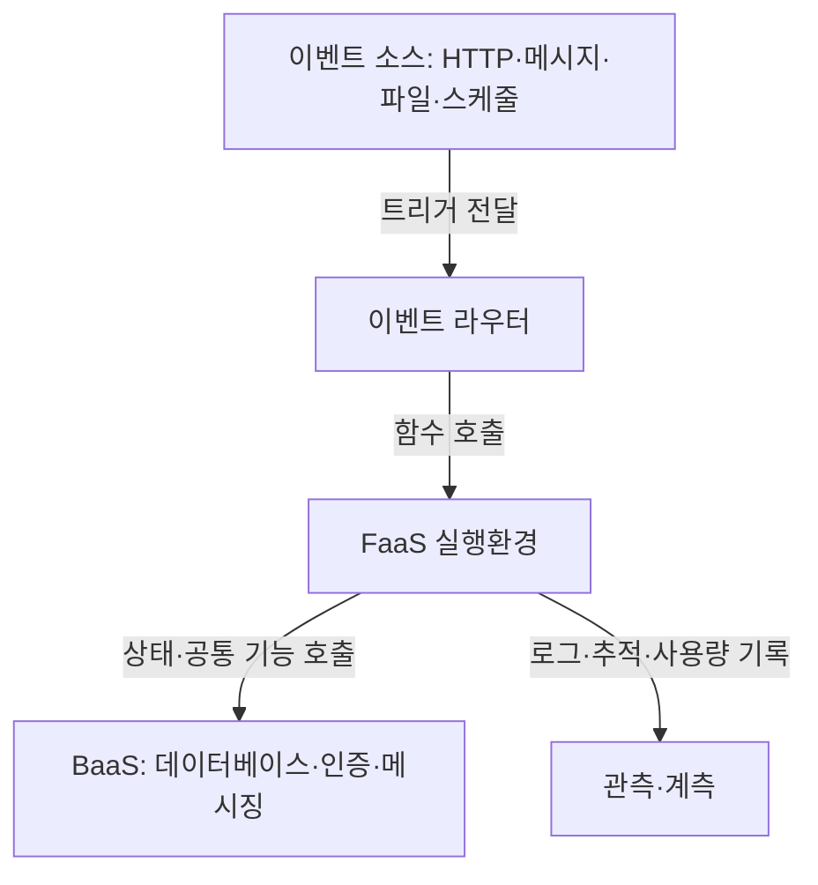
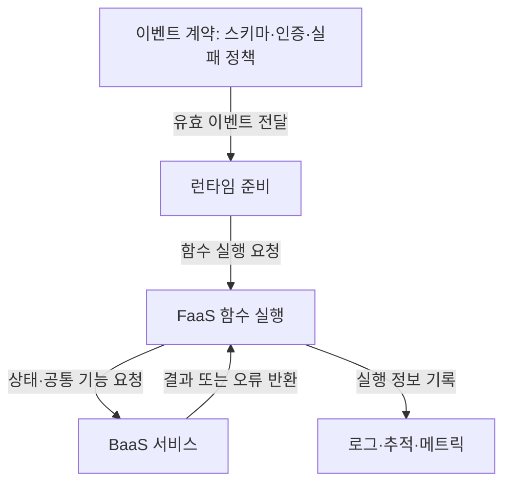

작성 모델 · GPT-6 작성 · 2026.09.24 21:00 KST

## 지식 로드맵 내 현재 위치

클라우드 컴퓨팅클라우드 실행 모델<strong>서버리스 컴퓨팅</strong>

## 큰 그림과 30초 인출

- 본질: 서버리스 컴퓨팅은 공급자가 실행 인프라를 운영하고 이용자가 함수 코드와 관리형 백엔드를 조합하는 클라우드 실행 모델
- 메커니즘: 이벤트 수신 → **FaaS** 함수 실행 → **BaaS** 상태·공통 기능 연계 → 실행량 계측
- 산출: 부하 변화에 민첩한 서비스이며, 대가는 Cold Start·상태 외부화·벤더 종속·분산 관측 복잡성임

핵심 용어

- **서버리스 컴퓨팅 (Serverless Computing)** : 공급자가 실행 인프라의 프로비저닝·확장·운영을 맡고, 이용자가 함수와 관리형 서비스를 조합하는 클라우드 실행 모델.
- **FaaS (Function as a Service)** : 이벤트에 따라 함수 코드를 실행하는 관리형 계산 서비스.
- **BaaS (Backend as a Service)** : 데이터베이스·인증·메시징 같은 백엔드 기능을 관리형 API로 제공하는 서비스.
- **DLQ (Dead Letter Queue)** : 재시도 후에도 처리되지 않은 메시지를 격리해 원인 조사·재처리하는 대기열.
- **VM (Virtual Machine)** : 가상화된 하드웨어 위에서 독립 운영체제를 실행하는 컴퓨팅 환경.
- **Cold Start** : 유휴 실행환경을 다시 준비할 때 추가되는 초기 실행 지연.
- **멱등성 (Idempotency)** : 같은 요청을 반복 처리해도 업무 결과가 중복 변경되지 않는 성질.

---

## 1교시 예상문제 (10점)
> 서버리스 컴퓨팅(Serverless Computing)을 설명하시오. (제136회 1교시 9번)

---

## 1교시 10점 답안
### Ⅰ. 서버리스 컴퓨팅의 개요

| 구분 | 핵심 |
|---|---|
| 정의 | **서버리스 컴퓨팅 (Serverless Computing)** 은 이용자가 함수 코드와 관리형 백엔드를 조합하고 공급자가 실행 인프라의 운영·확장을 맡는 클라우드 실행 모델 |
| 목적 | 인프라 관리 부담을 줄이고 변동하는 수요에 맞춘 실행 자원 사용 |

| 구성 | 역할 |
|---|---|
| **Event** | 함수 실행을 유발 |
| **FaaS** | 이벤트 기반 코드 실행과 확장 |
| **BaaS** | 상태·인증·메시징 등 관리형 기능 제공 |
| **Observability** | 실행 로그·메트릭·추적 연결 |

- 제언: 멱등성·동시성 제한·실패 큐를 이벤트 계약에 포함

---

## 2~4교시 예상문제 (25점)
> 서버리스 컴퓨팅에 대하여 다음을 설명하시오. 가. 정의 및 특징 나. 구성 요소 및 장·단점 (제140회 정보관리기술사 2교시 1번)

---

## 2~4교시 25점 답안

## Ⅰ. 서버리스 컴퓨팅의 개요

| 구분 | 핵심 |
|---|---|
| 정의 | **서버리스 컴퓨팅 (Serverless Computing)** 은 이용자가 함수 코드와 관리형 백엔드를 조합하고 공급자가 실행 인프라의 운영·확장을 맡는 클라우드 실행 모델 |
| 목적 | 인프라 관리 부담을 줄이고 변동하는 수요에 맞춘 실행 자원 사용 |

| 특징 | 메커니즘 | 설계 의미 |
|---|---|---|
| **Event-driven** | 트리거별 함수 호출 | 이벤트 계약이 결합도 결정 |
| **Auto Scaling** | 동시 요청에 따라 인스턴스 증감 | 폭주·하위 서비스 한도 통제 |
| **Metering** | 호출·실행 자원 계측 | 유휴 비용 감소, 단위비용 변동 |
| **Stateless** | 실행환경 수명과 상태 분리 | DB·캐시로 상태 외부화 |

## Ⅱ. FaaS·BaaS 구성과 실행 흐름

- 횡단 통제: 함수별 최소권한, Secret 분리, 상관 ID, Timeout, 재시도 제한, **DLQ(Dead Letter Queue)** 적용

## Ⅲ. VM·컨테이너·서버리스 비교

> 실행 단위가 작아질수록 운영 부담은 공급자로 이동하지만 실행 제약과 플랫폼 결합은 커지므로 업무 수명·지연·이식성으로 선택해야 함.

| 축 | VM | 컨테이너 | 서버리스 함수 |
|---|---|---|---|
| 단위 | Guest OS 이미지 | 애플리케이션 이미지 | 함수·의존성 |
| 책임 | OS 이상 이용자 관리 | 오케스트레이션 관리 | 실행환경 공급자 관리 |
| 확장 | VM | Pod·Task | 호출·함수 인스턴스 |
| 상태 | 장기 상태 가능 | 외부화 권장 | 외부화 원칙 |
| 적합 | 강한 격리·레거시 | 장기 서비스·이식성 | 간헐·급변 이벤트 |
| 대가 | 기동·유휴 자원 | 플랫폼 운영 | Cold Start·종속 |

## Ⅳ. 한계의 원인과 안전한 도입

> 서버리스 장애는 함수 코드보다 재시도·동시성·관리형 서비스 사이에서 확산되므로 E2E 관측과 실패 격리가 핵심임.

| 한계 | 원인 | 대응 | 확인 기준 |
|---|---|---|---|
| 초기 지연 | 런타임·의존성 준비 | 경량 패키지·사전 준비 | 지연 분포 |
| 중복 처리 | 비동기 전달·재시도 | **멱등키**, 조건부 쓰기·DLQ | 중복·실패 이벤트 |
| 연쇄 장애 | 동시성 폭주·하위 한도 | 동시성 제한·Backpressure | 오류 전파 경로 |
| 관측 단절 | 다수 함수·관리형 서비스 | 상관 ID·분산추적 | 추적 완결성 |
| 종속·비용 | 전용 API·전송·호출 계측 | Port·Adapter 경계·Exit Plan | 이동성·단위비용 |

## 기술사적 제언

| 한계 | 해결 방안 |
|---|---|
| 함수 자동 확장이 DB·외부 API의 처리 한도를 넘어 재시도와 장애를 증폭할 수 있음 | 멱등키·동시성 제한·DLQ를 공통 이벤트 Baseline으로 두고, 파일럿에서 종단 지연과 하위 서비스 포화를 확인한 뒤 확대 |

## 출제 이력과 검증 출처

- 제136회 정보관리기술사 1교시 9번: `서버리스 컴퓨팅(Serverless Computing)`
- 제140회 정보관리기술사 2교시 1번: `서버리스 컴퓨팅(Serverless Computing)에 대하여 다음을 설명하시오. 가. 정의 및 특징 나. 구성 요소 및 장·단점`
- [CNCF Serverless Whitepaper](https://github.com/cncf/wg-serverless/tree/master/whitepapers/serverless-overview)
- [Google Cloud — What is serverless computing?](https://cloud.google.com/discover/what-is-serverless-computing)
- [Google Cloud — What is FaaS?](https://cloud.google.com/discover/what-is-function-as-a-service-faas)
- [Q-Net 정보관리기술사 출제문제](https://www.q-net.or.kr/cst006.do?id=cst00601&gSite=Q&gId=)

## 연결 토픽

- [클라우드 컴퓨팅](./013_cloud_computing/) · [FaaS](./078_faas/) · [컨테이너](./032_container/) · [클라우드 서비스 모델](./109_cloud_computing_service_models/)
