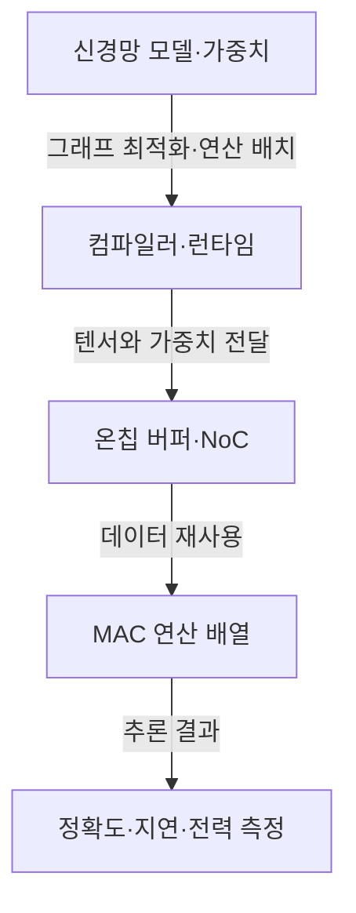
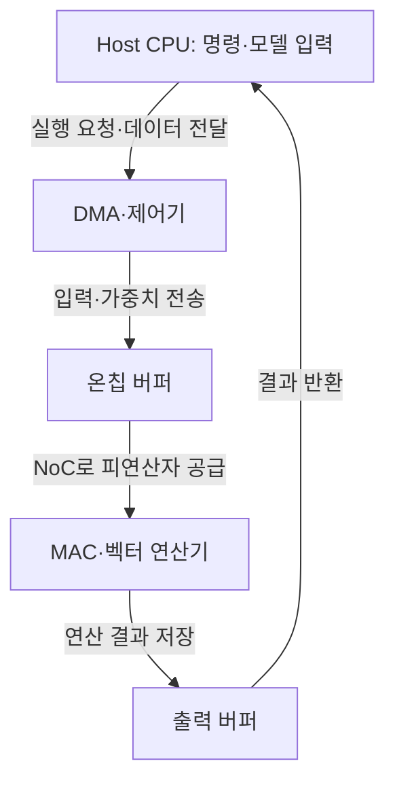
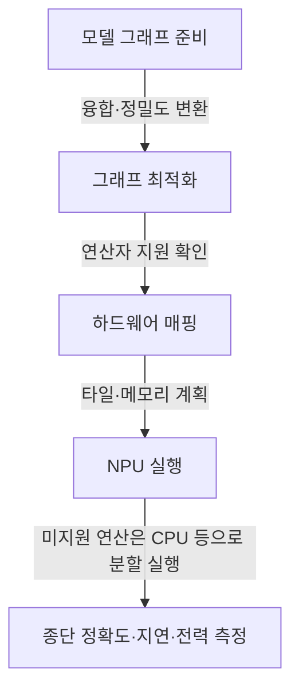

작성 모델 · GPT-6 작성 · 2026.09.24 21:00 KST

## 지식 로드맵 내 현재 위치

컴퓨터 구조AI 가속기<strong>NPU</strong>

## 큰 그림과 30초 인출

- 본질: **NPU(Neural Processing Unit)** 는 신경망 연산을 효율적으로 수행하도록 연산기·메모리 이동을 특화한 가속기
- 메커니즘: 컴파일러가 모델 연산을 하드웨어에 배치하고 온칩 데이터 재사용과 병렬 MAC 연산으로 추론 수행
- 판단: 연산 지원 범위·정확도·지연·지속 전력의 실제 모델 측정

핵심 용어

- **NPU (Neural Processing Unit)** : 신경망 연산에 맞춰 데이터 경로와 연산기를 특화한 가속기.
- **MAC (Multiply-Accumulate)** : 곱셈 결과를 누산하는 연산으로, 행렬·텐서 계산의 기본 연산.
- **NoC (Network-on-Chip)** : 칩 안의 연산기·메모리·제어 블록 사이 데이터 전달을 맡는 연결 구조.
- **양자화 (Quantization)** : 모델의 수치 표현 정밀도를 낮추거나 바꾸어 연산·저장 부담을 조정하는 변환.
- **DMA (Direct Memory Access)** : CPU가 각 데이터를 직접 복사하지 않고 장치가 메모리 전송을 수행하는 기능.
- **TOPS (Tera Operations Per Second)** : 초당 조 단위 연산 횟수를 나타내는 처리량 표기.
- **TPU (Tensor Processing Unit)** : Google이 신경망 텐서 연산용으로 설계한 특정 가속기 계열의 명칭.

---

## 1교시 예상문제 (10점)
> NPU의 개념과 특징을 설명하시오. (예상)

---

## 1교시 10점 답안
### Ⅰ. NPU의 개요

| 구분 | 핵심 |
|---|---|
| 정의 | **NPU (Neural Processing Unit)** 는 신경망 연산에 맞춰 데이터 경로와 연산기를 특화한 인공지능 가속기 |
| 목적 | 신경망 추론의 연산 지연과 데이터 이동 부담 완화 |

| 단계 | 핵심 관계 |
|---|---|
| 모델 변환 | Compiler가 연산을 양자화·매핑 |
| 데이터 공급 | On-chip Buffer·NoC가 가중치와 활성값 전달 |
| 병렬 연산 | MAC Array가 Tensor 계산 수행 |
| 검증 | 실제 모델의 정확도·지연·전력 확인 |

- 제언: TOPS 사양보다 대표 모델의 연산 지원과 종단 성능을 기준으로 선정

---

## 2~4교시 예상문제 (25점)
> NPU의 구조와 AI 추론 처리 절차를 설명하고 CPU·GPU와 비교하여 도입 시 고려사항을 제시하시오. (예상)

---

## 2~4교시 25점 답안

## Ⅰ. NPU의 개요

| 구분 | 핵심 |
|---|---|
| 정의 | **NPU (Neural Processing Unit)** 는 신경망 연산에 맞춰 데이터 경로와 연산기를 특화한 인공지능 가속기 |
| 목적 | 신경망 추론의 연산 지연과 데이터 이동 부담 완화 |

## Ⅱ. 특징 ───── 연산·메모리·정밀도 최적화

| 특징 | 구현 관점 | 효과 |
|---|---|---|
| 병렬 MAC | 행렬·텐서 연산 배열 | 높은 연산 병렬성 |
| 데이터 재사용 | 온칩 SRAM·버퍼·타일링 | 외부 메모리 이동 감소 |
| 저정밀 연산 | INT8 등 모델별 정밀도 | 처리량·에너지 효율 개선 가능 |
| 그래프 실행 | 연산 융합·스케줄링 | 중간 데이터 이동 축소 |
| SW/HW 결합 | 컴파일러·런타임·드라이버 | 모델을 실제 하드웨어에 매핑 |

## Ⅲ. 구조 ───── 데이터 경로 중심 배치

| 구성 | 역할 | 답안 키워드 |
|---|---|---|
| PE/MAC Array | 곱셈·누산 병렬 처리 | Tensor Compute |
| On-chip Buffer | 가중치·활성값 재사용 | Data Locality |
| Interconnect | PE·메모리 간 전달 | Bandwidth |
| DMA/Controller | 외부 메모리 전송·실행 제어 | Data Movement |
| Compiler/Runtime | 연산 지원 여부·배치·스케줄 | Operator Mapping |

## Ⅳ. 동작 ───── 모델 변환부터 실측까지

- 판정: 컴파일 성공이 아니라 실제 데이터에서 정확도·지연·처리량·전력을 함께 측정

## Ⅴ. 비교 ───── CPU·GPU·NPU·TPU

| 구분 | CPU | GPU | NPU | TPU |
|---|---|---|---|---|
| 지향 | 범용·제어 중심 | 대규모 병렬 처리 | 신경망 특화 | 특정 업체의 텐서 가속기 계열 |
| 유연성 | 높음 | 높음 | 지원 연산에 좌우 | 세대·환경에 좌우 |
| 강점 | 분기·OS·전처리 | 학습·범용 병렬 | 전력·지연 제약 추론 | 대규모 텐서 처리 |
| 유의 | 병렬 AI 효율 | 전력·메모리 | 컴파일러·연산 커버리지 | 생태계·배포 조건 |

용어 구별: TPU는 특정 제품 계열의 명칭, NPU는 신경망 연산 가속기의 일반적 분류.

## Ⅵ. 고려 ───── 정확도 제약 아래 전 구간 검증

| 한계 | 원인 | 대응 | 확인 기준 |
|---|---|---|---|
| 정확도 저하 | 양자화·연산 치환 | 대표 데이터 보정, 혼합 정밀도 | 기준 모델 대비 품질 |
| 성능 미달 | 메모리 대역폭·Host 왕복 | 연산 융합, 배치·타일 조정 | 종단 지연·처리량 |
| 대체 실행 증가 | 미지원 Operator | 모델 재구성, 지원표 확인 | NPU 실행 비율 |
| 열·전력 제한 | 지속 부하 Throttling | 전력 모드·냉각·부하 제어 | 지속 성능·에너지 |
| 종속성 | 전용 컴파일러·포맷 | 중간 표현·추상 계층·Exit Plan | 이식 시험 |
| 모델 보호 | 펌웨어·모델 공급망 | 서명·암호화·보안 업데이트 | 무결성·취약점 |

평가 기준: **모델·데이터셋·품질 목표·시나리오·전력 측정 경계**를 동일하게 고정한 비교.

## 기술사적 제언

| 한계 | 해결 방안 |
|---|---|
| TOPS 중심 선정은 미지원 연산의 CPU 대체 실행과 양자화에 따른 정확도 저하를 놓칠 수 있음 | 대표 모델을 컴파일해 연산 커버리지·정확도·지속 성능·전력을 측정한 뒤 장비를 선정 |

## 출제 이력과 검증 출처

- [MLCommons MLPerf Inference: Edge — 시나리오·품질·성능·전력 측정](https://mlcommons.org/benchmarks/inference-edge/)
- [SPEC ACCEL — 가속기·호스트·메모리 전송·SW 도구 체인 평가 범위](https://www.spec.org/hpg/accel/)

## 연결 토픽

- [컴퓨터 시스템 과목 지도](./)
- [데이터 압축](./004_data_compression/)
- [스레드](./010_thread/)
