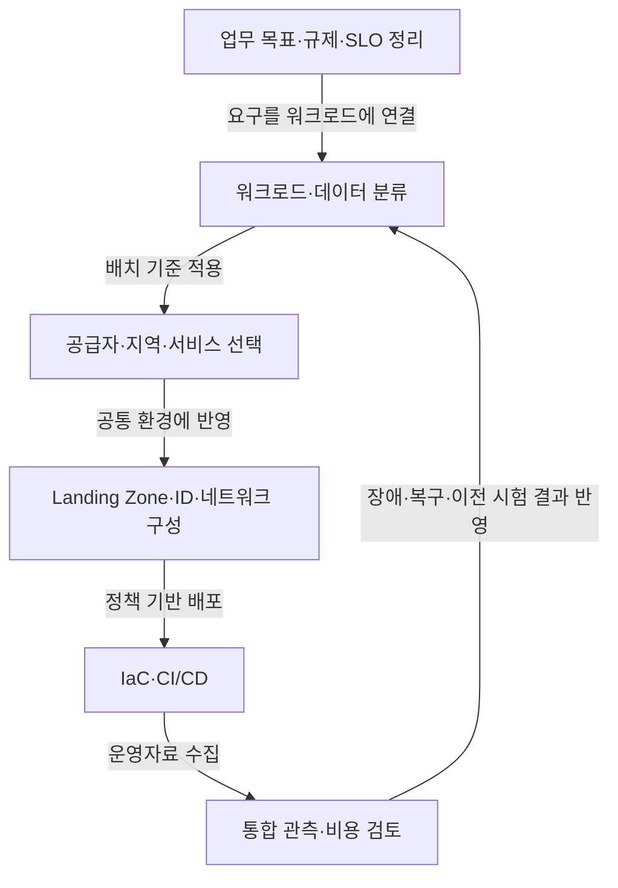

작성 모델 · GPT-6 작성 · 2026.09.24 21:00 KST

## 지식 로드맵 내 현재 위치

클라우드 컴퓨팅클라우드 운영전략<strong>멀티클라우드</strong>

## 큰 그림과 30초 인출

- 본질: **멀티클라우드**는 둘 이상의 클라우드 서비스를 업무 목적에 따라 선택·조합해 운영하는 전략
- 메커니즘: 워크로드 배치 원칙에 따라 공급자별 자원을 배치하고 공통 ID·정책·관측으로 관리
- 주의: 복수 공급자 사용만으로 이식성이나 Active-Active가 보장되지 않으며, 연결·데이터 이동·운영 비용의 별도 관리 필요

핵심 용어

- **멀티클라우드 (Multi-Cloud)** : 둘 이상의 클라우드 공급자 또는 서비스를 목적별로 선택·조합해 운영하는 전략.
- **하이브리드 클라우드 (Hybrid Cloud)** : 온프레미스·프라이빗·퍼블릭 환경을 연결해 함께 운영하는 구성.
- **연합 ID (Federated Identity)** : 신뢰 관계를 설정한 여러 도메인에서 사용자 인증 정보를 연계하는 방식.
- **IaC (Infrastructure as Code)** : 인프라 구성을 선언형 코드로 정의하고 반복 배포하는 운영 방식.
- **FinOps (Cloud Financial Operations)** : 클라우드 사용량·비용 정보를 업무 가치와 연결해 관리하는 운영 분야.
- **IAM (Identity and Access Management)** : 사용자·서비스의 신원을 확인하고 자원 접근 권한을 관리하는 기능.
- **SLO (Service Level Objective)** : 서비스 품질을 측정하는 지표에 대해 정한 목표값.
- **CMP (Cloud Management Platform)** : 여러 클라우드 자원의 배포·운영 정보를 통합 관리하는 도구 범주.
- **데이터 중력 (Data Gravity)** : 데이터가 클수록 이동 비용·지연·의존성 때문에 관련 응용이 데이터 근처에 모이는 경향.

---

## 1교시 예상문제 (10점)
> 멀티클라우드의 개념과 특징을 설명하시오. (예상)

---

## 1교시 10점 답안
### Ⅰ. 멀티클라우드의 개요

| 구분 | 핵심 |
|---|---|
| 정의 | **멀티클라우드 (Multi-Cloud)** 는 둘 이상의 클라우드 서비스를 업무 목적에 따라 선택·조합해 운영하는 전략 |
| 목적 | 워크로드별 적합 서비스 선택과 공급자·장애 위험 분산 |

| 운영 관점 | 핵심 내용 |
|---|---|
| 거버넌스 | 업무·위험·규제에 맞춰 배치 원칙 결정 |
| 관리 | 공통 ID·정책·자동화·관측 적용 |
| 자원 | 공급자별 계산·네트워크·데이터 서비스 배치 |
| 주의점 | 멀티클라우드가 모든 워크로드의 이식성이나 Active-Active를 뜻하지 않음 |

- 제언: 중요 워크로드의 복구·이전 가능성을 실제 시험으로 확인

---

## 2~4교시 예상문제 (25점)
> 멀티클라우드의 개념과 구성요소, 하이브리드 클라우드와의 차이를 설명하고 도입 절차 및 고려사항을 제시하시오. (예상)

---

## 2~4교시 25점 답안

## Ⅰ. 멀티클라우드의 개요

| 구분 | 핵심 |
|---|---|
| 정의 | **멀티클라우드 (Multi-Cloud)** 는 둘 이상의 클라우드 서비스를 업무 목적에 따라 선택·조합해 운영하는 전략 |
| 목적 | 워크로드별 적합 서비스 선택과 공급자·장애 위험 분산 |

| 목적 | 설명 |
|---|---|
| 적합 서비스 선택 | 데이터·지역·기능·규제에 맞춘 배치 |
| 회복탄력성 | 장애 도메인과 공급망 위험 분산 |
| 종속 관리 | 계약·기술 집중 위험 완화 |
| 협상·비용 | 단위비용과 운영비를 함께 최적화 |

## Ⅱ. 특징 ───── 선택성·분산성·복잡성

| 특징 | 가치 | 상충 요소 |
|---|---|---|
| Best-fit 배치 | 서비스·지역 선택 | 기술 스택 다양화 |
| 장애 도메인 분산 | 연속성 강화 가능 | 데이터 동기화 복잡성 |
| 공통 자동화 | 정책 일관성 | 최소공통분모 위험 |
| 통합 관측·비용 | 전사 가시성 | 계정·태그·지표 정규화 |

## Ⅲ. 구조와 관리 경계

| 관점 | 주요 책임·요소 |
|---|---|
| 거버넌스 | 포트폴리오·정책·위험·규정 준수·FinOps 기준 |
| 관리 | 클라우드 관리 플랫폼, IaC, CI/CD, 자산 목록, 통합 관측 |
| 자원 | 공급자별 계산·네트워크·데이터·관리형 서비스 |
| 공통 통제 | 연합 ID, 키·비밀정보, 연결, 감사, 복구 |

참조 구조 구분: 서비스 배포·오케스트레이션·관리·보안과 참여 주체의 책임.

## Ⅳ. 배치와 운영 흐름

| 단계 | 핵심 산출물 |
|---|---|
| 전략 | 배치 원칙, 공급자 역할, Exit 기준 |
| 설계 | 계정 구조, 신뢰, 연결, 데이터 흐름 |
| 구축 | Landing Zone, IaC, 정책·파이프라인 |
| 운영 | SLO, 통합 로그, 비용 배분, DR 결과 |

## Ⅴ. 비교 ───── 멀티클라우드·하이브리드

| 구분 | 멀티클라우드 | 하이브리드 클라우드 |
|---|---|---|
| 중심 | 복수 클라우드의 조합 | Private/On-prem과 Public의 결합 |
| 목적 | 선택성·위험 분산 | 기존 자산 연계·단계적 전환 |
| 필수 조건 | 클라우드가 둘 이상 | 서로 다른 배치 환경의 연동 |
| 공통 과제 | IAM·Network·Data·Policy·Observability |

운영 형태: 목적에 따른 분리 배치·백업·대체·동시 실행이며, 동일 워크로드의 실시간 양쪽 실행은 필수 조건이 아님.

## Ⅵ. 고려 ───── 복잡성을 통제 가능한 표준으로 전환

| 한계 | 원인 | 대응 | 확인 기준 |
|---|---|---|---|
| ID·권한 불일치 | 계정·역할 모델 상이 | 연합 ID, 공통 역할 모델, JIT 권한 | 권한 경로·회수 시간 |
| 정책 편차 | 서비스별 설정 차이 | Policy as Code, 기준선·예외 절차 | 준수율·예외 수 |
| 데이터 중력·비용 | 대량 이동·Egress | 데이터 배치 우선, 복제 범위 최소화 | 이동량·총비용 |
| 지연·가용성 | 사업자 간 네트워크 | 연결 다중화, 캐시, SLO별 배치 | 종단 지연·장애 시험 |
| 관측 단절 | 로그·지표 모델 상이 | 공통 스키마·상관 ID·통합 대시보드 | 추적 완결률 |
| 허위 이식성 | 전용 관리형 서비스 | 경계 API, 데이터 Export, Exit 리허설 | 복구·이전 시간 |

## 기술사적 제언

| 한계 | 해결 방안 |
|---|---|
| 공급자별 ID·정책·데이터 운영이 달라지면 복잡성이 커지고, 이식 가능성도 실제 장애 상황에서 확인되지 않을 수 있음 | 공통 ID·정책·관측 기준을 적용하고, 중요 워크로드의 복구·이전 시험으로 필요한 이식 범위를 확인 |

## 공식 검증 출처

- [NIST SP 500-332 — Cloud Federation Reference Architecture](https://www.nist.gov/publications/nist-cloud-federation-reference-architecture-0)
- 공식 기출 근거: 한국산업인력공단 Q-Net 정보관리기술사 135회 문제지

## 연결 토픽

- [서버리스 컴퓨팅](./003_serverless_computing/)
- [스토리지 유형 비교](./123_storage_type_comparison/)
- [가상화](./008_virtualization/)
