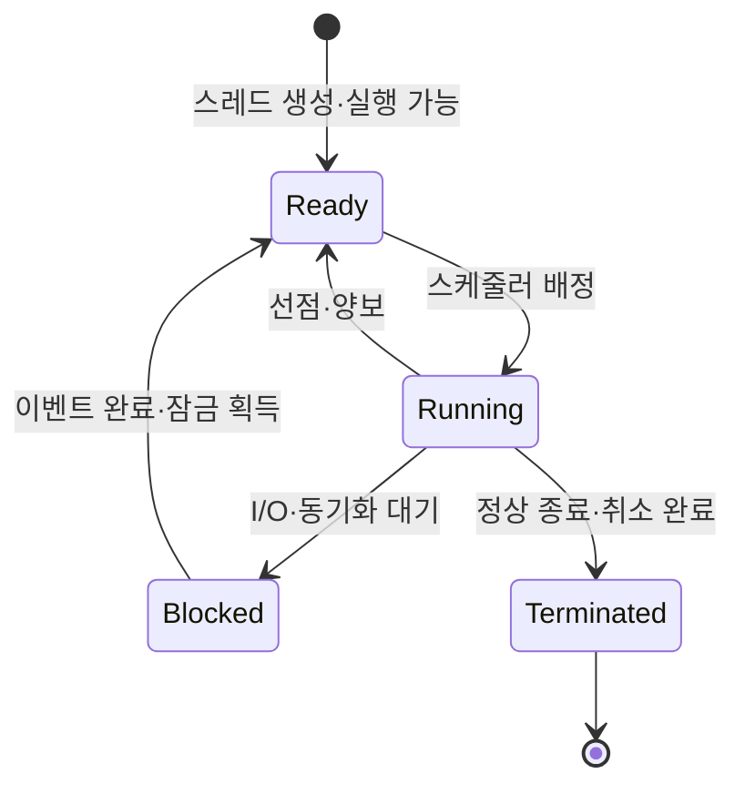

작성 모델 · GPT-6 작성 · 2026.09.24 21:00 KST

## 지식 로드맵 내 현재 위치

운영체제실행 단위<strong>스레드</strong>

## 큰 그림과 30초 인출

- 본질: **스레드(Thread)** 는 프로세스 안에서 스케줄되는 실행 흐름으로, 주소 공간의 자원을 공유하면서 실행 문맥은 각각 보유
- 구조: 프로세스는 코드·데이터·힙·열린 파일을 공유하고 각 스레드는 식별자·프로그램 카운터·레지스터·스택을 별도 보유
- 관리: 공유 상태의 동기화와 스레드 수·종료 처리의 통제

핵심 용어

- **스레드 (Thread)** : 프로세스 안에서 스케줄되는 실행 흐름으로, 프로세스 자원을 공유하고 독립 실행 문맥을 보유.
- **프로세스 (Process)** : 독립된 주소 공간과 실행 자원을 가진 프로그램 실행 단위.
- **TCB (Thread Control Block)** : 운영체제가 스레드의 상태·레지스터·스택 포인터·스케줄 정보를 관리하는 자료구조.
- **TLS (Thread-Local Storage)** : 각 스레드가 다른 스레드와 공유하지 않고 사용하는 스레드별 저장 영역.
- **사용자 수준 스레드 (User-Level Thread)** : 사용자 공간 런타임이 관리하는 스레드 실행 단위.
- **커널 수준 스레드 (Kernel-Level Thread)** : 운영체제 커널이 인식하고 스케줄하는 실행 단위.

---

## 1교시 예상문제 (10점)
> 스레드의 개념과 프로세스와 구별되는 메모리·실행 문맥을 설명하시오. (예상)

---

## 1교시 10점 답안
### Ⅰ. 스레드의 개요

| 구분 | 핵심 |
|---|---|
| 정의 | **스레드 (Thread)** 는 프로세스 안에서 스케줄되는 실행 흐름으로, 프로세스 자원을 공유하고 독립 실행 문맥을 보유하는 단위 |
| 목적 | 공유 메모리 통신 비용 절감과 동시·병렬 실행 지원 |

| 구분 | 스레드 간 공유 | 스레드별 독립 |
|---|---|---|
| 자원·메모리 | Code·Data·Heap·Open File | Stack·TLS |
| 실행 문맥 | 프로세스 주소 공간 | TID·PC·Register |
| 주의점 | 빠른 공유와 통신 | Race·Deadlock·격리 약화 |

- 제언: 공유 상태를 줄이고 동기화·취소·종료 처리를 함께 설계

---

## 2~4교시 예상문제 (25점)
> 스레드의 구조와 상태 전이를 설명하고 프로세스와 비교한 후, 멀티스레드 구현의 안전성·성능 고려사항을 제시하시오. (예상)

---

## 2~4교시 25점 답안

## Ⅰ. 스레드의 개요

| 구분 | 핵심 |
|---|---|
| 정의 | **스레드 (Thread)** 는 프로세스 안에서 스케줄되는 실행 흐름으로, 프로세스 자원을 공유하고 독립 실행 문맥을 보유하는 단위 |
| 목적 | 공유 메모리 통신 비용 절감과 동시·병렬 실행 지원 |

| 필요성 | 효과 | 위험 |
|---|---|---|
| 동시 요청 처리 | 응답성·처리량 향상 가능 | 공유 상태 경합 |
| 멀티코어 활용 | 병렬 실행 가능 | 동기화·스케줄 비용 |
| 주소 공간 공유 | 통신·복사 감소 | 장애 격리 약화 |

## Ⅱ. 특징 ───── 공유 자원과 독립 문맥

| 구분 | 스레드 간 공유 | 스레드별 독립 |
|---|---|---|
| 메모리·자원 | Code, Global/Data, Heap, Open File | Stack, TLS |
| 실행 문맥 | 프로세스 자원 한계·주소 공간 | Thread ID, PC, Register, Scheduling 속성 |
| 결과 | 빠른 데이터 교환 | 독립 호출 흐름·재진입 |

구현 유의점: 공유 범위와 TCB 필드·스택 크기는 OS·런타임별 차이.

## Ⅲ. 구조와 스레드 매핑 방식

| 모델 | 구조 | 장점 | 제약 |
|---|---|---|---|
| 사용자 수준 | 라이브러리가 스케줄 | 빠른 사용자 전환 가능 | 블로킹·코어 활용 제약 가능 |
| 커널 수준 | 커널이 개별 스케줄 | 멀티코어·블로킹 처리 | 커널 전환·관리 비용 |
| 혼합 M:N | 다수 사용자를 다수 커널에 매핑 | 유연한 병렬성 | 런타임 복잡성 |

| 실행 문맥 항목 | 스레드별 보유 정보 |
|---|---|
| 식별·상태 | Thread ID, 실행 상태, 스케줄 속성 |
| CPU 문맥 | Program Counter, 레지스터 |
| 메모리 문맥 | Stack Pointer, TLS 참조 |

## Ⅳ. 동작 ───── 생명주기·문맥 교환

문맥 교환: 현재 스레드의 실행 문맥 저장과 다음 스레드 문맥 복원. 같은 프로세스 안의 전환에서도 캐시·TLB 비용이 발생할 수 있음.

## Ⅴ. 비교 ───── 프로세스·스레드

| 구분 | 프로세스 | 스레드 |
|---|---|---|
| 주소 공간 | 원칙적으로 분리 | 프로세스 내 공유 |
| 통신 | IPC 필요 | 공유 메모리 직접 접근 |
| 생성·전환 | 상대적으로 큰 자원 문맥 | 상대적으로 작은 실행 문맥 |
| 장애 영향 | 격리 경계가 큼 | 프로세스 전체에 전파 가능 |
| 동기화 | IPC·공유 메모리 통제 | Race·Visibility 통제 필수 |
| 선택 | 격리·보안·독립 배포 | 밀결합 동시 작업 |

## Ⅵ. 고려 ───── 안전성·성능·운영 검증

| 한계 | 원인 | 대응 | 확인 기준 |
|---|---|---|---|
| Race Condition | 무동기 공유 쓰기 | Mutex·Atomic·불변 데이터 | 경쟁 탐지·부하 시험 |
| Deadlock | 순환 대기·잠금 순서 불일치 | 잠금 순서, Timeout, 구조 축소 | 교착 탐지·덤프 |
| 가시성 오류 | 캐시·컴파일러 재배치 | 언어 메모리 모델·동기화 준수 | 반복·약한 메모리 시험 |
| 과다 스레드 | 요청당 생성·블로킹 | Pool, Queue, Backpressure | Queue·문맥 교환·지연 |
| False Sharing | 동일 캐시라인 갱신 | 데이터 배치·패딩 검토 | 캐시 미스·확장성 |
| 안전하지 않은 종료 | 취소 중 잠금·자원 보유 | 협력적 취소, Cleanup, Join | 누수·일관성 시험 |

## 기술사적 제언

| 한계 | 해결 방안 |
|---|---|
| 공유 상태와 요청별 무제한 스레드 생성은 경쟁·교착 및 문맥 교환 부담을 키움 | 공유 상태를 줄이고 제한된 스레드 풀과 명시적 동기화·취소·종료 처리를 적용 |

## 공식 검증 출처

- [The Open Group POSIX Definitions — Thread·Thread-Safe](https://pubs.opengroup.org/onlinepubs/9699919799/basedefs/V1_chap03.html)
- [The Open Group pthread.h](https://pubs.opengroup.org/onlinepubs/9699919799/basedefs/pthread.h.html)

## 연결 토픽

- [컴퓨터 시스템 과목 지도](./)
- [가상화](./008_virtualization/)
- [NPU](./007_npu/)
