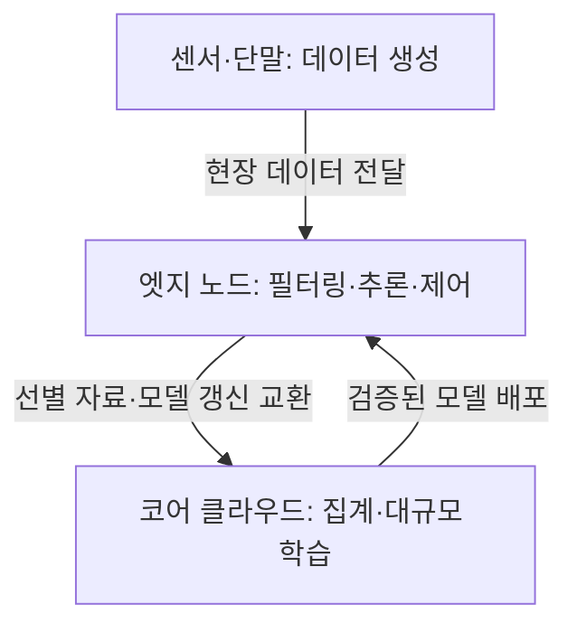
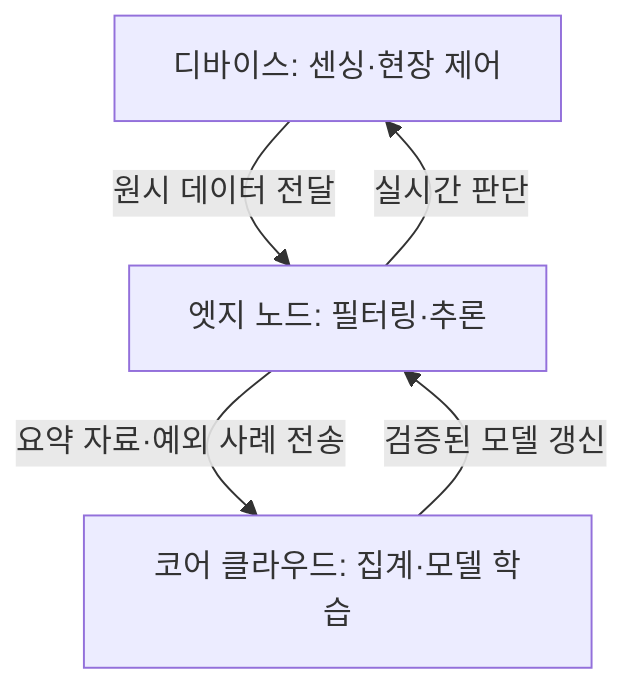

작성 모델 · GPT-6 작성 · 2026.09.24 21:00 KST

## 지식 로드맵 내 현재 위치

컴퓨터 시스템 → 분산 컴퓨팅 → 엣지 컴퓨팅

## 30초 인출

- 본질: **엣지 컴퓨팅(Edge Computing)** 은 데이터 발생지 가까이에서 데이터를 처리하는 분산 컴퓨팅 방식
- 메커니즘: 엣지에서 현장 제어·필터링·추론을 수행하고 필요한 데이터만 코어 클라우드로 전달
- 구분: 엣지와 클라우드는 대체 관계가 아니라 현장 처리와 중앙 집계·학습의 역할 분담

핵심 용어

- **엣지 컴퓨팅 (Edge Computing)** : 데이터 발생원 가까이에서 계산·저장·서비스를 수행하는 분산 컴퓨팅 방식.
- **MEC (Multi-access Edge Computing)** : 네트워크 엣지에 클라우드 기능과 IT 환경을 제공하는 ETSI 표준화 구조.
- **ETSI (European Telecommunications Standards Institute)** : 통신·정보기술 표준의 개발과 발행을 담당하는 유럽 표준기구.

---

## 1교시 예상문제 (10점)

> 엣지 컴퓨팅의 정의와 목적, 핵심 구조를 설명하시오. (예상)

---

## 1교시 10점 답안

### Ⅰ. 엣지 컴퓨팅의 개요

| 구분 | 핵심 |
|---|---|
| 정의 | **엣지 컴퓨팅 (Edge Computing)** 은 데이터 발생원 가까이에서 계산·저장·서비스를 수행하는 분산 컴퓨팅 방식 |
| 목적 | 원격 왕복 지연과 불필요한 데이터 전송 감소 |

### Ⅱ. 핵심 구조

### Ⅲ. 클라우드와의 차이

| 구분 | 엣지 컴퓨팅 | 클라우드 컴퓨팅 |
|---|---|---|
| 처리 위치 | 데이터 발생지 인근 | 원격 데이터센터 |
| 강점 | 낮은 지연, 적은 전송량 | 큰 연산·저장 자원 |
| 주 역할 | 현장 추론·즉시 제어 | 대규모 집계·학습 |

제언: 현장 응답은 엣지에서 처리하고 장기 분석·학습은 클라우드에 배치

---

## 2~4교시 예상문제 (25점)

> 엣지 컴퓨팅의 계층 구조와 데이터 처리 흐름을 설명하고, 클라우드 컴퓨팅과 비교하여 도입 시 고려사항과 개선 방안을 제시하시오. (예상)

---

## 2~4교시 25점 답안

## Ⅰ. 엣지 컴퓨팅의 개요

| 구분 | 핵심 |
|---|---|
| 정의 | **엣지 컴퓨팅 (Edge Computing)** 은 데이터 발생원 가까이에서 계산·저장·서비스를 수행하는 분산 컴퓨팅 방식 |
| 목적 | 원격 왕복 지연과 불필요한 데이터 전송 감소 |

## Ⅱ. 계층 구조와 처리 흐름

| 계층 | 주요 역할 |
|---|---|
| 디바이스 | 센서 데이터 생성, 현장 기기 제어 |
| 엣지 노드 | 실시간 필터링·추론, 로컬 캐시 |
| 코어 클라우드 | 대규모 데이터 집계, 모델 학습 |

## Ⅲ. 클라우드 컴퓨팅과 비교

| 비교축 | 엣지 컴퓨팅 | 클라우드 컴퓨팅 |
|---|---|---|
| 처리 위치 | 단말·게이트웨이·기지국 인근 | 원격 데이터센터 |
| 응답 특성 | 짧은 왕복 경로 | 네트워크 왕복 지연 존재 |
| 자원 규모 | 제한적·분산 | 대규모·중앙 집중 |
| 데이터 처리 | 필요한 데이터 선별·현장 처리 | 장기 저장·집계·대규모 분석 |

## Ⅳ. 도입 한계와 대응

| 한계 | 대응 |
|---|---|
| 분산 노드의 배포·유지보수 부담 | 중앙 관리와 단계적 원격 배포·롤백 적용 |
| 현장 장비의 제한된 연산·저장 자원 | 지연 요구와 자원 한계에 맞춰 추론·전처리 범위 조정 |
| 네트워크 단절 시 서비스 영향 | 필수 현장 기능을 엣지에서 지속하도록 설계 |

## Ⅴ. 기술사적 제언

| 한계 | 해결 방안 |
|---|---|
| 엣지 모델의 현장 환경 변화에 따른 성능 저하 | 현장에서 선별한 예외 데이터를 클라우드 재학습에 활용하고 검증된 경량 모델을 단계적으로 재배포 |

## 출제 이력과 검증 출처

- 제139회 정보관리기술사 1교시 6번: 엣지 컴퓨팅과 클라우드 컴퓨팅의 차이점(공식 Q-Net 문제지 대조).
- [ETSI, Multi-access Edge Computing (MEC)](https://www.etsi.org/technical-groups/mec/)
- [ETSI GS MEC 003 V4.1.1, Framework and Reference Architecture](https://www.etsi.org/deliver/etsi_gs/MEC/001_099/003/04.01.01_60/gs_mec003v040101p.pdf)

## 연결 토픽

- [클라우드 컴퓨팅](./013_cloud_computing.md) · [NPU](./007_npu.md) · [멀티클라우드](./009_multi_cloud.md)
