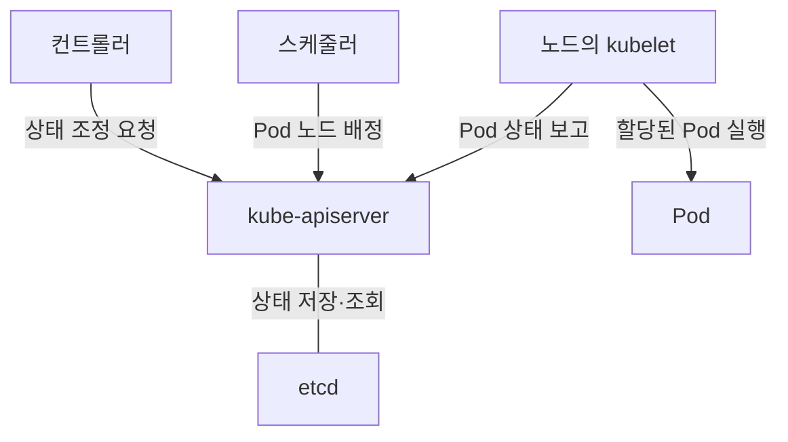
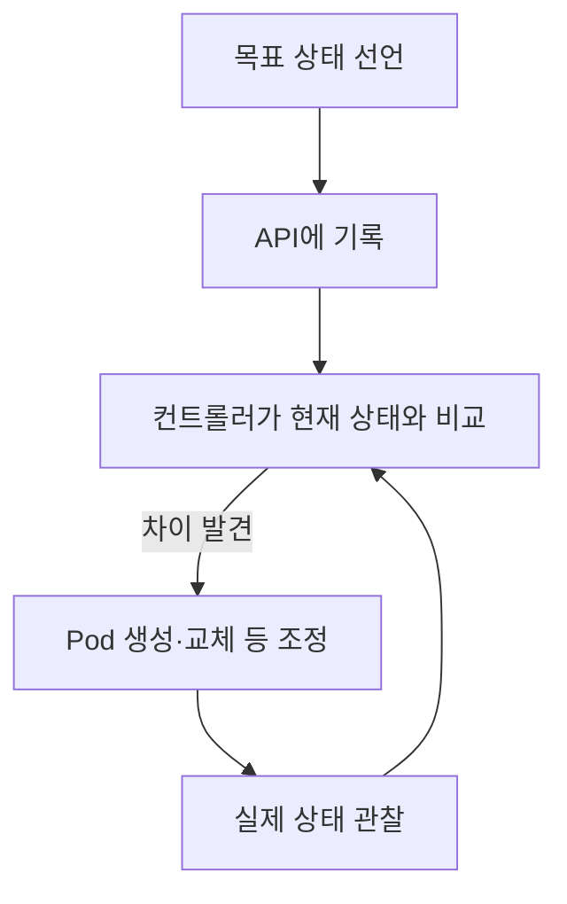

## 지식 로드맵 내 현재 위치

지식 위치: 컴퓨터 시스템 → 컨테이너 오케스트레이션 → **쿠버네티스**

## 30초 인출

- 본질: **쿠버네티스** 는 선언한 애플리케이션 상태를 유지하도록 컨테이너 실행을 조정하는 플랫폼이다.
- 메커니즘: API에 목표 상태를 기록하면 컨트롤러·스케줄러·노드의 kubelet이 현재 상태와 비교해 필요한 작업을 수행한다.

핵심 용어

- **Pod** : 같은 네트워크·스토리지 자원을 공유하며 함께 배치되는 컨테이너의 최소 실행 단위
- **kube-apiserver** : 클러스터 상태를 읽고 변경하는 Kubernetes API의 진입점
- **etcd** : 클러스터의 API 데이터를 저장하는 분산 키·값 저장소
- **kube-scheduler** : 아직 노드에 배정되지 않은 Pod에 적합한 노드를 선택하는 구성요소
- **kube-controller-manager** : 목표 상태와 현재 상태의 차이를 줄이는 컨트롤러를 실행하는 구성요소
- **kubelet** : 노드에서 할당된 Pod의 실행 상태를 관리하는 에이전트

---

## 1교시 예상문제 (10점)

> 쿠버네티스의 개념과 주요 구성요소, 선언형 상태 관리 방식을 설명하시오. (예상)

---

## 1교시 10점 답안

### Ⅰ. 정의·목적

- 정의: **쿠버네티스** 는 Pod의 배치·실행·복구를 선언한 목표 상태에 맞춰 조정하는 컨테이너 오케스트레이션 플랫폼이다.
- 목적: 여러 노드의 애플리케이션 배포와 가용성을 일관되게 관리한다.

### Ⅱ. 핵심 구성

### Ⅲ. 선언형 관리

| 입력 | 쿠버네티스의 동작 |
|---|---|
| 목표 상태: 복제본 3개 | 컨트롤러가 현재 복제본 수와 비교 |
| 현재 상태: 2개 | 부족한 Pod를 만들고 스케줄러가 노드를 배정 |

제언: 배포 전 복제본 수·자원 요구량·장애 영역을 함께 정해 가용성 목표와 배치 조건을 맞춘다.

---

## 2~4교시 예상문제 (25점)

> 쿠버네티스의 클러스터 구조와 선언형 상태 조정 방식을 설명하고, 배포·확장·장애 대응 시 확인할 사항을 제시하시오. (예상)

---

## 2~4교시 25점 답안

## Ⅰ. 쿠버네티스의 개요

| 구분 | 핵심 |
|---|---|
| 정의 | **쿠버네티스** 는 Pod의 배치·실행·복구를 선언한 목표 상태에 맞춰 조정하는 플랫폼 |
| 목적 | 여러 노드에서 실행되는 애플리케이션의 배포와 가용성 관리 |

## Ⅱ. 클러스터 구성요소와 역할

API 서버가 클러스터 상태의 진입점이다. 스케줄러는 노드를 고르고, kubelet은 배정된 노드에서 Pod를 실행한다.

## Ⅲ. 목표 상태를 맞추는 조정 과정

Deployment의 복제본 수가 부족하면 컨트롤러가 새 Pod를 만들도록 조정한다. 새 Pod는 스케줄러의 노드 배정을 거쳐 kubelet에서 실행된다.

## Ⅳ. 배포·확장·가용성의 운영 기준

| 상황 | 확인할 구성 | 판단 기준 |
|---|---|---|
| 버전 배포 | Deployment의 RollingUpdate | `maxUnavailable`·`maxSurge`와 준비 상태 |
| 부하 변화 | HPA | 관측 지표와 최소·최대 복제본 수 |
| 노드·영역 장애 | 복제본·Topology Spread Constraints | Pod가 여러 장애 영역에 분산되는지 |
| 제어 평면 복구 | etcd 백업·복원 절차 | 상태 데이터의 복구 가능 여부 |

## Ⅴ. 장애 대응에 대한 제언

| 문제 | 해결 방안 |
|---|---|
| 복제본이 한 노드나 영역에 몰림 | Topology Spread Constraints와 충분한 복제본을 함께 설정하고 실제 배치를 확인 |
| 배포 중 가용 Pod가 부족해짐 | RollingUpdate 설정과 준비 상태 검사를 서비스 가용성 목표에 맞춰 검증 |

## 출제 이력과 검증 출처

- 기존 노트에 제133회·제137회 출제 언급이 있었으나 원문을 확인하지 못해 예상문제로 표기했다.
- [Kubernetes 공식 문서, 클러스터 아키텍처](https://kubernetes.io/docs/concepts/architecture/)
- [Kubernetes 공식 문서, Deployment](https://kubernetes.io/docs/concepts/workloads/controllers/deployment/)
- [Kubernetes 공식 문서, Horizontal Pod Autoscaling](https://kubernetes.io/docs/concepts/workloads/autoscaling/horizontal-pod-autoscale/)
- [Kubernetes 공식 문서, Pod Topology Spread Constraints](https://kubernetes.io/docs/concepts/scheduling-eviction/topology-spread-constraints/)

## 연결 토픽

- 연관 토픽: [컨테이너](./032_container.md), [오토스케일링](./025_auto_scaling.md)
