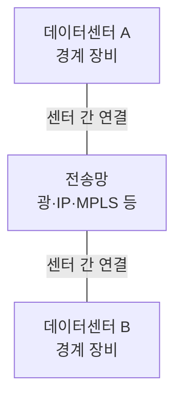

## 지식 로드맵 내 현재 위치

지식 위치: 컴퓨터 시스템 → 데이터센터 네트워크 → **DCI**

## 30초 인출

- 본질: **DCI** 는 떨어진 데이터센터의 네트워크를 연결해 서비스 트래픽과 데이터 교환을 지원하는 구성이다.
- 메커니즘: 각 센터의 경계 장비를 광·IP·MPLS 등 전송망으로 연결하고, 요구에 따라 L3 라우팅이나 EVPN 기반 L2 연장을 적용한다.

핵심 용어

- **DCI** : 데이터센터 사이의 네트워크 연결과 그 경계 장비·전송망을 포함한 구성
- **DWDM** : 여러 광 파장을 하나의 광섬유에서 함께 전송하는 광 다중화 기술
- **EVPN** : BGP를 이용해 이더넷 서비스의 MAC·IP 도달 정보를 교환하는 제어 평면
- **VXLAN** : IP 망 위에 가상 L2 네트워크를 실어 나르는 캡슐화 방식
- **L2 연장** : 데이터센터 사이에 같은 L2 세그먼트를 유지하는 설계 선택
- **L3 연계** : 데이터센터별 네트워크 경계를 유지하면서 라우팅으로 연결하는 설계 선택

---

## 1교시 예상문제 (10점)

> DCI의 개념과 기본 구조, L2 연장과 L3 연계의 차이를 설명하시오. (예상)

---

## 1교시 10점 답안

### 1. 정의·목적

- 정의: **DCI** 는 두 개 이상의 데이터센터를 네트워크로 연결하는 구성이다.
- 목적: 센터 간 서비스 통신과 데이터 복제에 필요한 연결을 제공한다.

### 2. 기본 구조

### 3. 연결 범위 선택

| 방식 | 유지하는 경계 | 확인할 위험 |
|---|---|---|
| L3 연계 | 센터별 IP·장애 영역 분리 | 라우팅·주소 변경 요구 |
| L2 연장 | 같은 L2 세그먼트 확장 | 브로드캐스트·장애 전파 범위 |

제언: 워크로드가 실제로 같은 L2 세그먼트를 필요로 하는지 먼저 확인하고 연결 범위를 정한다.

---

## 2~4교시 예상문제 (25점)

> DCI의 연결 구조와 전송·오버레이 기술의 역할을 설명하고, L2 연장과 L3 연계의 선택 기준 및 장애 전파 대응을 제시하시오. (예상)

---

## 2~4교시 25점 답안

## Ⅰ. DCI의 개요

| 구분 | 핵심 |
|---|---|
| 정의 | 두 개 이상의 데이터센터를 연결하는 경계 장비·전송망 구성 |
| 목적 | 센터 간 서비스 통신과 데이터 교환 지원 |

## Ⅱ. 데이터센터 간 연결 구조

센터의 경계 장비는 연결할 네트워크 범위를 정한다. 전송망이 곧 L2 연장이나 동기식 복제를 보장하는 것은 아니다.

## Ⅲ. 전송망과 오버레이 기술의 역할

| 계층·기능 | 기술 예 | 역할 |
|---|---|---|
| 물리 전송 | 광회선·DWDM | 센터 간 전송 용량 제공 |
| 네트워크 연결 | IP·MPLS | 센터 경계 장비 사이 도달성 제공 |
| 가상 네트워크 | EVPN·VXLAN | 필요한 L2/L3 서비스와 도달 정보 교환 |

DWDM과 EVPN·VXLAN은 서로 다른 계층의 선택지다. 모든 DCI에 함께 필요한 필수 묶음으로 보지 않는다.

## Ⅳ. L2 연장과 L3 연계의 설계 판단

| 판단 기준 | L2 연장 | L3 연계 |
|---|---|---|
| 주소·세그먼트 | 같은 L2 세그먼트 유지 가능 | 센터별 세그먼트 분리 |
| 장애 영향 | 설정에 따라 L2 장애 영역이 확대될 수 있음 | 라우팅 경계로 장애 범위를 분리하기 쉬움 |
| 적합한 경우 | 실제 L2 이동·연속성이 필요한 워크로드 | 주소 분리와 장애 격리가 우선인 워크로드 |

복제 방식은 별도 판단한다. 동기식 복제의 가능 여부는 거리만이 아니라 왕복 지연, 애플리케이션의 쓰기 경로, 허용 성능을 함께 확인해야 한다.

## Ⅴ. 연결 범위와 복제 방식에 대한 제언

| 문제 | 해결 방안 |
|---|---|
| 필요하지 않은 L2 세그먼트를 센터 전체로 확장 | 워크로드별 연결 요구를 확인하고 필요한 세그먼트만 연장하거나 L3로 분리 |
| 복제 지연이 서비스 응답에 영향을 줌 | 실제 RTT와 쓰기 지연을 측정해 동기·비동기 복제 방식을 선택 |

## 출제 이력과 검증 출처

- 기존 노트의 회차·원문을 확인하지 못해 예상문제로 표기했다.
- [Juniper, VXLAN Data Center Interconnect Using EVPN Overview](https://www.juniper.net/documentation/us/en/software/junos/evpn-vxlan/topics/concept/vxlan-evpn-integration-overview.html)
- [Cisco, VXLAN BGP EVPN Data Center Fabrics Design Guide](https://www.cisco.com/c/en/us/td/docs/dcn/whitepapers/cisco-vxlan-bgp-evpn-design-and-implementation-guide.html)

## 연결 토픽

- 연관 토픽: [고가용성](./021_ha.md), [클라우드 컴퓨팅](./013_cloud_computing.md)
