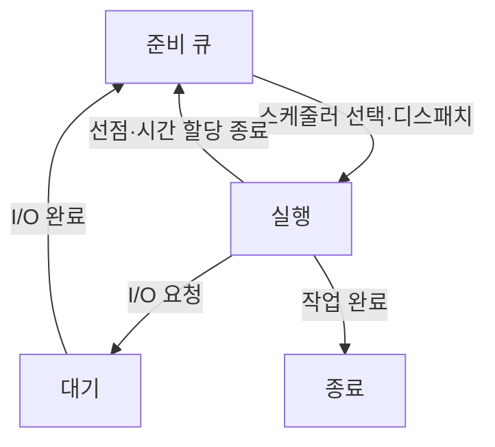

## 지식 로드맵 내 현재 위치

지식 위치: 컴퓨터 시스템 → 운영체제 자원 관리 → **CPU 스케줄링**

## 30초 인출

- 본질: **CPU 스케줄링 (CPU Scheduling)** 은 실행 가능한 작업 중 다음에 CPU를 사용할 작업을 선택하는 운영체제 기능
- 메커니즘: 준비 큐에서 정책에 맞는 작업 선택 → 디스패처의 문맥 전환·CPU 할당 → I/O 완료·선점 뒤 준비 상태 복귀

핵심 용어

- **CPU (Central Processing Unit)** : 프로그램 명령을 실행하는 중앙 처리 장치.
- **I/O (Input/Output)** : 프로세서와 주변 장치 사이의 입력·출력 작업.
- **CPU 스케줄링 (CPU Scheduling)** : 실행 가능한 작업 중 다음 CPU 사용 작업을 선택하는 운영체제 기능.
- **FCFS (First-Come, First-Served)** : 준비 큐에 먼저 도착한 작업을 먼저 실행하는 방식.
- **SJF (Shortest Job First)** : 다음 CPU 실행 시간이 짧은 작업을 먼저 선택하는 방식.
- **RR (Round Robin)** : 준비 큐 작업에 차례로 일정 시간 할당량을 주는 선점 방식.
- **CFS (Completely Fair Scheduler)** : Linux의 공정 스케줄링 구현으로, 가상 실행시간을 사용한 스케줄러.
- **EEVDF (Earliest Eligible Virtual Deadline First)** : 실행 자격이 있는 작업 중 가상 마감시각이 빠른 작업을 선택하는 스케줄링 알고리즘.
- **준비 큐** : 실행 가능하지만 CPU 할당을 기다리는 작업의 집합
- **디스패처** : 스케줄러가 고른 작업으로 CPU 실행을 전환하는 운영체제 구성요소
- **선점** : 실행 중인 작업의 CPU 사용을 중단시키고 다른 작업에 CPU를 주는 방식
- **기아** : 우선순위 등 정책 때문에 어떤 작업이 계속 CPU를 받지 못하는 상태
- **타임 퀀텀** : 라운드 로빈에서 한 작업이 한 번에 사용할 수 있는 CPU 시간

---

## 1교시 예상문제 (10점)

> CPU 스케줄링의 목적과 준비·실행·대기 상태 사이의 전환을 설명하시오. (예상)

---

## 1교시 10점 답안

### Ⅰ. CPU 스케줄링의 개요

| 구분 | 핵심 |
|---|---|
| 정의 | **CPU 스케줄링 (CPU Scheduling)** 은 실행 가능한 작업 중 다음 CPU 사용 작업을 선택하는 운영체제 기능 |
| 목적 | 처리량·응답성·대기 시간의 균형 |

### Ⅱ. 상태 전환과 스케줄링

### Ⅲ. 평가 기준

| 기준 | 무엇을 보는가 |
|---|---|
| 응답 시간 | 요청 후 첫 실행까지 걸린 시간 |
| 대기 시간 | 준비 큐에서 기다린 시간 |
| 처리량 | 일정 시간 동안 완료한 작업 수 |

제언: 대화형·배치 작업의 요구를 구분하고 응답 시간·처리량 중 우선 목표에 맞춰 정책을 선택

---

## 2~4교시 예상문제 (25점)

> CPU 스케줄링의 상태 전환과 선점·비선점 방식을 설명하고, 대표 알고리즘의 선택 기준과 기아·응답 지연 대응을 제시하시오. (예상)

---

## 2~4교시 25점 답안

## Ⅰ. CPU 스케줄링의 개요

| 구분 | 핵심 |
|---|---|
| 정의 | **CPU 스케줄링 (CPU Scheduling)** 은 실행 가능한 작업 중 다음 CPU 사용 작업을 선택하는 운영체제 기능 |
| 목적 | 처리량·응답성·대기 시간의 균형 |

## Ⅱ. 준비·실행·대기의 전환

상태 흐름: I/O 완료 작업은 실행 상태가 아닌 준비 큐로 복귀한 뒤 CPU 재배정 대기.

## Ⅲ. 대표 스케줄링 방식의 선택 기준

| 방식 | 선택 원리 | 한계 |
|---|---|---|
| FCFS | 준비된 순서대로 실행 | 긴 작업이 뒤 작업을 지연할 수 있음 |
| SJF | 예상 CPU 사용 시간이 짧은 작업 우선 | 사용 시간을 미리 정확히 알기 어려움 |
| RR | 시간 할당량마다 작업 교체 | 할당량이 작으면 전환 비용 증가 |
| 우선순위 | 중요도가 높은 작업 우선 | 낮은 우선순위 작업의 기아 가능 |

선점형 정책의 응답성 개선 가능성과 문맥 전환 비용 간 상충 관계.

## Ⅳ. 목표에 따른 평가와 구현 예

| 목표 | 확인할 지표·기법 |
|---|---|
| 대화형 응답 | 응답 시간, 선점 지점, 타임 퀀텀 |
| 배치 처리 | 처리량, 평균 대기·반환 시간 |
| 공정성 | 작업별 CPU 사용 비율, 장시간 대기 여부 |

Linux 스케줄러 변화: 과거 CFS의 가상 실행시간 방식에서 Linux 6.6부터 EEVDF로 전환 시작. 실제 정책은 커널 버전과 설정별 확인.

## Ⅴ. 기술사적 제언

| 한계 | 해결 방안 |
|---|---|
| 낮은 우선순위 작업이 계속 밀림 | 대기 시간이 길어질 때 우선순위를 조정하는 에이징 등 기아 방지 정책 적용 |
| RR의 할당량이 너무 작아 전환이 잦음 | 실제 작업의 응답 시간과 문맥 전환 비용을 측정해 할당량 조정 |

## 출제 이력과 검증 출처

- 제137회 정보관리기술사 3교시 1번: CPU·디스크 스케줄링 개념과 SJF·SRT·SSTF·SLTF 설명(공식 Q-Net 문제지 대조). 아래 예상문제는 원문 문항과 구분
- [Linux Kernel Documentation, CFS Scheduler](https://docs.kernel.org/scheduler/sched-design-CFS.html)
- [Linux Kernel Documentation, EEVDF Scheduler](https://kernel.org/doc/html/latest/scheduler/sched-eevdf.html)

## 연결 토픽

- 연관 토픽: [가상 메모리](./023_virtual_memory.md), [컨테이너](./032_container.md)
