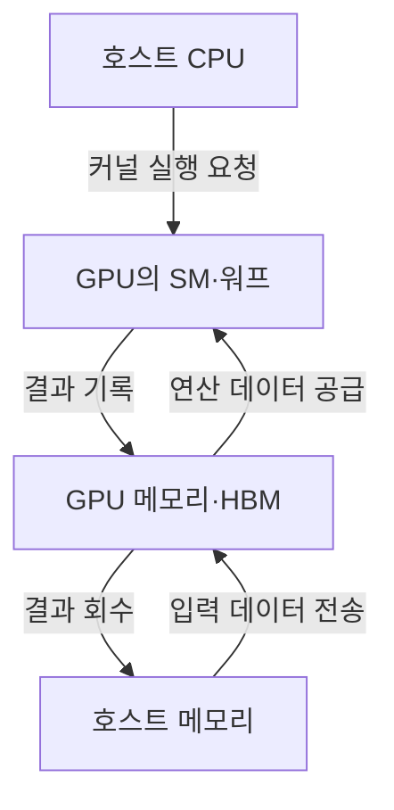
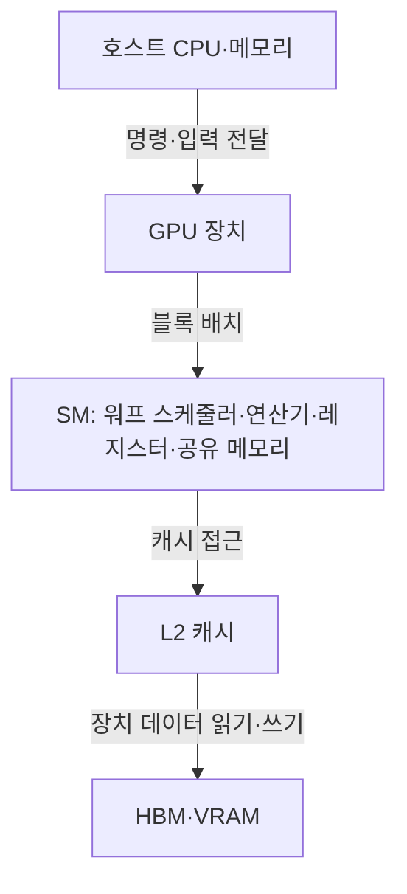
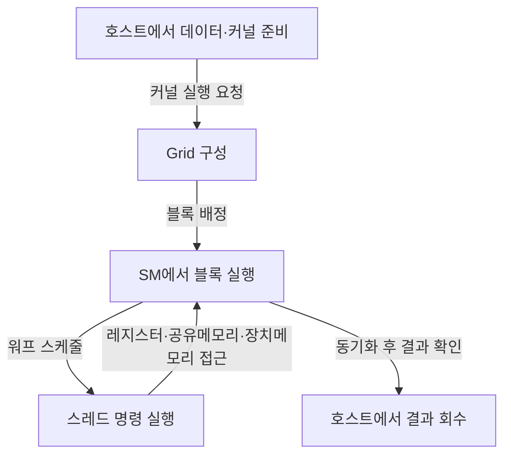

## 지식 로드맵 내 현재 위치

컴퓨터 구조병렬 가속기<strong>GPU</strong>

## 큰 그림과 30초 인출

- 본질: **GPU (Graphics Processing Unit)** 는 여러 연산기로 데이터 병렬 작업의 처리량을 높이는 프로세서
- 메커니즘: 스레드 블록을 연산 장치에 배치하고, 실행 그룹이 레지스터·캐시·장치 메모리의 데이터를 처리
- 병목: 분기 발산·불규칙 메모리 접근·Host-Device 전송·가속기 간 통신

핵심 용어

- **GPU (Graphics Processing Unit)** : 다수의 연산기로 데이터 병렬 작업을 수행하는 프로세서.
- **SIMT (Single Instruction, Multiple Threads)** : 여러 스레드가 같은 명령을 각 데이터에 적용하는 GPU 실행 모델.
- **SM (Streaming Multiprocessor)** : NVIDIA GPU에서 워프·연산기·온칩 메모리를 묶어 실행하는 처리 블록.
- **Warp** : GPU가 함께 스케줄하는 스레드 묶음으로, 크기와 세부 동작은 아키텍처별 차이.
- **CUDA (Compute Unified Device Architecture)** : NVIDIA GPU를 위한 병렬 컴퓨팅 플랫폼·프로그래밍 모델.
- **Tensor Core** : NVIDIA GPU의 행렬 연산 가속 장치.
- **HBM (High Bandwidth Memory)** : 넓은 인터페이스와 적층 구조를 통해 높은 메모리 대역폭을 제공하는 메모리 유형.
- **PCIe (Peripheral Component Interconnect Express)** : 호스트와 주변 장치 사이의 직렬 고속 연결 표준.

---

## 1교시 예상문제 (10점)
> GPU의 정의와 주요 구조를 설명하시오. (예상)

---

## 1교시 10점 답안
### Ⅰ. GPU의 개요

| 구분 | 핵심 |
|---|---|
| 정의 | **GPU (Graphics Processing Unit)** 는 여러 연산기로 데이터 병렬 작업의 처리량을 높이는 프로세서 |
| 목적 | 그래픽·AI·과학계산의 데이터 병렬 처리량 향상 |

| 핵심 요소 | 역할 |
|---|---|
| SM·Warp | 스레드 묶음을 스케줄하고 병렬 실행 |
| CUDA·Tensor Core | 범용 병렬·행렬 연산 수행 |
| Shared Memory·HBM | 재사용 데이터와 대용량 데이터 공급 |

- 제언: 분기·메모리·전송 병목을 프로파일링해 해당 경로를 우선 최적화

---

## 2~4교시 예상문제 (25점)
> GPU의 구조와 동작 원리를 설명하고 CPU·TPU와 비교한 후, 멀티 GPU 학습의 병목과 대응 방안을 제시하시오. (예상)

---

## 2~4교시 25점 답안

## Ⅰ. GPU의 개요

| 구분 | 핵심 |
|---|---|
| 정의 | **GPU (Graphics Processing Unit)** 는 여러 연산기로 데이터 병렬 작업의 처리량을 높이는 프로세서 |
| 목적 | 그래픽·AI·과학계산의 데이터 병렬 처리량 향상 |

## Ⅱ. SIMT·대규모 병렬성·메모리 대역폭의 특징

| 특징 | 구현 메커니즘 | 효과·제약 |
|---|---|---|
| **SIMT** | 하나의 명령을 워프 내 다수 스레드가 실행 | 규칙적 데이터 병렬 처리에 유리 |
| **대규모 코어 집적** | 제어·캐시보다 연산기 비중 확대 | 높은 처리량, 단일 스레드 지연에는 불리 |
| **계층형 메모리** | 레지스터·공유메모리·캐시·HBM 구성 | 지역성 활용 시 대역폭 효율 향상 |
| **전용 텐서 연산** | 행렬 곱셈-누적 장치 제공 | 혼합정밀도 AI 연산 가속 |
| **이기종 실행** | CPU가 제어하고 GPU가 커널 수행 | 전송·동기화 비용 관리 필요 |

## Ⅲ. SM과 메모리 계층으로 구성된 GPU 구조

| 구성요소 | 책임 |
|---|---|
| **SM** | 워프를 배치하고 다수 연산 파이프라인을 실행하는 기본 처리 블록 |
| **Warp Scheduler** | 실행 가능한 워프를 골라 명령 발행, 메모리 지연 은닉 |
| **CUDA Core** | 정수·부동소수점 스칼라/벡터 연산 수행 |
| **Tensor Core** | 혼합정밀도 행렬 곱셈-누적 연산 가속 |
| **Shared Memory** | 스레드 블록 내 저지연 데이터 공유·재사용 |
| **L2·HBM** | 장치 전역 데이터 캐시와 고대역폭 외부 메모리 제공 |

## Ⅳ. Host 제어에서 병렬 커널 실행까지의 동작

- 스레드는 블록으로, 블록은 그리드로 계층화되며 스케줄러가 가용 SM에 블록을 배치
- 메모리 지연이 생긴 워프 대신 실행 가능한 다른 워프를 발행해 지연을 은닉
- 동일 워프가 서로 다른 분기 경로를 선택하면 경로를 나누어 실행하므로 **분기 발산**이 발생

## Ⅴ. CPU·GPU·TPU의 구조와 적용 비교

| 기준 | CPU | GPU | TPU·AI ASIC |
|---|---|---|---|
| 최적화 목표 | 단일 작업 지연·범용 제어 | 대규모 병렬 처리량 | 텐서 연산 효율 |
| 실행 구조 | 소수 고성능 코어·큰 캐시 | 다수 경량 코어·SIMT | 행렬 연산 배열·데이터플로 |
| 강점 | 분기·순차·OS·업무 처리 | AI 학습·그래픽·과학계산 | 정형 AI 학습·추론의 전력 효율 |
| 약점 | 대규모 데이터 병렬 처리량 | 분기 발산·전송·프로그래밍 복잡성 | 지원 연산·프레임워크의 제약 |
| 선정 기준 | 복잡 제어와 낮은 지연 | 유연한 병렬 연산과 생태계 | 정형 워크로드의 효율·규모 |

## Ⅵ. 멀티 GPU 병목과 최적화 방안

| 한계 | 원인 | 대응 | 확인 기준 |
|---|---|---|---|
| **메모리 병목** | 연산량보다 가중치·활성값 이동량이 큼 | 연속 접근, 타일링, 커널 융합, 혼합정밀도 | 메모리 대역폭 활용률, 연산집약도 |
| **분기 발산** | 워프 내 스레드의 제어 경로 불일치 | 데이터·분기 재구성, 워프 단위 작업 정렬 | 활성 스레드 비율 |
| **Host-Device 전송** | 작은 전송·빈번한 동기화 | 배치 확대, 비동기 전송, 고정 메모리 활용 | 전송시간/전체시간 비율 |
| **가속기 간 통신** | 데이터·모델 병렬의 집단통신 증가 | 토폴로지 인식 배치, 통신-연산 중첩 | All-Reduce 시간, 확장 효율 |
| **메모리 용량 초과** | 모델·옵티마이저·활성값 동시 적재 | 체크포인팅, 샤딩, 파이프라인·텐서 병렬 | 최대 메모리 사용량, 재계산 비용 |

- 설계 순서: 워크로드 연산집약도 분석 → CPU/GPU/ASIC 역할 분리 → 메모리 이동 최소화 → 단일 GPU 프로파일링 → 분산 확장
- 수치 주의: 제품 세대별 코어 수·대역폭·정밀도는 달라지므로 답안에는 검증된 대상과 버전이 있을 때만 기재

## Ⅶ. 기술사적 제언

| 한계 | 해결 방안 |
|---|---|
| 코어 수나 최대 연산량만으로 장비를 고르면 실제 병목이 드러나지 않을 수 있음 | 대표 워크로드를 프로파일링해 연산·메모리·전송·통신 중 지배 병목을 찾고 해당 경로를 우선 개선 |

## 출제 이력과 검증 출처

- 제138회 정보관리기술사 2교시 3번: GPU와 TPU의 개념·구조·특징·차이점
- [NVIDIA CUDA C++ Programming Guide](https://docs.nvidia.com/cuda/cuda-c-programming-guide/)
- [Google Cloud TPU System Architecture](https://cloud.google.com/tpu/docs/system-architecture-tpu-vm)
- 제품별 성능 수치는 사용하지 않고, 공식 프로그래밍 모델과 구조 설명만 답안에 반영

## 연결 토픽

- [CPU](./076_cpu/) · [TPU](./022_tpu/) · [NPU](./007_npu/) · [GPGPU](./083_gpgpu/) · [HBM](./079_hbm/) · [Multi-GPU](./094_multi_gpu/)
