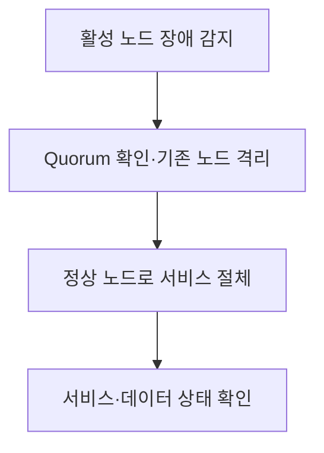

## 지식 로드맵 내 현재 위치

지식 위치: 컴퓨터 시스템 → 서비스 가용성 → **HA**

## 30초 인출

- 본질: **HA (High Availability)** 는 구성요소 장애가 서비스 중단으로 이어지는 시간을 줄이는 설계
- 메커니즘: 장애 감지 → 기존 노드 격리 → 정상 노드로 절체 → 서비스·데이터 확인

핵심 용어

- **HA (High Availability)** : 장애가 나도 서비스를 계속 제공하거나 신속히 복구하도록 구성한 시스템의 특성.
- **가용성** : 정해진 기간에 서비스가 정상 제공된 시간의 비율
- **Failover** : 장애가 난 구성요소에서 정상 구성요소로 서비스를 넘기는 동작
- **Quorum** : 클러스터가 어느 노드 집합에서 서비스를 계속 운영할지 결정하는 합의 조건
- **Fencing** : 장애·분할 상황의 노드가 공유 자원을 계속 쓰지 못하도록 격리하는 조치
- **Split-Brain** : 통신이 끊긴 노드들이 각각 자신을 활성 노드로 판단하는 상태
- **Active-Standby** : 평상시 주 노드가 처리하고 예비 노드는 대기하다 장애 때 넘겨받는 구성
- **Active-Active** : 여러 노드가 평상시 함께 요청을 처리하고 장애 때 남은 노드에 부하를 분산하는 구성
- **RTO (Recovery Time Objective)** : 장애 후 서비스를 복구하기까지 허용하는 목표 시간
- **RPO (Recovery Point Objective)** : 장애 발생 시 허용하는 데이터 손실의 목표 시점

---

## 1교시 예상문제 (10점)

> HA의 개념과 목적, 핵심 구조를 설명하시오. (예상)

---

## 1교시 10점 답안

### Ⅰ. 정의·목적

| 구분 | 핵심 |
|---|---|
| 정의 | **HA (High Availability)** 는 구성요소 장애 시 예비 자원으로 서비스를 넘겨 중단을 줄이는 설계 |
| 목적 | 장애로 인한 서비스 중단 시간을 허용 범위 안으로 축소 |

### Ⅱ. 장애 대응 흐름

### Ⅲ. 목표의 구분

| 지표 | 묻는 것 |
|---|---|
| 가용성 | 측정 기간 중 얼마나 정상 제공했는가 |
| **RTO (Recovery Time Objective)** | 장애 후 언제까지 복구해야 하는가 |
| **RPO (Recovery Point Objective)** | 어느 시점까지의 데이터 손실을 허용하는가 |

제언: 절체 시험으로 실제 복구 시간과 데이터 시점을 측정하고 설정한 목표와 비교

---

## 2~4교시 예상문제 (25점)

> HA의 이중화 구성과 장애 절체 과정을 설명하고, Active-Standby·Active-Active의 차이와 Split-Brain 방지 및 RTO·RPO 검증 방안을 제시하시오. (예상)

---

## 2~4교시 25점 답안

## Ⅰ. HA의 개요

| 구분 | 핵심 |
|---|---|
| 정의 | **HA (High Availability)** 는 구성요소 장애 시 예비 자원으로 서비스를 넘겨 중단을 줄이는 설계 |
| 목적 | 장애로 인한 서비스 중단 시간을 허용 범위 안으로 축소 |

## Ⅱ. 장애 감지와 절체

장애 감지만으로 대기 노드를 활성화하면 통신 분할 때 두 노드가 동시에 쓰기 작업을 할 위험. 공유 자원 접근 전 **Quorum** 확인과 **Fencing** 적용 필요.

## Ⅲ. 이중화 구성 선택

| 구분 | **Active-Standby** | **Active-Active** |
|---|---|---|
| 정상 시 | 활성 노드가 요청 처리, 대기 노드 준비 | 두 노드 이상이 요청 처리 |
| 장애 시 | 대기 노드로 절체 | 남은 노드로 트래픽 재분배 |
| 설계 초점 | 절체 시간·대기 자원의 준비 상태 | 부하 여유·데이터 일관성·장애 영역 |

어느 구성도 단독으로 가용률이나 무손실 복구를 보장하지 않는 한계. 데이터 복제와 애플리케이션 재접속까지 포함한 설계.

## Ⅳ. 장애 유형과 확인할 통제

| 위험 | 통제 | 확인할 결과 |
|---|---|---|
| 노드 간 통신 분할 | Quorum·Fencing | 한쪽만 공유 자원에 쓰는지 |
| 절체 중 연결 끊김 | 재접속·재시도 정책 | 이용자가 다시 처리할 수 있는지 |
| 복제 지연 | 복제 방식·데이터 검증 | 실제 복구 시점이 **RPO (Recovery Point Objective)** 이내인지 |
| 절체 지연 | 장애 감지·승격·서비스 확인 시험 | 실제 복구 시간이 **RTO (Recovery Time Objective)** 이내인지 |

## Ⅴ. 절체 검증에 대한 제언

| 한계 | 해결 방안 |
|---|---|
| 장애 시나리오가 서비스 중요도와 의존성에 따라 우선순위화되지 않을 수 있음 | 서비스 영향도와 의존 구성요소를 기준으로 영향이 큰 장애부터 절체·복구 연습 |

## 출제 이력과 검증 출처

- 기존 노트의 제138회 문항 원문을 확인하지 못해 예상문제로 표기했다.
- [Red Hat, High Availability Cluster Overview](https://docs.redhat.com/en/documentation/red_hat_enterprise_linux/9/html/configuring_and_managing_high_availability_clusters/assembly_overview-of-high-availability-configuring-and-managing-high-availability-clusters)
- [AWS, Recovery Objectives](https://docs.aws.amazon.com/whitepapers/latest/disaster-recovery-of-on-premises-applications-to-aws/recovery-objectives.html)

## 연결 토픽

- 연관 토픽: [다중 리전 재해복구](./068_multi_region_active_active_disaster_recovery.md), [DCI](./014_dci.md)
