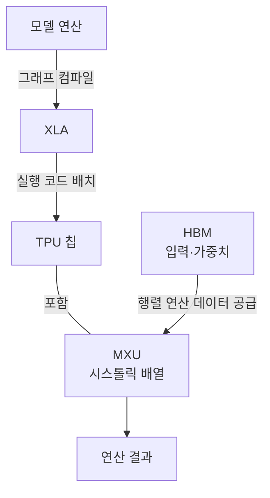

## 지식 로드맵 내 현재 위치

지식 위치: 컴퓨터 시스템 → AI 연산 가속기 → **TPU**

## 30초 인출

- 본질: **TPU (Tensor Processing Unit)** 는 머신러닝의 행렬 연산을 가속하도록 설계된 전용 칩
- 메커니즘: **XLA (Accelerated Linear Algebra)** 컴파일 → **MXU (Matrix Multiplication Unit)** 시스톨릭 배열의 곱셈·누산

핵심 용어

- **TPU (Tensor Processing Unit)** : Google이 머신러닝 연산을 가속하기 위해 설계한 ASIC (Application-Specific Integrated Circuit)
- **MXU (Matrix Multiplication Unit)** : TPU에서 행렬 곱셈·누산을 수행하는 연산 장치
- **시스톨릭 배열** : 이웃 연산기 사이로 데이터와 부분합을 전달해 행렬 연산에 재사용하는 구조
- **XLA (Accelerated Linear Algebra)** : 모델 연산 그래프를 TPU 실행 코드로 컴파일하는 컴파일러 도구
- **HBM (High Bandwidth Memory)** : 가속기 가까이 배치해 높은 대역폭으로 데이터를 공급하는 메모리
- **GPU (Graphics Processing Unit)** : 그래픽·범용 병렬 연산을 수행하는 프로세서
- **bfloat16 (Brain Floating Point 16)** : 16비트 중 지수부를 넓게 두어 부동소수점 범위를 확보하는 수 표현 형식

---

## 1교시 예상문제 (10점)

> TPU의 개념과 목적, 핵심 구조를 설명하시오. (예상)

---

## 1교시 10점 답안

### Ⅰ. 정의·목적

| 구분 | 핵심 |
|---|---|
| 정의 | **TPU (Tensor Processing Unit)** 는 머신러닝의 행렬 연산을 가속하도록 설계된 전용 칩 |
| 목적 | 적합한 모델의 행렬 연산 처리량 향상 |

### Ⅱ. 행렬 연산 구조

### Ⅲ. 구성요소별 역할

| 구성 | 핵심 역할 |
|---|---|
| **XLA (Accelerated Linear Algebra)** | 연산 그래프를 TPU용 실행 코드로 컴파일 |
| **HBM (High Bandwidth Memory)** | 데이터·가중치 공급 |
| **MXU (Matrix Multiplication Unit)** | 행렬 곱셈·누산 수행 |

제언: 모델의 행렬 연산 비중과 텐서 형상을 확인한 뒤 TPU 적합성 시험

---

## 2~4교시 예상문제 (25점)

> TPU의 개념과 목적, 핵심 구조를 설명하시오. (예상)

---

## 2~4교시 25점 답안

## Ⅰ. TPU의 개요

| 구분 | 핵심 |
|---|---|
| 정의 | **TPU (Tensor Processing Unit)** 는 머신러닝의 행렬 연산을 가속하도록 설계된 전용 칩 |
| 목적 | 적합한 모델의 행렬 연산 처리량 향상 |

## Ⅱ. XLA와 MXU 중심의 실행 구조

MXU 배열 크기와 칩 구성의 세대별 차이. 특정 세대의 수치를 TPU 전체의 고정 구조로 일반화하지 않음.

## Ⅲ. 시스톨릭 배열의 작동과 제약

| 관점 | 핵심 |
|---|---|
| 데이터 이동 | 인접 연산기 사이로 입력과 부분합을 전달해 재사용 |
| 계산 | 다수 곱셈·누산을 행렬 형태로 병렬 수행 |
| 활용률 | 작은 행렬이나 비행렬 연산이 많으면 MXU 활용률이 낮아질 수 있음 |
| 컴파일 | 텐서 형상이 자주 바뀌면 재컴파일·패딩 비용을 확인해야 함 |

## Ⅳ. GPU와의 선택 기준

| 기준 | TPU | **GPU (Graphics Processing Unit)** |
|---|---|---|
| 강점 | 큰 행렬 연산과 XLA 최적화 | 다양한 병렬 연산·도구 생태계 |
| 적용 판단 | 모델의 행렬 비중·텐서 형상·지원 프레임워크 확인 | 연산 다양성·개발 도구·배포 환경 확인 |
| 주의점 | 컴파일·데이터 공급 병목 확인 | 커널·메모리 이동 병목 확인 |

장치 이름만으로 처리량이나 비용 우위를 단정하기 어려운 한계. 실제 모델·배치·입력 크기를 이용한 비교.

## Ⅴ. 성능 저하 대응

| 한계 | 해결 방안 |
|---|---|
| 텐서 형상이 계속 바뀌어 컴파일 비용 증가 | 입력 길이를 적절한 구간으로 묶고 재컴파일 횟수와 패딩 비용을 함께 측정 |
| 데이터 공급이 느려 MXU가 쉬는 시간 증가 | 입력 파이프라인을 프로파일링해 읽기·전처리 병목을 줄임 |

## 출제 이력과 검증 출처

- 제138회 정보관리기술사 2교시 3번: GPU·TPU 개념·비교·TPU 활용 이유·효율과 전망(공식 Q-Net 문제지 대조). 아래 예상문제는 원문 문항과 구분
- [Google Cloud, TPU architecture](https://docs.cloud.google.com/tpu/docs/system-architecture-tpu-vm)
- [Google Cloud, Introduction to Cloud TPU](https://docs.cloud.google.com/tpu/docs/intro-to-tpu)
- [Google Cloud, Cloud TPU performance guide](https://docs.cloud.google.com/tpu/docs/performance-guide)

## 연결 토픽

- 연관 토픽: [다중 GPU 분산학습](./095_multi_gpu_distributed_training.md), [AI 슈퍼컴퓨팅 플랫폼](../07-latest-tech/058_ai_supercomputing_platform.md)
