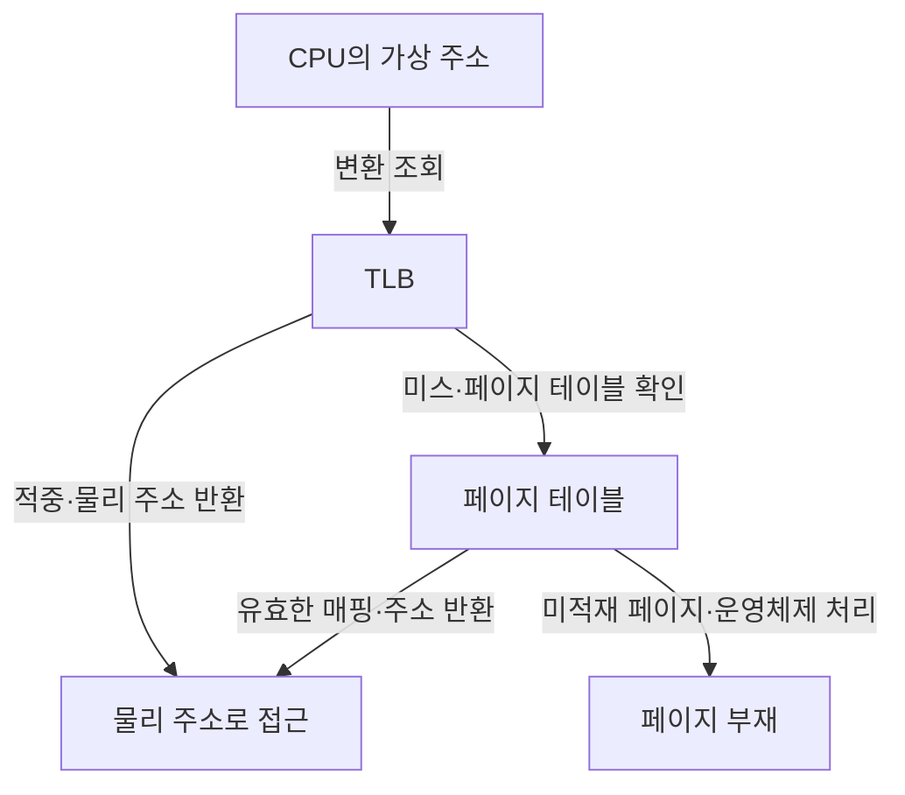
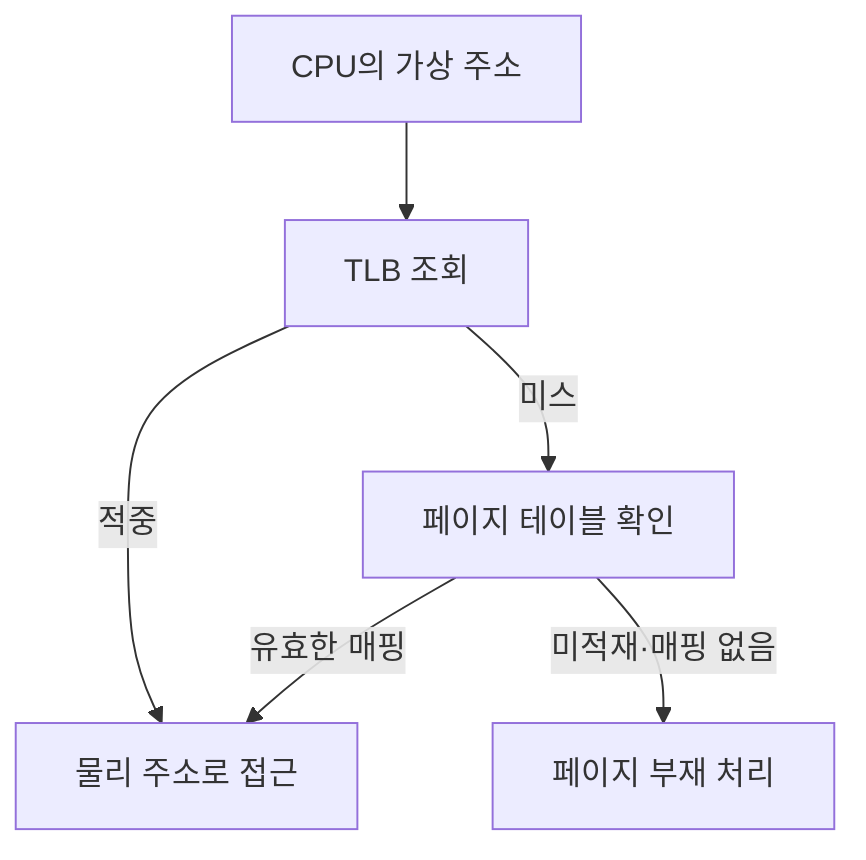
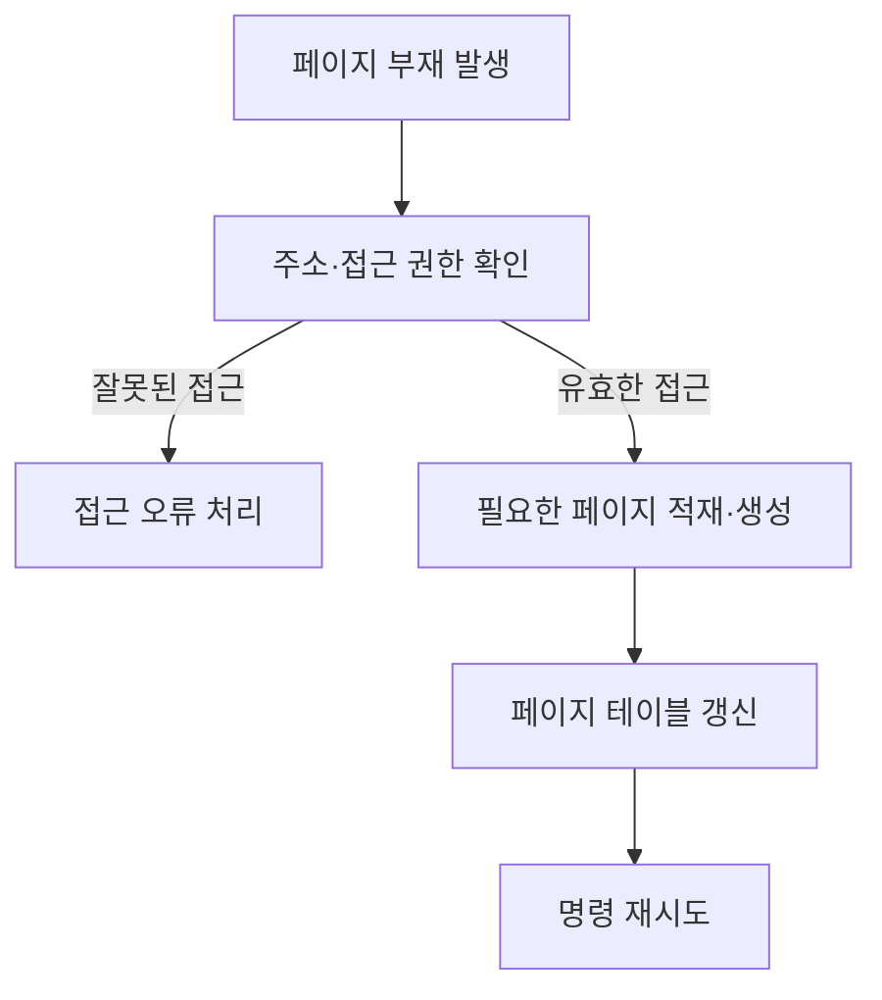

## 지식 로드맵 내 현재 위치

지식 위치: 컴퓨터 시스템 → 운영체제 메모리 관리 → **가상 메모리**

## 30초 인출

- 본질: **가상 메모리 (Virtual Memory)** 는 프로세스마다 독립된 주소 공간을 제공하고 필요한 부분을 물리 메모리에 연결하는 메모리 관리 방식
- 메커니즘: **MMU (Memory Management Unit)** 의 주소 변환 → **TLB (Translation Lookaside Buffer)** 우선 조회 → 미스 때 페이지 테이블 확인 → 미적재 페이지는 운영체제 처리

핵심 용어

- **가상 메모리 (Virtual Memory)** : 프로세스의 가상 주소 공간을 물리 메모리와 연결해 관리하는 메모리 기능.
- **CPU (Central Processing Unit)** : 프로그램 명령을 실행하는 중앙 처리 장치.
- **가상 주소** : 프로그램이 사용하는 주소로, 물리 메모리 위치와 일치하지 않을 수 있음.
- **MMU (Memory Management Unit)** : 가상 주소를 물리 주소로 변환하고 접근 권한을 확인하는 하드웨어
- **페이지 테이블** : 가상 페이지와 물리 프레임의 대응 및 권한 정보를 담는 자료구조
- **TLB (Translation Lookaside Buffer)** : 최근 주소 변환 결과를 저장해 페이지 테이블 탐색을 줄이는 캐시
- **TLB 미스** : 변환 결과가 TLB에 없어 페이지 테이블을 확인해야 하는 상태
- **페이지 부재(Page Fault)** : 접근한 가상 페이지의 매핑이 없거나 현재 물리 메모리에 준비되지 않아 운영체제 처리가 필요한 사건
- **스래싱** : 필요한 페이지가 메모리에 충분히 남지 못해 교체·입출력이 반복되는 상태

---

## 1교시 예상문제 (10점)

> 가상 메모리의 개념과 목적, 주소 변환의 핵심 구조를 설명하시오. (예상)

---

## 1교시 10점 답안

### Ⅰ. 정의·목적

| 구분 | 핵심 |
|---|---|
| 정의 | **가상 메모리 (Virtual Memory)** 는 프로세스의 가상 주소 공간을 물리 메모리와 연결해 관리하는 메모리 기능 |
| 목적 | 프로세스별 주소 공간 분리와 필요한 부분의 선택적 적재 |

### Ⅱ. 주소 변환과 분기

### Ⅲ. 두 사건의 차이

| 사건 | 뜻 | 결과 |
|---|---|---|
| TLB 미스 | 변환 캐시에 항목이 없음 | 페이지 테이블 확인 |
| 페이지 부재 | 필요한 페이지가 준비되지 않음 | 운영체제의 적재·매핑 또는 접근 오류 처리 |

제언: 주소 변환 실패와 페이지 부재를 따로 측정해 병목 원인 구분

---

## 2~4교시 예상문제 (25점)

> 가상 메모리의 주소 변환과 페이지 부재 처리 과정을 설명하고, TLB 미스·스래싱의 차이와 성능 개선 방안을 제시하시오. (예상)

---

## 2~4교시 25점 답안

## Ⅰ. 가상 메모리의 개요

| 구분 | 핵심 |
|---|---|
| 정의 | **가상 메모리 (Virtual Memory)** 는 프로세스의 가상 주소 공간을 물리 메모리와 연결해 관리하는 메모리 기능 |
| 목적 | 프로세스별 주소 공간 분리와 필요한 부분의 선택적 적재 |

## Ⅱ. MMU의 주소 변환

TLB 미스와 페이지 부재는 다른 사건. 페이지 테이블에 유효한 매핑이 있으면 주소 변환 후 실행 재개.

## Ⅲ. 페이지 부재의 처리

유효한 접근에서 파일 기반 페이지 읽기와 새 페이지 생성 중 어느 처리가 필요한지는 매핑 방식과 상태에 좌우됨. 모든 페이지 부재가 스왑 읽기는 아님.

## Ⅳ. 성능 저하 원인의 구별

| 현상 | 직접 원인 | 확인할 대응 |
|---|---|---|
| TLB 미스 증가 | 변환 캐시가 작업 주소 범위를 충분히 담지 못함 | 접근 지역성·페이지 크기와 실제 측정치 검토 |
| 페이지 부재 증가 | 아직 매핑되지 않았거나 메모리에서 밀려난 페이지 접근 | 부재 유형과 적재 비용 확인 |
| 스래싱 | 활성 작업집합에 비해 물리 메모리 부족 | 메모리 압박·교체 입출력·동시 실행량 조정 |

큰 페이지는 TLB 범위를 넓힐 수 있지만 메모리 사용량과 페이지 부재 비용도 바뀔 수 있는 선택지. 일괄 적용보다 워크로드별 검토 필요.

## Ⅴ. 기술사적 제언 — 큰 페이지 적용 범위 결정

| 한계 | 해결 방안 |
|---|---|
| 모든 프로세스에 큰 페이지를 적용하면 주소 변환 이득과 메모리 낭비의 차이를 반영하기 어려움 | 워크로드별 TLB 미스·페이지 부재·메모리 압박을 측정해 이득이 확인된 범위부터 적용 |

## 출제 이력과 검증 출처

- 기존 노트의 제139회 가상 메모리 문항 주장은 공식 Q-Net 문제지에서 확인되지 않음. 아래 문항은 예상문제
- [Linux Kernel Documentation, Page Tables](https://docs.kernel.org/mm/page_tables.html)
- [Linux Kernel Documentation, Transparent Hugepage Support](https://docs.kernel.org/admin-guide/mm/transhuge.html)

## 연결 토픽

- 연관 토픽: [CPU 스케줄링](./019_cpu_scheduling.md), [메모리 풀링](./026_cxl_4_0_memory_pooling.md)
