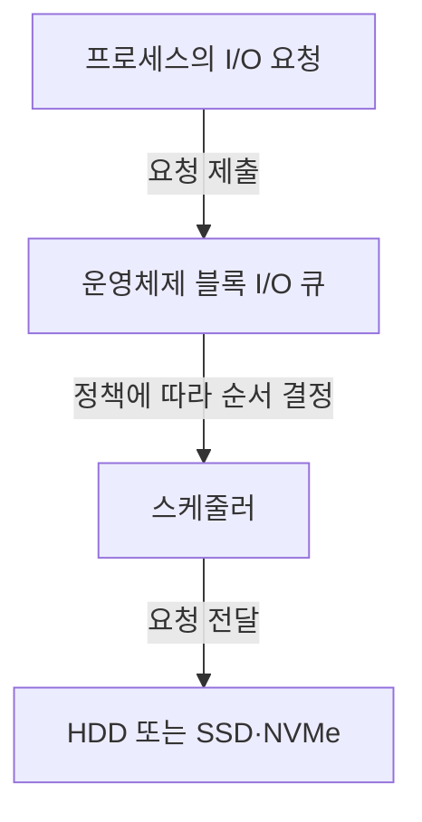
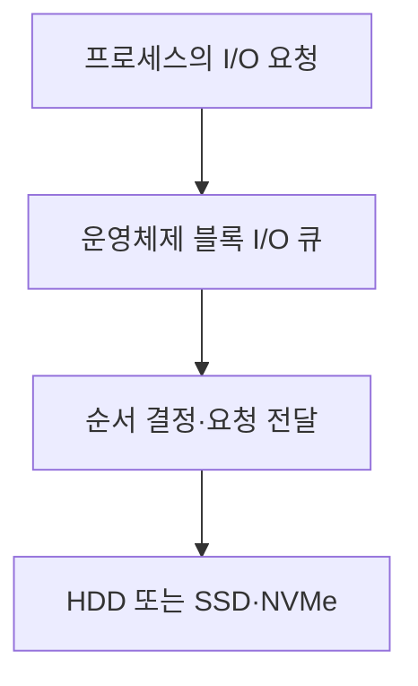

## 지식 로드맵 내 현재 위치

지식 위치: 컴퓨터 시스템 → 저장장치 입출력 관리 → **디스크 스케줄링**

## 30초 인출

- 본질: **디스크 스케줄링 (Disk Scheduling)** 은 대기 중인 저장장치 I/O 요청의 처리 순서를 정하는 운영체제 기능
- 메커니즘: HDD의 헤드 이동·대기 시간과 SSD·NVMe의 병렬 큐·소프트웨어 처리 비용에 맞춘 요청 순서 결정

핵심 용어

- **디스크 스케줄링 (Disk Scheduling)** : 저장장치 I/O 요청의 처리 순서를 정하는 운영체제 기능.
- **HDD (Hard Disk Drive)** : 회전하는 자기 디스크와 이동 헤드로 데이터를 읽고 쓰는 저장장치.
- **SSD (Solid-State Drive)** : 비휘발성 반도체 메모리로 데이터를 저장하는 저장장치.
- **NVMe (Non-Volatile Memory Express)** : PCI Express 기반 비휘발성 메모리 저장장치용 호스트 인터페이스·명령 집합.
- **I/O (Input/Output)** : 컴퓨터와 저장장치 사이의 입력·출력 작업.
- **FCFS (First-Come, First-Served)** : 먼저 도착한 요청부터 처리하는 방식.
- **탐색 시간** : HDD의 헤드가 목표 트랙으로 이동하는 데 걸리는 시간
- **SSTF (Shortest Seek Time First)** : 현재 헤드 위치와 가까운 요청을 먼저 처리하는 방식
- **SCAN** : 헤드가 한 방향으로 이동하며 요청을 처리하고 방향을 바꿔 돌아오는 방식
- **C-SCAN (Circular SCAN)** : 한 방향에서만 요청을 처리하고 반대편으로 되돌아가 다시 시작하는 방식
- **LOOK** : 물리적 끝이 아니라 해당 방향의 마지막 요청에서 방향을 바꾸는 방식

---

## 1교시 예상문제 (10점)

> 디스크 스케줄링의 개념과 목적, 저장장치별 핵심 판단 기준을 설명하시오. (예상)

---

## 1교시 10점 답안

### Ⅰ. 정의·목적

| 구분 | 핵심 |
|---|---|
| 정의 | **디스크 스케줄링 (Disk Scheduling)** 은 대기 중인 저장장치 I/O 요청의 처리 순서를 정하는 운영체제 기능 |
| 목적 | 장치 특성에 맞춘 요청 지연·처리량·공정성의 균형 |

### Ⅱ. 요청 처리 위치

### Ⅲ. HDD 방식 비교

| 방식 | 헤드 이동 기준 | 주의점 |
|---|---|---|
| **SSTF (Shortest Seek Time First)** | 현재 위치에서 가까운 요청 | 먼 요청이 오래 기다릴 수 있음 |
| **SCAN** | 양방향 이동 중 요청 처리 | 방향·요청 분포에 따라 대기 차이 |
| **C-SCAN (Circular SCAN)** | 한 방향 처리 후 반대편으로 복귀 | 되돌아갈 때는 요청을 처리하지 않음 |

제언: HDD와 SSD에 같은 정책을 일괄 적용하지 않고 실제 지연·처리량 비교

---

## 2~4교시 예상문제 (25점)

> 디스크 스케줄링의 처리 위치와 FCFS·SSTF·SCAN·C-SCAN·LOOK의 차이를 설명하고 HDD와 SSD·NVMe에서의 선택 기준을 제시하시오. (예상)

---

## 2~4교시 25점 답안

## Ⅰ. 디스크 스케줄링의 개요

| 구분 | 핵심 |
|---|---|
| 정의 | **디스크 스케줄링 (Disk Scheduling)** 은 대기 중인 저장장치 I/O 요청의 처리 순서를 정하는 운영체제 기능 |
| 목적 | 장치 특성에 맞춘 요청 지연·처리량·공정성의 균형 |

## Ⅱ. 운영체제와 장치 사이의 처리 위치

운영체제의 정렬 결과와 장치 내부 처리 순서 간 차이. SSD·NVMe의 내부 병렬성도 함께 고려.

## Ⅲ. HDD의 대표 순서 정책

| 정책 | 다음 요청을 고르는 기준 | 주요 한계 |
|---|---|---|
| **FCFS (First-Come, First-Served)** | 도착 순서 | 헤드 이동이 커질 수 있음 |
| **SSTF (Shortest Seek Time First)** | 현재 헤드에 가장 가까운 요청 | 먼 요청의 장시간 대기 가능 |
| **SCAN** | 한 방향으로 지나가며 요청 처리 후 반전 | 요청 위치에 따라 대기 차이 |
| **C-SCAN (Circular SCAN)** | 한 방향에서만 처리하고 복귀 | 복귀 구간은 서비스하지 않음 |
| LOOK | 해당 방향의 마지막 요청에서 반전 | SCAN과 같이 방향 선택에 영향 |

## Ⅳ. 저장장치에 따른 선택 기준

| 관점 | **HDD (Hard Disk Drive)** | **SSD (Solid-State Drive)**·**NVMe (Non-Volatile Memory Express)** |
|---|---|---|
| 주요 특성 | 헤드 이동·회전 지연 | 기계적 탐색 없음, 병렬 큐 활용 |
| 정책 목표 | 이동 감소와 장기 대기 방지 | 요청 처리 비용·지연·공정성 균형 |
| Linux 예 | 헤드 이동을 고려한 정책 | `none`, `mq-deadline`, `bfq` 등 사용 가능 정책을 실제 부하로 비교 |

SSD에서 스케줄러 제거가 필수 조건은 아님. `none`은 선택지 중 하나이며 공정성·지연 요구에 따른 다른 정책도 고려 가능.

## Ⅴ. 정책 선택에 대한 제언

| 한계 | 해결 방안 |
|---|---|
| 최대 처리량만 비교하면 장시간 대기와 지연 편차를 놓칠 수 있음 | 대표 I/O 부하에서 처리량·지연·공정성을 함께 측정하고 장치별 정책을 선택 |

## 출제 이력과 검증 출처

- 제137회 정보관리기술사 3교시 1번: CPU·디스크 스케줄링 개념과 SJF·SRT·SSTF·SLTF 설명(공식 Q-Net 문제지 대조). 아래 예상문제는 원문 문항과 구분
- [Linux Kernel Documentation, Multi-Queue Block IO Queueing Mechanism](https://docs.kernel.org/block/blk-mq.html)
- [Linux Kernel Documentation, Switching Scheduler](https://docs.kernel.org/6.6/block/switching-sched.html)

## 연결 토픽

- 연관 토픽: [CPU 스케줄링](./019_cpu_scheduling.md), [가상 메모리](./023_virtual_memory.md)
