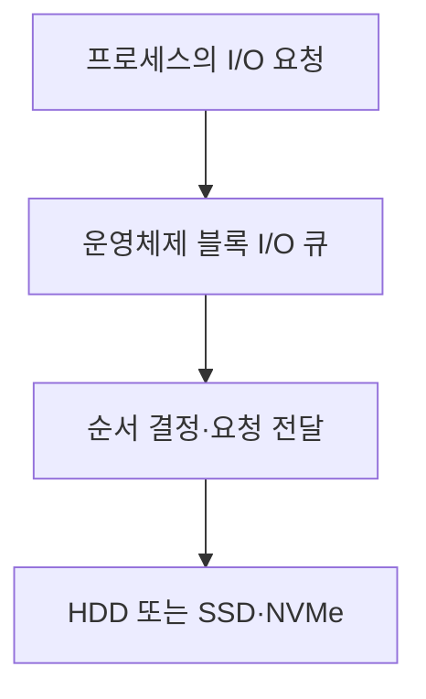

## 지식 로드맵 내 현재 위치

지식 위치: 컴퓨터 시스템 → 저장장치 입출력 관리 → **디스크 스케줄링**

## 30초 인출

- 본질: **디스크 스케줄링** 은 대기 중인 저장장치 I/O 요청의 처리 순서를 정하는 일이다.
- 메커니즘: HDD에서는 헤드 이동과 대기 시간을, SSD·NVMe에서는 장치 병렬성과 소프트웨어 처리 비용을 고려해 요청을 정렬하거나 바로 전달한다.

핵심 용어

- **탐색 시간** : HDD의 헤드가 목표 트랙으로 이동하는 데 걸리는 시간
- **SSTF** : 현재 헤드 위치와 가까운 요청을 먼저 처리하는 방식
- **SCAN** : 헤드가 한 방향으로 이동하며 요청을 처리하고 방향을 바꿔 돌아오는 방식
- **C-SCAN** : 한 방향에서만 요청을 처리하고 반대편으로 되돌아가 다시 시작하는 방식
- **LOOK** : 물리적 끝이 아니라 해당 방향의 마지막 요청에서 방향을 바꾸는 방식
- **blk-mq** : Linux의 다중 큐 블록 I/O 구조. 장치의 병렬 요청 처리에 맞춰 여러 소프트웨어·하드웨어 큐를 사용한다.

---

## 1교시 예상문제 (10점)

> 디스크 스케줄링의 목적과 HDD의 SCAN·C-SCAN 방식, SSD에서 달라지는 판단 기준을 설명하시오. (예상)

---

## 1교시 10점 답안

### Ⅰ. 정의·목적

- 정의: **디스크 스케줄링** 은 저장장치의 대기 중인 I/O 요청 처리 순서를 정하는 기능이다.
- 목적: 장치 특성에 맞춰 지연과 처리량, 요청 간 공정성을 관리한다.

### Ⅱ. 요청 처리 위치

### Ⅲ. HDD 방식 비교

| 방식 | 헤드 이동 기준 | 주의점 |
|---|---|---|
| SSTF | 현재 위치에서 가까운 요청 | 먼 요청이 오래 기다릴 수 있음 |
| SCAN | 양방향 이동 중 요청 처리 | 방향·요청 분포에 따라 대기 차이 |
| C-SCAN | 한 방향 처리 후 반대편으로 복귀 | 되돌아갈 때는 요청을 처리하지 않음 |

제언: HDD와 SSD에 같은 정책을 일괄 적용하지 말고 실제 지연·처리량을 비교한다.

---

## 2~4교시 예상문제 (25점)

> 디스크 스케줄링의 처리 위치와 FCFS·SSTF·SCAN·C-SCAN·LOOK의 차이를 설명하고 HDD와 SSD·NVMe에서의 선택 기준을 제시하시오. (예상)

---

## 2~4교시 25점 답안

## Ⅰ. 디스크 스케줄링의 개요

| 구분 | 핵심 |
|---|---|
| 정의 | 대기 중인 저장장치 I/O 요청의 처리 순서 결정 |
| 목적 | 지연·처리량·공정성을 장치 특성에 맞게 관리 |

## Ⅱ. 운영체제와 장치 사이의 처리 위치

운영체제의 정렬 결과가 장치 내부 처리 순서와 항상 같지는 않다. SSD·NVMe의 내부 병렬성도 함께 고려해야 한다.

## Ⅲ. HDD의 대표 순서 정책

| 정책 | 다음 요청을 고르는 기준 | 주요 한계 |
|---|---|---|
| FCFS | 도착 순서 | 헤드 이동이 커질 수 있음 |
| SSTF | 현재 헤드에 가장 가까운 요청 | 먼 요청의 장시간 대기 가능 |
| SCAN | 한 방향으로 지나가며 요청 처리 후 반전 | 요청 위치에 따라 대기 차이 |
| C-SCAN | 한 방향에서만 처리하고 복귀 | 복귀 구간은 서비스하지 않음 |
| LOOK | 해당 방향의 마지막 요청에서 반전 | SCAN과 같이 방향 선택에 영향 |

## Ⅳ. 저장장치에 따른 선택 기준

| 관점 | HDD | SSD·NVMe |
|---|---|---|
| 주요 특성 | 헤드 이동·회전 지연 | 기계적 탐색 없음, 병렬 큐 활용 |
| 정책 목표 | 이동 감소와 장기 대기 방지 | 요청 처리 비용·지연·공정성 균형 |
| Linux 예 | 헤드 이동을 고려한 정책 | `none`, `mq-deadline`, `bfq` 등 사용 가능 정책을 실제 부하로 비교 |

SSD라고 모든 스케줄링을 제거해야 하는 것은 아니다. `none`도 선택지 중 하나이며, 공정성·지연 요구에 따라 다른 정책이 유리할 수 있다.

## Ⅴ. 정책 선택에 대한 제언

| 문제 | 해결 방안 |
|---|---|
| HDD에서 가까운 요청만 우선해 먼 요청이 밀림 | 장기 대기 요청을 처리할 수 있는 정책과 대기 시간 지표를 함께 검토 |
| SSD에 HDD용 헤드 이동 최적화 논리를 그대로 적용 | 장치의 실제 큐 구조와 처리량·지연을 측정해 `none` 등 정책을 비교 |

## 출제 이력과 검증 출처

- 기존 노트의 제137회 문항 원문을 확인하지 못해 예상문제로 표기했다.
- [Linux Kernel Documentation, Multi-Queue Block IO Queueing Mechanism](https://docs.kernel.org/block/blk-mq.html)
- [Linux Kernel Documentation, Switching Scheduler](https://docs.kernel.org/6.6/block/switching-sched.html)

## 연결 토픽

- 연관 토픽: [CPU 스케줄링](./019_cpu_scheduling.md), [가상 메모리](./023_virtual_memory.md)
