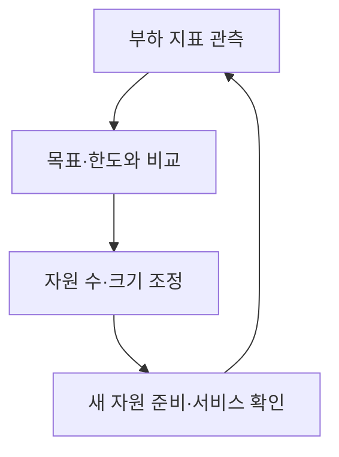

## 지식 로드맵 내 현재 위치

지식 위치: 컴퓨터 시스템 → 클라우드 자원 운영 → **오토스케일링**

## 30초 인출

- 본질: **오토스케일링** 은 부하 변화에 맞춰 실행 자원의 수나 크기를 자동 조정하는 기능이다.
- 메커니즘: 지표를 측정해 목표와 비교하고, 정해 둔 범위·속도 정책에 따라 증감한 뒤 실제 서비스 상태를 다시 확인한다.

핵심 용어

- **수평 확장** : 실행 인스턴스나 Pod의 수를 늘리는 방식
- **수직 확장** : 실행 단위에 할당한 CPU·메모리 등 자원 크기를 늘리는 방식
- **HPA** : 관측 지표에 맞춰 Kubernetes 워크로드의 Pod 복제본 수를 조정하는 컨트롤러
- **VPA** : 워크로드의 CPU·메모리 요청·제한 값을 조정하도록 권고하거나 적용하는 Kubernetes 추가 구성요소
- **KEDA** : 메시지 수 등 외부 사건을 기준으로 Kubernetes 워크로드를 확장할 수 있게 하는 추가 구성요소
- **안정화 기간** : 지표 변동에 따라 확장·축소가 반복되지 않도록 최근 계산 결과를 고려하는 시간 범위

---

## 1교시 예상문제 (10점)

> 오토스케일링의 작동 과정과 수평·수직 확장의 차이를 설명하시오. (예상)

---

## 1교시 10점 답안

### Ⅰ. 정의·목적

- 정의: **오토스케일링** 은 관측한 부하에 맞춰 실행 자원의 수나 크기를 자동 조정하는 기능이다.
- 목적: 서비스 수요 변화에 대응하고 불필요한 자원 사용을 줄인다.

### Ⅱ. 조정 과정

### Ⅲ. 확장 방식

| 방식 | 조정 대상 | Kubernetes 예 |
|---|---|---|
| 수평 | Pod 복제본 수 | HPA |
| 수직 | Pod CPU·메모리 할당량 | VPA |

제언: 확장 정책을 정할 때 새 자원의 준비 시간과 뒤쪽 서비스의 처리 한도를 함께 확인한다.

---

## 2~4교시 예상문제 (25점)

> 오토스케일링의 피드백 과정을 설명하고 HPA·VPA·이벤트 기반 확장의 차이, 확장 지연과 반복 증감에 대한 대응을 제시하시오. (예상)

---

## 2~4교시 25점 답안

## Ⅰ. 오토스케일링의 개요

| 구분 | 핵심 |
|---|---|
| 정의 | 부하에 맞춰 실행 자원의 수나 크기를 자동 조정하는 기능 |
| 목적 | 수요 변화에 대응하고 불필요한 자원 사용을 줄임 |

## Ⅱ. 관측·조정·검증의 피드백

정책이 복제본 수를 늘려도 이미지 준비·기동·준비 상태 확인이 끝나기 전에는 실제 처리 용량이 늘지 않는다.

## Ⅲ. 확장 대상과 신호의 차이

| 방식 | 바뀌는 것 | 적합한 신호·주의점 |
|---|---|---|
| HPA | Pod 복제본 수 | CPU·메모리·사용자 지정 지표, 최소·최대 복제본 |
| VPA | Pod 자원 요청·제한 | 사용량 기반 권고, 적용 방식에 따른 재생성 가능성 |
| KEDA | 외부 사건에 따른 복제본 수 | 큐 길이 등 사건 원천, HPA와의 연계 확인 |

HPA와 VPA는 서로 다른 자원을 조정한다. KEDA는 모든 워크로드의 필수 구성요소가 아니라 사건 기반 부하에 맞는 선택지다.

## Ⅳ. 정책 설계에서 확인할 제약

| 제약 | 확인할 값 | 대응 방향 |
|---|---|---|
| 확장 지연 | 지표 수집·판정·기동·준비 시간 | 예측 가능한 이벤트는 사전 확장 검토 |
| 반복 증감 | 부하 진동과 축소 빈도 | 안정화 기간·증감 속도 정책 조정 |
| 뒤쪽 병목 | DB 연결·큐 소비·외부 API 한도 | 애플리케이션 전체의 처리 한계 확인 |

CPU 사용률 하나만 보면 대기 중인 요청이나 큐 길이를 놓칠 수 있다. 실제 서비스 지연과 연관된 지표를 선택한다.

## Ⅴ. 안정적인 확장을 위한 제언

| 문제 | 해결 방안 |
|---|---|
| 급증한 요청에 비해 새 Pod 준비가 늦음 | 준비 시간을 측정하고 필요하면 사전 확장·최소 복제본을 조정 |
| 임계치 부근에서 증설·축소가 반복됨 | 안정화 기간과 축소 속도를 조정하고 서비스 지연을 함께 확인 |

## 출제 이력과 검증 출처

- 기존 노트의 제121회·제131회 문항 원문을 확인하지 못해 예상문제로 표기했다.
- [Kubernetes 공식 문서, Autoscaling Workloads](https://kubernetes.io/docs/concepts/workloads/autoscaling/)
- [Kubernetes 공식 문서, Horizontal Pod Autoscaling](https://kubernetes.io/docs/concepts/workloads/autoscaling/horizontal-pod-autoscale/)
- [Kubernetes 공식 문서, Vertical Pod Autoscaling](https://kubernetes.io/docs/concepts/workloads/autoscaling/vertical-pod-autoscale/)

## 연결 토픽

- 연관 토픽: [쿠버네티스](./012_kubernetes.md), [클라우드 컴퓨팅](./013_cloud_computing.md)
