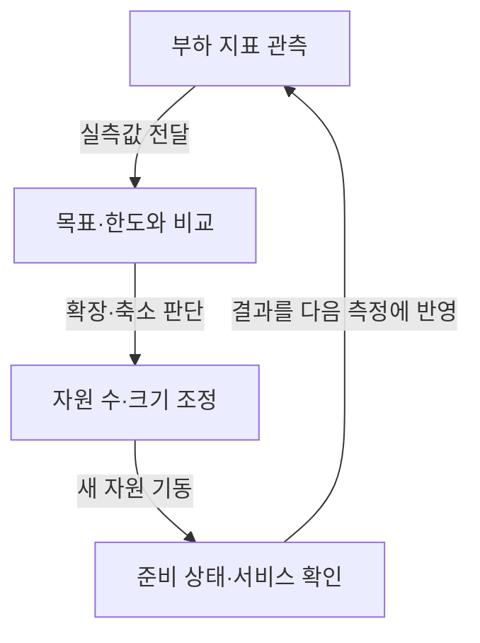

## 지식 로드맵 내 현재 위치

지식 위치: 컴퓨터 시스템 → 클라우드 자원 운영 → **오토스케일링**

## 30초 인출

- 본질: **오토스케일링 (Auto Scaling)** 은 관측한 부하와 정책에 따라 실행 자원의 수나 크기를 자동 조정하는 기능
- 메커니즘: 부하 지표 관측 → 목표·한도 비교 → 자원 조정 → 실제 서비스 상태 확인

핵심 용어

- **오토스케일링 (Auto Scaling)** : 관측 지표와 정책에 따라 실행 자원의 수나 크기를 자동 조정하는 기능.
- **HPA (Horizontal Pod Autoscaler)** : 관측 지표에 따라 Kubernetes 워크로드의 Pod 복제본 수를 조정하는 컨트롤러.
- **VPA (Vertical Pod Autoscaler)** : 사용량을 분석해 Pod 자원 요청·제한 값을 권고하거나 설정에 따라 적용하는 추가 구성요소.
- **KEDA (Kubernetes Event-Driven Autoscaling)** : 이벤트 원천을 트리거로 Kubernetes 워크로드를 확장하는 도구.
- **Pod** : 하나 이상의 컨테이너를 함께 배치·관리하는 Kubernetes 실행 단위.
- **CPU (Central Processing Unit)** : 프로그램 명령을 실행하는 중앙 처리 장치.
- **수평 확장** : 실행 인스턴스나 Pod의 수를 늘리는 방식
- **수직 확장** : 실행 단위에 할당한 CPU·메모리 등 자원 크기를 늘리는 방식
- **안정화 기간** : 지표 변동에 따라 확장·축소가 반복되지 않도록 최근 계산 결과를 고려하는 시간 범위

---

## 1교시 예상문제 (10점)

> 오토스케일링의 개념과 목적, 자원 조정의 핵심 구조를 설명하시오. (예상)

---

## 1교시 10점 답안

### Ⅰ. 정의·목적

| 구분 | 핵심 |
|---|---|
| 정의 | **오토스케일링 (Auto Scaling)** 은 관측한 부하와 정책에 따라 실행 자원의 수나 크기를 자동 조정하는 기능 |
| 목적 | 수요 변동에 맞는 처리 용량 확보와 과잉 자원 할당 억제 |

### Ⅱ. 조정 과정

### Ⅲ. 확장 방식

| 방식 | 조정 대상 | Kubernetes 예 |
|---|---|---|
| 수평 | Pod 복제본 수 | **HPA (Horizontal Pod Autoscaler)** |
| 수직 | Pod CPU·메모리 할당량 | **VPA (Vertical Pod Autoscaler)** |

제언: 확장 정책에 새 자원의 준비 시간과 뒤쪽 서비스의 처리 한도를 함께 반영

---

## 2~4교시 예상문제 (25점)

> 오토스케일링의 피드백 과정을 설명하고 HPA·VPA·이벤트 기반 확장의 차이, 확장 지연과 반복 증감에 대한 대응을 제시하시오. (예상)

---

## 2~4교시 25점 답안

## Ⅰ. 오토스케일링의 개요

| 구분 | 핵심 |
|---|---|
| 정의 | **오토스케일링 (Auto Scaling)** 은 관측한 부하와 정책에 따라 실행 자원의 수나 크기를 자동 조정하는 기능 |
| 목적 | 수요 변동에 맞는 처리 용량 확보와 과잉 자원 할당 억제 |

## Ⅱ. 관측·조정·검증의 피드백

복제본 수 증가 뒤 이미지 준비·기동·준비 상태 확인까지 필요한 시간. 실제 처리 용량의 증가는 이 절차 완료 후 발생.

## Ⅲ. 확장 대상과 신호의 차이

| 방식 | 바뀌는 것 | 적합한 신호·주의점 |
|---|---|---|
| **HPA (Horizontal Pod Autoscaler)** | Pod 복제본 수 | **CPU (Central Processing Unit)**·메모리·사용자 지정 지표, 최소·최대 복제본 |
| **VPA (Vertical Pod Autoscaler)** | Pod 자원 요청·제한 | 사용량 기반 권고, 적용 방식에 따른 재생성 가능성 |
| **KEDA (Kubernetes Event-Driven Autoscaling)** | 외부 사건에 따른 복제본 수 | 큐 길이 등 사건 원천, HPA와의 연계 확인 |

**HPA (Horizontal Pod Autoscaler)** 와 **VPA (Vertical Pod Autoscaler)** 의 조정 대상 차이. **KEDA (Kubernetes Event-Driven Autoscaling)** 는 필수 구성요소가 아니라 사건 기반 부하에 맞는 선택지.

## Ⅳ. 정책 설계에서 확인할 제약

| 한계 | 확인할 값 | 대응 방향 |
|---|---|---|
| 확장 지연 | 지표 수집·판정·기동·준비 시간 | 예측 가능한 이벤트는 사전 확장 검토 |
| 반복 증감 | 부하 진동과 축소 빈도 | 안정화 기간·증감 속도 정책 조정 |
| 뒤쪽 병목 | 데이터베이스 연결·큐 소비·외부 API 한도 | 애플리케이션 전체의 처리 한계 확인 |

CPU 사용률만으로 대기 요청·큐 길이를 파악하기 어려운 한계. 실제 서비스 지연과 연관된 지표 선택.

## Ⅴ. 기술사적 제언 — 시범 적용 대상 선정

| 한계 | 해결 방안 |
|---|---|
| 모든 워크로드에 같은 신호·기준을 적용하면 부하 특성과 서비스 목표 차이가 반영되지 않음 | 수요 변동이 뚜렷하고 지표·기동 시간·후단 용량을 측정할 수 있는 워크로드부터 시범 적용한 뒤 목표별 정책 확장 |

## 출제 이력과 검증 출처

- 기존 노트의 제121회·제131회 문항 원문 미확인으로 예상문제 표기
- [Kubernetes 공식 문서, Autoscaling Workloads](https://kubernetes.io/docs/concepts/workloads/autoscaling/)
- [Kubernetes 공식 문서, Horizontal Pod Autoscaling](https://kubernetes.io/docs/concepts/workloads/autoscaling/horizontal-pod-autoscale/)
- [Kubernetes 공식 문서, Vertical Pod Autoscaling](https://kubernetes.io/docs/concepts/workloads/autoscaling/vertical-pod-autoscale/)
- [KEDA 공식 문서](https://keda.sh/docs/)

## 연결 토픽

- 연관 토픽: [쿠버네티스](./012_kubernetes.md), [클라우드 컴퓨팅](./013_cloud_computing.md)
