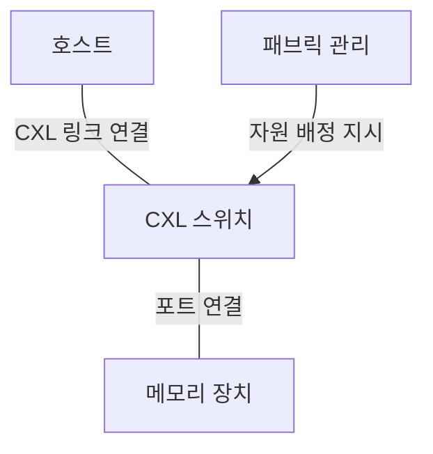
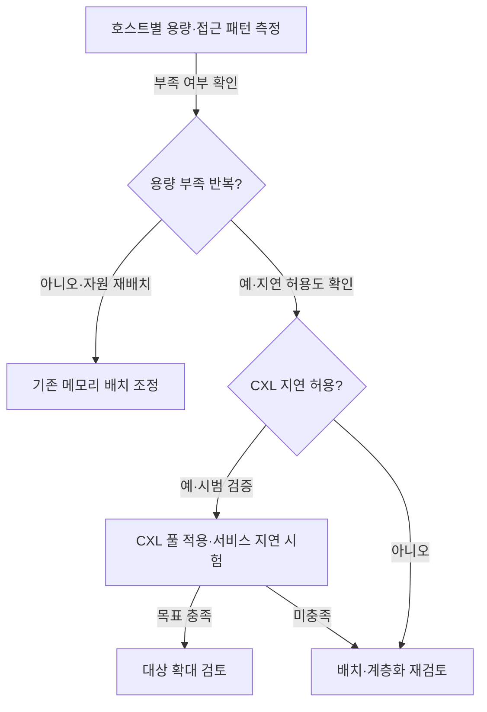

## 지식 로드맵 내 현재 위치

컴퓨터 시스템 및 네트워크 → 메모리 확장 → CXL과 메모리 풀링

## 30초 인출

- 본질: **CXL 메모리 풀링** 은 CXL 장치의 메모리 자원을 여러 호스트에 배정하는 메모리 확장 구성
- 메커니즘: 호스트·메모리 장치의 스위치 연결 → 관리 주체의 용량 배정 → 호스트의 CXL.mem 접근
- 추가 단서: **풀링** 은 자원 배정이고 **공유** 는 동일 영역의 동시 접근. CXL 4.0의 링크·포트 개선과 풀링 기능의 도입 시점 구별

핵심 용어

- **CXL (Compute Express Link)** : 프로세서와 가속기·메모리 장치 사이의 캐시 일관성 연결 규격.
- **PCIe (Peripheral Component Interconnect Express)** : 고속 직렬 주변장치 연결 규격.
- **DRAM (Dynamic Random Access Memory)** : 셀의 전하를 이용해 데이터를 저장하는 휘발성 메모리.
- **CXL.io** : 장치 검색·설정과 입출력에 쓰는 PCIe 기반 프로토콜.
- **CXL.cache** : 장치가 호스트 메모리를 일관성 있게 캐시·접근하도록 지원하는 프로토콜.
- **CXL.mem** : 호스트가 CXL 장치 메모리에 접근하는 프로토콜.
- **CXL 메모리 풀링** : 여러 호스트가 공용 자원 집합에서 메모리 장치 또는 용량을 배정받는 구성.
- **GFAM (Global Fabric Attached Memory)** : CXL 3.0에서 다중 호스트 공유를 위해 도입한 패브릭 부착 메모리 장치 유형.
- **RAS (Reliability, Availability, Serviceability)** : 장치 신뢰성·가용성·정비성을 다루는 특성.
- **GT/s (Gigatransfers per second)** : 초당 전송 횟수의 십억 단위.

---

## 1교시 예상문제 (10점)

> CXL 4.0의 개념·주요 변화와 메모리 풀링 구조를 설명하시오. (예상)

---

## 1교시 10점 답안

### Ⅰ. 개요

| 구분 | 핵심 |
|---|---|
| 정의 | **CXL 메모리 풀링** 은 CXL 연결로 외부 메모리 장치나 용량을 여러 호스트에 배정하는 메모리 확장 구성 |
| 목적 | 서버별 메모리 용량 편차 완화와 유휴 자원 활용 |

### Ⅱ. 핵심 구조

실선은 연결 관계, 화살표는 관리 주체의 배정 지시. 풀링만으로 여러 호스트의 동일 메모리 영역 동시 쓰기 보장은 어려움.

| 구분 | 역할 |
|---|---|
| **CXL.io** | 장치 검색·설정 |
| **CXL.cache** | 장치의 호스트 메모리 일관성 접근 |
| **CXL.mem** | 호스트의 장치 메모리 접근 |
| **CXL 4.0** | 128 GT/s 링크, bundled ports, 메모리 RAS 개선 |

제언: 호스트·스위치·장치의 지원 버전과 실제 워크로드 지연시간을 함께 확인

---

## 2~4교시 예상문제 (25점)

> CXL의 프로토콜과 메모리 풀링 구조를 설명하고, CXL 4.0의 변화 및 적용 시 고려사항을 제시하시오. (예상)

---

## 2~4교시 25점 답안

## Ⅰ. 개요

| 구분 | 핵심 |
|---|---|
| 정의 | **CXL 메모리 풀링** 은 CXL 연결로 외부 메모리 장치나 용량을 여러 호스트에 배정하는 메모리 확장 구성 |
| 목적 | 서버별 메모리 용량 편차 완화와 유휴 자원 활용 |

## Ⅱ. 연결·배정 구조

메모리 장치의 배정·재배정 범위에 영향을 미치는 스위치·장치 유형·관리 기능·호스트 지원. 모든 구성에서 실시간 무중단 재배정이 가능한 것은 아님.

## Ⅲ. 프로토콜과 풀링·공유의 구분

| 구분 | 핵심 역할 | 적용 시 구별할 점 |
|---|---|---|
| **CXL.io** | 장치 검색·설정·입출력 | 장치 제어 경로 |
| **CXL.cache** | 장치의 호스트 메모리 일관성 접근 | 주로 가속기 쪽 요구 |
| **CXL.mem** | 호스트의 장치 메모리 접근 | 메모리 확장·풀링의 데이터 경로 |
| 풀링 | 호스트에 자원 배정 | 배정·재배정 정책 |
| 공유 | 같은 영역에 다중 호스트 접근 | 동기화·일관성·접근 제어 |

스위칭·메모리 풀링을 지원한 **CXL 2.0**, **GFAM (Global Fabric Attached Memory)** 등 다중 호스트 공유를 확장한 **CXL 3.0**. 장치의 CXL 지원만으로 모든 프로토콜·공유 기능이 보장되지는 않는 점.

## Ⅳ. CXL 4.0 변화와 적용 한계

| 항목 | CXL 4.0의 변화 | 확인할 점 |
|---|---|---|
| 링크 | 전송률 64 GT/s → 128 GT/s | 전체 경로의 버전·폭·구성 |
| 연결 | bundled ports 지원 | 호스트·가속기 장치의 해당 기능 지원 |
| 신뢰성 | 메모리 **RAS (Reliability, Availability, Serviceability)** 개선 | 오류 가시성·격리·정비 절차 |
| 성능 | 링크 대역폭 확대 | 실제 접근 지연시간·워크로드 처리량 |

링크 전송률과 애플리케이션 처리량의 차이. 로컬 DRAM보다 먼 CXL 메모리의 데이터 배치 판단 기준인 접근 빈도·지연 민감도·운영체제 지원. 보편 효과로 단정할 수 없는 고정 지연시간·비용 절감률.

## Ⅴ. 기술사적 제언 — 첫 적용 워크로드 선정

## 출제 이력과 검증 출처

- 관련 기출 미확인으로 예상문제 구성
- [CXL Consortium, CXL 4.0 규격 발표](https://computeexpresslink.org/wp-content/uploads/2025/11/CXL_4.0-Specification-Release_FINAL_Website-Copy.pdf)
- [CXL Consortium, CXL 3.0 백서](https://computeexpresslink.org/wp-content/uploads/2023/12/CXL_3.0_white-paper_FINAL.pdf)
- [CXL Consortium, CXL 2.0 메모리 풀링](https://computeexpresslink.org/webinars/compute-express-link-2-0-specification-memory-pooling-339/)

## 연결 토픽

- 연관 토픽: [클라우드 컴퓨팅](./013_cloud_computing.md), [가상 메모리](./023_virtual_memory.md), [HBM4](./027_hbm4.md)
