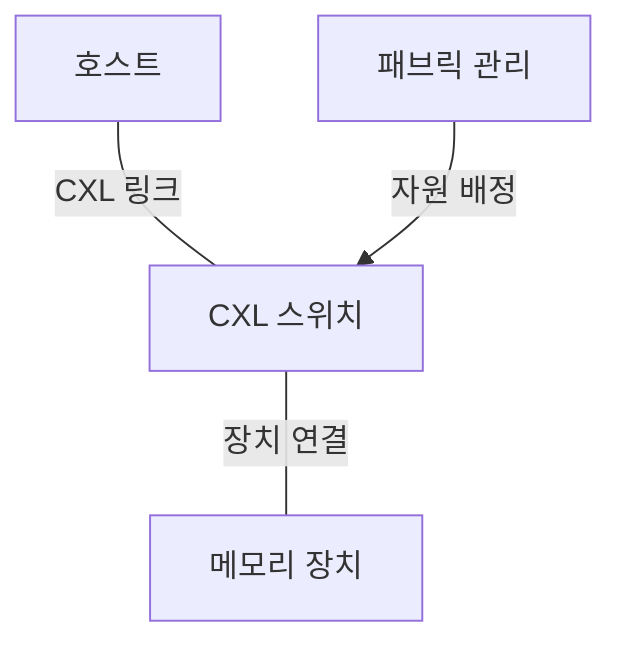
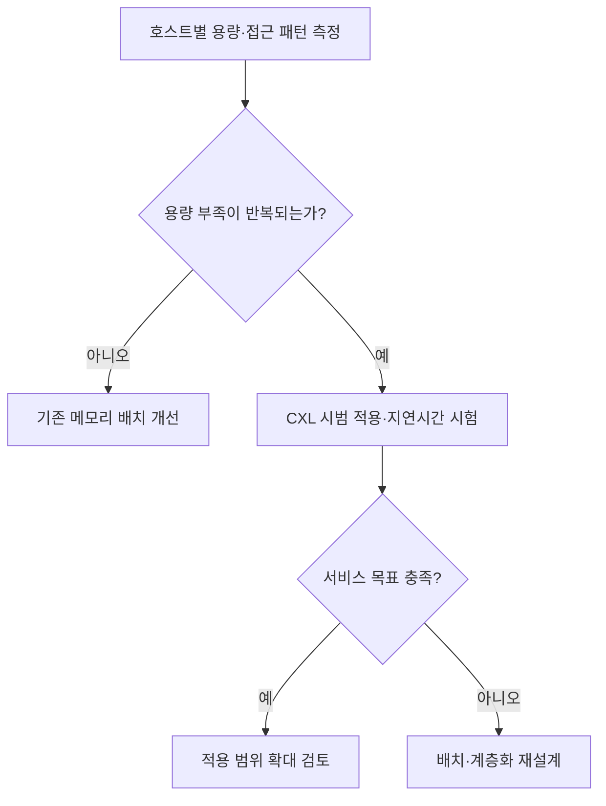

## 지식 로드맵 내 현재 위치

컴퓨터 시스템 및 네트워크 → 메모리 확장 → CXL과 메모리 풀링

## 30초 인출

- 본질: CXL 메모리 풀링은 여러 호스트가 외부 메모리 자원을 필요에 따라 배정받아 서버별 용량 불균형을 줄이는 방식이다.
- 메커니즘: 호스트와 메모리 장치를 CXL 스위치로 연결하고, 관리 주체가 장치나 용량을 호스트에 배정한다.
- 추가 단서: 메모리 **풀링** 은 용량 배정이고 **공유** 는 동일 영역의 동시 접근이다. CXL 4.0의 새 기능과도 구별한다.

핵심 용어

- **CXL.io** : 장치 검색·설정과 입출력에 쓰는 PCIe 기반 프로토콜이다.
- **CXL.cache** : 장치가 호스트 메모리를 일관성 있게 캐시·접근하도록 지원하는 프로토콜이다.
- **CXL.mem** : 호스트가 CXL 장치 메모리에 접근하는 프로토콜이다.
- **메모리 풀링** : 여러 호스트가 공용 자원 집합에서 메모리 장치 또는 용량을 배정받는 구성이다.
- **GFAM(Global Fabric Attached Memory)** : CXL 3.0에서 다중 호스트 공유를 위해 도입한 패브릭 부착 메모리 장치 유형이다.

---

## 1교시 예상문제 (10점)

> CXL 4.0의 주요 변화와 CXL 메모리 풀링 구조를 설명하시오. (예상)

---

## 1교시 10점 답안

### Ⅰ. 정의·목적

- 정의: **CXL 메모리 풀링** 은 여러 호스트가 스위치에 연결된 메모리 자원을 수요에 따라 배정받는 구성이다.
- 목적: 호스트별 유휴·부족 메모리의 불균형을 줄이고 확장 선택지를 늘린다.

### Ⅱ. 핵심 구조

실선은 연결, 화살표는 관리 주체의 배정 지시다. 풀링만으로 여러 호스트의 동일 메모리 영역 동시 쓰기가 보장되지는 않는다.

| 구분 | 역할 |
|---|---|
| CXL.io | 장치 검색·설정 |
| CXL.cache | 장치의 호스트 메모리 일관성 접근 |
| CXL.mem | 호스트의 장치 메모리 접근 |
| CXL 4.0 | 128 GT/s 링크, bundled ports, 메모리 RAS 개선 |

제언: 호스트·스위치·장치의 지원 버전과 실제 워크로드의 지연시간을 함께 확인한다.

---

## 2~4교시 예상문제 (25점)

> CXL의 프로토콜과 메모리 풀링 구조를 설명하고, CXL 4.0의 변화 및 적용 시 고려사항을 제시하시오. (예상)

---

## 2~4교시 25점 답안

## Ⅰ. 개요

| 항목 | 핵심 |
|---|---|
| 정의 | CXL 메모리 풀링은 여러 호스트가 외부 메모리 자원을 수요에 따라 배정받는 구성이다. |
| 목적 | 서버별 용량 불균형을 줄이고 메모리 확장 선택지를 늘린다. |

## Ⅱ. 연결·배정 구조

메모리 장치의 배정·재배정 범위는 스위치, 장치 유형, 관리 기능 및 호스트 지원에 좌우된다. 모든 구성에서 실시간 무중단 재배정이 가능한 것은 아니다.

## Ⅲ. 프로토콜과 풀링·공유의 구분

| 구분 | 핵심 역할 | 적용 시 구별할 점 |
|---|---|---|
| CXL.io | 장치 검색·설정·입출력 | 장치 제어 경로 |
| CXL.cache | 장치의 호스트 메모리 일관성 접근 | 주로 가속기 쪽 요구 |
| CXL.mem | 호스트의 장치 메모리 접근 | 메모리 확장·풀링의 데이터 경로 |
| 풀링 | 호스트에 자원 배정 | 배정·재배정 정책 |
| 공유 | 같은 영역에 다중 호스트 접근 | 동기화·일관성·접근 제어 |

스위칭과 메모리 풀링은 CXL 2.0부터 지원됐다. CXL 3.0은 GFAM 등 다중 호스트 공유를 확장했다. 장치가 CXL을 지원한다는 사실만으로 모든 프로토콜과 공유 기능을 지원한다고 판단하지 않는다.

## Ⅳ. CXL 4.0 변화와 적용 한계

| 항목 | 4.0의 변화 | 확인할 점 |
|---|---|---|
| 링크 | 전송률 64 GT/s → 128 GT/s | 전체 경로의 버전·폭·구성 |
| 연결 | bundled ports 지원 | 호스트·가속기 장치의 해당 기능 지원 |
| 신뢰성 | 메모리 RAS 개선 | 오류 가시성·격리·정비 절차 |
| 성능 | 링크 대역폭 확대 | 실제 접근 지연시간·워크로드 처리량 |

링크 전송률은 애플리케이션 처리량과 다르다. 로컬 DRAM보다 먼 CXL 메모리에 어떤 데이터를 둘지는 접근 빈도·지연 민감도·OS 지원을 근거로 정한다. 고정 지연시간이나 비용 절감률을 보편 효과로 쓰지 않는다.

## Ⅴ. 기술사적 제언 — 첫 적용 워크로드 선정

> 제안: 메모리 용량 부족만 보고 풀을 도입하지 말고, **용량 부족과 접근 지연 민감도** 를 함께 측정해 시범 적용 대상을 고른다.

Ⅳ절은 기술 특성과 한계를 비교했다. 이 제안은 **어느 워크로드에 먼저 적용할지** 고르는 판단이다. 운영 중 장애·RAS도 별도로 시험한다.

## 출제 이력과 검증 출처

- 관련 기출은 확인되지 않아 예상문제로 구성했다.
- [CXL Consortium, CXL 4.0 규격 발표](https://computeexpresslink.org/wp-content/uploads/2025/11/CXL_4.0-Specification-Release_FINAL_Website-Copy.pdf)
- [CXL Consortium, CXL 3.0 백서](https://computeexpresslink.org/wp-content/uploads/2023/12/CXL_3.0_white-paper_FINAL.pdf)
- [CXL Consortium, CXL 2.0 메모리 풀링](https://computeexpresslink.org/webinars/compute-express-link-2-0-specification-memory-pooling-339/)

## 연결 토픽

- 연관 토픽: [클라우드 컴퓨팅](./013_cloud_computing.md), [가상 메모리](./023_virtual_memory.md), [HBM4](./027_hbm4.md)
