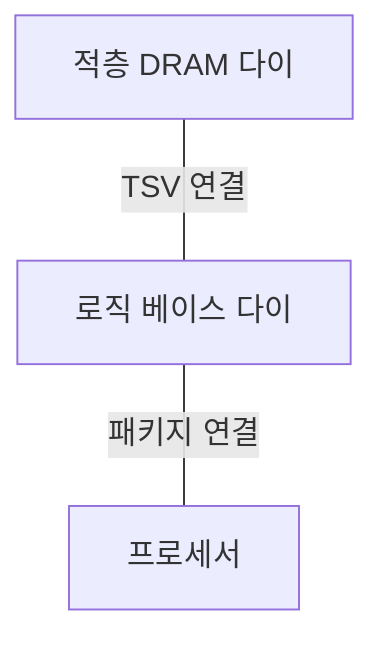
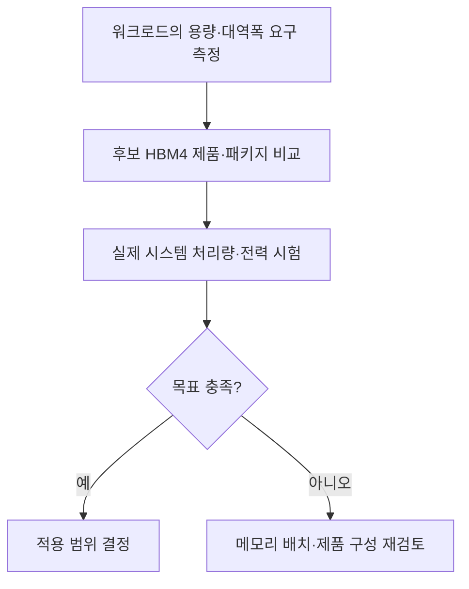

## 지식 로드맵 내 현재 위치

컴퓨터 시스템 및 네트워크 → 반도체 메모리 → HBM4

## 30초 인출

- 본질: HBM4는 여러 DRAM 다이를 쌓아 프로세서 가까이에 배치하는 고대역폭 메모리의 세대다.
- 메커니즘: 수직 적층·TSV·넓은 인터페이스로 많은 데이터를 병렬 전송하며, HBM4는 인터페이스 폭을 2,048 I/O로 늘렸다.
- 추가 단서: 로직 베이스 다이의 공정과 다이 접합 방식은 제품·제조사별 구현이며, 하이브리드 본딩이 HBM4 전체의 필수 조건은 아니다.

핵심 용어

- **HBM(High Bandwidth Memory)** : 여러 DRAM 다이를 수직으로 쌓아 넓은 데이터 경로를 제공하는 메모리다.
- **TSV(Through-Silicon Via)** : 적층한 다이 사이를 수직으로 연결하는 실리콘 관통 전극이다.
- **로직 베이스 다이(Logic Base Die)** : DRAM 적층 아래에서 신호·전력·제어 기능을 담당하는 기반 다이다.
- **2,048 I/O 인터페이스** : HBM4의 넓은 데이터 입출력 경로다. 실제 대역폭은 핀당 속도와 시스템 구성에도 좌우된다.
- **하이브리드 본딩(Hybrid Bonding)** : 구리 접점과 절연면을 직접 접합하는 적층 기술이다. HBM4에 일률적으로 적용되는 의무 공정은 아니다.

---

## 1교시 예상문제 (10점)

> HBM4의 구조와 HBM3E 대비 핵심 변화를 설명하시오. (예상)

---

## 1교시 10점 답안

### Ⅰ. 정의·목적

- 정의: **HBM4** 는 DRAM 다이를 수직 적층하고 2,048 I/O 인터페이스로 프로세서에 높은 메모리 대역폭을 제공하는 HBM 세대다.
- 목적: AI 가속기 등에서 연산 장치에 데이터를 공급하는 속도의 병목을 줄인다.

### Ⅱ. 적층 구조

실선은 적층·패키지 연결 관계다. 특정 접합 공정이나 다이 수를 이 구조의 필수 조건으로 쓰지 않는다.

### Ⅲ. HBM3E와의 차이

| 비교축 | HBM3E | HBM4 |
|---|---|---|
| I/O 폭 | 1,024 | 2,048 |
| 대역폭 확대 | 핀당 속도·구성에 의존 | 폭 확대와 핀당 속도를 함께 활용 |
| 베이스 다이·접합 | 제품별 구현 | 제품별 로직 공정·접합 방식 선택 |

제언: 채택할 제품의 실효 대역폭·용량·전력·패키지 호환성을 함께 검증한다.

---

## 2~4교시 예상문제 (25점)

> HBM4의 적층 구조와 HBM3E 대비 변화를 설명하고, 시스템 적용 시 고려사항을 제시하시오. (예상)

---

## 2~4교시 25점 답안

## Ⅰ. 개요

| 항목 | 핵심 |
|---|---|
| 정의 | **HBM4** 는 수직 적층 DRAM과 2,048 I/O 인터페이스를 사용하는 고대역폭 메모리 세대다. |
| 목적 | 프로세서에 필요한 데이터를 충분한 속도로 제공해 메모리 대역폭 병목을 줄인다. |

## Ⅱ. 적층·연결 구조

**TSV** 는 다이 간 수직 연결이고, **베이스 다이** 는 하부의 신호·제어 기능을 맡는다. 인터포저 등 프로세서와의 패키지 연결 구조는 제품에 따라 달라진다. 하이브리드 본딩은 가능한 접합 방식 중 하나이며 모든 HBM4 제품의 필수 요건으로 단정하지 않는다.

## Ⅲ. HBM3E와 HBM4의 대역폭 설계

| 비교축 | HBM3E | HBM4 | 해석 |
|---|---|---|---|
| I/O 폭 | 1,024 | 2,048 | 같은 핀당 전송률이면 이론상 데이터 경로가 두 배 |
| 실제 대역폭 | 제품 속도·구성에 의존 | 제품 속도·구성에 의존 | 폭만으로 실효 처리량 확정 불가 |
| 베이스 다이 | 제조사·제품별 설계 | 로직 공정 활용 사례 확대 | 특정 파운드리 공정을 표준 요건으로 볼 수 없음 |

삼성전자는 4nm 로직 베이스 다이를 쓴 HBM4 제품을 발표했고, SK하이닉스는 TSMC와 베이스 다이 협력을 발표했다. 이들은 **제품·사업자별 구현 사례** 다.

## Ⅳ. 적용 한계와 검증 항목

| 한계 | 왜 확인하는가 | 검증 항목 |
|---|---|---|
| 적층 발열·전력 | 높은 밀도와 데이터 전송이 열 설계에 영향 | 패키지 전력·온도·냉각 여유 |
| 패키지 호환성 | 가속기·HBM 연결 구조가 제품별로 다름 | 핀·패키지·용량·속도 지원 |
| 대역폭 활용률 | 연산·캐시·접근 패턴이 병목을 바꿈 | 실제 워크로드의 처리량·지연시간 |
| 신뢰성·수율 | 적층 결함과 교체 비용의 영향 | 오류 관리·제품 공급 조건 |

확인되지 않은 온도·수율·성능 개선 수치를 HBM4 일반 특성으로 쓰지 않는다.

## Ⅴ. 기술사적 제언 — 필요한 메모리 성능부터 역산

> 제안: HBM4를 세대명만 보고 선정하지 말고, 목표 모델의 **용량·대역폭·전력** 요구를 먼저 측정해 후보 제품과 패키지 구성을 비교한다.

Ⅳ절은 일반적인 적용 한계를 비교했고, 이 제안은 **어떤 측정값으로 제품을 선정할지** 정한다.

## 출제 이력과 검증 출처

- 관련 기출은 확인되지 않아 예상문제로 구성했다.
- [삼성전자, HBM4 양산 출하와 4nm 로직 베이스 다이](https://news.samsung.com/kr/%EC%82%BC%EC%84%B1%EC%A0%84%EC%9E%90-%EC%84%B8%EA%B3%84-%EC%B5%9C%EC%B4%88-%EC%97%85%EA%B3%84-%EC%B5%9C%EA%B3%A0-%EC%84%B1%EB%8A%A5%EC%9D%98-hbm4-%EC%96%91%EC%82%B0-%EC%B6%9C%ED%95%98)
- [SK하이닉스, TSMC와 HBM4 베이스 다이 협력](https://news.skhynix.com/en/sk-hynix-partners-with-tsmc-to-strengthen-hbm-technological-leadership/)
- [SK하이닉스, 하이브리드 본딩과 HBM4·차세대 HBM 구분](https://news.skhynix.com/en/tech-note-series-ep2/)

## 연결 토픽

- 연관 토픽: [GPU](./020_gpu.md), [TPU](./022_tpu.md), [CXL 메모리 풀링](./026_cxl_4_0_memory_pooling.md)
