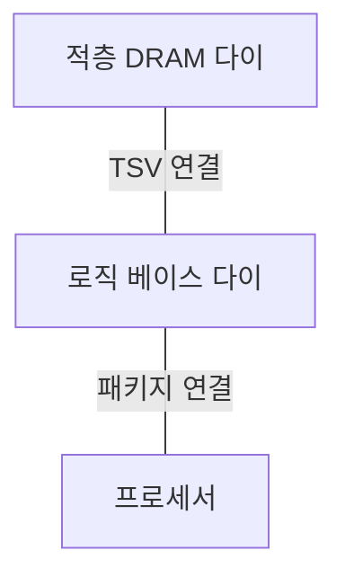
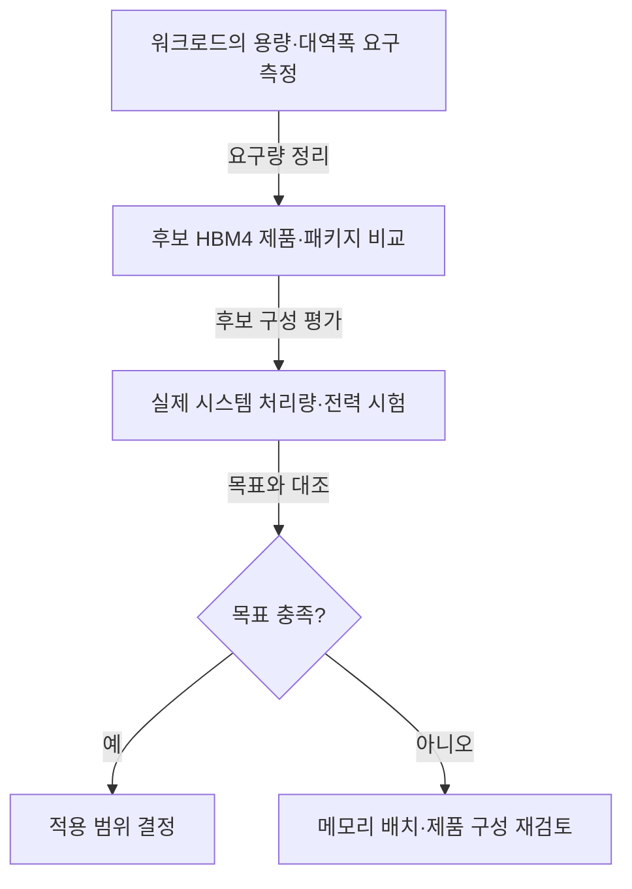

## 지식 로드맵 내 현재 위치

컴퓨터 시스템 및 네트워크 → 반도체 메모리 → HBM4

## 30초 인출

- 본질: **HBM4 (High Bandwidth Memory 4)** 는 2,048 I/O 인터페이스를 갖춘 적층형 고대역폭 메모리 세대
- 메커니즘: DRAM 다이 수직 적층 → TSV 연결 → 넓은 인터페이스를 통한 병렬 데이터 전송
- 추가 단서: 로직 베이스 다이 공정·접합 방식은 제조사별 구현. 하이브리드 본딩은 HBM4 전체의 필수 조건이 아님.

핵심 용어

- **HBM4 (High Bandwidth Memory 4)** : HBM3E 다음 세대의 적층형 고대역폭 메모리 표준.
- **HBM (High Bandwidth Memory)** : 적층 DRAM과 넓은 데이터 인터페이스로 높은 메모리 대역폭을 제공하는 메모리 계열.
- **DRAM (Dynamic Random Access Memory)** : 셀의 전하를 이용해 데이터를 저장하는 휘발성 메모리.
- **TSMC (Taiwan Semiconductor Manufacturing Company)** : 반도체 파운드리 업체.
- **I/O (Input/Output)** : 장치가 데이터를 주고받는 입력·출력 신호 경로.
- **HBM3E (High Bandwidth Memory 3E)** : HBM3 세대의 대역폭·용량을 확장한 제품 계열.
- **TSV (Through-Silicon Via)** : 적층한 다이 사이를 수직으로 연결하는 실리콘 관통 전극.
- **로직 베이스 다이 (Logic Base Die)** : DRAM 적층 아래에서 신호·전력·제어 기능을 담당하는 기반 다이.
- **2,048 I/O 인터페이스** : HBM4의 넓은 데이터 입출력 경로. 실효 대역폭은 핀당 속도와 시스템 구성에도 좌우.
- **하이브리드 본딩 (Hybrid Bonding)** : 구리 접점과 절연면을 직접 접합하는 적층 기술. HBM4 전체에 일률적으로 적용되는 필수 공정은 아님.

---

## 1교시 예상문제 (10점)

> HBM4의 개념과 적층 구조, 핵심 특징을 설명하시오. (예상)

---

## 1교시 10점 답안

### Ⅰ. 개요

| 구분 | 핵심 |
|---|---|
| 정의 | **HBM4 (High Bandwidth Memory 4)** 는 수직 적층 DRAM과 2,048 I/O 인터페이스를 사용하는 고대역폭 메모리 세대 |
| 목적 | 프로세서의 메모리 대역폭 요구 지원과 데이터 공급 병목 완화 |

### Ⅱ. 적층 구조

실선은 적층·패키지 연결 관계. 특정 접합 공정이나 다이 수를 이 구조의 필수 조건으로 볼 수 없음.

### Ⅲ. HBM3E와의 차이

| 비교축 | **HBM3E (High Bandwidth Memory 3E)** | **HBM4 (High Bandwidth Memory 4)** |
|---|---|---|
| I/O 폭 | 1,024 | 2,048 |
| 대역폭 확대 | 핀당 속도·구성에 의존 | 폭 확대와 핀당 속도를 함께 활용 |
| 베이스 다이·접합 | 제품별 구현 | 제품별 로직 공정·접합 방식 선택 |

제언: 채택 후보의 실효 대역폭·용량·전력·패키지 호환성 확인

---

## 2~4교시 예상문제 (25점)

> HBM4의 적층 구조와 HBM3E 대비 변화를 설명하고, 시스템 적용 시 고려사항을 제시하시오. (예상)

---

## 2~4교시 25점 답안

## Ⅰ. 개요

| 구분 | 핵심 |
|---|---|
| 정의 | **HBM4 (High Bandwidth Memory 4)** 는 수직 적층 DRAM과 2,048 I/O 인터페이스를 사용하는 고대역폭 메모리 세대 |
| 목적 | 프로세서의 메모리 대역폭 요구 지원과 데이터 공급 병목 완화 |

## Ⅱ. 적층·연결 구조

**TSV (Through-Silicon Via)** 는 다이 간 수직 연결, **로직 베이스 다이 (Logic Base Die)** 는 하부의 신호·제어 기능 담당. 인터포저 등 프로세서와의 패키지 연결 구조는 제품별 차이. 하이브리드 본딩은 가능한 접합 방식 중 하나로 모든 HBM4 제품의 필수 요건은 아님.

## Ⅲ. HBM3E와 HBM4의 대역폭 설계

| 비교축 | **HBM3E (High Bandwidth Memory 3E)** | **HBM4 (High Bandwidth Memory 4)** | 해석 |
|---|---|---|---|
| I/O 폭 | 1,024 | 2,048 | 같은 핀당 전송률이면 이론상 데이터 경로가 두 배 |
| 실제 대역폭 | 제품 속도·구성에 의존 | 제품 속도·구성에 의존 | 폭만으로 실효 처리량 확정 불가 |
| 베이스 다이 | 제조사·제품별 설계 | 로직 공정 활용 사례 확대 | 특정 파운드리 공정을 표준 요건으로 볼 수 없음 |

삼성전자의 4nm 로직 베이스 다이 기반 HBM4 양산 발표, SK하이닉스의 TSMC 베이스 다이 협력 발표. 두 사례 모두 **제품·사업자별 구현**.

## Ⅳ. 적용 한계와 검증 항목

| 한계 | 왜 확인하는가 | 검증 항목 |
|---|---|---|
| 적층 발열·전력 | 높은 밀도와 데이터 전송이 열 설계에 영향 | 패키지 전력·온도·냉각 여유 |
| 패키지 호환성 | 가속기·HBM 연결 구조가 제품별로 다름 | 핀·패키지·용량·속도 지원 |
| 대역폭 활용률 | 연산·캐시·접근 패턴이 병목을 바꿈 | 실제 워크로드의 처리량·지연시간 |
| 신뢰성·수율 | 적층 결함과 교체 비용의 영향 | 오류 관리·제품 공급 조건 |

HBM4 일반 특성으로 단정할 수 없는 온도·수율·성능 개선 수치.

## Ⅴ. 기술사적 제언 — 필요한 메모리 성능부터 역산

## 출제 이력과 검증 출처

- 관련 기출 미확인으로 예상문제 구성
- [삼성전자, HBM4 양산 출하와 4nm 로직 베이스 다이](https://news.samsung.com/kr/%EC%82%BC%EC%84%B1%EC%A0%84%EC%9E%90-%EC%84%B8%EA%B3%84-%EC%B5%9C%EC%B4%88-%EC%97%85%EA%B3%84-%EC%B5%9C%EA%B3%A0-%EC%84%B1%EB%8A%A5%EC%9D%98-hbm4-%EC%96%91%EC%82%B0-%EC%B6%9C%ED%95%98)
- [SK하이닉스, TSMC와 HBM4 베이스 다이 협력](https://news.skhynix.com/en/sk-hynix-partners-with-tsmc-to-strengthen-hbm-technological-leadership/)
- [SK하이닉스, 하이브리드 본딩과 HBM4·차세대 HBM 구분](https://news.skhynix.com/en/tech-note-series-ep2/)

## 연결 토픽

- 연관 토픽: [GPU](./020_gpu.md), [TPU](./022_tpu.md), [CXL 메모리 풀링](./026_cxl_4_0_memory_pooling.md)
