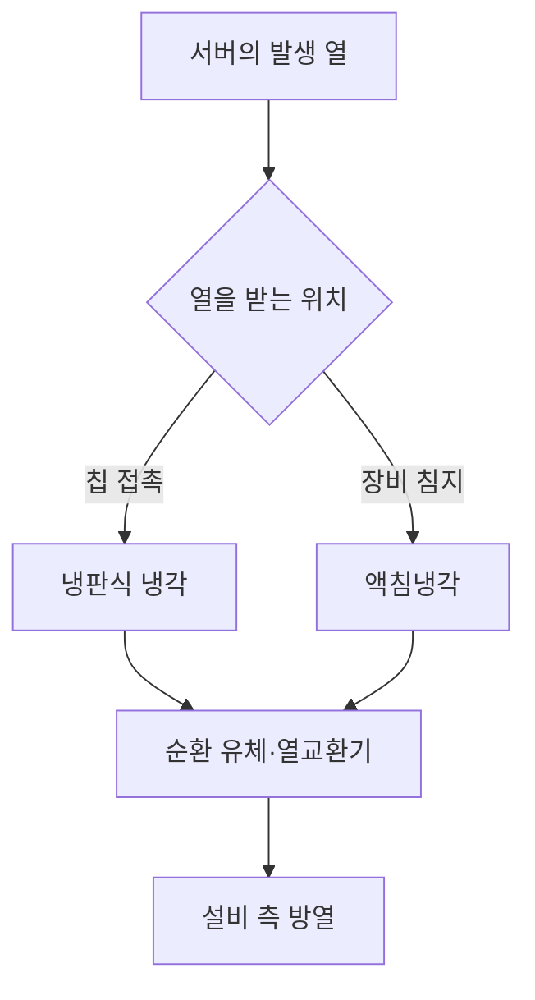
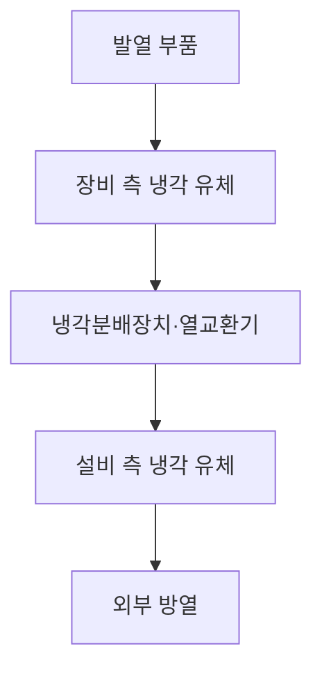

---
sidebar:
  order: 28
  label: "028. 액체냉각"
  badge:
    text: "기초"
    variant: note
title: "데이터센터 액체냉각"
author: "Codex"
date: "2026-09-24T00:00:00+09:00"
tags:
  - "notes-computer-system"
weight: 28
extra:
  model: "GPT-6"
  keyword_grade: "기초"
  question_no: "028"
---

## 지식 로드맵 내 현재 위치

지식 위치: 컴퓨터 시스템 → 데이터센터 설비 → **액체냉각**

## 30초 인출

- 본질: **액체냉각** : 서버의 열을 액체로 받아 외부 방열 경로로 옮기는 냉각 방식
- 메커니즘: 냉판 또는 액침 유체가 서버 열 흡수 → 냉각수 순환·열교환 → 설비 측 방열

핵심 용어

- **액체냉각(Liquid Cooling)** : 서버에서 발생한 열을 액체 매질로 받아 옮기는 냉각 방식
- **냉판식 냉각(Direct-to-Chip Cooling, D2C)** : 칩에 닿는 냉판 내부로 냉각수를 순환시켜 열을 빼내는 방식
- **액침냉각(Immersion Cooling)** : 서버 부품의 일부 또는 전체를 절연성 액체에 담가 열을 받아 내는 방식
- **냉각분배장치(Coolant Distribution Unit, CDU)** : 장비 측 냉각 유체의 순환·열교환을 설비 측 유체와 연계하는 장치
- **열교환기(Heat Exchanger)** : 서로 섞이지 않는 두 유체 사이에 열을 전달하는 장치
- **PUE(Power Usage Effectiveness)** : 데이터센터 전체 에너지 사용량을 IT 장비 에너지 사용량으로 나눈 지표

---

## 1교시 예상문제 (10점)

> 데이터센터 액체냉각에 관하여 설명하시오. (예상·10점)

---

## 1교시 10점 답안

### Ⅰ. 액체냉각의 개요

| 구분 | 핵심 |
|---|---|
| 정의 | **액체냉각** : 서버의 열을 액체 매질로 받아 외부 방열 경로로 옮기는 냉각 방식 |
| 목적 | 고발열 장비의 열 제거와 안정적인 운전 온도 유지 |

### Ⅱ. 대표 방식과 열의 이동

- **10점 제언**: 장비 발열과 기존 설비의 유량·배관·방열 능력을 함께 확인한 냉각 방식 선정.

---

## 2~4교시 예상문제 (25점)

> 데이터센터 액체냉각의 구조와 대표 방식을 설명하고, 도입 시 한계와 대응 방안을 제시하시오. (예상·25점)

---

## 2~4교시 25점 답안

## Ⅰ. 액체냉각의 개요

| 구분 | 핵심 |
|---|---|
| 정의 | **액체냉각** : 서버의 열을 액체 매질로 받아 외부 방열 경로로 옮기는 냉각 방식 |
| 목적 | 고발열 장비의 열 제거와 안정적인 운전 온도 유지 |

## Ⅱ. 냉각 경로의 핵심 구조

장비 측 열을 설비 측으로 옮기는 경로와 두 유체의 경계가 핵심. 냉판식에서는 냉판·배관, 액침식에서는 탱크·절연성 유체가 장비 측 열 수집부.

## Ⅲ. 냉판식과 액침식 비교

| 비교 축 | 냉판식 냉각 | 액침냉각 |
|---|---|---|
| 열 수집 위치 | CPU·GPU 등 발열 부품에 닿는 냉판 | 절연성 유체에 잠긴 부품 표면 |
| 장비 구성 | 냉판·매니폴드·배관 연결 | 탱크·유체·장비 적합성 확인 |
| 공기 냉각 | 냉판 밖의 부품은 추가 공랭이 필요할 수 있음 | 침지 범위와 탱크 설계에 따라 다름 |
| 정비 관점 | 연결부 누수·유량 점검 | 유체 적합성·장비 인출·정비 절차 점검 |

냉판식과 액침식은 모두 액체로 열을 옮기지만 장비와 유체가 접촉하는 범위가 다름.

## Ⅳ. 도입 전 설계 판단

| 확인 대상 | 판단할 내용 |
|---|---|
| 장비 발열 | 부품별 발열 분포와 요구 냉각 유량 |
| 설비 접속 | 냉각수 온도·유량·압력과 열교환 능력 |
| 운영·정비 | 누수 감지, 부품 교체, 배관 격리 절차 |
| 에너지 | IT 부하와 냉각 설비를 함께 측정한 PUE 변화 |

PUE 개선 폭은 기존 설비·외기·운전 조건에 따라 달라지는 측정 결과. 액체냉각만으로 특정 PUE나 절감률을 보장할 수 없음.

## Ⅴ. 적용 한계와 대응

| 한계 | 대응 |
|---|---|
| 장비 열을 받아도 설비 측 방열 능력이 부족할 수 있음 | 랙·배관·열교환기·외부 방열까지 연속 용량 검토 |
| 배관·접속부 누수 또는 순환 장애 | 감지·차단·우회·정비 절차와 장애 시험 |
| 장비와 냉각 유체의 재료 적합성 차이 | 장비 제조사 조건과 유체·씰·배관 재료의 호환성 확인 |

## Ⅵ. 기술사적 제언

| 우선 제언 | 실행·확인 |
|---|---|
| 기존 공랭 설비에 고발열 장비를 추가하기 전 냉각 경로 확인 | 장비 발열량에서 외부 방열까지의 유량·온도·열교환 능력을 한 경로로 점검 |
| 정상 운전뿐 아니라 순환 장애에 대비 | 펌프·전원·누수 감지 실패를 가정한 장비 온도와 복구 절차 시험 |

---

## 검증 출처

- [ASHRAE Handbook: Data Centers and Telecommunication Facilities](https://handbook.ashrae.org/Handbooks/A23/SI/A23_Ch20/a23_ch20_si.aspx)
- [ASHRAE: Energy and Thermal Efficiency](https://www.ashrae.org/technical-resources/ai-data-center-framework/energy-and-thermal-efficiency)
- [Open Compute Project: Base Specification for Immersion Fluids](https://www.opencompute.org/documents/ocp-base-specification-for-immersion-fluids-20221201-pdf)

## 연결 토픽

- 연관 토픽: [GPU](./020_gpu.md), [데이터센터 위치 선정](./044_idc_geographic_site_selection.md)
