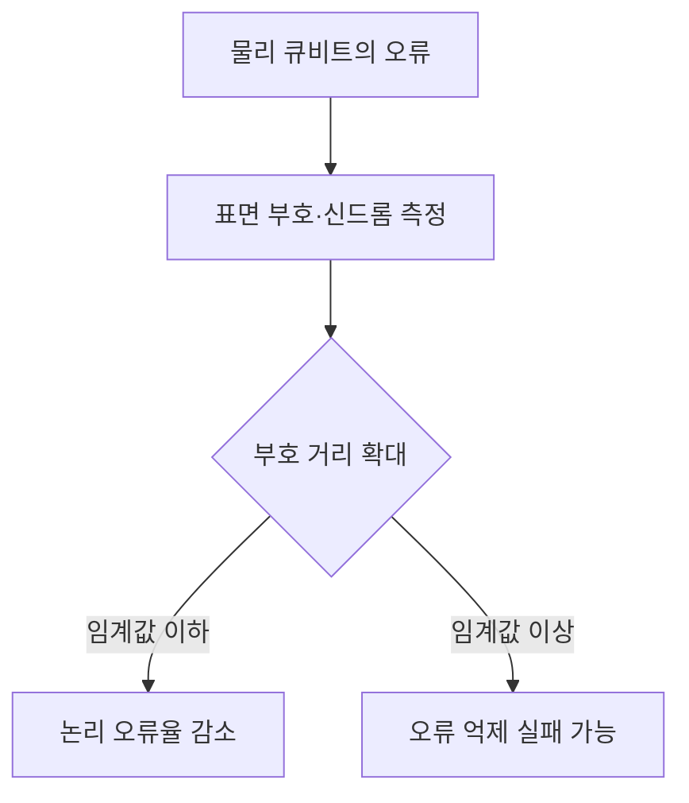
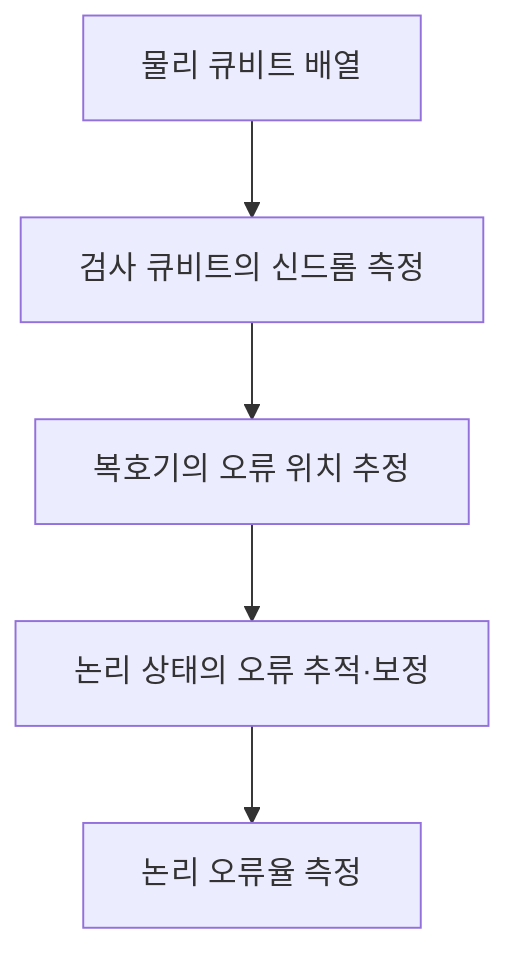

---
sidebar:
  order: 29
  label: "029. 양자 오류정정 임계값"
  badge:
    text: "서브"
    variant: note
title: "양자 오류정정 임계값과 Willow"
author: "Codex"
date: "2026-09-24T00:00:00+09:00"
tags:
  - "notes-computer-system"
weight: 29
extra:
  model: "GPT-6"
  keyword_grade: "서브"
  question_no: "029"
---

## 지식 로드맵 내 현재 위치

지식 위치: 컴퓨터 시스템 → 양자컴퓨팅 → **양자 오류정정 임계값**

## 30초 인출

- 본질: **양자 오류정정 임계값** : 물리적 오류가 충분히 낮아 부호 크기를 키울수록 논리 오류를 줄일 수 있는 경계
- 메커니즘: 여러 물리 큐비트로 논리 큐비트 구성 → 신드롬 측정·복호 → 부호 거리 증가에 따른 논리 오류율 비교

핵심 용어

- **물리 큐비트(Physical Qubit)** : 실제 양자 회로에서 상태를 구현·조작하는 큐비트
- **논리 큐비트(Logical Qubit)** : 여러 물리 큐비트의 오류정정 부호로 보호하는 정보 단위
- **양자 오류정정(Quantum Error Correction, QEC)** : 물리적 오류의 흔적을 측정하고 복호해 논리 정보의 오류를 줄이는 기법
- **표면 부호(Surface Code)** : 2차원 큐비트 배열의 검사 결과로 오류를 추정하는 양자 오류정정 부호
- **신드롬(Syndrome)** : 논리 정보를 직접 읽지 않고 오류 정보를 알아내기 위한 검사 결과
- **부호 거리(Code Distance)** : 부호가 구별할 수 있는 오류 패턴의 크기와 관련된 척도
- **오류정정 임계값(Threshold)** : 물리적 오류가 이보다 낮을 때 부호 크기 확대로 논리 오류를 줄일 수 있는 경계
- **Willow** : Google Quantum AI의 초전도 양자 프로세서로 표면 부호 양자 메모리의 임계값 이하 동작을 보고한 실험 장치

---

## 1교시 예상문제 (10점)

> 양자 오류정정 임계값에 관하여 설명하시오. (예상·10점)

---

## 1교시 10점 답안

### Ⅰ. 양자 오류정정 임계값의 개요

| 구분 | 핵심 |
|---|---|
| 정의 | **양자 오류정정 임계값** : 물리적 오류가 충분히 낮아 부호 크기를 키울수록 논리 오류를 줄일 수 있는 경계 |
| 목적 | 물리 큐비트의 오류가 논리 정보에 미치는 영향 감소 |

### Ⅱ. 임계값의 의미

- 제언: 물리 큐비트 수만 보지 않고 부호 거리를 늘릴 때 논리 오류율이 실제로 감소하는지 확인.

---

## 2~4교시 예상문제 (25점)

> 양자 오류정정 임계값의 의미와 표면 부호의 작동을 설명하고, Willow 실험의 성과와 남은 한계를 제시하시오. (예상·25점)

---

## 2~4교시 25점 답안

## Ⅰ. 양자 오류정정 임계값의 개요

| 구분 | 핵심 |
|---|---|
| 정의 | **양자 오류정정 임계값** : 물리적 오류가 충분히 낮아 부호 크기를 키울수록 논리 오류를 줄일 수 있는 경계 |
| 목적 | 물리 큐비트의 오류가 논리 정보에 미치는 영향 감소 |

## Ⅱ. 표면 부호의 오류정정 경로

양자 상태의 값을 직접 복사해 다수결하는 방식이 아니라 오류에 관한 검사 결과를 이용한 보호 방식.

## Ⅲ. 임계값 판정

| 물리 오류 조건 | 부호 거리 확대 시 | 의미 |
|---|---|---|
| 임계값 이하 | 논리 오류율 감소 가능 | 더 큰 부호의 오류 억제 효과 |
| 임계값 이상 | 오류정정 부담이 이득을 상쇄할 수 있음 | 부호 확대만으로 개선 보장 불가 |

임계값의 수치는 오류 모형·측정·복호기·회로에 따라 달라지므로 고정 백분율로 일반화할 수 없음.

## Ⅳ. Willow 실험의 위치

| 확인한 내용 | 해석 범위 |
|---|---|
| 표면 부호 거리 3·5·7을 키운 실험에서 논리 오류 억제 | 양자 메모리의 임계값 이하 동작을 뒷받침하는 결과 |
| 거리 5의 실시간 복호 실험 | 측정 주기 안에서 복호 결과를 처리할 수 있는지 확인 |
| 거리 7의 논리 정보 보존 개선 | 더 큰 부호에서 논리 오류 억제가 이어지는지 확인 |

Willow 결과는 오류정정 양자 메모리의 진전. 임의의 대규모 양자 알고리즘을 이미 내결함적으로 실행했다는 뜻은 아님.

## Ⅴ. 확장 한계와 대응

| 한계 | 대응 |
|---|---|
| 부호 거리를 더 키우면 물리 큐비트·제어 비용 증가 | 논리 오류 감소율과 제어 자원 비용을 함께 측정 |
| 상관 오류·오류 바닥이 있을 수 있음 | 반복 실험과 장시간 오류 분포 관찰 |
| 실시간 복호 지연이 연산 주기를 넘길 수 있음 | 측정·복호·제어의 종단 간 시간 검증 |

## Ⅵ. 기술사적 제언

| 우선 제언 | 실행·확인 |
|---|---|
| 장치 규모보다 논리 성능 개선을 우선 비교 | 같은 조건에서 부호 거리를 높일 때 논리 오류율과 복호 지연을 함께 기록 |
| 메모리 실험과 범용 연산 성능을 구분 | 실험이 보호한 연산·시간 범위와 미검증 범위를 결과표에 명시 |

---

## 검증 출처

- [Google Quantum AI: Making quantum error correction work](https://research.google/blog/making-quantum-error-correction-work/)
- [Nature: Quantum error correction below the surface code threshold](https://www.nature.com/articles/s41586-024-08449-y)

## 연결 토픽

- 연관 토픽: [양자컴퓨팅](./072_quantum_computing.md), [위상 큐비트](./115_topological_qubit_majorana_1.md)
