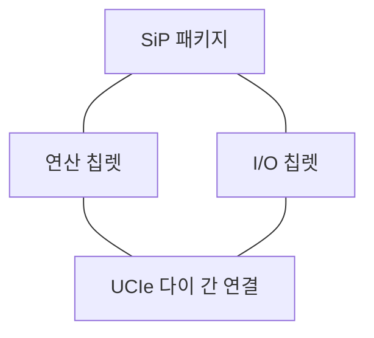
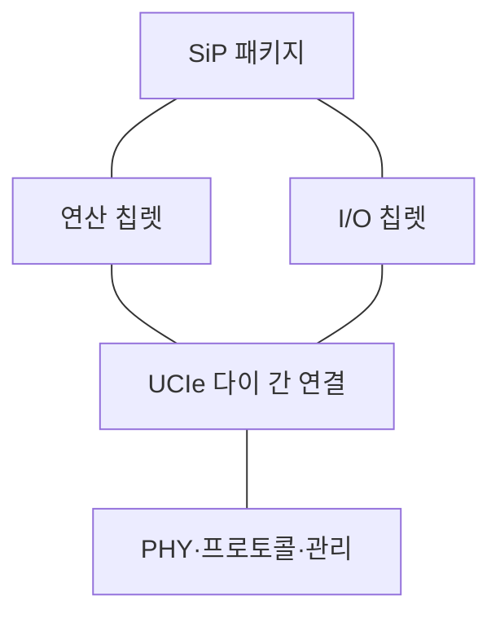
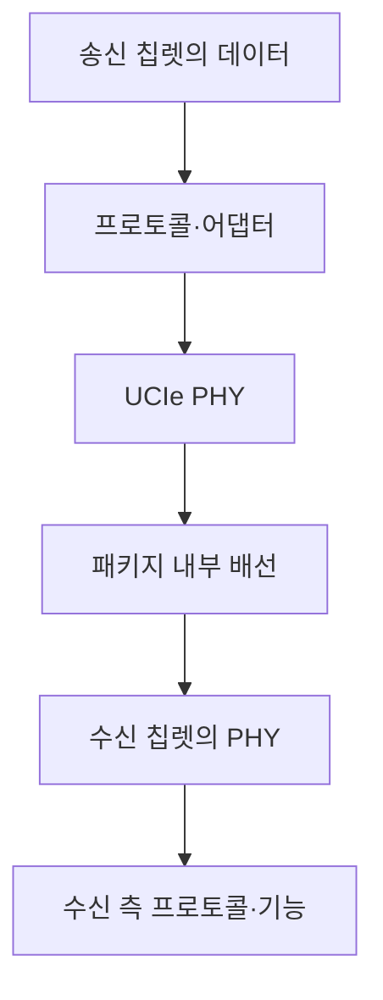

---
sidebar:
  order: 30
  label: "030. 칩렛과 UCIe 3.0"
  badge:
    text: "서브"
    variant: note
title: "칩렛과 UCIe 3.0"
author: "Codex"
date: "2026-09-24T00:00:00+09:00"
tags:
  - "notes-computer-system"
weight: 30
extra:
  model: "GPT-6"
  keyword_grade: "서브"
  question_no: "030"
---

## 지식 로드맵 내 현재 위치

지식 위치: 컴퓨터 시스템 → 반도체 패키징 → **칩렛과 UCIe**

## 30초 인출

- 본질: **칩렛**은 기능별로 나눈 작은 반도체 다이, **UCIe**는 한 패키지 안의 칩렛을 잇는 개방형 연결 규격
- 메커니즘: 기능별 다이 제작·검사 → 패키지 안에 배치 → 다이 간 물리 연결과 프로토콜로 통신

핵심 용어

- **칩렛(Chiplet)** : 큰 칩의 기능을 나누어 제조하고 한 패키지에 조립하는 반도체 다이
- **UCIe(Universal Chiplet Interconnect Express)** : 패키지 내부 다이 간 연결의 물리 계층과 프로토콜 등을 규정하는 개방형 표준
- **다이 간 연결(Die-to-Die Interconnect)** : 같은 패키지에 있는 반도체 다이 사이의 신호 전달 경로
- **SiP(System-in-Package)** : 여러 다이를 하나의 패키지에 조립한 시스템 구성
- **PHY(Physical Layer, 물리 계층)** : 다이 간 신호의 전기적 송수신을 담당하는 계층
- **사이드밴드(Sideband)** : 주 데이터 경로와 별도로 관리·제어 신호를 전달하는 경로
- **GT/s(Giga Transfers per Second)** : 초당 신호 전송 횟수를 나타내는 단위로 실제 유효 대역폭과 구분

---

## 1교시 예상문제 (10점)

> 칩렛과 UCIe에 관하여 설명하시오. (예상·10점)

---

## 1교시 10점 답안

### Ⅰ. 칩렛과 UCIe의 개요

| 구분 | 핵심 |
|---|---|
| 정의 | **칩렛**은 기능별 반도체 다이, **UCIe**는 같은 패키지 안의 다이 간 연결 규격 |
| 목적 | 기능별 다이의 조합과 연결 방식의 상호운용성 확보 |

### Ⅱ. 패키지 안의 관계

- 제언: 칩렛 조합 가능 여부는 UCIe 지원뿐 아니라 패키지 배선·전력·열 설계를 함께 확인.

---

## 2~4교시 예상문제 (25점)

> 칩렛 구조와 UCIe의 역할을 설명하고, UCIe 3.0의 주요 변경점과 적용 시 한계·대응을 제시하시오. (예상·25점)

---

## 2~4교시 25점 답안

## Ⅰ. 칩렛과 UCIe의 개요

| 구분 | 핵심 |
|---|---|
| 정의 | **칩렛**은 기능별 반도체 다이, **UCIe**는 같은 패키지 안의 다이 간 연결 규격 |
| 목적 | 기능별 다이의 조합과 연결 방식의 상호운용성 확보 |

## Ⅱ. 패키지 구조와 표준의 경계

| 설계 대상 | UCIe의 역할 |
|---|---|
| 다이 간 송수신 | 물리 계층·링크 구성의 공통 규정 |
| 상위 통신 | 다이 간 프로토콜 전달 방식 |
| 패키징·전력·열 | 별도 패키지·시스템 설계와 검증 필요 |

UCIe 준수만으로 모든 칩렛의 기능적 호환성이나 패키지 조립 가능성이 자동으로 보장되는 것은 아님.

## Ⅲ. 다이 간 통신 흐름

데이터 경로의 방향은 실제 송수신을 뜻하며, 앞 절의 패키지 도해에서 사용한 연결선은 정적 구성 관계.

## Ⅳ. UCIe 3.0의 주요 변경

| 변화 | 공식 규격의 의미 |
|---|---|
| 48·64 GT/s 전송률 지원 | 2.0의 32 GT/s보다 높은 링크 전송률 선택지 |
| 확장된 사이드밴드 | 패키지 내 유연한 관리·제어 연결 |
| 초기 펌웨어 전달·우선순위 신호 | 시동·시스템 이벤트 관리 기능 보강 |
| 런타임 재보정 | 운전 중 링크 전력·성능 조정 지원 |

전송률은 링크 신호 규격이며 애플리케이션의 실제 처리량·전력 절감률과 동일하지 않음.

## Ⅴ. 적용 한계와 대응

| 한계 | 대응 |
|---|---|
| 칩렛 간 전기적 연결 규격만으로 시스템 통합 완료 불가 | 패키지 배선·전력·열·테스트 조건 함께 확인 |
| 다이·패키지 조합에 따른 실제 처리량 차이 | 연결 수·배선 길이·프로토콜 오버헤드 포함 성능 검증 |
| 이종 칩렛의 관리·장애 처리 복잡도 | 초기화·오류 보고·복구 경로 통합 시험 |

## Ⅵ. 기술사적 제언

| 우선 제언 | 실행·확인 |
|---|---|
| 후보 칩렛의 UCIe 버전과 패키지 조건을 함께 대조 | 물리 연결·관리 기능·전력·열 요구를 동일 구성에서 시험 |
| 표준 전송률과 실제 업무 성능 분리 | 대표 워크로드의 종단 간 지연·처리량 측정 |

---

## 검증 출처

- [UCIe Consortium: Specifications](https://www.uciexpress.org/specifications)
- [UCIe Consortium: 3.0 Specification](https://www.uciexpress.org/post/ucie-3-0-specification-redefining-chiplet-interconnects)

## 연결 토픽

- 연관 토픽: [GPU](./020_gpu.md), [HBM4](./027_hbm4.md)
