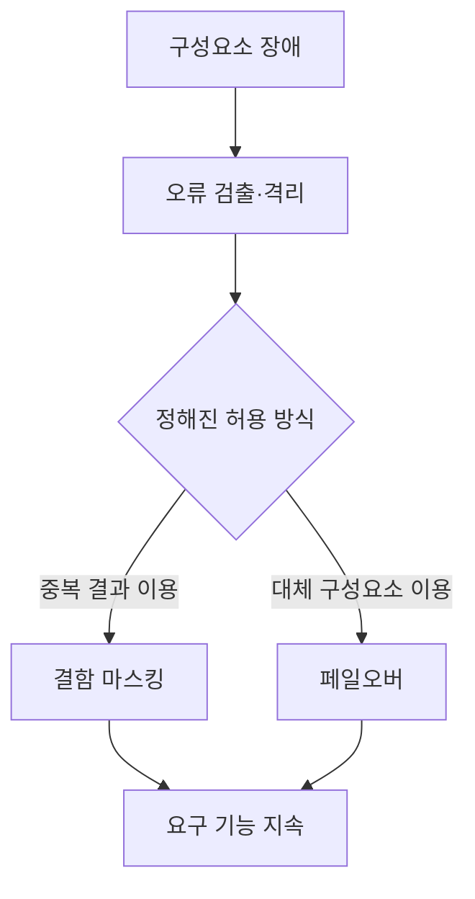
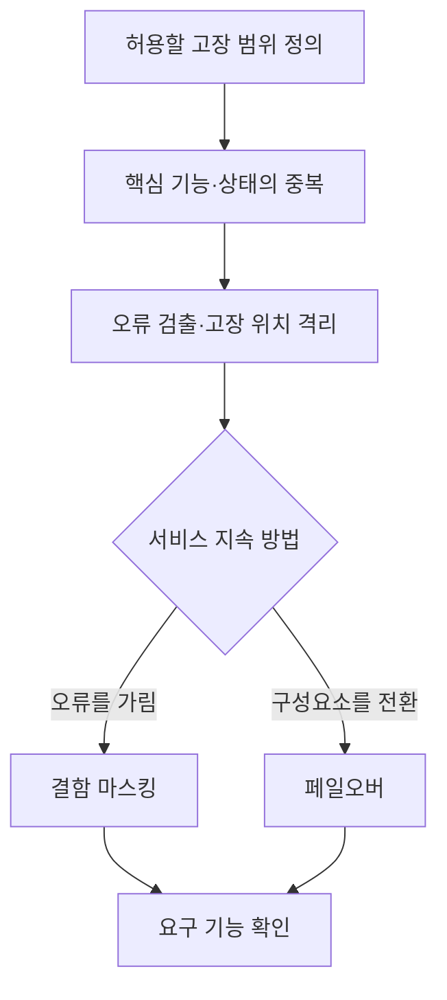

---
sidebar:
  order: 31
  label: "031. 결함허용시스템(FTS)"
  badge:
    text: "기초"
    variant: note
title: "결함허용시스템(FTS)"
author: "Codex"
date: "2026-09-24T00:00:00+09:00"
tags:
  - "notes-computer-system"
weight: 31
extra:
  model: "GPT-6"
  keyword_grade: "기초"
  question_no: "031"
---

## 지식 로드맵 내 현재 위치

지식 위치: 컴퓨터 시스템 → 가용성·복원력 → **결함허용시스템**

## 30초 인출

- 본질: **결함허용시스템(FTS)** : 일부 구성요소가 고장 나도 정해진 기능을 계속 제공하도록 설계한 시스템
- 메커니즘: 고장 범위 가정 → 핵심 기능의 중복·오류 검출 → 결함 격리·마스킹 또는 대체 → 기능 지속 확인

핵심 용어

- **FTS(Fault-Tolerant System, 결함허용시스템)** : 일부 구성요소 고장에도 요구한 기능을 계속 수행하도록 설계한 시스템
- **결함허용(Fault Tolerance)** : 구성요소 고장이 생겨도 정해진 동작을 유지하는 성질
- **중복(Redundancy)** : 장애에 대비해 기능·데이터·경로를 여분으로 두는 방식
- **결함 마스킹(Fault Masking)** : 내부의 일부 오류가 외부 결과에 드러나지 않도록 중복 결과 등으로 가리는 처리
- **TMR(Triple Modular Redundancy, 삼중 모듈 중복)** : 같은 기능을 세 모듈로 수행하고 다수결로 단일 모듈의 잘못된 출력을 가리는 기법
- **페일오버(Failover)** : 동작 중인 구성요소의 장애 시 대기 구성요소로 기능을 전환하는 방식
- **공통 원인 장애(Common-Cause Failure)** : 여러 중복 구성요소가 같은 원인으로 함께 실패하는 장애

---

## 1교시 예상문제 (10점)

> 결함허용시스템에 관하여 설명하시오. (예상·10점)

---

## 1교시 10점 답안

### Ⅰ. 결함허용시스템의 개요

| 구분 | 핵심 |
|---|---|
| 정의 | **결함허용시스템(FTS)** : 일부 구성요소의 고장에도 정해진 기능을 계속 제공하도록 설계한 시스템 |
| 목적 | 구성요소 고장 시에도 요구한 서비스 기능의 지속 |

### Ⅱ. 기본 작동 구조

- 제언: 허용할 고장의 범위와 장애 중 유지할 기능을 먼저 정한 뒤 중복 방식을 선택.

---

## 2~4교시 예상문제 (25점)

> 결함허용시스템의 구조와 대표 기법을 설명하고, 적용 시 한계와 대응 방안을 제시하시오. (예상·25점)

---

## 2~4교시 25점 답안

## Ⅰ. 결함허용시스템의 개요

| 구분 | 핵심 |
|---|---|
| 정의 | **결함허용시스템(FTS)** : 일부 구성요소의 고장에도 정해진 기능을 계속 제공하도록 설계한 시스템 |
| 목적 | 구성요소 고장 시에도 요구한 서비스 기능의 지속 |

## Ⅱ. 결함허용의 설계 구조

중복만으로 결함허용이 완성되는 것은 아님. 오류를 알아내고 올바른 결과를 선택하거나 정상 구성요소로 전환하는 경로까지 필요.

## Ⅲ. 대표 기법과 허용 범위

| 기법 | 작동 | 주의할 범위 |
|---|---|---|
| TMR | 세 모듈의 결과를 다수결로 선택 | 독립적인 한 모듈 오류의 마스킹 |
| 오류 검출·대체 | 오류 모듈 격리 후 예비 모듈 사용 | 전환 중 상태·서비스 연속성 |
| 상태 복제 | 여러 노드에 필요한 상태 유지 | 복제 지연·불일치·동시 장애 |

TMR은 한 가지 구현 기법이며 모든 FTS가 세 개의 CPU를 동일 클록으로 실행하는 것은 아님.

## Ⅳ. 고가용성 구조와의 관계

| 비교 축 | 일반적인 대기계 전환 | 결함허용 설계에서 확인할 점 |
|---|---|---|
| 장애 반응 | 장애 탐지 후 예비계로 전환 | 마스킹 또는 전환 방식과 상태 보존 |
| 서비스 영향 | 감지·전환 동안 단절 가능 | 허용된 고장 조건에서 요구 기능 지속 여부 |
| 검증 | 전환 시간·복구 상태 측정 | 고장 주입 시 출력 정확성·연속성 측정 |

명칭만으로 중단 시간 0이나 모든 장애에 대한 무중단을 보장할 수 없음. 고장 가정과 측정 결과를 함께 제시.

## Ⅴ. 적용 한계와 대응

| 한계 | 대응 |
|---|---|
| 공통 원인으로 중복 구성요소가 함께 실패 | 전원·경로·위치 등 실패 원인의 분리 |
| 잘못된 결과를 선택하는 비교·투표 기능 자체의 장애 | 투표기·검출 경로의 고장 가능성 분석 |
| 중복 상태가 불일치한 채 전환 | 복제 상태와 전환 후 데이터 정확성 시험 |

## Ⅵ. 기술사적 제언

| 우선 제언 | 실행·확인 |
|---|---|
| 서비스별 허용 고장 범위와 유지 기능을 먼저 문서화 | 단일 부품·노드·전원·경로 고장별로 기대 출력과 중단 허용치 명시 |
| 실제 고장 주입으로 지속 능력 확인 | 구성요소 장애 중 기능·데이터 정확성과 복구 상태 측정 |

---

## 검증 출처

- [NIST CSRC: Fault Tolerance](https://csrc.nist.gov/glossary/term/fault_tolerance)
- [NASA: Triple-Modular Redundancy Review](https://ntrs.nasa.gov/api/citations/20160003541/downloads/20160003541.pdf)
- [NIST CSRC: Failover](https://csrc.nist.gov/glossary/term/failover)

## 연결 토픽

- 연관 토픽: [고가용성](./021_ha.md), [고가용성·가용성 보증](./042_ha_availability_assurance.md)
