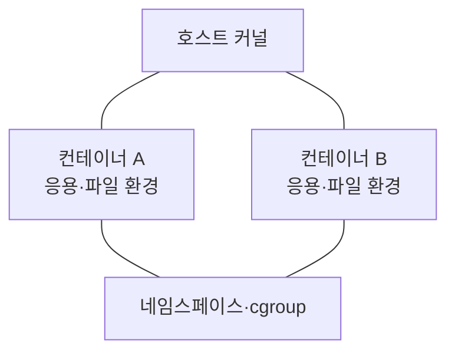
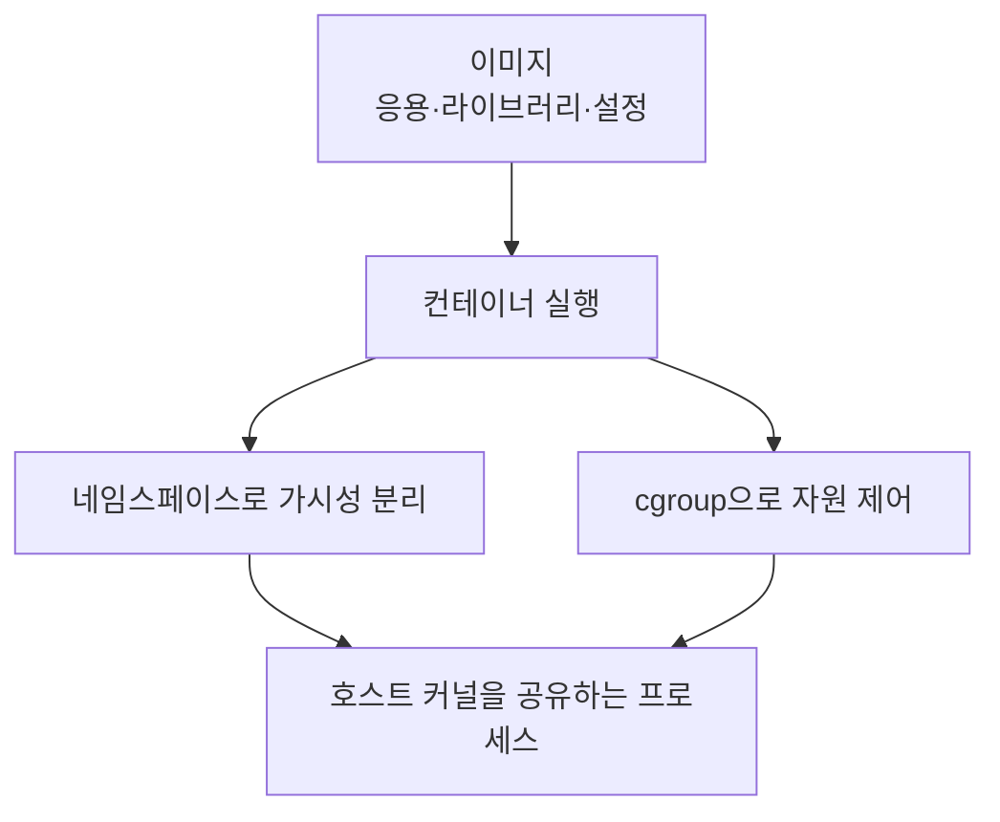

---
sidebar:
  order: 32
  label: "032. 컨테이너"
  badge:
    text: "기초"
    variant: note
title: "컨테이너(Container)"
author: "Codex"
date: "2026-09-24T00:00:00+09:00"
tags:
  - "notes-computer-system"
weight: 32
extra:
  model: "GPT-6"
  keyword_grade: "기초"
  question_no: "032"
---

## 지식 로드맵 내 현재 위치

지식 위치: 컴퓨터 시스템 → OS 격리·배포 → **컨테이너**

## 30초 인출

- 본질: **컨테이너** : 응용과 필요한 실행 환경을 묶어 격리된 프로세스로 실행하는 단위
- 메커니즘: 이미지에서 실행 환경 생성 → 커널의 프로세스·파일·네트워크 가시성 분리 → 자원 사용량 제한

핵심 용어

- **컨테이너(Container)** : 응용과 실행 환경을 묶어 격리된 프로세스로 실행하는 단위
- **이미지(Image)** : 컨테이너를 만들기 위한 파일·설정의 읽기 전용 템플릿
- **네임스페이스(Namespace)** : 프로세스가 보는 PID·마운트·네트워크 등의 범위를 분리하는 커널 기능
- **cgroup(Control Group)** : 프로세스 집합의 CPU·메모리 등 자원 사용을 제어하는 커널 기능
- **호스트 커널(Host Kernel)** : 같은 호스트의 컨테이너가 공유하는 운영체제 커널
- **가상머신(Virtual Machine, VM)** : 가상 하드웨어 위에서 별도 게스트 OS를 실행하는 격리 단위

---

## 1교시 예상문제 (10점)

> 컨테이너에 관하여 설명하시오. (예상·10점)

---

## 1교시 10점 답안

### Ⅰ. 컨테이너의 개요

| 구분 | 핵심 |
|---|---|
| 정의 | **컨테이너** : 응용과 실행 환경을 묶어 호스트 커널 위에서 격리된 프로세스로 실행하는 단위 |
| 목적 | 실행 환경의 일관성과 자원 사용 범위의 분리 |

### Ⅱ. 실행 구조

- 제언: 이미지 구성과 함께 권한·자원 제한·저장 데이터의 위치를 명시.

---

## 2~4교시 예상문제 (25점)

> 컨테이너의 실행 구조와 격리 메커니즘을 설명하고, 가상머신과의 차이 및 운영상 한계·대응을 제시하시오. (예상·25점)

---

## 2~4교시 25점 답안

## Ⅰ. 컨테이너의 개요

| 구분 | 핵심 |
|---|---|
| 정의 | **컨테이너** : 응용과 실행 환경을 묶어 호스트 커널 위에서 격리된 프로세스로 실행하는 단위 |
| 목적 | 실행 환경의 일관성과 자원 사용 범위의 분리 |

## Ⅱ. 이미지에서 실행 프로세스까지

컨테이너는 실행 중인 격리 프로세스, 이미지는 그 프로세스를 시작할 때 쓰는 템플릿.

## Ⅲ. 격리·자원 제어의 역할

| 메커니즘 | 분리·제어 대상 | 확인할 점 |
|---|---|---|
| 네임스페이스 | 프로세스 ID, 마운트, 네트워크 등의 가시성 | 다른 컨테이너·호스트 자원의 노출 범위 |
| cgroup | CPU·메모리 등 자원 배분·한도 | 과다 사용 시 서비스 영향 |
| 파일시스템·권한 설정 | 이미지 파일과 쓰기 가능한 경로 | 호스트 마운트·권한 상승 가능성 |

공유 커널 위의 격리는 설정에 달린 경계. 네임스페이스와 cgroup만으로 완전한 보안 격리가 자동으로 보장되는 것은 아님.

## Ⅳ. 가상머신과의 비교

| 비교 축 | 컨테이너 | 가상머신 |
|---|---|---|
| OS 경계 | 호스트 커널 공유 | 게스트 OS·커널 실행 |
| 실행 단위 | 격리된 프로세스 | 가상 하드웨어 위의 OS |
| 이미지·배포 | 응용과 필요한 실행 환경 중심 | 게스트 OS와 응용 구성 |
| 격리 선택 | 커널 공유 조건과 권한 검토 | 가상화 계층·게스트 OS 관리 |

두 방식은 목적에 따라 함께 사용할 수 있음. 시작 시간·성능 차이는 이미지·호스트·워크로드에 따라 측정할 항목.

## Ⅴ. 운영 한계와 대응

| 한계 | 대응 |
|---|---|
| 커널을 공유하므로 호스트 커널 장애·취약점 영향 가능 | 커널 갱신, 최소 권한, 보안 정책 적용 |
| 메모리·CPU 한도 부재 시 이웃 서비스에 영향 | 자원 요청·한도와 부하 시험 |
| 컨테이너 삭제와 함께 쓰기 계층의 데이터가 소실될 수 있음 | 영속 데이터는 명시적 볼륨·외부 저장소에 분리 |

## Ⅵ. 기술사적 제언

| 우선 제언 | 실행·확인 |
|---|---|
| 컨테이너의 실행 경계와 데이터 경계를 함께 설계 | 이미지·권한·자원 한도와 볼륨 위치를 배포 명세에 기록 |
| 배포 전에 격리 설정을 시험 | 권한 상승·자원 과다 사용·재시작 시 데이터 상태 확인 |

---

## 검증 출처

- [Docker Docs: What is a container?](https://docs.docker.com/get-started/docker-concepts/the-basics/what-is-a-container/)
- [Docker Docs: Running containers](https://docs.docker.com/engine/containers/run/)
- [Linux Kernel: Control Group v2](https://docs.kernel.org/admin-guide/cgroup-v2.html)

## 연결 토픽

- 연관 토픽: [쿠버네티스](./012_kubernetes.md), [가상 메모리](./023_virtual_memory.md)
