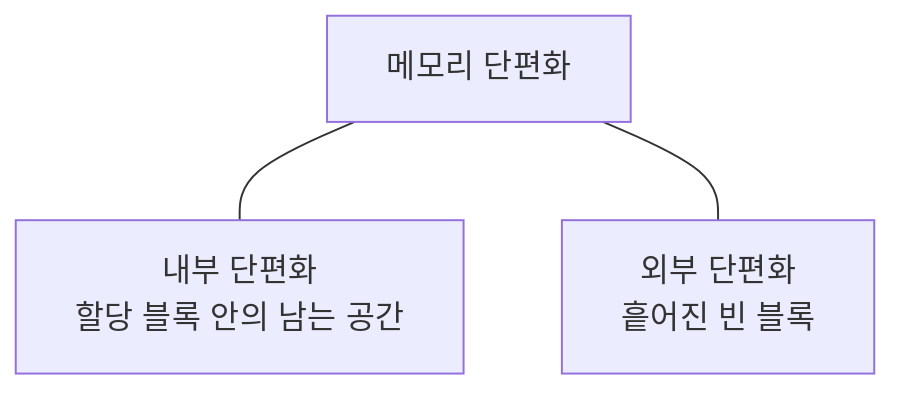
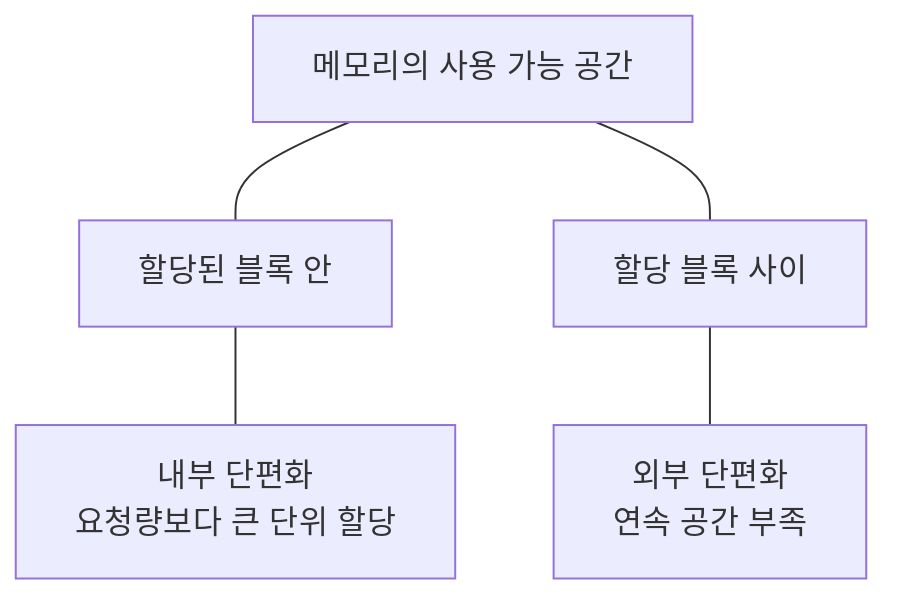

---
sidebar:
  order: 33
  label: "033. 메모리 단편화"
  badge:
    text: "기초"
    variant: note
title: "메모리 단편화(Fragmentation)"
author: "Codex"
date: "2026-09-24T00:00:00+09:00"
tags:
  - "notes-computer-system"
weight: 33
extra:
  model: "GPT-6"
  keyword_grade: "기초"
  question_no: "033"
---

## 지식 로드맵 내 현재 위치

지식 위치: 컴퓨터 시스템 → 메모리 관리 → **메모리 단편화**

## 30초 인출

- 본질: **메모리 단편화** : 할당·해제 과정에서 빈 공간이 블록 안에 남거나 여러 곳에 흩어져 메모리 사용 효율이 떨어지는 현상
- 메커니즘: 고정 크기 할당의 블록 내부 낭비와 가변 크기 할당의 연속 공간 부족을 구분해 대응

핵심 용어

- **메모리 단편화(Memory Fragmentation)** : 사용 가능한 메모리가 할당 단위 안이나 단위 사이에 남아 활용이 어려워지는 현상
- **내부 단편화(Internal Fragmentation)** : 할당받은 블록 안에서 요청 크기를 제외하고 남는 공간
- **외부 단편화(External Fragmentation)** : 사용 가능한 빈 공간이 여러 곳에 흩어져 필요한 연속 공간을 확보하기 어려운 상태
- **페이징(Paging)** : 가상 주소 공간을 페이지, 물리 메모리를 프레임으로 나누어 매핑하는 방식
- **버디 할당(Buddy Allocation)** : 메모리를 정해진 크기 단위로 분할하고 빈 짝 블록을 다시 합치는 할당 방식
- **메모리 압축(Compaction)** : 사용 중인 페이지를 이동시켜 빈 물리 페이지를 연속된 영역으로 모으는 처리

---

## 1교시 예상문제 (10점)

> 메모리 단편화에 관하여 설명하시오. (예상·10점)

---

## 1교시 10점 답안

### Ⅰ. 메모리 단편화의 개요

| 구분 | 핵심 |
|---|---|
| 정의 | **메모리 단편화** : 빈 공간이 할당 블록 안이나 블록 사이에 남아 메모리 활용이 어려워지는 현상 |
| 목적 | 단편화 유형을 구분해 할당 실패와 공간 낭비를 줄일 방법 선택 |

### Ⅱ. 내부·외부 단편화

- 제언: 남는 공간의 위치가 블록 안인지 밖인지 먼저 확인한 뒤 할당 단위 또는 연속 공간 대책 선택.

---

## 2~4교시 예상문제 (25점)

> 메모리 단편화의 유형과 발생 원인을 설명하고, 메모리 관리 방식별 대응과 한계를 제시하시오. (예상·25점)

---

## 2~4교시 25점 답안

## Ⅰ. 메모리 단편화의 개요

| 구분 | 핵심 |
|---|---|
| 정의 | **메모리 단편화** : 빈 공간이 할당 블록 안이나 블록 사이에 남아 메모리 활용이 어려워지는 현상 |
| 목적 | 단편화 유형을 구분해 할당 실패와 공간 낭비를 줄일 방법 선택 |

## Ⅱ. 남는 공간의 위치에 따른 유형

| 구분 | 관찰할 현상 |
|---|---|
| 내부 단편화 | 할당 단위가 요청량보다 커서 블록 내부의 일부가 미사용 |
| 외부 단편화 | 빈 공간 총량이 있어도 필요한 크기의 연속 영역 확보 곤란 |

## Ⅲ. 할당 방식과 발생 원인

| 할당 방식 | 단편화 관점 | 핵심 이유 |
|---|---|---|
| 고정 크기 블록 | 내부 단편화 가능 | 요청 크기와 블록 크기의 차이 |
| 가변 크기 연속 할당 | 외부 단편화 가능 | 반복 할당·해제 후 빈 공간의 분산 |
| 페이징 | 프로세스 전체의 물리적 연속 할당 불필요 | 마지막 페이지의 남는 공간 등 내부 낭비 가능 |

페이징을 쓴다고 모든 물리 메모리 단편화가 사라지는 것은 아님. 큰 연속 물리 영역이 필요한 할당에는 외부 단편화가 다시 문제가 될 수 있음.

## Ⅳ. 대응 기법의 선택

| 기법 | 겨냥하는 상황 | 고려할 비용 |
|---|---|---|
| 할당 단위 조정 | 내부 낭비가 큰 경우 | 작은 단위의 관리 오버헤드 |
| 버디 할당·블록 병합 | 빈 블록을 재결합할 수 있는 경우 | 크기 반올림에 따른 내부 낭비 |
| 메모리 압축 | 큰 연속 물리 영역이 필요한 경우 | 페이지 이동 비용·지연 |
| 페이지 매핑 | 가상 연속 공간으로 충분한 경우 | 페이지 관리 비용 |

## Ⅴ. 운영상 한계와 대응

| 한계 | 대응 |
|---|---|
| 빈 메모리 총량만으로 큰 연속 할당 가능 여부를 판단 | 필요한 연속 블록 크기와 빈 블록 분포 확인 |
| 압축 작업이 지연 민감 업무에 영향 | 압축 빈도·할당 지연을 함께 측정 |
| 할당 단위를 지나치게 크게 선택 | 요청 크기 분포와 실제 내부 낭비 비교 |

## Ⅵ. 기술사적 제언

| 우선 제언 | 실행·확인 |
|---|---|
| 할당 실패를 단순 메모리 부족으로 단정하지 않기 | 총 가용량과 요청한 연속 블록 크기·분포를 함께 기록 |
| 지연이 중요한 시스템에서 대응 기법을 시험 | 압축·병합 후 할당 성공률과 지연 변화를 같은 부하에서 확인 |

---

## 검증 출처

- [Linux Kernel: Memory Management Concepts](https://docs.kernel.org/admin-guide/mm/concepts.html)
- [Linux Kernel: VM Sysctl Documentation](https://docs.kernel.org/admin-guide/sysctl/vm.html)

## 연결 토픽

- 연관 토픽: [가상 메모리](./023_virtual_memory.md), [스래싱](./039_thrashing.md)
