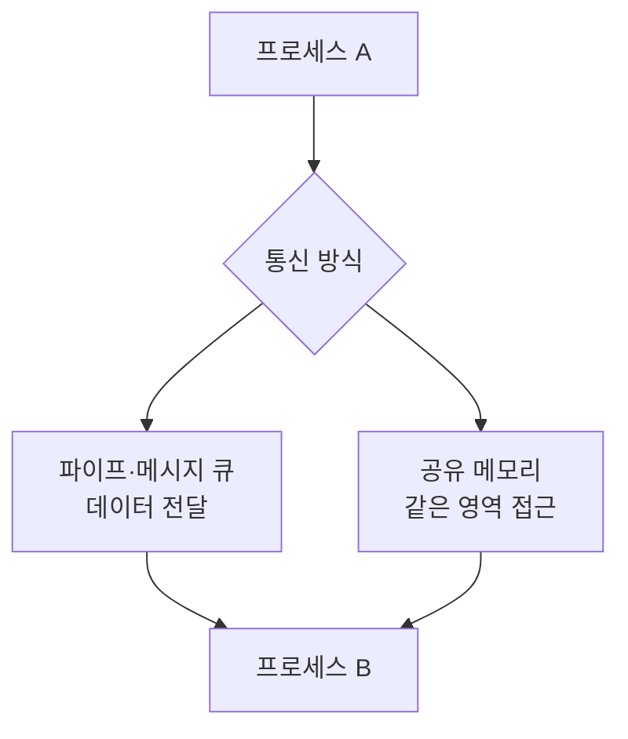
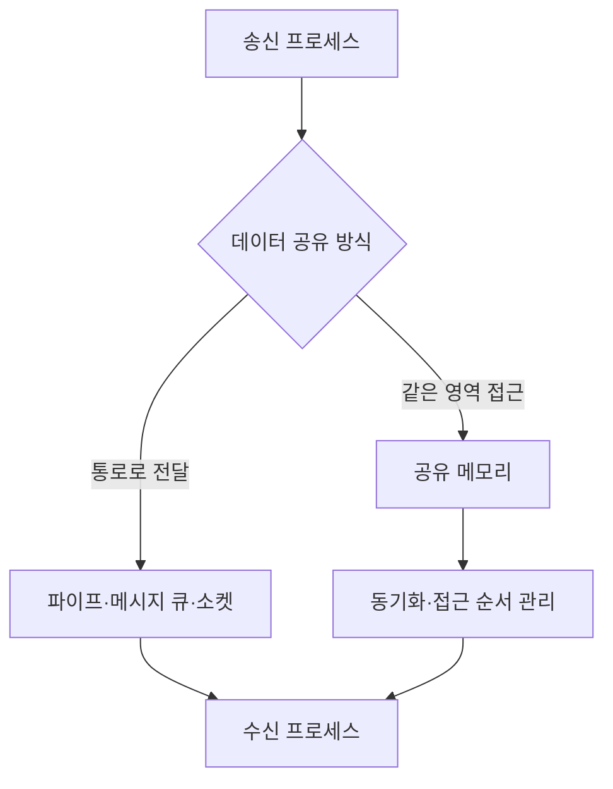

---
sidebar:
  order: 34
  label: "034. 프로세스 간 통신(IPC)"
  badge:
    text: "기초"
    variant: note
title: "프로세스 간 통신(IPC)"
author: "Codex"
date: "2026-09-24T00:00:00+09:00"
tags:
  - "notes-computer-system"
weight: 34
extra:
  model: "GPT-6"
  keyword_grade: "기초"
  question_no: "034"
---

## 지식 로드맵 내 현재 위치

지식 위치: 컴퓨터 시스템 → 운영체제·프로세스 → **프로세스 간 통신**

## 30초 인출

- 본질: **프로세스 간 통신(IPC)** : 서로 분리된 프로세스가 데이터나 제어 신호를 주고받는 방법
- 메커니즘: 통신 통로 선택 → 송신·수신 또는 공유 영역 접근 → 순서·동시 접근 조정

핵심 용어

- **IPC(Inter-Process Communication, 프로세스 간 통신)** : 프로세스 사이에서 데이터·신호를 교환하는 방식
- **파이프(Pipe)** : 한쪽이 쓴 바이트 스트림을 다른 쪽이 읽는 통신 통로
- **메시지 큐(Message Queue)** : 메시지를 단위별로 넣고 꺼내는 통신 통로
- **공유 메모리(Shared Memory)** : 여러 프로세스가 같은 메모리 영역에 접근하는 방식
- **소켓(Socket)** : 프로세스 사이에 양방향 통신 끝점을 제공하는 인터페이스
- **세마포어(Semaphore)** : 공유 자원 접근 순서나 사용 가능 수를 조정하는 동기화 수단

---

## 1교시 예상문제 (10점)

> 프로세스 간 통신에 관하여 설명하시오. (예상·10점)

---

## 1교시 10점 답안

### Ⅰ. 프로세스 간 통신의 개요

| 구분 | 핵심 |
|---|---|
| 정의 | **프로세스 간 통신(IPC)** : 분리된 프로세스가 데이터나 제어 신호를 주고받는 방식 |
| 목적 | 프로세스 사이의 데이터 전달과 작업 조정 |

### Ⅱ. 대표 통신 관계

- 제언: 전달 단위와 데이터 크기를 확인하고, 공유 메모리 사용 시 동기화 수단을 함께 설계.

---

## 2~4교시 예상문제 (25점)

> 프로세스 간 통신의 구조와 주요 방식을 설명하고, 방식 선택 시 고려 사항과 한계·대응을 제시하시오. (예상·25점)

---

## 2~4교시 25점 답안

## Ⅰ. 프로세스 간 통신의 개요

| 구분 | 핵심 |
|---|---|
| 정의 | **프로세스 간 통신(IPC)** : 분리된 프로세스가 데이터나 제어 신호를 주고받는 방식 |
| 목적 | 프로세스 사이의 데이터 전달과 작업 조정 |

## Ⅱ. 통신 구조

통로형은 송수신 경계, 공유 메모리형은 데이터 접근 순서가 핵심.

## Ⅲ. 대표 방식의 차이

| 방식 | 전달 단위·범위 | 확인할 점 |
|---|---|---|
| 파이프 | 연속된 바이트 스트림 | 방향·끝점·읽기/쓰기 차단 조건 |
| 메시지 큐 | 개별 메시지 | 순서·용량·수신 시점 |
| 공유 메모리 | 공동 접근하는 메모리 영역 | 동시 수정·가시성·수명 |
| 소켓 | 통신 끝점 사이의 바이트·메시지 | 로컬/네트워크 범위·프로토콜 |

세마포어는 데이터를 나르는 통로가 아니라 공유 자원 접근을 조정하는 수단.

## Ⅳ. 선택 기준

| 요구 | 우선 검토 |
|---|---|
| 단순한 생산자·소비자 스트림 | 파이프 |
| 메시지 단위의 비동기 전달 | 메시지 큐 |
| 같은 호스트에서 큰 데이터의 공동 접근 | 공유 메모리와 동기화 |
| 호스트 간 확장 가능성 | 소켓·네트워크 프로토콜 |

실제 성능은 복사 방식·데이터 크기·커널 구현·부하에 따라 측정할 항목.

## Ⅴ. 한계와 대응

| 한계 | 대응 |
|---|---|
| 공유 메모리의 동시 쓰기로 데이터 경합 | 잠금·세마포어 등 동기화와 충돌 시험 |
| 큐의 소비 지연으로 적체 | 큐 용량·만료·역압력 정책 |
| 프로세스 종료 후 통신 자원 잔존 | 자원 수명·정리 책임 명시 |

## Ⅵ. 기술사적 제언

| 우선 제언 | 실행·확인 |
|---|---|
| IPC 방식을 속도만으로 선택하지 않기 | 전달 단위·통신 범위·장애 처리·동기화 요구를 같은 표로 비교 |
| 운영 중 적체와 경합을 검증 | 생산·소비 속도 차이, 동시 갱신, 프로세스 재시작을 시험 |

---

## 검증 출처

- [Linux man-pages: System V IPC](https://www.man7.org/linux/man-pages/man7/svipc.7.html)
- [Linux man-pages: Pipe](https://man7.org/linux/man-pages/man7/pipe.7.html)
- [Linux man-pages: Semaphore](https://man7.org/linux/man-pages/man7/sem_overview.7.html)

## 연결 토픽

- 연관 토픽: [스레드](./010_thread.md), [프로세스 동기화](./122_process_synchronization.md)
