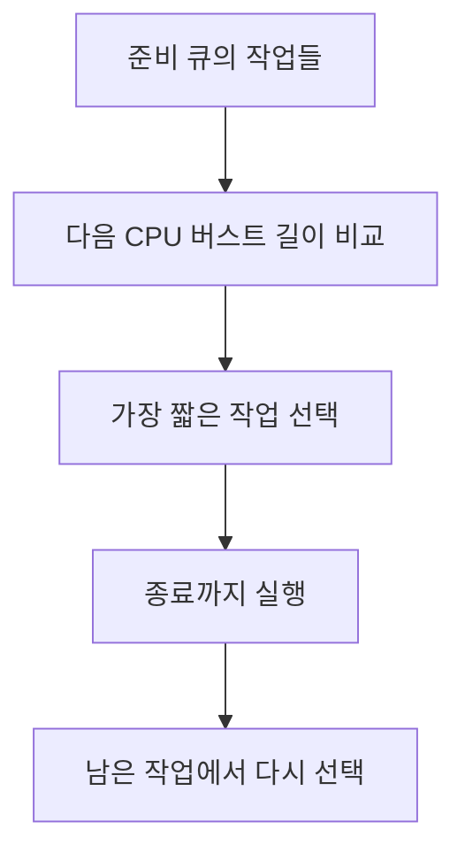
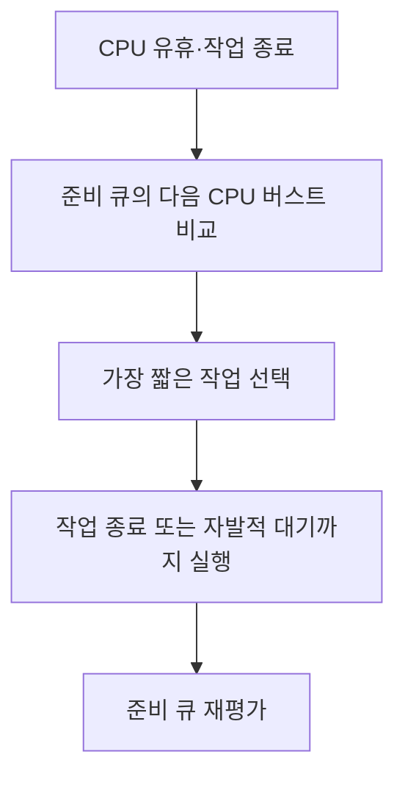

---
sidebar:
  order: 35
  label: "035. SJF 스케줄링"
  badge:
    text: "기초"
    variant: note
title: "SJF(Shortest Job First) 스케줄링"
author: "Codex"
date: "2026-09-24T00:00:00+09:00"
tags:
  - "notes-computer-system"
weight: 35
extra:
  model: "GPT-6"
  keyword_grade: "기초"
  question_no: "035"
---

## 지식 로드맵 내 현재 위치

지식 위치: 컴퓨터 시스템 → CPU 스케줄링 → **SJF**

## 30초 인출

- 본질: **SJF** : 준비된 작업 중 다음 CPU 실행시간이 가장 짧은 작업부터 실행하는 비선점 스케줄링
- 메커니즘: 준비 큐의 CPU 버스트 길이 비교 → 가장 짧은 작업 선택 → 작업 종료 후 다시 선택

핵심 용어

- **SJF(Shortest Job First, 최단 작업 우선)** : 준비된 작업 중 다음 CPU 버스트가 가장 짧은 작업을 먼저 실행하는 비선점 스케줄링
- **CPU 버스트(CPU Burst)** : 프로세스가 CPU를 연속해서 사용하는 실행 구간
- **대기시간(Waiting Time)** : 준비 상태에서 CPU 할당을 기다린 시간
- **SRTF(Shortest Remaining Time First)** : 남은 실행시간이 더 짧은 작업이 도착하면 선점하는 SJF의 선점형 변형
- **기아(Starvation)** : 다른 작업이 계속 우선되어 한 작업의 실행이 오래 지연되는 상태
- **FCFS(First Come First Served, 선입선출)** : 준비 큐에 먼저 도착한 작업부터 실행하는 스케줄링

---

## 1교시 예상문제 (10점)

> SJF 스케줄링에 관하여 설명하시오. (예상·10점)

---

## 1교시 10점 답안

### Ⅰ. SJF의 개요

| 구분 | 핵심 |
|---|---|
| 정의 | **SJF** : 준비된 작업 중 다음 CPU 버스트가 가장 짧은 작업부터 실행하는 비선점 스케줄링 |
| 목적 | 짧은 작업의 대기를 줄여 평균 대기시간 개선 |

### Ⅱ. 선택 과정

- 제언: CPU 버스트의 실제 길이를 미리 알기 어려우므로 예측 오차와 장기 대기 작업을 함께 관찰.

---

## 2~4교시 예상문제 (25점)

> SJF 스케줄링의 동작과 선점형 변형을 설명하고, 평균 대기시간 개선 조건과 한계·대응을 제시하시오. (예상·25점)

---

## 2~4교시 25점 답안

## Ⅰ. SJF의 개요

| 구분 | 핵심 |
|---|---|
| 정의 | **SJF** : 준비된 작업 중 다음 CPU 버스트가 가장 짧은 작업부터 실행하는 비선점 스케줄링 |
| 목적 | 짧은 작업의 대기를 줄여 평균 대기시간 개선 |

## Ⅱ. 비선점 SJF의 작동

선택 후에는 새 작업이 도착해도 실행 중인 CPU 버스트를 선점하지 않는 방식.

## Ⅲ. 관련 방식의 비교

| 기준 | FCFS | SJF | SRTF |
|---|---|---|---|
| 선택 기준 | 도착 순서 | 다음 CPU 버스트 길이 | 남은 CPU 버스트 길이 |
| 선점 | 없음 | 없음 | 있음 |
| 장점 | 단순한 순서 | 짧은 작업의 대기 감소 | 짧은 새 작업에 즉시 반응 |
| 주의 | 긴 선행 작업의 호위 효과 | 긴 작업의 기아 가능성 | 선점 비용과 기아 가능성 |

SRTF는 SJF와 같은 최단 시간 원리를 쓰지만 새로운 작업 도착 시 선점 여부가 다름.

## Ⅳ. 평균 대기시간 판단

| 조건 | 영향 |
|---|---|
| 준비 작업의 CPU 버스트를 정확히 아는 경우 | 동일 시점에 준비된 작업 집합에서 평균 대기시간 최소화 |
| 버스트 길이를 추정해야 하는 경우 | 예측 오차에 따라 선택 결과 변동 |
| 작업 도착이 계속되는 경우 | 새 짧은 작업이 긴 작업보다 계속 앞설 가능성 |

평균 대기시간 최적화의 전제와 응답시간·공정성 목표를 구분.

## Ⅴ. 한계와 대응

| 한계 | 대응 |
|---|---|
| 다음 CPU 버스트 길이를 실행 전에 정확히 알기 어려움 | 과거 실행 정보로 추정하고 오차 측정 |
| 짧은 작업이 계속 들어오면 긴 작업의 기아 가능 | 대기시간을 고려한 우선순위 조정 |
| 평균 대기시간 개선이 개별 작업의 공정성을 보장하지 않음 | 최대 대기시간과 업무별 서비스 목표 함께 확인 |

## Ⅵ. 기술사적 제언

| 우선 제언 | 실행·확인 |
|---|---|
| 평균 대기시간과 긴 작업 지연을 함께 평가 | 대표 작업 혼합에서 평균·최대 대기시간 동시 측정 |
| 실행시간 예측을 적용할 경우 오차를 검증 | 예측 길이와 실제 CPU 버스트의 차이, 선택 순서 변화 확인 |

---

## 검증 출처

- Abraham Silberschatz, Peter Baer Galvin, Greg Gagne, *Operating System Concepts*, CPU Scheduling

## 연결 토픽

- 연관 토픽: [CPU 스케줄링](./019_cpu_scheduling.md), [스레드](./010_thread.md)
