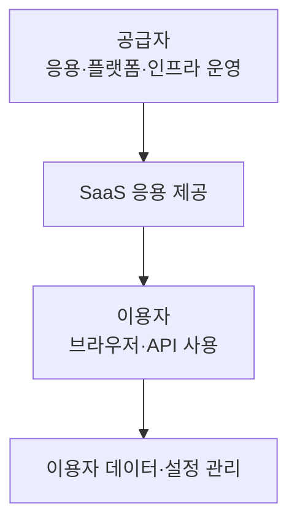
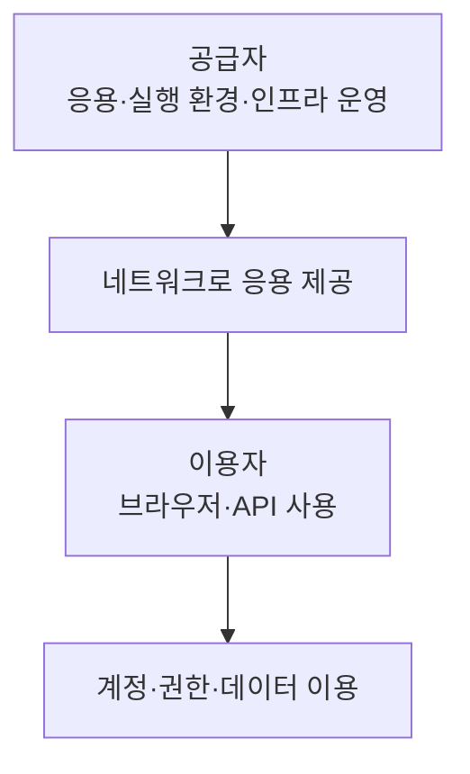

---
sidebar:
  order: 36
  label: "036. SaaS"
  badge:
    text: "기초"
    variant: note
title: "SaaS(Software as a Service)"
author: "Codex"
date: "2026-09-24T00:00:00+09:00"
tags:
  - "notes-computer-system"
weight: 36
extra:
  model: "GPT-6"
  keyword_grade: "기초"
  question_no: "036"
---

## 지식 로드맵 내 현재 위치

지식 위치: 컴퓨터 시스템 → 클라우드 서비스 모델 → **SaaS**

## 30초 인출

- 본질: **SaaS** : 공급자가 운영하는 응용 소프트웨어를 이용자가 네트워크로 사용하는 클라우드 서비스 모델
- 메커니즘: 공급자가 응용·기반 시설 운영 → 이용자는 브라우저·API 등으로 기능 사용 → 이용자별 설정·데이터 관리 책임 구분

핵심 용어

- **SaaS(Software as a Service, 서비스형 소프트웨어)** : 공급자 응용을 클라우드에서 제공하고 이용자가 네트워크로 사용하는 서비스 모델
- **IaaS(Infrastructure as a Service, 서비스형 인프라)** : 이용자가 컴퓨팅·저장·네트워크 자원을 받아 OS와 응용을 배치하는 모델
- **PaaS(Platform as a Service, 서비스형 플랫폼)** : 공급자가 제공하는 실행 환경에 이용자가 응용을 배치하는 모델
- **테넌트(Tenant)** : SaaS 서비스 안에서 식별·설정·데이터의 관리 단위가 되는 고객 조직
- **테넌트 격리(Tenant Isolation)** : 고객별 데이터와 권한이 다른 고객에게 노출되지 않도록 구분하는 경계
- **API(Application Programming Interface)** : 응용 기능에 프로그램으로 접근하는 인터페이스

---

## 1교시 예상문제 (10점)

> SaaS에 관하여 설명하시오. (예상·10점)

---

## 1교시 10점 답안

### Ⅰ. SaaS의 개요

| 구분 | 핵심 |
|---|---|
| 정의 | **SaaS** : 공급자가 운영하는 응용을 이용자가 네트워크로 사용하는 클라우드 서비스 모델 |
| 목적 | 이용자의 기반 시설·응용 운영 부담 축소와 필요한 기능의 제공 |

### Ⅱ. 제공·이용 관계

- 제언: 서비스 기능뿐 아니라 이용자 데이터의 권한·반출·종료 조건을 계약과 운영 절차에 명시.

---

## 2~4교시 예상문제 (25점)

> SaaS의 제공 구조와 책임 범위를 설명하고, 다른 클라우드 서비스 모델과 비교하여 운영상 한계·대응을 제시하시오. (예상·25점)

---

## 2~4교시 25점 답안

## Ⅰ. SaaS의 개요

| 구분 | 핵심 |
|---|---|
| 정의 | **SaaS** : 공급자가 운영하는 응용을 이용자가 네트워크로 사용하는 클라우드 서비스 모델 |
| 목적 | 이용자의 기반 시설·응용 운영 부담 축소와 필요한 기능의 제공 |

## Ⅱ. 공급자와 이용자의 관계

이용자는 공급자 응용을 사용하고 제한된 설정을 바꿀 수 있으나, 일반적으로 기반 시설과 응용 코드를 직접 운영하지 않는 모델.

## Ⅲ. 책임 범위

| 대상 | 공급자 중심 | 이용자 중심 |
|---|---|---|
| 응용·기반 시설 운영 | 배포·가용성·패치 | 서비스 수준 확인 |
| 계정·접근 | 인증 기능 제공 | 사용자 권한·접근 정책 설정 |
| 업무 데이터 | 계약상 보관·보호 기능 제공 | 입력 데이터의 적정성·이용·반출 요구 정의 |
| 종료·이관 | 내보내기 기능·계약 조건 제공 | 데이터 회수·대체 업무 절차 준비 |

구체적인 책임은 서비스 계약과 기술 기능으로 확인할 항목.

## Ⅳ. 다른 서비스 모델과의 차이

| 모델 | 이용자가 주로 사용하는 대상 | 이용자 관리 범위 |
|---|---|---|
| IaaS | 컴퓨팅·저장·네트워크 자원 | OS·응용 배치와 관리 |
| PaaS | 응용 실행 플랫폼 | 이용자가 배치한 응용 |
| SaaS | 공급자가 제공하는 응용 기능 | 이용자 설정·계정·데이터 이용 |

단일 응용 인스턴스, 특정 과금 방식, 구독 여부는 SaaS의 정의 조건이 아니라 제품별 설계·계약 조건.

## Ⅴ. 운영 한계와 대응

| 한계 | 대응 |
|---|---|
| 공급자 장애가 이용자 업무에 영향 | 서비스 수준·복구·대체 업무 절차 확인 |
| 고객 데이터와 권한 경계의 관리 부족 | 테넌트 격리·권한·감사 기록 검증 |
| 종료 시 데이터 반출·이관 곤란 | 내보내기 형식·기한·삭제 조건을 계약과 시험에 반영 |

## Ⅵ. 기술사적 제언

| 우선 제언 | 실행·확인 |
|---|---|
| 기능 평가와 함께 데이터 이탈 경로를 검증 | 도입 전 실제 업무 데이터의 내보내기·재적재 시험 |
| 공급자·이용자의 책임을 항목별로 확정 | 계정·권한·백업·장애 통지의 담당과 확인 방법 명시 |

---

## 검증 출처

- [NIST CSRC: Software as a Service](https://csrc.nist.gov/glossary/term/Software_as_a_Service)
- [NIST SP 800-145: The NIST Definition of Cloud Computing](https://csrc.nist.gov/pubs/sp/800/145/final)

## 연결 토픽

- 연관 토픽: [클라우드 컴퓨팅](./013_cloud_computing.md), [XaaS](./119_xaas.md)
