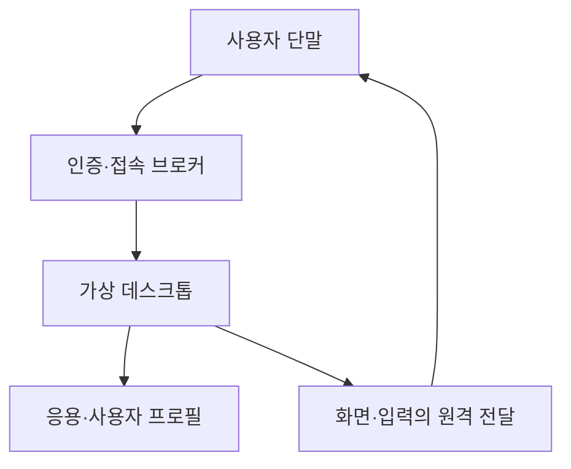
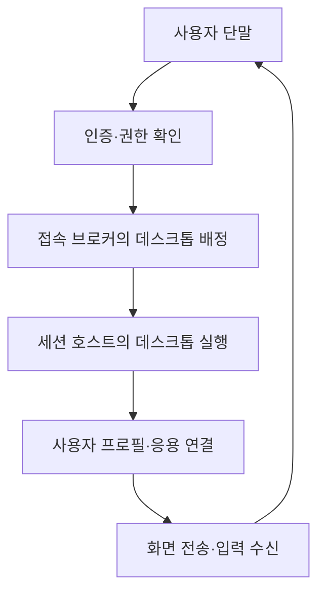

---
sidebar:
  order: 37
  label: "037. VDI"
  badge:
    text: "기초"
    variant: note
title: "VDI(가상 데스크톱 인프라)"
author: "Codex"
date: "2026-09-24T00:00:00+09:00"
tags:
  - "notes-computer-system"
weight: 37
extra:
  model: "GPT-6"
  keyword_grade: "기초"
  question_no: "037"
---

## 지식 로드맵 내 현재 위치

지식 위치: 컴퓨터 시스템 → 데스크톱 가상화 → **VDI**

## 30초 인출

- 본질: **VDI** : 서버·클라우드의 가상 데스크톱을 사용자의 단말에 원격으로 제공하는 인프라
- 메커니즘: 사용자 인증 → 접속 브로커가 데스크톱 배정 → 원격 화면·입력 전달 → 프로필·업무 데이터 저장

핵심 용어

- **VDI(Virtual Desktop Infrastructure, 가상 데스크톱 인프라)** : 서버 측 가상 데스크톱을 사용자 단말에 원격 제공하는 인프라
- **세션 호스트(Session Host)** : 원격 데스크톱 세션을 실행하는 서버 또는 가상머신
- **접속 브로커(Connection Broker)** : 인증된 사용자를 사용 가능한 데스크톱·세션 호스트에 연결하는 구성요소
- **사용자 프로필(User Profile)** : 사용자별 설정·개인화 정보를 담는 데이터
- **원격 디스플레이(Remote Display)** : 서버 측 화면과 사용자 입력을 네트워크로 전달하는 방식
- **풀(Pool)** : 여러 사용자에게 배정할 수 있는 데스크톱·세션 호스트의 집합

---

## 1교시 예상문제 (10점)

> VDI에 관하여 설명하시오. (예상·10점)

---

## 1교시 10점 답안

### Ⅰ. VDI의 개요

| 구분 | 핵심 |
|---|---|
| 정의 | **VDI** : 서버 측 가상 데스크톱을 사용자의 단말에 원격으로 제공하는 인프라 |
| 목적 | 사용자 작업 환경의 중앙 관리와 다양한 단말에서의 접근 지원 |

### Ⅱ. 접속 구조

- 제언: 가상머신 용량과 함께 접속 지연·프로필 로딩·업무 데이터 저장 위치를 시험.

---

## 2~4교시 예상문제 (25점)

> VDI의 구성과 사용자 접속 흐름을 설명하고, 데스크톱 배정 방식 및 운영상 한계·대응을 제시하시오. (예상·25점)

---

## 2~4교시 25점 답안

## Ⅰ. VDI의 개요

| 구분 | 핵심 |
|---|---|
| 정의 | **VDI** : 서버 측 가상 데스크톱을 사용자의 단말에 원격으로 제공하는 인프라 |
| 목적 | 사용자 작업 환경의 중앙 관리와 다양한 단말에서의 접근 지원 |

## Ⅱ. 사용자 접속 흐름

화면·입력은 원격으로 전달되지만 업무 데이터의 실제 저장 위치는 응용·프로필 설계에 따름.

## Ⅲ. 구성요소의 역할

| 구성요소 | 역할 | 운영 확인 |
|---|---|---|
| 접속 브로커 | 사용자와 데스크톱 연결 | 배정 정책·장애 시 재접속 |
| 세션 호스트 | 데스크톱·응용 실행 | CPU·메모리·동시 세션 |
| 사용자 프로필 저장소 | 사용자 설정·개인화 보관 | 로그인 시간·프로필 무결성 |
| 원격 접속 경로 | 화면·입력 전달 | 지연·대역폭·접속 통제 |

## Ⅳ. 데스크톱 배정 방식

| 방식 | 배정 관계 | 적합성 판단 |
|---|---|---|
| 전용형 | 사용자에게 정해진 데스크톱 배정 | 개인화·전용 환경 요구 |
| 풀형 | 이용 시 풀에서 사용 가능한 데스크톱 배정 | 공통 환경·자원 활용 요구 |

제품에 따라 다중 사용자 세션 제공 방식도 있으므로 전용 VM과 공유 세션의 차이를 서비스 구성에서 확인.

## Ⅴ. 운영 한계와 대응

| 한계 | 대응 |
|---|---|
| 네트워크 지연·단절이 사용자 경험에 영향 | 대표 업무의 접속·화면 반응 시험과 장애 대체 경로 |
| 로그인 집중 시 호스트·프로필 저장소 병목 | 동시 로그인 부하와 프로필 로딩 시간 측정 |
| 서버 집중에 따른 장애 영향 확대 | 브로커·호스트·프로필 저장소의 복구 경로 점검 |

## Ⅵ. 기술사적 제언

| 우선 제언 | 실행·확인 |
|---|---|
| 단말 수보다 실제 동시 이용 패턴으로 용량 산정 | 로그인 집중 시간과 응용별 CPU·메모리·네트워크 부하 측정 |
| 장애 시 사용자 작업 연속성 시험 | 세션 재접속 후 프로필·열린 업무의 복원 범위 확인 |

---

## 검증 출처

- [Microsoft Learn: Azure Virtual Desktop Architecture](https://learn.microsoft.com/en-us/azure/virtual-desktop/service-architecture-resilience)
- [Microsoft Learn: Azure Virtual Desktop Terminology](https://learn.microsoft.com/en-us/azure/virtual-desktop/environment-setup)

## 연결 토픽

- 연관 토픽: [클라우드 컴퓨팅](./013_cloud_computing.md), [SaaS](./036_saas.md)
