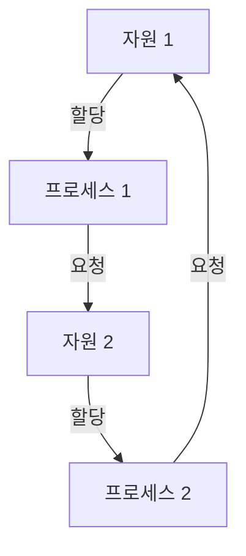

---
sidebar:
  order: 38
  label: "038. 교착상태"
  badge:
    text: "기초"
    variant: note
title: "교착상태(Deadlock)"
author: "Codex"
date: "2026-09-24T00:00:00+09:00"
tags:
  - "notes-computer-system"
weight: 38
extra:
  model: "GPT-6"
  keyword_grade: "기초"
  question_no: "038"
---

## 지식 로드맵 내 현재 위치

지식 위치: 컴퓨터 시스템 → 운영체제·자원 관리 → **교착상태**

## 30초 인출

- 본질: **교착상태** : 여러 프로세스가 서로 점유한 자원을 기다려 더 진행하지 못하는 상태
- 메커니즘: 자원 점유·추가 요청이 원형 대기를 형성 → 어느 프로세스도 필요한 자원을 얻지 못함

핵심 용어

- **교착상태(Deadlock)** : 둘 이상의 프로세스가 서로 필요한 자원을 기다려 진행할 수 없는 상태
- **상호 배제(Mutual Exclusion)** : 한 자원을 동시에 하나의 실행 주체만 사용할 수 있는 조건
- **점유와 대기(Hold and Wait)** : 이미 가진 자원을 놓지 않고 다른 자원을 기다리는 조건
- **비선점(No Preemption)** : 점유 중인 자원을 강제로 회수할 수 없는 조건
- **원형 대기(Circular Wait)** : 실행 주체들이 고리 형태로 서로의 자원을 기다리는 조건
- **자원 할당 그래프(Resource Allocation Graph, RAG)** : 프로세스의 자원 요청·할당 관계를 나타낸 그래프
- **안전 상태(Safe State)** : 모든 프로세스를 완료할 수 있는 순서가 적어도 하나 존재하는 자원 할당 상태

---

## 1교시 예상문제 (10점)

> 교착상태에 관하여 설명하시오. (예상·10점)

---

## 1교시 10점 답안

### Ⅰ. 교착상태의 개요

| 구분 | 핵심 |
|---|---|
| 정의 | **교착상태** : 프로세스들이 서로 점유한 자원을 기다려 진행하지 못하는 상태 |
| 목적 | 발생 조건의 파악과 실행 정지를 줄일 자원 관리 방식 선택 |

### Ⅱ. 자원 대기의 고리

- 제언: 자원 획득 순서를 통일할 수 있는지 먼저 확인하고, 불가하면 탐지·회복 경로 마련.

---

## 2~4교시 예상문제 (25점)

> 교착상태의 발생 조건과 대응 방법을 설명하고, 각 방법의 적용 한계와 운영 방안을 제시하시오. (예상·25점)

---

## 2~4교시 25점 답안

## Ⅰ. 교착상태의 개요

| 구분 | 핵심 |
|---|---|
| 정의 | **교착상태** : 프로세스들이 서로 점유한 자원을 기다려 진행하지 못하는 상태 |
| 목적 | 발생 조건의 파악과 실행 정지를 줄일 자원 관리 방식 선택 |

## Ⅱ. 자원 할당과 원형 대기

자원별 인스턴스가 하나인 경우 이 자원 할당 그래프의 사이클은 교착상태를 나타냄. 자원 인스턴스가 여러 개인 경우 사이클만으로 확정할 수 없음.

## Ⅲ. 네 가지 필요 조건

| 조건 | 교착상태와의 관계 |
|---|---|
| 상호 배제 | 자원을 동시에 공유할 수 없는 상태 |
| 점유와 대기 | 가진 자원을 유지한 채 다른 자원을 요청 |
| 비선점 | 점유 자원을 강제로 회수할 수 없음 |
| 원형 대기 | 요청·점유 관계가 고리 형성 |

네 조건이 동시에 성립해야 교착상태가 발생할 수 있음. 조건 하나를 제거하는 방식은 예방의 근거.

## Ⅳ. 대응 방법

| 방법 | 핵심 작동 | 대가·전제 |
|---|---|---|
| 예방 | 필요 조건 중 하나 제거 | 자원 이용률·동시성 제약 가능 |
| 회피 | 요청 승인 전에 안전 상태 유지 확인 | 최대 요구량 등 사전 정보 필요 |
| 탐지·회복 | 발생 상태를 찾아 종료·회수·롤백 | 탐지 비용과 작업 손실 |

회피는 모든 교착상태를 사후에 찾아내는 탐지 방식과 구별.

## Ⅴ. 적용 한계와 대응

| 한계 | 대응 |
|---|---|
| 모든 자원을 한 번에 요청하도록 강제하면 이용률 저하 | 자원 획득 순서 통일 가능성부터 검토 |
| 최대 자원 요구량을 알기 어려워 회피 적용 곤란 | 탐지 주기와 회복 정책을 설계 |
| 회복 시 작업 결과가 일부만 반영될 수 있음 | 롤백·재시도 가능 구간과 데이터 정합성 시험 |

## Ⅵ. 기술사적 제언

| 우선 제언 | 실행·확인 |
|---|---|
| 업무의 자원 획득 순서를 우선 분석 | 공유 자원 잠금 순서를 문서화하고 반대 순서의 경합 시험 |
| 순서 통일이 어려운 경로에는 복구 기준 마련 | 대기 시간·탐지 조건과 중단·재시도 대상을 정해 장애 주입 검증 |

---

## 검증 출처

- Abraham Silberschatz, Peter Baer Galvin, Greg Gagne, *Operating System Concepts*, Deadlocks
- [MIT OpenCourseWare, 프로세스 동기화와 교착상태](https://live.ocw.mit.edu/courses/6-004-computation-structures-spring-2017/pages/c19/c19s1/).

## 연결 토픽

- 연관 토픽: [은행원 알고리즘](./002_bankers_algorithm.md), [프로세스 동기화](./122_process_synchronization.md)
