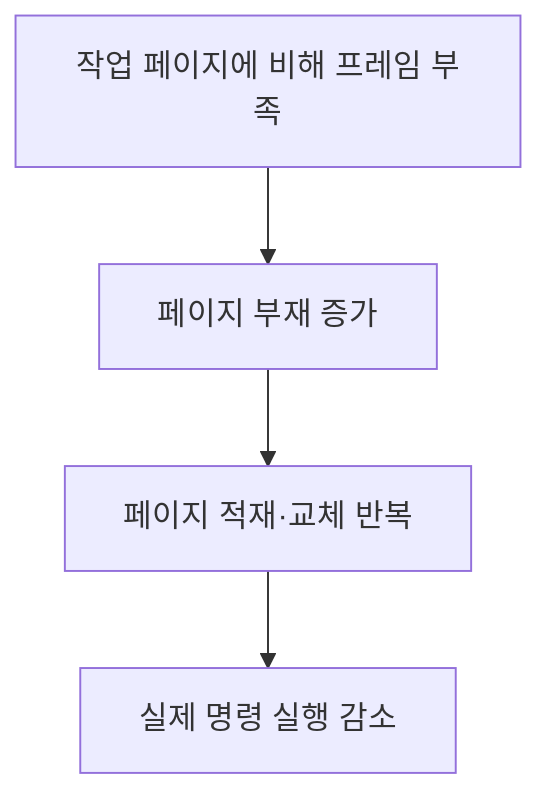
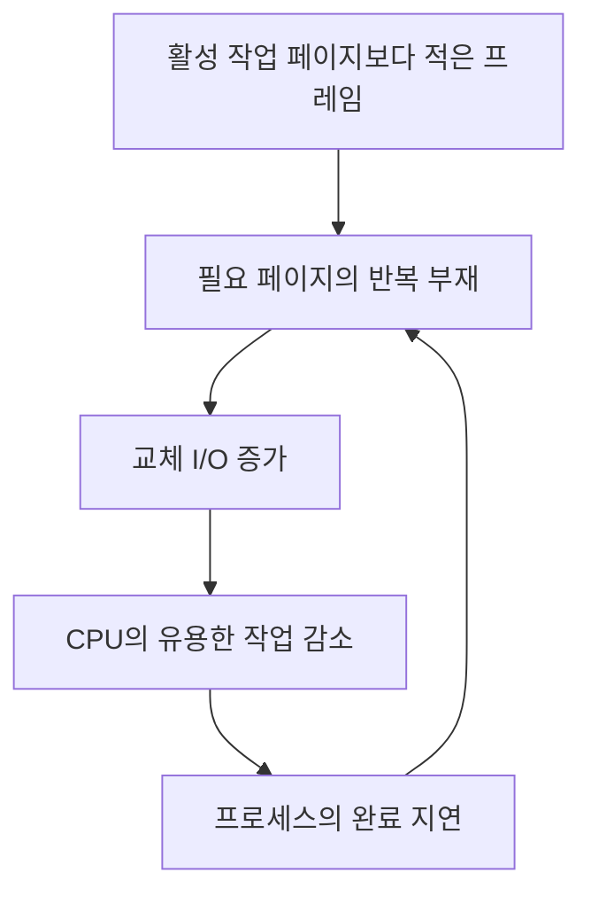

---
sidebar:
  order: 39
  label: "039. 스래싱"
  badge:
    text: "기초"
    variant: note
title: "스래싱(Thrashing)"
author: "Codex"
date: "2026-09-24T00:00:00+09:00"
tags:
  - "notes-computer-system"
weight: 39
extra:
  model: "GPT-6"
  keyword_grade: "기초"
  question_no: "039"
---

## 지식 로드맵 내 현재 위치

지식 위치: 컴퓨터 시스템 → 가상 메모리 → **스래싱**

## 30초 인출

- 본질: **스래싱** : 필요한 페이지가 메모리에 머물지 못해 페이지 교체에 시간을 대부분 쓰는 상태
- 메커니즘: 프로세스의 작업 페이지에 비해 프레임 부족 → 페이지 부재·교체 반복 → 실제 명령 실행 감소

핵심 용어

- **스래싱(Thrashing)** : 빈번한 페이지 부재·교체로 유용한 프로그램 실행이 크게 줄어드는 상태
- **페이지 부재(Page Fault)** : 참조한 가상 페이지가 현재 메모리에 없어 적재가 필요한 사건
- **프레임(Frame)** : 물리 메모리에서 페이지를 담는 고정 크기 단위
- **워킹셋(Working Set)** : 일정한 최근 참조 구간에서 프로세스가 사용한 페이지 집합
- **PFF(Page Fault Frequency, 페이지 부재 빈도)** : 일정 기간 페이지 부재가 발생하는 빈도
- **다중 프로그래밍 정도(Degree of Multiprogramming)** : 동시에 메모리를 요구하며 실행되는 프로세스의 수

---

## 1교시 예상문제 (10점)

> 스래싱에 관하여 설명하시오. (예상·10점)

---

## 1교시 10점 답안

### Ⅰ. 스래싱의 개요

| 구분 | 핵심 |
|---|---|
| 정의 | **스래싱** : 페이지 부재·교체가 반복되어 실제 프로그램 실행이 크게 줄어드는 상태 |
| 목적 | 작업 페이지 부족을 판별해 프레임 할당과 실행 프로세스 수 조정 |

### Ⅱ. 발생 흐름

- 제언: CPU 사용률만 보지 말고 페이지 부재와 교체 I/O를 함께 확인.

---

## 2~4교시 예상문제 (25점)

> 스래싱의 원인과 발생 과정을 설명하고, 워킹셋·페이지 부재 빈도를 이용한 대응과 한계를 제시하시오. (예상·25점)

---

## 2~4교시 25점 답안

## Ⅰ. 스래싱의 개요

| 구분 | 핵심 |
|---|---|
| 정의 | **스래싱** : 페이지 부재·교체가 반복되어 실제 프로그램 실행이 크게 줄어드는 상태 |
| 목적 | 작업 페이지 부족을 판별해 프레임 할당과 실행 프로세스 수 조정 |

## Ⅱ. 페이지 교체의 악순환

항상 프로세스 수만이 원인은 아님. 프로세스별 작업 집합의 크기 변화나 프레임 배분도 영향을 줌.

## Ⅲ. 관찰할 지표

| 관찰 대상 | 스래싱 의심 신호 | 함께 확인할 점 |
|---|---|---|
| 페이지 부재·교체 | 빈도와 교체 I/O 급증 | 정상적인 일시적 적재와 구분 |
| CPU 유용 작업 | 처리량 감소 | 다른 I/O 병목 가능성 |
| 활성 워킹셋 | 할당 프레임보다 큰 참조 범위 | 프로세스별·전체 메모리 요구 |

단일 CPU 사용률 값만으로 스래싱을 확정할 수 없음.

## Ⅳ. 대응 방법

| 방법 | 작동 원리 | 적용 조건 |
|---|---|---|
| 워킹셋 기준 배분 | 최근 참조 페이지 집합에 맞춰 프레임 확보 | 메모리 수요의 관찰 가능성 |
| PFF 기반 조정 | 부재 빈도가 높을 때 프레임 추가 검토 | 가용 프레임 존재 |
| 다중 프로그래밍 정도 축소 | 일부 프로세스를 잠시 중지해 나머지에 프레임 제공 | 전체 워킹셋이 물리 메모리 초과 |

워킹셋은 최근 참조한 페이지 집합, PFF는 페이지 부재의 측정 지표로 역할이 다름.

## Ⅴ. 한계와 대응

| 한계 | 대응 |
|---|---|
| 일시적 페이지 부재를 스래싱으로 오판 | 일정 시간의 부재율·처리량·교체량 함께 확인 |
| 메모리 총량보다 활성 워킹셋 합계가 큼 | 동시 실행 수 축소 또는 메모리 용량 재검토 |
| 프레임 추가만으로 다른 I/O 병목 해결 불가 | 디스크·스토리지 지연과 페이지 교체 I/O 분리 관찰 |

## Ⅵ. 기술사적 제언

| 우선 제언 | 실행·확인 |
|---|---|
| 처리량 감소가 생긴 시점의 메모리 압박부터 검증 | 프로세스별 워킹셋·PFF와 교체 I/O의 동시 변화 기록 |
| 스래싱으로 확인되면 동시 실행 수 조정 시험 | 실행 수 감소 전후 처리량과 완료시간 비교 |

---

## 검증 출처

- Abraham Silberschatz, Peter Baer Galvin, Greg Gagne, *Operating System Concepts*, Virtual Memory
- [MIT OpenCourseWare, 가상 메모리와 스래싱](https://ocw.mit.edu/courses/6-004-computation-structures-spring-2017/pages/c16/c16s1/).

## 연결 토픽

- 연관 토픽: [가상 메모리](./023_virtual_memory.md), [메모리 단편화](./033_fragmentation.md)
