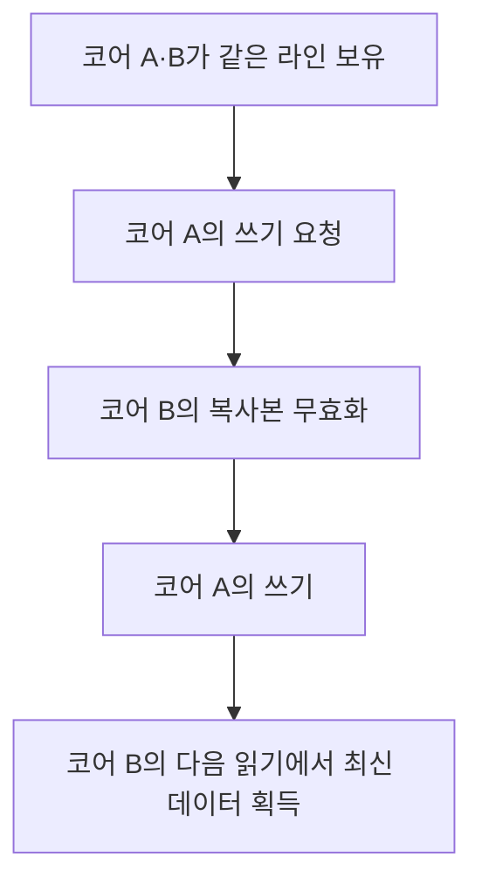
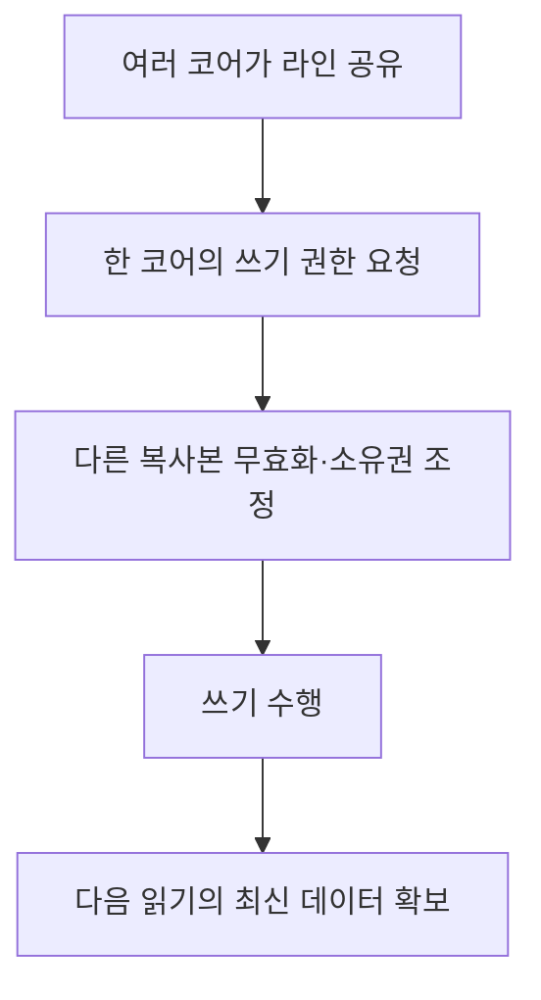

---
sidebar:
  order: 40
  label: "040. 캐시 일관성"
  badge:
    text: "기초"
    variant: note
title: "캐시 일관성(Cache Coherence)"
author: "Codex"
date: "2026-09-24T00:00:00+09:00"
tags:
  - "notes-computer-system"
weight: 40
extra:
  model: "GPT-6"
  keyword_grade: "기초"
  question_no: "040"
---

## 지식 로드맵 내 현재 위치

지식 위치: 컴퓨터 시스템 → 멀티코어 메모리 → **캐시 일관성**

## 30초 인출

- 본질: **캐시 일관성** : 여러 코어가 같은 메모리 위치를 캐시에 둬도 서로 모순된 값을 계속 사용하지 않게 하는 성질
- 메커니즘: 한 코어의 쓰기 권한 획득 → 다른 캐시의 해당 라인 무효화·상태 변경 → 다음 읽기에서 최신 값 확보

핵심 용어

- **캐시 일관성(Cache Coherence)** : 공유 주소의 여러 캐시 복사본을 정해진 규칙으로 관리하는 성질
- **캐시 라인(Cache Line)** : 캐시가 데이터를 옮기고 상태를 관리하는 기본 블록
- **MESI(Modified, Exclusive, Shared, Invalid)** : 캐시 라인의 수정·독점·공유·무효 상태를 구별하는 대표 일관성 프로토콜
- **무효화(Invalidation)** : 다른 코어가 쓰기 권한을 얻을 때 기존 복사본을 사용할 수 없게 하는 처리
- **스누핑(Snooping)** : 공유 요청을 관련 캐시가 관찰하여 일관성 상태를 갱신하는 방식
- **디렉터리(Directory)** : 캐시 라인의 보유자를 추적해 필요한 노드에 일관성 메시지를 보내는 방식
- **메모리 일관성 모델(Memory Consistency Model)** : 서로 다른 주소의 읽기·쓰기 순서가 프로그램에 어떻게 보이는지 정하는 규칙
- **거짓 공유(False Sharing)** : 독립 변수들이 같은 캐시 라인에 있어 불필요한 일관성 통신이 생기는 현상

---

## 1교시 예상문제 (10점)

> 캐시 일관성에 관하여 설명하시오. (예상·10점)

---

## 1교시 10점 답안

### Ⅰ. 캐시 일관성의 개요

| 구분 | 핵심 |
|---|---|
| 정의 | **캐시 일관성** : 여러 코어의 공유 메모리 복사본을 모순 없이 관리하는 성질 |
| 목적 | 한 코어의 변경을 다른 코어가 올바르게 관찰할 수 있는 캐시 상태 유지 |

### Ⅱ. 쓰기 시 복사본 갱신

- 제언: 공유 데이터의 성능 저하를 볼 때 값의 정확성뿐 아니라 캐시 라인 이동·무효화 빈도 확인.

---

## 2~4교시 예상문제 (25점)

> 캐시 일관성의 필요성과 대표 유지 방식을 설명하고, MESI 상태·거짓 공유 및 적용상 한계·대응을 제시하시오. (예상·25점)

---

## 2~4교시 25점 답안

## Ⅰ. 캐시 일관성의 개요

| 구분 | 핵심 |
|---|---|
| 정의 | **캐시 일관성** : 여러 코어의 공유 메모리 복사본을 모순 없이 관리하는 성질 |
| 목적 | 한 코어의 변경을 다른 코어가 올바르게 관찰할 수 있는 캐시 상태 유지 |

## Ⅱ. 공유 라인의 쓰기 경로

라인 단위의 소유권·유효성 관리가 핵심이며, 모든 구현이 같은 메시지나 순서를 쓰는 것은 아님.

## Ⅲ. 대표 상태 모델: MESI

| 상태 | 의미 | 쓰기와의 관계 |
|---|---|---|
| Modified | 이 캐시에 수정된 데이터 보유 | 다른 복사본과 소유권 조정 필요 |
| Exclusive | 이 캐시가 깨끗한 복사본을 단독 보유 | 로컬 쓰기 전환 가능 |
| Shared | 여러 캐시가 깨끗한 복사본 공유 | 쓰기 권한 획득 시 타 복사본 조정 |
| Invalid | 사용할 수 없는 복사본 | 다시 읽을 때 데이터 획득 필요 |

MESI는 대표 모델이며 프로세서별 실제 프로토콜은 추가 상태와 최적화를 포함할 수 있음.

## Ⅳ. 일관성 메시지 전달 방식

| 방식 | 보유 캐시 확인 | 주요 고려 사항 |
|---|---|---|
| 스누핑 | 공유 요청을 여러 캐시가 관찰 | 요청 전파량·연결 구조 |
| 디렉터리 기반 | 보유자를 추적해 필요한 곳에 전달 | 디렉터리 저장·조회 비용 |

두 방식 모두 캐시 라인 상태를 맞추기 위한 방법. 서로 다른 주소의 전체 메모리 접근 순서를 정하는 메모리 일관성 모델과는 구별.

## Ⅴ. 적용 한계와 대응

| 한계 | 대응 |
|---|---|
| 공유 라인 쓰기가 잦아 무효화 통신 증가 | 쓰기 공유 데이터의 배치·접근 패턴 조정 |
| 서로 다른 변수가 한 라인을 공유하는 거짓 공유 | 변수 배치·정렬 변경 전후 캐시 통신 측정 |
| 캐시 일관성만으로 스레드 간 실행 순서 보장 불가 | 원자 연산·잠금·메모리 순서 규칙 사용 |

## Ⅵ. 기술사적 제언

| 우선 제언 | 실행·확인 |
|---|---|
| 병렬 처리 병목을 단순 캐시 용량 부족으로 단정하지 않기 | 같은 라인의 쓰기·무효화와 실제 경합 위치 측정 |
| 거짓 공유가 확인된 경우 자료 배치 변경 | 변경 전후 라인 이동과 업무 처리량 비교 |

---

## 검증 출처

- [Intel: Faster Core-to-Core Communications](https://www.intel.com/content/www/us/en/developer/articles/technical/fast-core-to-core-communications.html)
- [Arm: Cache Coherency White Paper](https://developer.arm.com/-/media/Arm%20Developer%20Community/PDF/CacheCoherencyWhitepaper_6June2011.pdf?revision=e5a82cb4-0f87-4f5c-91cf-52b33a5cd1da)

## 연결 토픽

- 연관 토픽: [CXL 메모리 풀링](./026_cxl_4_0_memory_pooling.md), [프로세스 동기화](./122_process_synchronization.md)
