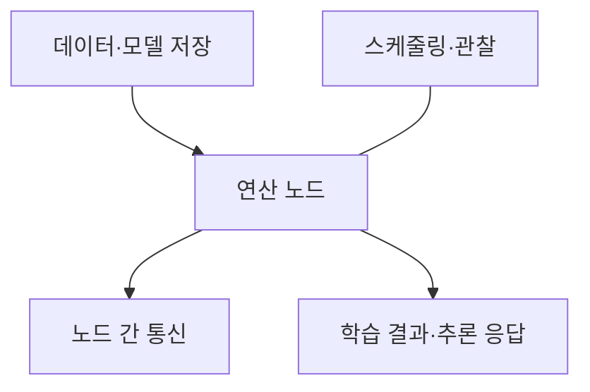
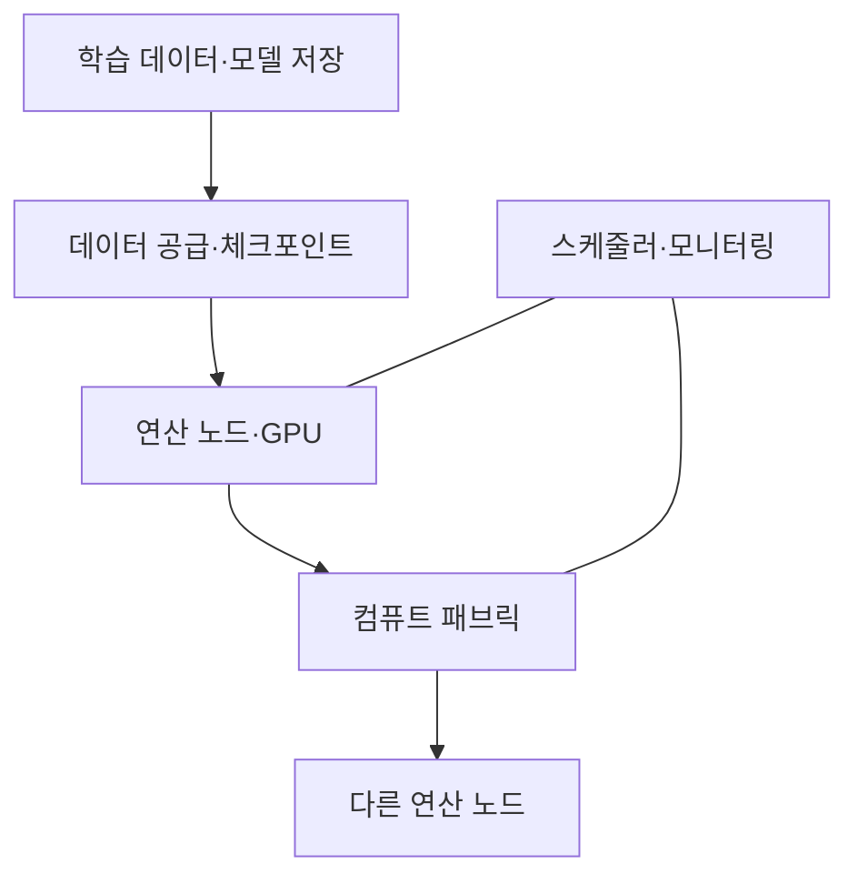

---
sidebar:
  order: 41
  label: "041. AI 학습·추론 인프라"
  badge:
    text: "서브"
    variant: note
title: "AI 학습·추론 고성능 컴퓨팅 인프라"
author: "Codex"
date: "2026-09-24T00:00:00+09:00"
tags:
  - "notes-computer-system"
weight: 41
extra:
  model: "GPT-6"
  keyword_grade: "서브"
  question_no: "041"
---

## 지식 로드맵 내 현재 위치

지식 위치: 컴퓨터 시스템 → AI 컴퓨팅 → **학습·추론 인프라**

## 30초 인출

- 본질: **AI 학습·추론 인프라** : 모델 학습과 요청 처리를 위해 연산·통신·저장·운영 자원을 함께 구성한 컴퓨팅 환경
- 메커니즘: 데이터를 연산 장치에 공급 → 학습 시 노드 간 결과 교환·모델 갱신, 추론 시 요청 처리·응답 제공 → 성능과 장애 상태 관찰

핵심 용어

- **AI 컴퓨팅 인프라(AI Computing Infrastructure)** : AI 작업에 필요한 연산·네트워크·저장·운영 자원의 결합
- **GPU(Graphics Processing Unit)** : 병렬 계산을 처리하는 연산 장치
- **컴퓨트 패브릭(Compute Fabric)** : 여러 연산 노드가 데이터를 주고받는 네트워크
- **집합 통신(Collective Communication)** : 분산 학습 참여 노드가 기울기 등 계산 결과를 모으고 공유하는 통신
- **체크포인트(Checkpoint)** : 학습 중 모델·옵티마이저 상태 등을 기록해 재시작에 쓰는 저장 지점
- **추론 지연(Inference Latency)** : 입력 요청부터 결과 반환까지 걸리는 시간
- **스케줄러(Scheduler)** : 작업을 사용할 수 있는 연산 자원에 배치하는 소프트웨어

---

## 1교시 예상문제 (10점)

> AI 학습·추론 고성능 컴퓨팅 인프라에 관하여 설명하시오. (예상·10점)

---

## 1교시 10점 답안

### Ⅰ. AI 학습·추론 인프라의 개요

| 구분 | 핵심 |
|---|---|
| 정의 | **AI 학습·추론 인프라** : 연산·통신·저장·운영 자원을 결합해 모델 학습과 요청 처리를 지원하는 환경 |
| 목적 | 학습 처리량과 추론 응답 목표를 안정적으로 충족 |

### Ⅱ. 자원의 관계

- 제언: 장치 수보다 대표 학습·추론 작업의 연산·통신·저장 병목을 먼저 측정.

---

## 2~4교시 예상문제 (25점)

> AI 학습·추론 고성능 컴퓨팅 인프라의 구성과 작업별 병목을 설명하고, 운영상 한계·대응을 제시하시오. (예상·25점)

---

## 2~4교시 25점 답안

## Ⅰ. AI 학습·추론 인프라의 개요

| 구분 | 핵심 |
|---|---|
| 정의 | **AI 학습·추론 인프라** : 연산·통신·저장·운영 자원을 결합해 모델 학습과 요청 처리를 지원하는 환경 |
| 목적 | 학습 처리량과 추론 응답 목표를 안정적으로 충족 |

## Ⅱ. 연산·통신·저장 구조

데이터 공급, 노드 계산, 노드 간 통신, 결과 저장이 끊기지 않는 균형이 핵심. 특정 GPU·연결 제품은 한 구현 선택.

## Ⅲ. 학습과 추론의 요구 차이

| 비교 축 | 학습 | 추론 |
|---|---|---|
| 주된 작업 | 데이터로 모델 파라미터 갱신 | 입력에 대한 모델 결과 생성 |
| 성능 목표 | 완료 시간·처리량·확장 효율 | 요청 지연·처리량·가용성 |
| 자원 병목 | 연산·집합 통신·데이터 공급 | 모델 적재·메모리·요청 동시성 |
| 상태 관리 | 체크포인트·재시작 | 모델 버전·서비스 배포·복구 |

같은 장비라도 작업 크기와 응답 목표에 따라 적합한 배치가 달라짐.

## Ⅳ. 병목 진단

| 구간 | 관찰 지표 | 판단 |
|---|---|---|
| 데이터 공급 | 입력 대기·저장 읽기 속도 | 연산 장치가 데이터 대기로 쉬는지 |
| 연산 | 장치 사용률·메모리 부족 | 계산·모델 크기 제약 여부 |
| 통신 | 집합 통신 대기·노드별 완료 시간 | 느린 노드나 네트워크 정체 여부 |
| 추론 제공 | 요청 지연·대기열·오류율 | 부하 증가 시 응답 목표 유지 여부 |

한 지표만 높여 전체 성능이 선형적으로 늘어난다고 가정하지 않음.

## Ⅴ. 운영 한계와 대응

| 한계 | 대응 |
|---|---|
| 연산 장치 증설 후 통신·저장이 병목 | 대표 워크로드의 구간별 대기 시간 측정 |
| 일부 노드가 느려 분산 학습 전체가 대기 | 노드별 작업·통신 지표로 원인 분리 |
| 학습 인프라와 추론 서비스의 목표 혼동 | 학습 처리량과 추론 지연·가용성을 별도 검증 |

## Ⅵ. 기술사적 제언

| 우선 제언 | 실행·확인 |
|---|---|
| 구매 규격보다 업무 워크로드를 먼저 확정 | 모델 크기·데이터 크기·동시 요청으로 학습·추론 시험 구성 |
| 증설 전 가장 느린 구간을 찾아 투자 | 연산·통신·저장별 대기시간과 개선 후 전체 완료시간 비교 |

---

## 검증 출처

- [NVIDIA DGX SuperPOD Architecture](https://docs.nvidia.com/dgx-superpod/reference-architecture/scalable-infrastructure-h200/latest/dgx-superpod-architecture.html)
- [NVIDIA DGX SuperPOD Components](https://docs.nvidia.com/dgx-superpod/reference-architecture/scalable-infrastructure-h200/latest/dgx-superpod-components.html)

## 연결 토픽

- 연관 토픽: [GPU](./020_gpu.md), [멀티 GPU 분산 학습](./095_multi_gpu_distributed_training.md)
