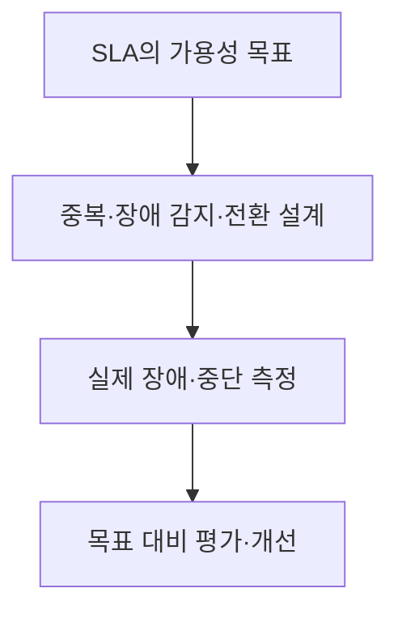
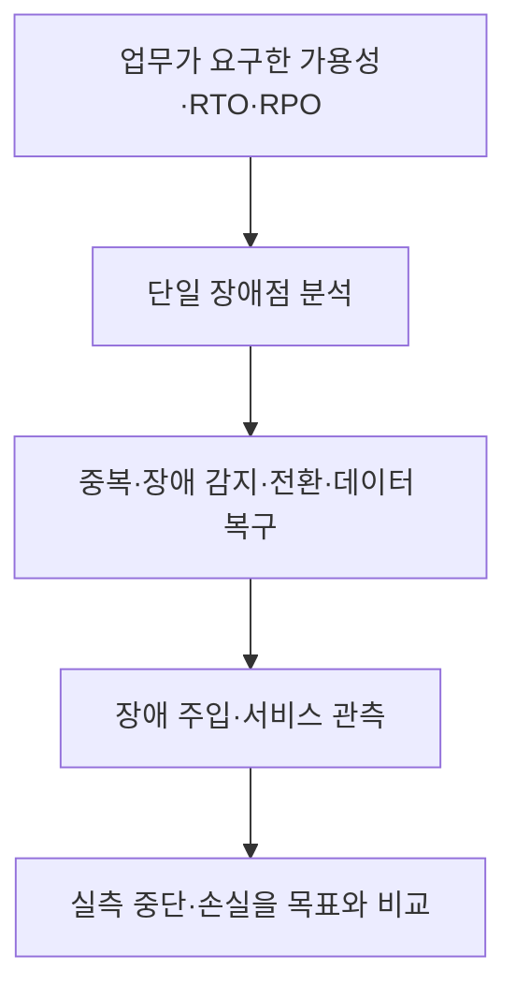

---
sidebar:
  order: 42
  label: "042. 가용성 보장·HA"
  badge:
    text: "서브"
    variant: note
title: "가용성 보장과 고가용성(HA)"
author: "Codex"
date: "2026-09-24T00:00:00+09:00"
tags:
  - "notes-computer-system"
weight: 42
extra:
  model: "GPT-6"
  keyword_grade: "서브"
  question_no: "042"
---

## 지식 로드맵 내 현재 위치

지식 위치: 컴퓨터 시스템 → 고가용성 운영 → **가용성 보장**

## 30초 인출

- 본질: **가용성 보장** : 서비스가 약속한 기간에 필요한 기능을 제공하도록 목표·구조·측정·복구를 함께 관리하는 활동
- 메커니즘: 가용성 목표 설정 → 단일 장애점 완화·장애 감지·전환 → 실제 중단과 복구 결과 측정

핵심 용어

- **HA(High Availability, 고가용성)** : 구성요소 장애에도 서비스 중단을 줄이도록 중복·전환·복구를 설계한 특성
- **가용성(Availability)** : 정해진 기간에 서비스가 필요한 기능을 사용할 수 있는 상태의 비율
- **SLA(Service Level Agreement, 서비스 수준 협약)** : 제공자와 이용자가 측정 목표·책임·조치 등을 합의한 약속
- **SPOF(Single Point of Failure, 단일 장애점)** : 한 구성요소의 고장만으로 서비스 전체가 멈출 수 있는 지점
- **MTBF(Mean Time Between Failures, 평균 고장 간격)** : 수리 가능한 시스템의 고장 사이 평균 운영 시간
- **MTTR(Mean Time to Repair/Recover, 평균 복구 시간)** : 여러 장애에서 측정한 평균 복구 소요시간
- **RTO(Recovery Time Objective, 복구시간목표)** : 장애 후 서비스 복구까지 허용하는 최대 시간 목표
- **RPO(Recovery Point Objective, 복구시점목표)** : 장애 시 허용하는 데이터 손실 시점의 목표

---

## 1교시 예상문제 (10점)

> 서비스 가용성 보장에 관하여 설명하시오. (예상·10점)

---

## 1교시 10점 답안

### Ⅰ. 가용성 보장의 개요

| 구분 | 핵심 |
|---|---|
| 정의 | **가용성 보장** : 서비스의 목표 가용성을 위해 중복·전환·측정·복구를 관리하는 활동 |
| 목적 | 장애와 복구 과정의 서비스 중단을 합의한 수준 이내로 관리 |

### Ⅱ. 목표와 운영 구조

- 제언: 가용성 비율 외에 RTO·RPO를 함께 정하고 장애 전환·데이터 복구를 따로 시험.

---

## 2~4교시 예상문제 (25점)

> 서비스 가용성 보장의 구조와 측정 지표를 설명하고, HA 설계와 RTO·RPO의 관계 및 운영상 한계·대응을 제시하시오. (예상·25점)

---

## 2~4교시 25점 답안

## Ⅰ. 가용성 보장의 개요

| 구분 | 핵심 |
|---|---|
| 정의 | **가용성 보장** : 서비스의 목표 가용성을 위해 중복·전환·측정·복구를 관리하는 활동 |
| 목적 | 장애와 복구 과정의 서비스 중단을 합의한 수준 이내로 관리 |

## Ⅱ. 목표·설계·검증의 관계

중복 장비만 추가해도 서비스가 유지되는 것은 아님. 장애 감지, 전환, 상태 일치, 이용자 관점의 기능 확인까지 필요.

## Ⅲ. 지표의 역할

| 지표 | 의미 | 서로 다른 질문 |
|---|---|---|
| 가용성 | 정해진 기간에 서비스가 사용 가능했던 비율 | 목표 기간의 실제 제공 비율 |
| MTBF·MTTR | 평균 고장 간격과 평균 복구 시간 | 평균 고장·복구 특성 |
| RTO | 한 장애 뒤 허용하는 최대 복구 시간 목표 | 서비스 복구 허용 시간 |
| RPO | 허용 가능한 데이터 손실 시점 목표 | 보존해야 할 데이터 시점 |
| SLA | 측정 목표와 제공·이용 조건의 합의 | 약속한 목표와 판정 방식 |

평균인 MTTR과 최대 허용 목표인 RTO는 동일하지 않음. MTBF/(MTBF+MTTR)은 특정 수리 가능한 시스템의 장기 가용도 추정식이며 실제 서비스 SLA 판정의 만능 공식은 아님.

## Ⅳ. HA와 재해 복구의 역할

| 상황 | 우선 구조 | 확인 목표 |
|---|---|---|
| 단일 장비·노드 장애 | 중복·자동 전환 중심의 HA | 이용자 기능 중단과 전환 시간 |
| 광역 장애·데이터 손실 | 백업·복제·재해 복구 | 업무별 RTO·RPO |
| 공통 의존성 장애 | 전원·네트워크·인증·저장 경로 분석 | 중복 구조의 실제 독립성 |

HA가 있어도 광역 장애나 데이터 손실의 RPO가 자동으로 0이 되지 않음.

## Ⅴ. 운영 한계와 대응

| 한계 | 대응 |
|---|---|
| 장비는 이중화했지만 인증·저장 등 공통 의존성이 남음 | 서비스 호출 경로 전체에서 SPOF 확인 |
| 가용성 비율만 보고 데이터 손실 위험을 빠뜨림 | 업무별 RTO·RPO를 별도로 정의·시험 |
| 장애 전환 시험 없이 목표 달성 단정 | 실제 장애 주입 후 사용자 기능·중단·데이터 상태 측정 |

## Ⅵ. 기술사적 제언

| 우선 제언 | 실행·확인 |
|---|---|
| 가장 중요한 업무 경로의 가용성부터 검증 | 사용자 요청에서 공통 의존성과 전환 지점을 따라 장애 주입 |
| SLA와 복구 목표의 측정 책임 확정 | 중단 시간·MTTR·RTO·RPO의 측정 시점과 판정 자료 기록 |

---

## 검증 출처

- [AWS Well-Architected: Availability](https://docs.aws.amazon.com/wellarchitected/latest/reliability-pillar/availability.html)
- [AWS Well-Architected: DR Objectives](https://docs.aws.amazon.com/wellarchitected/latest/reliability-pillar/disaster-recovery-dr-objectives.html)

## 연결 토픽

- 연관 토픽: [고가용성](./021_ha.md), [결함허용시스템](./031_fts.md)
