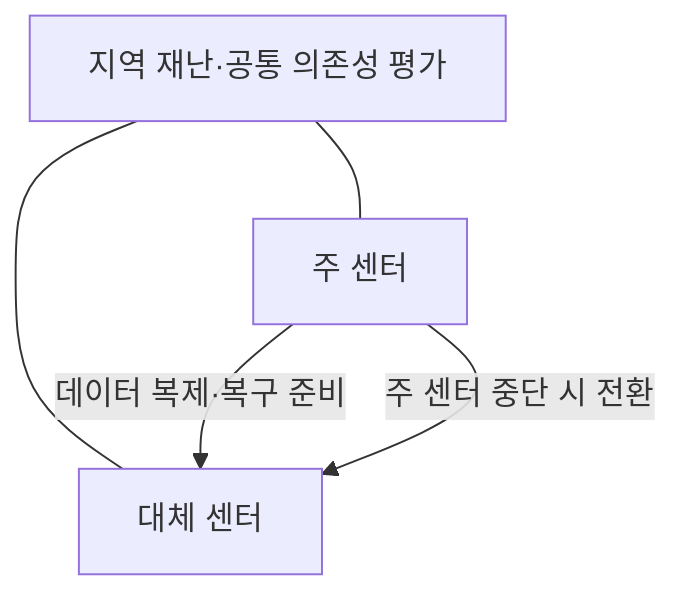
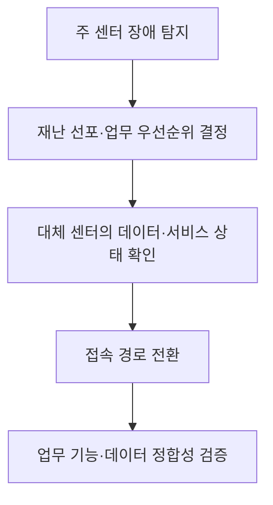

---
sidebar:
  order: 43
  label: "043. 데이터센터 입지·재난 대응"
  badge:
    text: "서브"
    variant: note
title: "데이터센터 입지와 재난 대응"
author: "Codex"
date: "2026-09-24T00:00:00+09:00"
tags:
  - "notes-computer-system"
weight: 43
extra:
  model: "GPT-6"
  keyword_grade: "서브"
  question_no: "043"
---

## 지식 로드맵 내 현재 위치

지식 위치: 컴퓨터 시스템 → 데이터센터 연속성 → **입지·재난 대응**

## 30초 인출

- 본질: **데이터센터 입지·재난 대응** : 주 센터와 대체 센터가 같은 재난에 함께 중단될 위험을 줄이고 업무를 복구하도록 장소·자원·절차를 설계하는 활동
- 메커니즘: 지역별 재난·공통 의존성 평가 → 대체 거점·데이터 복제 준비 → 재난 선포·서비스 전환·복구 시험

핵심 용어

- **대체 센터(Alternate Site)** : 주 센터가 사용할 수 없을 때 정보시스템 기능을 복구할 장소
- **지리적 이격(Geographic Separation)** : 같은 지역 재난의 동시 영향을 줄이도록 주·대체 센터를 분리하는 배치
- **공통 원인 장애(Common-Cause Failure)** : 주·대체 센터가 공유하는 전력·통신·공급망 등의 장애로 함께 실패하는 상황
- **BCP(Business Continuity Plan, 업무연속성계획)** : 중단 중 핵심 업무를 유지·복구하기 위한 조직의 계획
- **RTO(Recovery Time Objective, 복구시간목표)** : 중단 후 업무 복구까지 허용하는 최대 시간
- **RPO(Recovery Point Objective, 복구시점목표)** : 장애 시 허용하는 데이터 손실 시점의 목표

---

## 1교시 예상문제 (10점)

> 데이터센터 입지와 재난 대응에 관하여 설명하시오. (예상·10점)

---

## 1교시 10점 답안

### Ⅰ. 입지·재난 대응의 개요

| 구분 | 핵심 |
|---|---|
| 정의 | **데이터센터 입지·재난 대응** : 주·대체 센터의 동시 중단 위험을 줄이고 업무 복구를 준비하는 활동 |
| 목적 | 지역 재난 시 핵심 업무의 RTO·RPO 달성 |

### Ⅱ. 주 센터와 대체 센터의 관계

- 제언: 거리 자체보다 같은 재난·전력·통신 장애에 동시에 노출되는지 먼저 확인.

---

## 2~4교시 예상문제 (25점)

> 데이터센터 주·대체 거점의 입지 위험과 재난 대응 구조를 설명하고, RTO·RPO 관점의 한계·대응을 제시하시오. (예상·25점)

---

## 2~4교시 25점 답안

## Ⅰ. 입지·재난 대응의 개요

| 구분 | 핵심 |
|---|---|
| 정의 | **데이터센터 입지·재난 대응** : 주·대체 센터의 동시 중단 위험을 줄이고 업무 복구를 준비하는 활동 |
| 목적 | 지역 재난 시 핵심 업무의 RTO·RPO 달성 |

## Ⅱ. 같은 재난에 대한 노출 평가

| 위험 범위 | 주·대체 센터에서 확인할 점 |
|---|---|
| 자연재해 | 홍수·지진·산불 등 동일 영향권 여부 |
| 전력 | 수전 계통·변전소·연료 공급의 독립성 |
| 통신 | 회선 경로·사업자·관로의 공통 장애점 |
| 접근·운영 | 재난 시 인력·장비가 대체 거점에 도달 가능한지 |

고정 거리만으로 분리 효과를 판정할 수 없음. 위험의 범위와 공통 의존성에 따라 필요한 거리를 판단.

## Ⅲ. 재난 시 업무 복구 흐름

대체 센터가 존재해도 데이터 복제 상태, 전환 권한, 이용자 접속 경로가 준비되지 않으면 목표 복구시간을 맞추기 어려움.

## Ⅳ. 대체 거점과 복구 목표

| 판단 축 | 선택에 미치는 영향 |
|---|---|
| 업무 RTO | 대체 센터의 준비 수준·전환 자동화 요구 |
| 업무 RPO | 복제 주기·복제 방식과 허용 손실 범위 |
| 용량 | 재난 시 동시 복구할 핵심 업무의 수용 가능성 |
| 보안·계약 | 접근 권한, 대체 장소 사용 기간, 공급자 책임 |

RTO와 RPO는 업무에서 정한 목표이며 지리적 이격만으로 자동 달성되는 값이 아님.

## Ⅴ. 한계와 대응

| 한계 | 대응 |
|---|---|
| 두 거점이 같은 전력·통신 경로에 의존 | 공급 경로와 공통 장애점의 분리 여부 확인 |
| 대체 거점 용량이 여러 업무의 동시 복구에 부족 | 업무 우선순위와 동시 복구 부하 시험 |
| 복제 지연을 모른 채 무손실 전환 가정 | 실제 복제 지연·전환 시점의 데이터 상태 측정 |

## Ⅵ. 기술사적 제언

| 우선 제언 | 실행·확인 |
|---|---|
| 거리 기준보다 동시 장애 시나리오를 먼저 선정 | 지역 재난·전력·통신별로 주·대체 센터의 공통 의존성 조사 |
| 선정한 시나리오로 복구 절차 시험 | 재난 선포부터 서비스 복구까지 실제 시간과 데이터 손실 시점 기록 |

---

## 검증 출처

- [NIST SP 800-34 Rev.1: Contingency Planning Guide](https://csrc.nist.gov/pubs/sp/800/34/r1/upd1/final)
- [NIST SP 800-53 Rev.5: Alternate Storage Site Separation](https://nvlpubs.nist.gov/nistpubs/SpecialPublications/NIST.SP.800-53r5.pdf)

## 연결 토픽

- 연관 토픽: [데이터센터 입지 선정](./044_idc_geographic_site_selection.md), [가용성 보장](./042_ha_availability_assurance.md)
