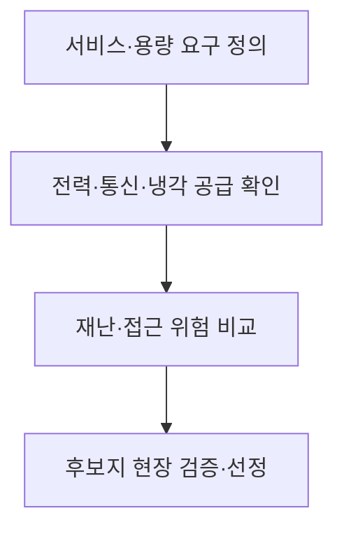
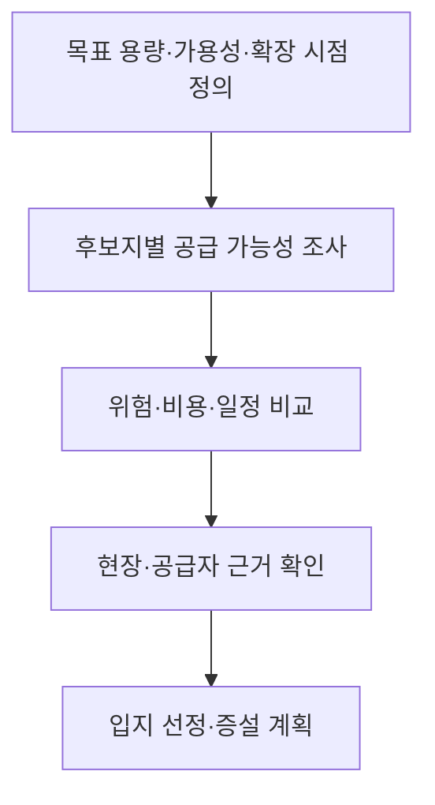

---
sidebar:
  order: 44
  label: "044. 데이터센터 입지 선정"
  badge:
    text: "기초"
    variant: note
title: "데이터센터(IDC) 입지 선정"
author: "Codex"
date: "2026-09-24T00:00:00+09:00"
tags:
  - "notes-computer-system"
weight: 44
extra:
  model: "GPT-6"
  keyword_grade: "기초"
  question_no: "044"
---

## 지식 로드맵 내 현재 위치

지식 위치: 컴퓨터 시스템 → 데이터센터 설계 → **입지 선정**

## 30초 인출

- 본질: **데이터센터 입지 선정** : 서비스 요구를 충족할 부지를 전력·통신·냉각·재난 위험·운영 조건으로 비교해 선택하는 활동
- 메커니즘: 필요한 용량·가용성 확인 → 후보지의 공급 능력과 위험 조사 → 운영 비용·확장성 비교 → 현장 검증 후 선정

핵심 용어

- **IDC(Internet Data Center, 인터넷 데이터센터)** : 서버·네트워크·저장 장비를 설치·운영하는 시설
- **데이터센터 입지 선정(Data Center Site Selection)** : 전력·통신·냉각·위험 등 조건을 평가해 운영 장소를 선택하는 활동
- **수전 용량** : 전력 계통으로부터 시설에 공급받을 수 있는 전력 규모
- **통신 경로 다양성** : 서로 다른 경로·사업자를 통해 네트워크 연결을 확보하는 정도
- **공통 원인 장애(Common-Cause Failure)** : 서로 다른 설비가 같은 지역·전력·통신 원인으로 함께 실패하는 상황
- **냉각 자원** : 장비의 열을 제거하는 데 필요한 전력·물·설비의 공급 조건

---

## 1교시 예상문제 (10점)

> 데이터센터 입지 선정에 관하여 설명하시오. (예상·10점)

---

## 1교시 10점 답안

### Ⅰ. 데이터센터 입지 선정의 개요

| 구분 | 핵심 |
|---|---|
| 정의 | **데이터센터 입지 선정** : 전력·통신·냉각·재난·운영 조건을 평가해 시설 부지를 선택하는 활동 |
| 목적 | 필요한 서비스 용량과 안정적 운영·확장 조건 확보 |

### Ⅱ. 선정 절차

- 제언: 후보지의 현재 설비뿐 아니라 예정 증설의 공급 가능 시점과 공통 장애점 확인.

---

## 2~4교시 예상문제 (25점)

> 데이터센터 입지 선정의 주요 평가 기준과 절차를 설명하고, 시설 운영·확장 관점의 한계·대응을 제시하시오. (예상·25점)

---

## 2~4교시 25점 답안

## Ⅰ. 데이터센터 입지 선정의 개요

| 구분 | 핵심 |
|---|---|
| 정의 | **데이터센터 입지 선정** : 전력·통신·냉각·재난·운영 조건을 평가해 시설 부지를 선택하는 활동 |
| 목적 | 필요한 서비스 용량과 안정적 운영·확장 조건 확보 |

## Ⅱ. 입지 평가 기준

| 기준 | 확인할 내용 | 서비스와의 관계 |
|---|---|---|
| 전력 | 수전 용량·품질·증설 가능성 | 연산 설비 운영과 성장 |
| 통신 | 회선·사업자·경로 다양성 | 이용자 접속과 거점 연결 |
| 냉각·물 | 열 제거 방식과 필요한 자원 | 장비 운전 온도 유지 |
| 재난 위험 | 홍수·지진·산불 등 지역 위험 | 시설 중단 가능성 |
| 접근·운영 | 인력·장비 접근, 공사·인허가 | 유지보수와 확장 일정 |

후보지를 한 지표만으로 비교하지 않고 업무 요구와 공급 조건을 같은 기준에서 평가.

## Ⅲ. 선정 흐름

계획상 공급 용량과 실제 계약·인입 가능 용량을 구분하는 현장 검증 단계.

## Ⅳ. 후보지의 상충 조건

| 후보지 장점 | 함께 확인할 제약 |
|---|---|
| 낮은 부지 비용 | 전력·통신망 인입 비용과 시점 |
| 냉각에 유리한 기후 | 물 공급·재난 위험·접근성 |
| 주요 이용자와의 근접성 | 전력 확보·확장 부지·지역 위험 |

가중치 분석 기법을 쓸 수 있으나 사전에 정한 평가축과 근거 자료의 신뢰성이 우선.

## Ⅴ. 적용 한계와 대응

| 한계 | 대응 |
|---|---|
| 현재 전력 용량만 보고 향후 증설을 계획 | 증설 단계별 공급 가능 시점·계약 조건 확인 |
| 통신 사업자가 달라도 관로가 같은 경우 | 물리적 회선 경로·공통 장애점 조사 |
| 재난 위험을 후보지 내부 설비의 중복으로만 해결하려 함 | 지역 위험과 대체 거점의 동시 영향 평가 |

## Ⅵ. 기술사적 제언

| 우선 제언 | 실행·확인 |
|---|---|
| 후보지 평가 전에 업무의 확장 시점·용량 확정 | 전력·통신·냉각의 현재·미래 요구를 하나의 평가표로 작성 |
| 높은 점수의 후보지도 현장 근거로 재검증 | 전력·회선 인입 계획과 재난 위험 자료를 공급자·현장 자료로 확인 |

---

## 검증 출처

- [US DOE: Water and Energy Considerations During Data Center Consolidations](https://www.energy.gov/eere/femp/articles/guideline-water-and-energy-considerations-during-federal-data-center)
- [NIST SP 800-34 Rev.1: Contingency Planning Guide](https://csrc.nist.gov/pubs/sp/800/34/r1/upd1/final)
- [Uptime Institute: Data Center Risk Assessment](https://atd.uptimeinstitute.com/professional-services/data-center-risk-assessment)

## 연결 토픽

- 연관 토픽: [데이터센터 입지·재난 대응](./043_datacenter_location_disaster_response.md), [액체냉각](./028_liquid_cooling.md)
