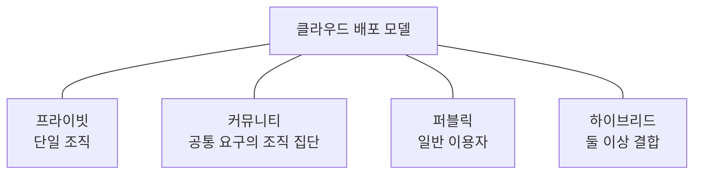
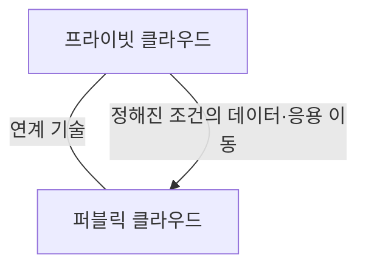

---
sidebar:
  order: 46
  label: "046. 클라우드 배포 모델"
  badge:
    text: "기초"
    variant: note
title: "클라우드 배포 모델"
author: "Codex"
date: "2026-09-24T00:00:00+09:00"
tags:
  - "notes-computer-system"
weight: 46
extra:
  model: "GPT-6"
  keyword_grade: "기초"
  question_no: "046"
---

## 지식 로드맵 내 현재 위치

지식 위치: 컴퓨터 시스템 → 클라우드 컴퓨팅 → **배포 모델**

## 30초 인출

- 본질: **클라우드 배포 모델** : 클라우드를 누가 이용하고 어떤 범위에서 독점·공유하며 어떻게 연결하는지 구분한 방식
- 메커니즘: 이용 조직의 범위와 인프라 독점 여부로 프라이빗·커뮤니티·퍼블릭을 구분하고, 둘 이상을 연계하면 하이브리드

핵심 용어

- **클라우드 배포 모델(Cloud Deployment Model)** : 클라우드 인프라의 이용 범위·공유·결합 형태에 따른 분류
- **프라이빗 클라우드(Private Cloud)** : 한 조직만 이용하도록 제공하는 클라우드
- **커뮤니티 클라우드(Community Cloud)** : 공통 요구를 가진 조직 집단이 이용하도록 제공하는 클라우드
- **퍼블릭 클라우드(Public Cloud)** : 일반 대중이 이용하도록 제공하는 클라우드
- **하이브리드 클라우드(Hybrid Cloud)** : 독립된 둘 이상의 클라우드를 데이터·응용 이동성을 지원하는 기술로 결합한 구성
- **서비스 모델(Service Model)** : SaaS·PaaS·IaaS처럼 이용자가 공급자로부터 제공받는 기능의 수준에 따른 분류

---

## 1교시 예상문제 (10점)

> 클라우드 배포 모델에 관하여 설명하시오. (예상·10점)

---

## 1교시 10점 답안

### Ⅰ. 클라우드 배포 모델의 개요

| 구분 | 핵심 |
|---|---|
| 정의 | **클라우드 배포 모델** : 인프라의 이용 범위와 결합 형태에 따른 클라우드 분류 |
| 목적 | 조직의 공유·독점·연계 요구에 맞는 제공 방식 선택 |

### Ⅱ. 네 가지 유형

- 제언: 배포 모델 이름보다 실제 이용 범위·책임 경계·연계 방법 확인.

---

## 2~4교시 예상문제 (25점)

> 클라우드 배포 모델의 유형과 구별 기준을 설명하고, 하이브리드 구성의 적용 판단과 한계·대응을 제시하시오. (예상·25점)

---

## 2~4교시 25점 답안

## Ⅰ. 클라우드 배포 모델의 개요

| 구분 | 핵심 |
|---|---|
| 정의 | **클라우드 배포 모델** : 인프라의 이용 범위와 결합 형태에 따른 클라우드 분류 |
| 목적 | 조직의 공유·독점·연계 요구에 맞는 제공 방식 선택 |

## Ⅱ. 이용 범위에 따른 유형

| 유형 | 이용 범위 | 구별점 |
|---|---|---|
| 프라이빗 | 한 조직의 독점 이용 | 내부·외부 설치 모두 가능 |
| 커뮤니티 | 공통 요구를 가진 조직 집단 | 집단의 공동 요구가 이용 경계 |
| 퍼블릭 | 일반 대중 | 특정 조직으로 이용 범위를 제한하지 않음 |
| 하이브리드 | 서로 독립된 둘 이상의 클라우드 | 데이터·응용 이동성을 위한 기술적 결합 |

소유 주체나 건물 위치 하나만으로 배포 모델을 결정하지 않음.

## Ⅲ. 하이브리드의 결합 관계

프라이빗과 퍼블릭은 예시 조합. 하이브리드는 독립된 환경의 결합과 이동성을 함께 확인해야 하는 구성.

## Ⅳ. 배포 모델과 서비스 모델의 구별

| 질문 | 배포 모델 | 서비스 모델 |
|---|---|---|
| 무엇을 구분하는가 | 누가 인프라를 이용하고 어떻게 결합하는가 | 이용자가 어떤 수준의 기능을 제공받는가 |
| 대표 유형 | 프라이빗·커뮤니티·퍼블릭·하이브리드 | IaaS·PaaS·SaaS |
| 함께 적용 | 퍼블릭 SaaS, 프라이빗 IaaS 등 조합 가능 | 배포 방식과 별개의 제공 범위 |

## Ⅴ. 적용 한계와 대응

| 한계 | 대응 |
|---|---|
| 프라이빗이면 자동으로 보안·규제 요구 충족이라고 판단 | 실제 접근 통제·데이터 위치·운영 책임 검증 |
| 하이브리드라고 부르지만 이동성 경로가 없음 | 연계 인터페이스와 데이터·응용 이관 시험 |
| 서로 다른 환경의 운영·보안 정책 불일치 | 계정·네트워크·모니터링 책임 경계 정리 |

## Ⅵ. 기술사적 제언

| 우선 제언 | 실행·확인 |
|---|---|
| 업무별 이용 범위와 이동 요구를 먼저 분리 | 데이터 접근 주체·이관 대상·운영 책임을 목록화 |
| 선택한 배포 모델을 실제 구성으로 검증 | 접근 권한과 장애·이관 상황에서 데이터·응용 이동 시험 |

---

## 검증 출처

- [NIST SP 800-145: The NIST Definition of Cloud Computing](https://csrc.nist.gov/pubs/sp/800/145/final)

## 연결 토픽

- 연관 토픽: [클라우드 컴퓨팅](./013_cloud_computing.md), [SaaS](./036_saas.md)
