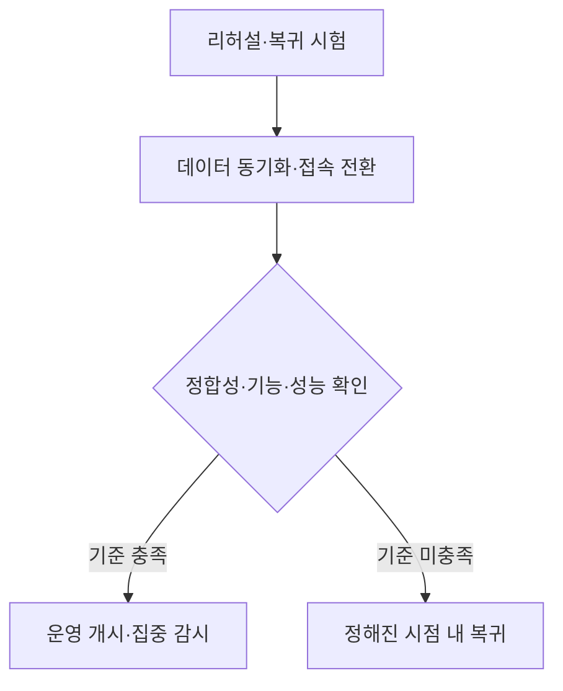
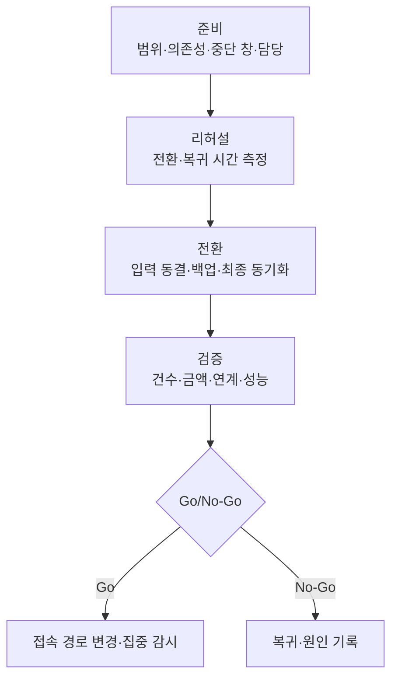
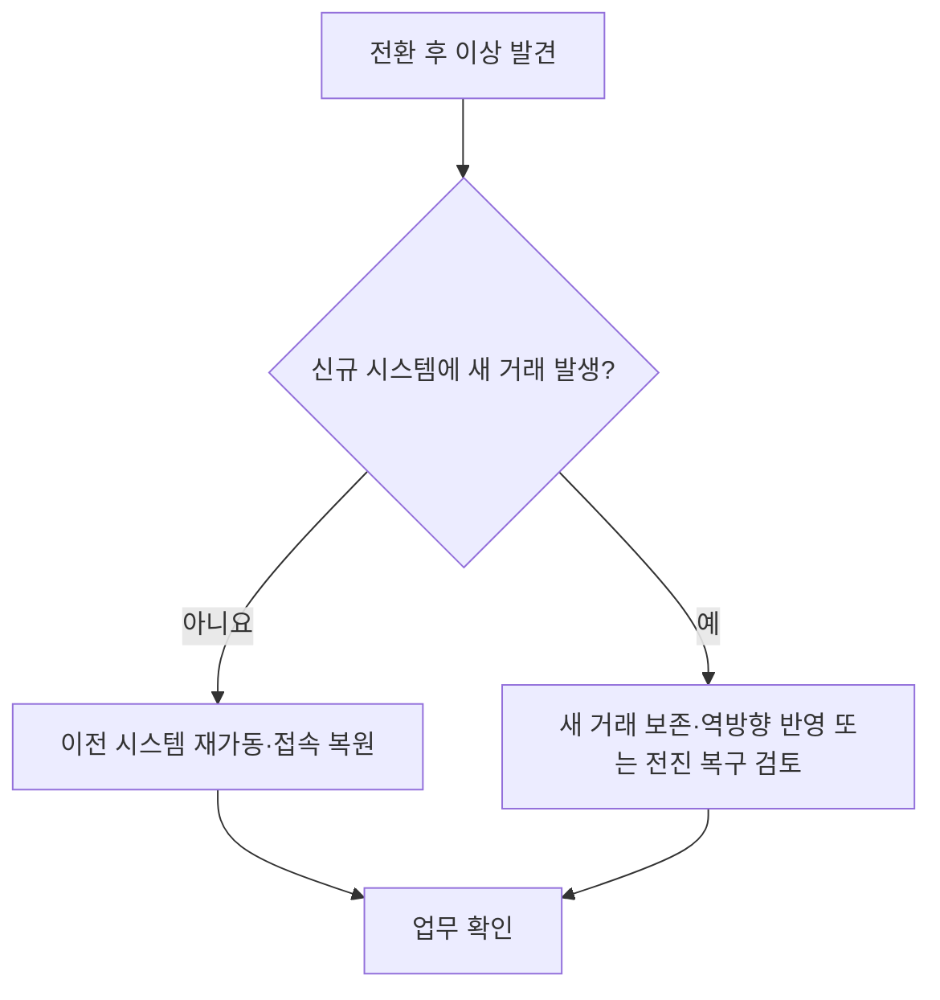

---
sidebar:
  order: 47
  label: "047. 정보시스템 장애 예방·운영 전환"
  badge:
    text: "기초"
    variant: note
title: "정보시스템 장애 예방·운영 전환"
author: "Codex"
date: "2026-09-24T00:00:00+09:00"
tags:
  - "notes-computer-system"
weight: 47
extra:
  model: "GPT-6"
  keyword_grade: "기초"
  question_no: "047"
---

## 지식 로드맵 내 현재 위치

지식 위치: 컴퓨터 시스템 → 운영 관리 → **운영 전환·장애 예방**

## 30초 인출

- 본질: **운영 전환(Cutover)** : 신규 시스템으로 실제 업무와 이용자 트래픽을 옮기는 작업
- 메커니즘: 전환 범위·중단 시간·검증 기준·복귀 시점을 먼저 정하고, 리허설 후 데이터 동기화·접속 경로 변경·업무 확인을 순서대로 실행

핵심 용어

- **운영 전환(Cutover)** : 기존 시스템의 업무·데이터·접속을 신규 시스템으로 옮겨 실제 운영을 시작하는 작업
- **전환 계획(Cutover Plan)** : 전환 순서·담당자·시간 창·검증·복귀 절차를 정리한 계획
- **런북(Runbook)** : 단계별 실행 명령·담당·확인 결과를 기록한 운영 절차서
- **리허설(Dry Run)** : 실제 전환 절차와 복귀 절차를 사전에 시험하는 모의 수행
- **Go/No-Go** : 정해진 검증 결과와 남은 복귀 시간을 근거로 전환 진행 여부를 결정하는 관문
- **복귀(Rollback)** : 전환 실패 시 이전 운영 상태로 돌아가는 작업. 전환 후 신규 데이터가 발생했으면 데이터 처리 방법까지 필요

---

## 1교시 예상문제 (10점)

> 정보시스템 운영 전환과 장애 예방 방안을 설명하시오. (예상·10점)

---

## 1교시 10점 답안

### Ⅰ. 운영 전환의 개요

| 구분 | 핵심 |
|---|---|
| 정의 | **운영 전환** : 업무·데이터·접속을 기존 시스템에서 신규 시스템으로 옮겨 실제 운영을 시작하는 작업 |
| 목적 | 전환 중 서비스 중단·데이터 손실·연계 오류를 줄이고 안정적으로 업무 개시 |

### Ⅱ. 전환과 복귀의 관문

- 제언: 전환 성공 기준과 복귀 가능 시점을 런북에 미리 정하고, 양쪽 절차를 리허설로 확인.

---

## 2~4교시 예상문제 (25점)

> 정보시스템 운영 전환 방식과 절차를 설명하고, 장애 예방 및 복귀 방안을 제시하시오. (예상·25점)

---

## 2~4교시 25점 답안

## Ⅰ. 운영 전환의 개요

| 구분 | 핵심 |
|---|---|
| 정의 | **운영 전환** : 업무·데이터·접속을 기존 시스템에서 신규 시스템으로 옮겨 실제 운영을 시작하는 작업 |
| 목적 | 전환 중 서비스 중단·데이터 손실·연계 오류를 줄이고 안정적으로 업무 개시 |

## Ⅱ. 전환 방식 선택

| 방식 | 전환 단위 | 장점 | 유의점 |
|---|---|---|---|
| 일괄 전환 | 전체 업무·트래픽을 한 번에 이동 | 전환 경계가 단순 | 실패 시 영향 범위가 큼 |
| 단계적 전환 | 업무·지역·이용자 그룹별 순차 이동 | 단계별 확인·조정 가능 | 구·신 시스템 간 연계·데이터 일관성 관리 필요 |
| 병행 운영 | 구·신 시스템을 일정 기간 함께 운영 | 결과 비교와 업무 적응 가능 | 이중 입력·데이터 동기화 방식 설계 필요 |

서비스 의존성과 데이터 공유 범위에 맞춰 방식 선택. 단계적 전환이나 병행 운영도 데이터 충돌을 자동으로 막아 주지는 않음.

## Ⅲ. 전환 절차와 판정

판정 기준은 업무별 허용 중단 시간과 데이터 허용 손실, 검증 결과를 함께 반영. DNS 변경은 접속 경로 변경의 한 예시.

## Ⅳ. 장애 예방의 핵심 확인 항목

| 대상 | 전환 전 확인 | 전환 후 확인 |
|---|---|---|
| 데이터 | 동결 시점·백업·최종 동기화·대사 기준 | 건수·합계·핵심 거래의 정합성 |
| 연계 | 외부 기관·배치·인증 의존성 시험 | 실제 전문 송수신·배치 완료 |
| 서비스 | 예상 부하·모니터링·지원 인력 준비 | 응답 지연·오류율·핵심 업무 시나리오 |
| 복귀 | 복구 소요 시간과 결정권자, 데이터 처리 절차 | 신규 거래 발생 여부와 복귀 가능성 재판정 |

## Ⅴ. 복귀 시 데이터 상태

이전 시스템이 오래된 데이터 상태라면 접속만 되돌리는 방식으로 새 거래가 사라질 수 있음. 복귀 절차에 데이터 소유권과 반영 경로까지 포함.

## Ⅵ. 한계와 대응

| 한계 | 대응 |
|---|---|
| 샘플 데이터만으로 리허설해 실제 전환 시간이 달라짐 | 운영 규모에 가까운 데이터·부하로 소요 시간과 병목 확인 |
| 기술 작업은 완료했지만 핵심 업무·대외 연계가 실패 | 업무 담당자와 외부 연계 담당자의 확인을 Go 조건에 포함 |
| 복귀 결정이 늦어 허용 중단 시간 초과 | 복귀 소요 시간을 역산해 No-Go 판정 시한 지정 |

## Ⅶ. 기술사적 제언

| 우선 제언 | 실행·확인 |
|---|---|
| 전환의 성공 조건을 작업 완료와 분리 | 데이터 정합성·업무 처리·외부 연계·성능의 승인 기준 사전 합의 |
| 복귀 가능한 전환 계획 수립 | 런북에 담당자·판정 시한·새 거래 처리 절차를 기록하고 리허설로 검증 |

---

## 검증 출처

- [AWS Prescriptive Guidance: Cutover stage](https://docs.aws.amazon.com/prescriptive-guidance/latest/best-practices-migration-cutover/cutover-stage.html)
- [AWS Prescriptive Guidance: Completing the communication gates](https://docs.aws.amazon.com/prescriptive-guidance/latest/large-migration-governance-playbook/task-follow-communication-gates.html)

## 연결 토픽

- 연관 토픽: [고가용성](./042_ha_availability_assurance.md), [클라우드 네이티브 재해 복구](./049_cloud_native_disaster_recovery.md)