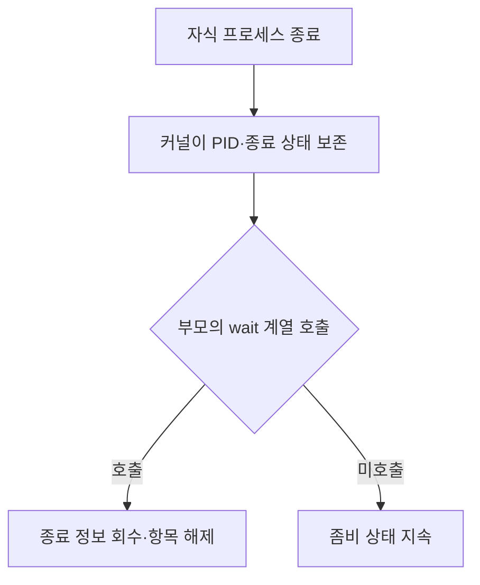
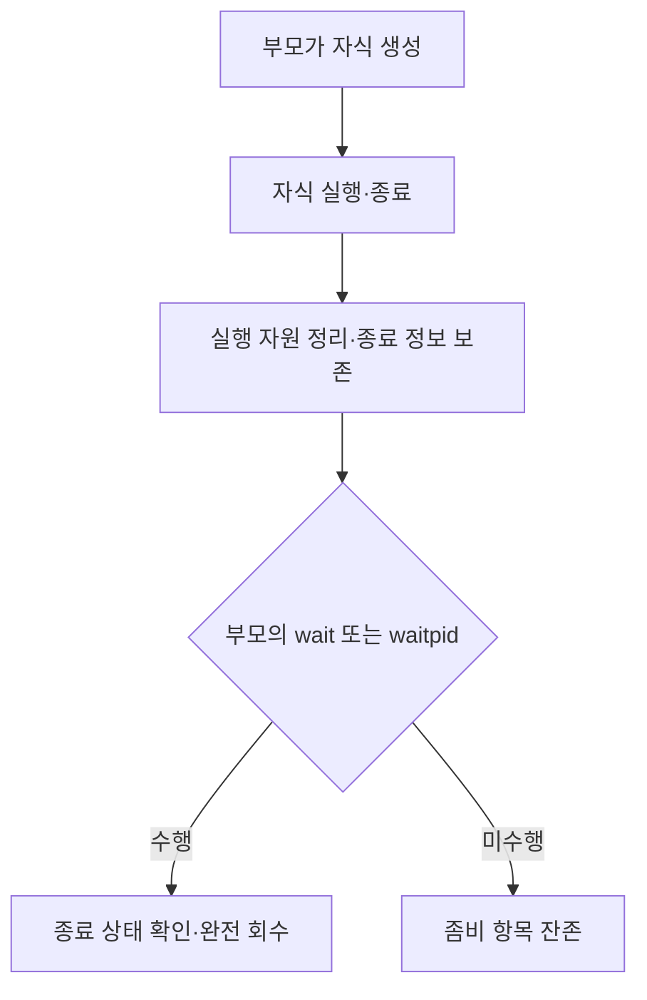
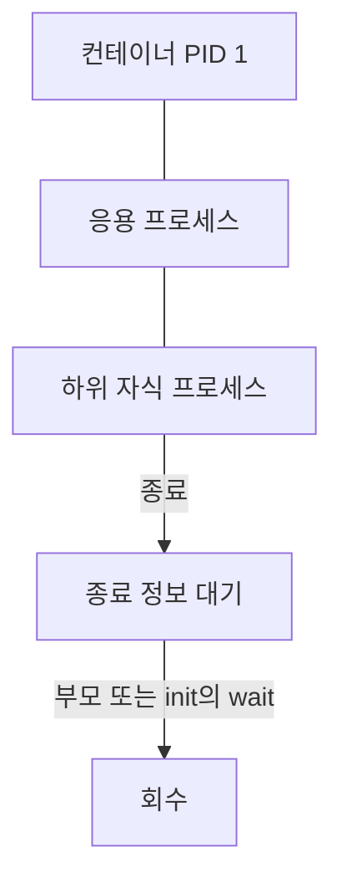

---
sidebar:
  order: 48
  label: "048. 좀비 프로세스"
  badge:
    text: "기초"
    variant: note
title: "좀비 프로세스(Zombie Process)"
author: "Codex"
date: "2026-09-24T00:00:00+09:00"
tags:
  - "notes-computer-system"
weight: 48
extra:
  model: "GPT-6"
  keyword_grade: "기초"
  question_no: "048"
---

## 지식 로드맵 내 현재 위치

지식 위치: 컴퓨터 시스템 → 운영체제 → **프로세스 생명주기**

## 30초 인출

- 본질: **좀비 프로세스** : 자식 프로세스가 종료됐지만 부모가 종료 상태를 회수하지 않아 커널에 최소 정보가 남은 상태
- 메커니즘: 자식 종료 → 부모의 `wait()` 미호출 → PID·종료 상태 보존. 부모가 `wait()` 계열 호출로 회수

핵심 용어

- **좀비 프로세스(Zombie Process)** : 종료한 자식의 상태를 부모가 회수하기 전까지 커널이 최소 종료 정보를 보존하는 상태
- **종료 상태(Exit Status)** : 자식의 종료 결과를 부모가 확인하는 정보
- **wait()/waitpid()** : 부모가 자식의 상태 변화를 확인하고 종료 자원을 회수하는 시스템 호출
- **프로세스 ID(PID, Process ID)** : 커널이 프로세스를 구별하는 식별자
- **고아 프로세스(Orphan Process)** : 부모가 먼저 종료해 다른 프로세스에 재부모화된 살아 있는 자식 프로세스
- **서브리퍼(Subreaper)** : 고아가 된 하위 프로세스를 받아 종료 상태를 회수하도록 지정된 프로세스

---

## 1교시 예상문제 (10점)

> 좀비 프로세스의 개념과 발생·해소 과정을 설명하시오. (예상·10점)

---

## 1교시 10점 답안

### Ⅰ. 좀비 프로세스의 개요

| 구분 | 핵심 |
|---|---|
| 정의 | **좀비 프로세스** : 자식은 종료했으나 부모가 종료 상태를 회수하지 않아 최소 정보가 남은 상태 |
| 목적 | 종료 정보를 부모에게 전달할 때까지 보존하고, 회수 후 프로세스 항목 해제 |

### Ⅱ. 발생과 회수

- 제언: 자식을 생성하는 장기 실행 프로그램에서 종료 상태 회수 경로를 확인.

---

## 2~4교시 예상문제 (25점)

> 좀비 프로세스의 발생 원리와 고아 프로세스와의 차이를 설명하고, 운영상 한계와 대응 방안을 제시하시오. (예상·25점)

---

## 2~4교시 25점 답안

## Ⅰ. 좀비 프로세스의 개요

| 구분 | 핵심 |
|---|---|
| 정의 | **좀비 프로세스** : 자식은 종료했으나 부모가 종료 상태를 회수하지 않아 최소 정보가 남은 상태 |
| 목적 | 종료 정보를 부모에게 전달할 때까지 보존하고, 회수 후 프로세스 항목 해제 |

## Ⅱ. 발생 원리

좀비는 이미 종료했으므로 일반 실행 프로세스처럼 CPU를 사용하지 않음. PID와 종료 상태 등 최소 커널 정보는 남으며, 다수 누적되면 프로세스 생성에 영향을 줄 수 있음.

## Ⅲ. 좀비와 고아의 구별

| 구분 | 좀비 프로세스 | 고아 프로세스 |
|---|---|---|
| 자식 상태 | 종료 | 살아 있음 |
| 원인 | 부모가 종료 상태를 아직 회수하지 않음 | 부모가 먼저 종료 |
| 커널 처리 | 부모의 회수까지 최소 정보 보존 | init 또는 가장 가까운 서브리퍼에 재부모화 |
| 대응 초점 | 부모의 자식 회수 로직 | 새 부모의 종료 상태 회수 |

고아는 살아 있는 프로세스의 부모 관계, 좀비는 종료 후 남은 회수 대상이라는 점이 핵심 차이.

## Ⅳ. 원인과 대응

| 한계 | 대응 |
|---|---|
| 부모가 자식의 종료를 기다리지 않아 좀비 누적 | 종료 시 `wait()`·`waitpid()`로 자식 상태 회수 |
| 비동기 자식을 여러 개 생성하고 일부만 회수 | 자식 종료 알림 처리와 반복 회수 경로 점검 |
| 컨테이너의 PID 1이 고아 자식을 수거하지 않음 | 자식 관리 책임 확인, 필요한 경우 작은 init 프로세스 사용 |
| 종료한 좀비에 `kill`을 반복 | 좀비의 부모가 회수하도록 수정; 부모 종료 시 재부모화 경로 확인 |

## Ⅴ. 컨테이너의 부모 관계

컨테이너에 init을 두는 방법은 재부모화된 자식의 회수에 유용. 응용이 직접 만든 자식의 종료 상태도 응용의 회수 로직으로 관리할 필요.

## Ⅵ. 기술사적 제언

| 우선 제언 | 실행·확인 |
|---|---|
| 종료한 자식의 회수 책임 명시 | 자식 생성 코드와 종료 알림 경로를 함께 검토 |
| 운영 중 누적 조기 발견 | 프로세스 상태 `Z`·부모 PID를 확인하고 원인 부모의 회수 동작 수정 |

---

## 검증 출처

- [Linux man-pages: wait(2)](https://man7.org/linux/man-pages/man2/waitpid.2.html)
- [Docker Docs: docker container run --init](https://docs.docker.com/reference/cli/docker/container/run)

## 연결 토픽

- 연관 토픽: [프로세스 메모리 배치](./050_process_memory_layout.md), [교착상태](./038_deadlock.md)