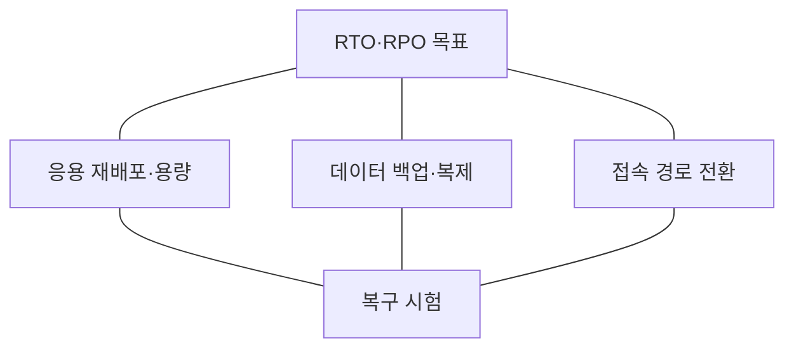
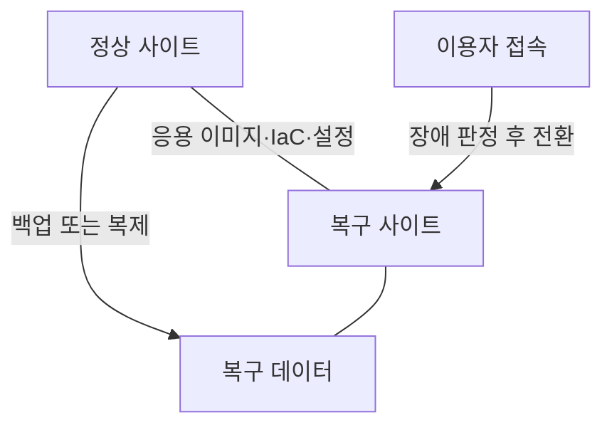
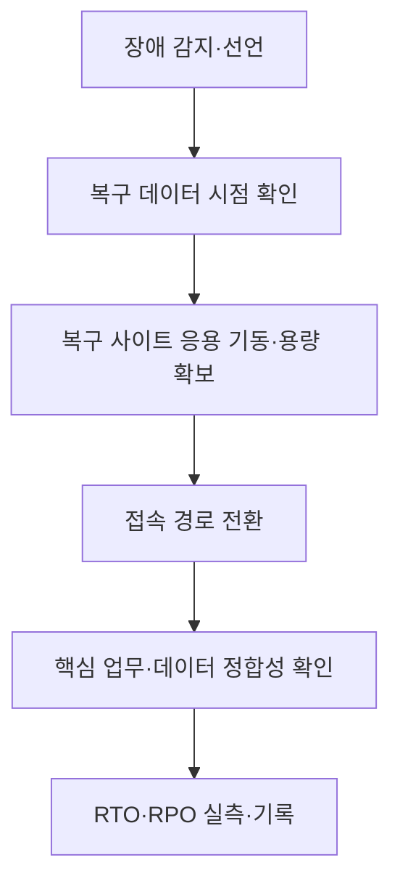

---
sidebar:
  order: 49
  label: "049. 클라우드 네이티브 재해복구"
  badge:
    text: "기초"
    variant: note
title: "클라우드 네이티브 재해복구"
author: "Codex"
date: "2026-09-24T00:00:00+09:00"
tags:
  - "notes-computer-system"
weight: 49
extra:
  model: "GPT-6"
  keyword_grade: "기초"
  question_no: "049"
---

## 지식 로드맵 내 현재 위치

지식 위치: 컴퓨터 시스템 → 서비스 연속성 → **클라우드 재해복구**

## 30초 인출

- 본질: **클라우드 네이티브 재해복구** : 장애가 난 위치 밖에서 애플리케이션·데이터·접속 경로를 복원해 업무를 재개하는 체계
- 메커니즘: 업무별 **RTO·RPO** 설정 후 배포 구성, 데이터 복제·백업, 트래픽 전환을 설계하고 실제 복구 시험으로 검증

핵심 용어

- **재해복구(DR, Disaster Recovery)** : 광역 장애나 재해로 중단된 서비스를 다른 자원에서 복원하는 활동
- **RTO(Recovery Time Objective)** : 중단 후 업무 복구까지 허용하는 목표 시간
- **RPO(Recovery Point Objective)** : 복구 시점에서 허용하는 최대 데이터 손실 구간
- **백업·복원(Backup and Restore)** : 데이터를 보관하고 장애 후 인프라·응용·데이터를 다시 구성하는 방식
- **파일럿 라이트(Pilot Light)** : 복구에 필요한 핵심 데이터·구성 요소를 유지하고 장애 시 나머지를 확장하는 방식
- **웜 스탠바이(Warm Standby)** : 축소된 복구 환경을 운영하다 장애 시 확장하는 방식
- **다중 사이트 활성 운영(Active-Active)** : 둘 이상의 사이트에서 평상시에도 서비스를 제공하는 방식
- **IaC(Infrastructure as Code)** : 인프라 구성을 코드로 선언·관리하는 방식

---

## 1교시 예상문제 (10점)

> 클라우드 네이티브 재해복구의 핵심 요소를 설명하시오. (예상·10점)

---

## 1교시 10점 답안

### Ⅰ. 클라우드 네이티브 재해복구의 개요

| 구분 | 핵심 |
|---|---|
| 정의 | **클라우드 네이티브 재해복구** : 장애 위치 밖에서 응용·데이터·접속 경로를 복원해 서비스를 재개하는 체계 |
| 목적 | 업무별 **RTO·RPO** 내 서비스 복구와 데이터 손실 제한 |

### Ⅱ. 복구 대상의 연결

- 제언: 컨테이너 재기동 시간만 보지 말고 데이터 복구와 실제 이용자 접속까지 측정.

---

## 2~4교시 예상문제 (25점)

> 클라우드 네이티브 재해복구 전략을 RTO·RPO와 복구 구성 요소를 중심으로 설명하고, 한계와 대응 방안을 제시하시오. (예상·25점)

---

## 2~4교시 25점 답안

## Ⅰ. 클라우드 네이티브 재해복구의 개요

| 구분 | 핵심 |
|---|---|
| 정의 | **클라우드 네이티브 재해복구** : 장애 위치 밖에서 응용·데이터·접속 경로를 복원해 서비스를 재개하는 체계 |
| 목적 | 업무별 **RTO·RPO** 내 서비스 복구와 데이터 손실 제한 |

## Ⅱ. 복구 목표와 전략 선택

| 전략 | 복구 환경 상태 | 설계상 판단 |
|---|---|---|
| 백업·복원 | 평상시 별도 서비스 미운영 | 복원 시간·백업 간격이 목표를 만족하는지 |
| 파일럿 라이트 | 핵심 데이터·구성 요소 유지 | 장애 후 확장·배포 시간이 목표를 만족하는지 |
| 웜 스탠바이 | 축소된 서비스 운영 | 확장·라우팅 전환 시간이 목표를 만족하는지 |
| 다중 사이트 활성 운영 | 둘 이상에서 서비스 운영 | 데이터 충돌·장애 격리·라우팅이 가능한지 |

위에서 아래로 단순히 우열을 매기지 않고, 업무 중요도·비용·데이터 일관성 요구에 맞춰 선택.

## Ⅲ. 응용·데이터·접속의 복구 구조

응용은 재배포 가능해도 데이터 복구 지점이 뒤처지면 목표 **RPO** 초과 가능. 복구 사이트의 용량과 비밀정보·설정도 함께 준비할 필요.

## Ⅳ. 복구 검증 순서

복구 시간의 시작·끝과 데이터 손실 기준 시점을 미리 정의해야 목표 달성 여부를 판정할 수 있음.

## Ⅴ. 한계와 대응

| 한계 | 대응 |
|---|---|
| 컨테이너만 재배포하면 복구가 끝났다고 판단 | 데이터·설정·인증·외부 연계·접속까지 복구 범위 지정 |
| 비동기 복제의 지연으로 RPO 초과 | 복제 지연 감시, 백업 검증, 허용 손실 범위 확인 |
| 복구 사이트 용량·서비스 할당량 부족 | 장애 시 필요한 용량과 확장 시간 사전 시험 |
| 복구 사이트도 동일 장애 원인에 노출 | 장애 범위와 복구 사이트의 독립성 검토 |
| 복구 계획만 있고 전환 시험이 없음 | 정기적인 장애 전환·복귀 훈련으로 RTO·RPO 실측 |

## Ⅵ. 기술사적 제언

| 우선 제언 | 실행·확인 |
|---|---|
| 업무별 RTO·RPO를 먼저 합의 | 데이터·응용·접속 각 구성 요소에 목표 배분 |
| 복구 가능성을 실제 업무로 입증 | 복구 사이트에서 핵심 거래 수행 후 시간·데이터 손실·복귀 절차 기록 |

---

## 검증 출처

- [AWS Well-Architected: Define recovery objectives](https://docs.aws.amazon.com/wellarchitected/latest/framework/rel_planning_for_recovery_objective_defined_recovery.html)
- [AWS Well-Architected: Disaster recovery options](https://docs.aws.amazon.com/whitepapers/latest/disaster-recovery-workloads-on-aws/disaster-recovery-options-in-the-cloud.html)
- [AWS Well-Architected: Test disaster recovery implementation](https://docs.aws.amazon.com/wellarchitected/latest/reliability-pillar/rel_planning_for_recovery_dr_tested.html)

## 연결 토픽

- 연관 토픽: [고가용성](./042_ha_availability_assurance.md), [운영 전환](./047_system_failure_prevention_cutover.md)