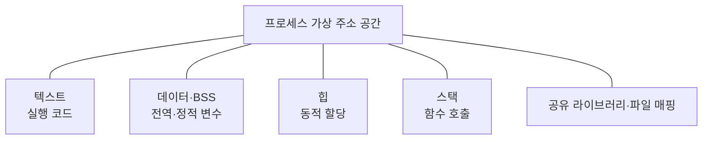
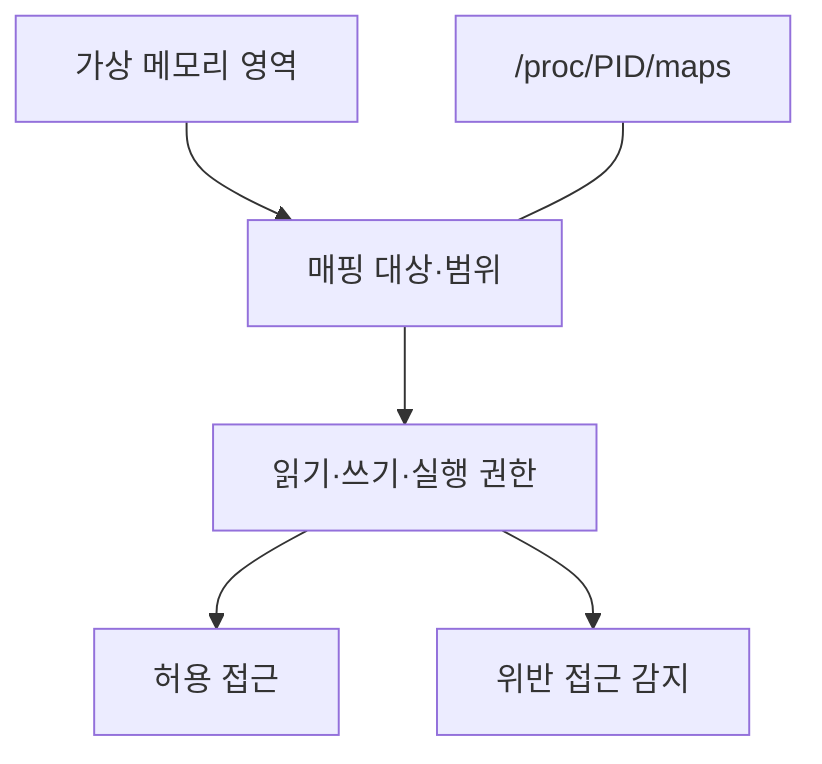

---
sidebar:
  order: 50
  label: "050. 프로세스 메모리 영역"
  badge:
    text: "기초"
    variant: note
title: "프로세스 메모리 영역"
author: "Codex"
date: "2026-09-24T00:00:00+09:00"
tags:
  - "notes-computer-system"
weight: 50
extra:
  model: "GPT-6"
  keyword_grade: "기초"
  question_no: "050"
---

## 지식 로드맵 내 현재 위치

지식 위치: 컴퓨터 시스템 → 운영체제 → **프로세스 가상 주소 공간**

## 30초 인출

- 본질: **프로세스 메모리 영역** : 프로세스의 가상 주소 공간을 코드·전역 데이터·동적 할당·호출 정보 등의 용도에 따라 구분한 것
- 메커니즘: 실행 파일과 공유 라이브러리를 매핑하고, 힙·스택을 사용 목적에 맞게 할당하며 영역별 접근 권한 적용

핵심 용어

- **텍스트 영역(Text Segment)** : 실행 코드가 매핑되는 영역
- **데이터 영역(Data Segment)** : 초기화된 전역·정적 변수 등이 저장되는 영역
- **BSS(Block Started by Symbol)** : 초기값을 명시하지 않았거나 0으로 초기화되는 전역·정적 변수의 영역
- **힙(Heap)** : 실행 중 요청한 동적 메모리를 관리하는 영역
- **스택(Stack)** : 함수 호출의 실행 문맥과 지역 데이터 등을 담는 영역
- **VMA(Virtual Memory Area)** : 가상 주소 범위와 접근 권한·매핑 대상을 관리하는 영역
- **ASLR(Address Space Layout Randomization)** : 주요 매핑의 주소를 무작위화하는 보안 기법

---

## 1교시 예상문제 (10점)

> 프로세스 메모리 영역의 종류와 역할을 설명하시오. (예상·10점)

---

## 1교시 10점 답안

### Ⅰ. 프로세스 메모리 영역의 개요

| 구분 | 핵심 |
|---|---|
| 정의 | **프로세스 메모리 영역** : 코드·전역 데이터·동적 할당·호출 정보 등을 용도별로 구분한 가상 주소 공간 |
| 목적 | 데이터 생명주기와 접근 권한에 맞는 메모리 관리 |

### Ⅱ. 주요 영역

| 영역 | 담는 내용 |
|---|---|
| 텍스트 | 실행 명령어 |
| 데이터·BSS | 전역·정적 변수 |
| 힙 | 실행 중 동적 할당 |
| 스택 | 함수 호출 문맥·지역 데이터 |

- 제언: 주소의 고정 순서보다 각 영역의 저장 대상·생명주기·접근 권한을 구별.

---

## 2~4교시 예상문제 (25점)

> 프로세스 가상 주소 공간의 주요 메모리 영역을 설명하고, 힙·스택의 차이와 메모리 보호 방안을 제시하시오. (예상·25점)

---

## 2~4교시 25점 답안

## Ⅰ. 프로세스 메모리 영역의 개요

| 구분 | 핵심 |
|---|---|
| 정의 | **프로세스 메모리 영역** : 코드·전역 데이터·동적 할당·호출 정보 등을 용도별로 구분한 가상 주소 공간 |
| 목적 | 데이터 생명주기와 접근 권한에 맞는 메모리 관리 |

## Ⅱ. 용도별 구조

이는 용도에 따른 개념도. 실제 주소 순서와 크기는 운영체제·실행 파일·할당 방식·ASLR 등에 따라 달라짐.

## Ⅲ. 영역별 저장 대상과 관리

| 영역 | 대표 내용 | 관리 관점 |
|---|---|---|
| 텍스트 | 실행 명령어 | 통상 읽기·실행 권한, 쓰기 제한 |
| 데이터 | 초기화된 전역·정적 변수 | 프로그램 생존 기간 유지 |
| BSS | 0으로 시작하는 전역·정적 변수 | 실행 시 초기 상태 확보 |
| 힙 | 동적 객체 | 할당·해제 또는 언어 런타임 회수 |
| 스택 | 호출 프레임·지역 데이터 | 호출·반환에 따른 사용 |
| 기타 매핑 | 공유 라이브러리·메모리 매핑 파일 | 매핑 대상·공유 여부별 권한 |

## Ⅳ. 힙과 스택의 구별

| 관점 | 힙 | 스택 |
|---|---|---|
| 주된 용도 | 실행 중 크기·수명이 가변적인 데이터 | 함수 호출의 실행 문맥 |
| 사용 시점 | 동적 할당 요청 시 | 호출·반환 시 |
| 생명주기 | 해제 또는 런타임 회수까지 | 해당 호출 종료까지가 일반적 |
| 대표 한계 | 누수·단편화·잘못된 해제 | 과도한 호출 깊이·스택 공간 초과 |

힙이 항상 하나의 연속 구간으로만 커지거나 스택과 반드시 마주 보고 확장하는 것은 아님.

## Ⅴ. 접근 권한과 진단

영역별 권한은 코드 변조나 데이터 실행의 위험을 줄이는 기반. Linux에서는 `/proc/PID/maps`로 현재 매핑·권한을 확인 가능.

## Ⅵ. 한계와 대응

| 한계 | 대응 |
|---|---|
| 동적 메모리 해제 누락 | 할당 소유권과 회수 경로 점검 |
| 깊은 재귀·큰 지역 배열로 스택 공간 부족 | 호출 깊이·자료 크기 점검 |
| 잘못된 주소 접근 | 메모리 검사 도구와 접근 권한 검증 |
| 교과서의 고정 주소 그림을 실제 배치로 오해 | 실행 중 매핑 정보와 플랫폼별 차이 확인 |

## Ⅶ. 기술사적 제언

| 우선 제언 | 실행·확인 |
|---|---|
| 저장 대상과 수명에 맞는 영역 사용 | 동적 객체의 소유권·해제 시점과 호출 단위 자료의 크기 점검 |
| 배치보다 보호 경계 확인 | 실행 중 매핑·권한을 확인하고 오류를 메모리 검사로 재현 |

---

## 검증 출처

- [GNU C Library: Memory Concepts](https://www.sourceware.org/glibc/manual/2.43/html_node/Memory-Concepts.html)
- [Linux man-pages: proc_pid_maps(5)](https://www.man7.org/linux/man-pages/man5/proc_pid_maps.5.html)

## 연결 토픽

- 연관 토픽: [메모리 누수](./052_memory_leak.md), [가상 메모리 페이징](./060_paging.md)