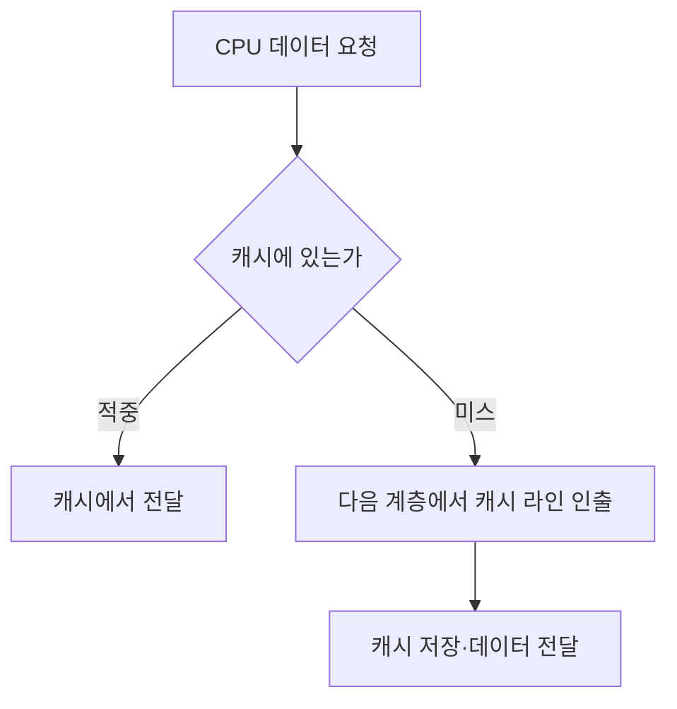
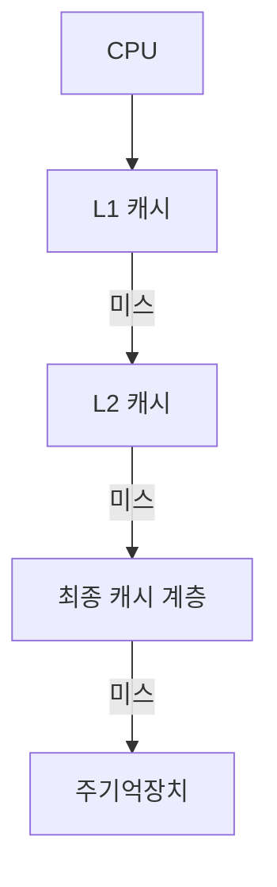
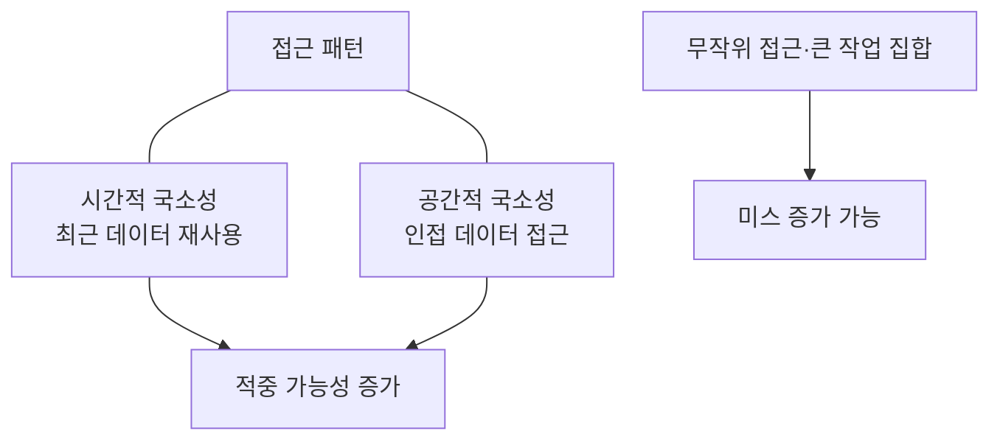

---
sidebar:
  order: 51
  label: "051. 캐시 메모리"
  badge:
    text: "기초"
    variant: note
title: "캐시 메모리(Cache Memory)"
author: "Codex"
date: "2026-09-24T00:00:00+09:00"
tags:
  - "notes-computer-system"
weight: 51
extra:
  model: "GPT-6"
  keyword_grade: "기초"
  question_no: "051"
---

## 지식 로드맵 내 현재 위치

지식 위치: 컴퓨터 시스템 → 컴퓨터 구조 → **메모리 계층**

## 30초 인출

- 본질: **캐시 메모리** : CPU가 자주 쓰거나 곧 다시 쓸 가능성이 높은 데이터를 가까운 고속 저장소에 보관하는 장치
- 메커니즘: 접근한 주소가 캐시에 있으면 적중, 없으면 다음 계층에서 캐시 라인 단위로 가져와 저장

핵심 용어

- **캐시 메모리(Cache Memory)** : CPU와 주기억장치 사이의 접근 지연을 줄이는 고속 저장소
- **참조 국소성(Locality of Reference)** : 최근 사용 데이터나 그 주변 데이터를 다시 접근하는 경향
- **캐시 라인(Cache Line)** : 캐시 계층 간 데이터를 옮기고 관리하는 기본 블록
- **적중(Hit)** : 요청한 데이터가 캐시에 있는 상태
- **미스(Miss)** : 요청한 데이터가 없어 다음 메모리 계층에서 가져와야 하는 상태
- **AMAT(Average Memory Access Time)** : 적중 시간과 미스 비율·미스 비용을 반영한 평균 메모리 접근 시간
- **거짓 공유(False Sharing)** : 서로 다른 코어가 같은 캐시 라인의 다른 데이터를 갱신해 불필요한 일관성 트래픽이 발생하는 현상

---

## 1교시 예상문제 (10점)

> 캐시 메모리의 동작 원리와 필요성을 설명하시오. (예상·10점)

---

## 1교시 10점 답안

### Ⅰ. 캐시 메모리의 개요

| 구분 | 핵심 |
|---|---|
| 정의 | **캐시 메모리** : 자주 접근하는 데이터의 사본을 CPU 가까이에 두어 접근 지연을 줄이는 고속 저장소 |
| 목적 | 주기억장치 접근 횟수와 평균 메모리 접근 시간 감소 |

### Ⅱ. 적중과 미스

- 제언: 캐시 용량만 늘리는 접근보다 실제 접근 패턴과 적중·미스 원인 확인.

---

## 2~4교시 예상문제 (25점)

> 캐시 메모리의 구조와 동작, 매핑·쓰기 정책을 설명하고 성능 한계와 대응 방안을 제시하시오. (예상·25점)

---

## 2~4교시 25점 답안

## Ⅰ. 캐시 메모리의 개요

| 구분 | 핵심 |
|---|---|
| 정의 | **캐시 메모리** : 자주 접근하는 데이터의 사본을 CPU 가까이에 두어 접근 지연을 줄이는 고속 저장소 |
| 목적 | 주기억장치 접근 횟수와 평균 메모리 접근 시간 감소 |

## Ⅱ. 계층과 접근 경로

가까운 계층에서 적중하면 다음 계층 접근을 피함. 계층의 개수·공유 방식·크기는 프로세서마다 다름.

## Ⅲ. 매핑과 교체

| 방식 | 저장 후보 위치 | 특징 |
|---|---|---|
| 직접 매핑 | 정해진 한 위치 | 단순하지만 같은 위치에 몰리면 충돌 |
| 세트 연관 | 정해진 세트의 여러 위치 | 후보 위치를 늘려 충돌 완화 |
| 완전 연관 | 캐시의 여러 위치 | 배치 자유도 높지만 탐색·구현 부담 |

캐시가 꽉 찼을 때는 교체 정책에 따라 기존 라인을 내보냄. 매핑 방식과 교체 정책은 구별할 필요.

## Ⅳ. 쓰기 정책의 차이

| 정책 | 쓰기 반영 | 확인할 점 |
|---|---|---|
| Write-through | 캐시와 다음 계층에 반영 | 쓰기 트래픽 |
| Write-back | 수정된 라인을 나중에 다음 계층에 반영 | 더티 라인 추적과 내보내기 |

쓰기 정책만으로 애플리케이션 데이터의 영속성이 보장되는 것은 아님. 멀티코어의 캐시 일관성과 저장장치의 영속성도 별도 문제.

## Ⅴ. 국소성과 성능 한계

**AMAT** = 적중 시간 + 미스율 × 미스 비용. 실제 계층형 캐시의 계산은 계층별 미스율·비용을 반영해야 함.

## Ⅵ. 한계와 대응

| 한계 | 대응 |
|---|---|
| 작업 집합이 캐시보다 크거나 접근 순서가 불리함 | 데이터 배치·블로킹 등으로 재사용·연속 접근 확대 |
| 여러 코어가 같은 캐시 라인의 다른 변수를 자주 수정 | 거짓 공유 여부 측정 후 데이터 분리·정렬 검토 |
| 매핑 충돌로 특정 세트에 미스 집중 | 주소 패턴·자료 배치 점검 |
| 적중률만으로 성능 판단 | 지연·미스 비용·코어 간 트래픽 함께 측정 |

## Ⅶ. 기술사적 제언

| 우선 제언 | 실행·확인 |
|---|---|
| 접근 패턴 중심의 최적화 | 실제 워크로드의 미스·지연을 먼저 측정한 뒤 자료 배치 조정 |
| 성능과 일관성 구분 | 멀티코어 공유 데이터에서는 캐시 라인 이동과 동기화 비용 함께 확인 |

---

## 검증 출처

- [Intel: Memory Performance in a Nutshell](https://www.intel.com/content/www/us/en/developer/articles/technical/memory-performance-in-a-nutshell.html)
- [Intel: CPU Metrics Reference](https://www.intel.com/content/www/us/en/docs/vtune-profiler/user-guide/2024-2/cpu-metrics-reference.html)
- [Microsoft Learn: False Sharing](https://learn.microsoft.com/en-us/archive/msdn-magazine/2008/october/net-matters-false-sharing)

## 연결 토픽

- 연관 토픽: [캐시 일관성](./040_cache_coherence.md), [메모리 인터리빙](./057_memory_interleaving.md)