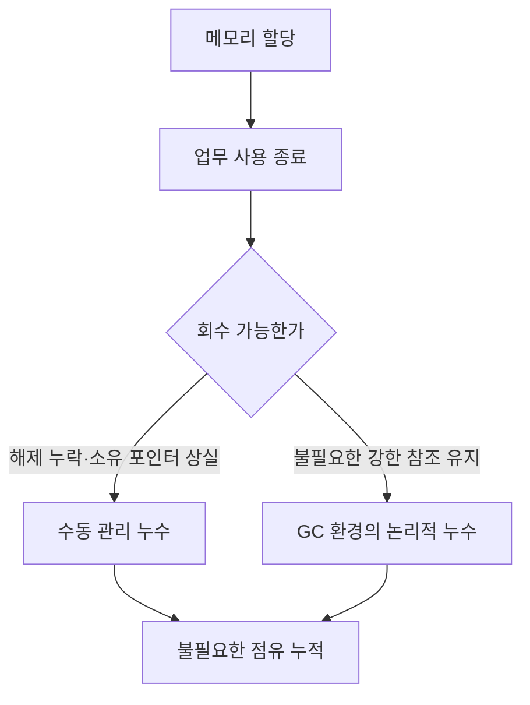
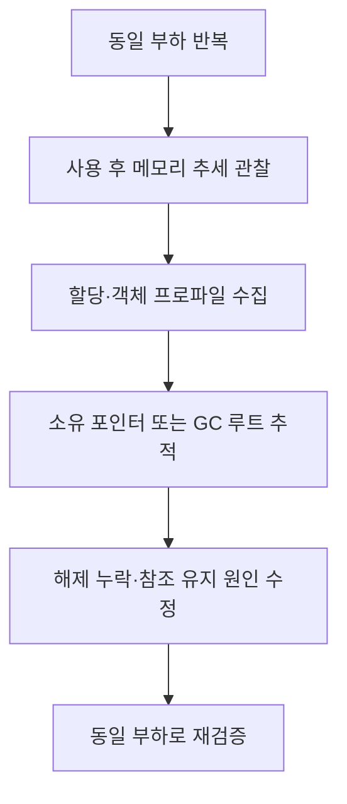

---
sidebar:
  order: 52
  label: "052. 메모리 누수"
  badge:
    text: "기초"
    variant: note
title: "메모리 누수(Memory Leak)"
author: "Codex"
date: "2026-09-24T00:00:00+09:00"
tags:
  - "notes-computer-system"
weight: 52
extra:
  model: "GPT-6"
  keyword_grade: "기초"
  question_no: "052"
---

## 지식 로드맵 내 현재 위치

지식 위치: 컴퓨터 시스템 → 메모리 관리 → **동적 메모리 수명**

## 30초 인출

- 본질: **메모리 누수** : 더 이상 필요하지 않은 메모리가 반환되지 않아 프로그램의 점유가 불필요하게 남는 현상
- 메커니즘: 수동 관리 언어의 해제 누락 또는 관리형 언어의 불필요한 참조 유지 → 점유 누적 → 할당 실패·성능 저하 가능

핵심 용어

- **메모리 누수(Memory Leak)** : 사용하지 않는 메모리가 프로그램의 수명 동안 계속 점유되는 현상
- **동적 할당(Dynamic Allocation)** : 실행 중 필요한 크기의 메모리를 할당하는 방식
- **RAII(Resource Acquisition Is Initialization)** : 객체 수명과 자원 획득·반납을 묶는 C++ 설계 기법
- **GC(Garbage Collection)** : 도달할 수 없는 객체의 메모리를 자동으로 회수하는 기법
- **GC 루트(GC Root)** : 관리형 런타임이 객체의 도달 가능성을 판단할 때 출발점으로 삼는 참조
- **LeakSanitizer** : 실행 중 해제되지 않은 할당을 탐지하는 LLVM 도구

---

## 1교시 예상문제 (10점)

> 메모리 누수의 개념과 발생 원인을 설명하시오. (예상·10점)

---

## 1교시 10점 답안

### Ⅰ. 메모리 누수의 개요

| 구분 | 핵심 |
|---|---|
| 정의 | **메모리 누수** : 필요하지 않은 메모리가 반환되지 않아 점유가 불필요하게 남는 현상 |
| 목적 | 자원 고갈을 막기 위해 할당과 사용 종료·회수 시점을 일치 |

### Ⅱ. 언어별 발생 경로

| 관리 방식 | 대표 원인 |
|---|---|
| 수동 관리 | 해제 누락·할당 포인터 상실 |
| GC 기반 | 사용하지 않는 객체에 대한 불필요한 참조 유지 |

- 제언: 누수 여부는 순간 사용량보다 같은 부하에서 사용 후 점유가 계속 남는지 확인.

---

## 2~4교시 예상문제 (25점)

> 메모리 누수의 발생 원리와 탐지 방법을 설명하고 예방 및 대응 방안을 제시하시오. (예상·25점)

---

## 2~4교시 25점 답안

## Ⅰ. 메모리 누수의 개요

| 구분 | 핵심 |
|---|---|
| 정의 | **메모리 누수** : 필요하지 않은 메모리가 반환되지 않아 점유가 불필요하게 남는 현상 |
| 목적 | 자원 고갈을 막기 위해 할당과 사용 종료·회수 시점을 일치 |

## Ⅱ. 누수 발생 구조

GC는 도달 불가능한 객체를 회수하지만, 더 이상 쓰지 않아도 강한 참조로 연결된 객체는 살아 있다고 판단할 수 있음.

## Ⅲ. 누수와 다른 메모리 현상 구별

| 현상 | 핵심 | 확인 방법 |
|---|---|---|
| 누수 | 필요 없는 할당이 반환되지 않음 | 반복 작업 후 살아 있는 할당·객체 증가 |
| 정상 캐시 | 재사용을 위해 의도적으로 보유 | 보유 한도·회수 정책 존재 |
| 단편화 | 빈 공간이 나뉘어 할당 효율 저하 | 할당 분포·큰 블록 확보 여부 |
| 일시적 피크 | 작업 중 사용량 증가 후 감소 | 부하 종료 후 점유 회복 |

사용량 증가만으로 누수라고 단정하지 않고 생존 객체·소유 관계를 확인.

## Ⅳ. 탐지 경로

C/C++은 누수 탐지 도구와 할당 스택, 관리형 언어는 힙 덤프·GC 후 생존 객체·루트 참조가 핵심 단서.

## Ⅴ. 예방과 대응

| 한계 | 대응 |
|---|---|
| 예외·조기 반환 경로에서 해제 누락 | RAII·소유권 명시 등 수명 기반 자원 관리 |
| 무제한 캐시·정적 컬렉션의 객체 보유 | 크기·만료·퇴출 정책 설정 |
| 장기 실행 스레드가 요청 객체 참조 유지 | 요청 종료 시 참조 정리 |
| 사용량 그래프만으로 원인 추정 | 실제 할당·참조 경로 계측 |

## Ⅵ. 기술사적 제언

| 우선 제언 | 실행·확인 |
|---|---|
| 메모리의 소유자와 종료 시점 명시 | 할당 지점마다 해제 또는 참조 제거 경로 검토 |
| 재현 가능한 부하로 검증 | 수정 전후 동일 작업에서 사용 후 생존 메모리 추세 비교 |

---

## 검증 출처

- [Microsoft Learn: C++ RAII](https://learn.microsoft.com/en-us/cpp/cpp/object-lifetime-and-resource-management-modern-cpp?view=msvc-170)
- [Oracle Java: Troubleshoot Memory Leaks](https://docs.oracle.com/en/java/javase/15/troubleshoot/troubleshoot-memory-leaks.html)
- [LLVM: LeakSanitizer](https://clang.llvm.org/docs/LeakSanitizer.html)

## 연결 토픽

- 연관 토픽: [프로세스 메모리 영역](./050_process_memory_layout.md), [메모리 단편화](./033_fragmentation.md)