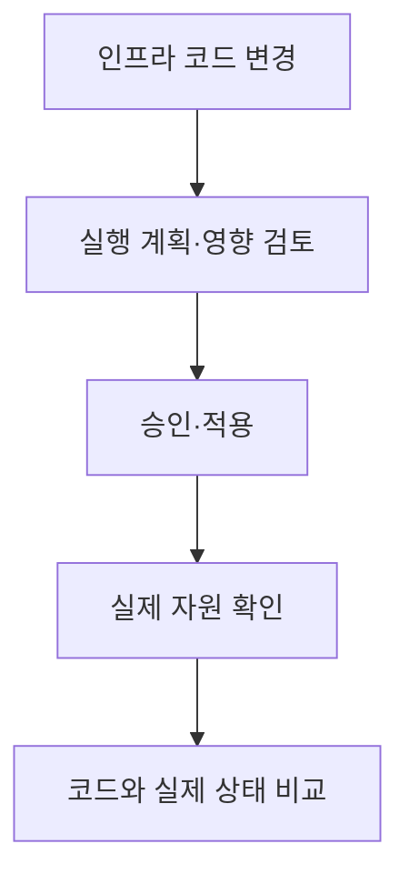
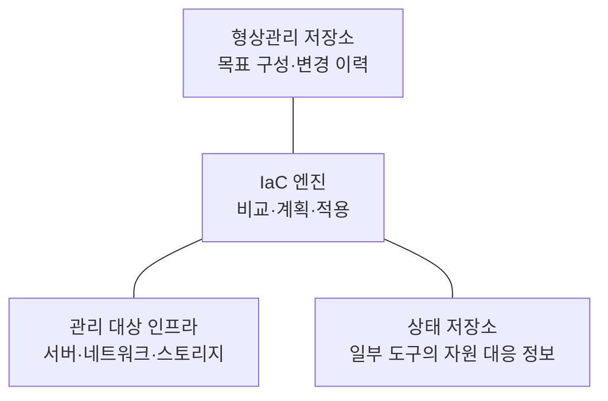
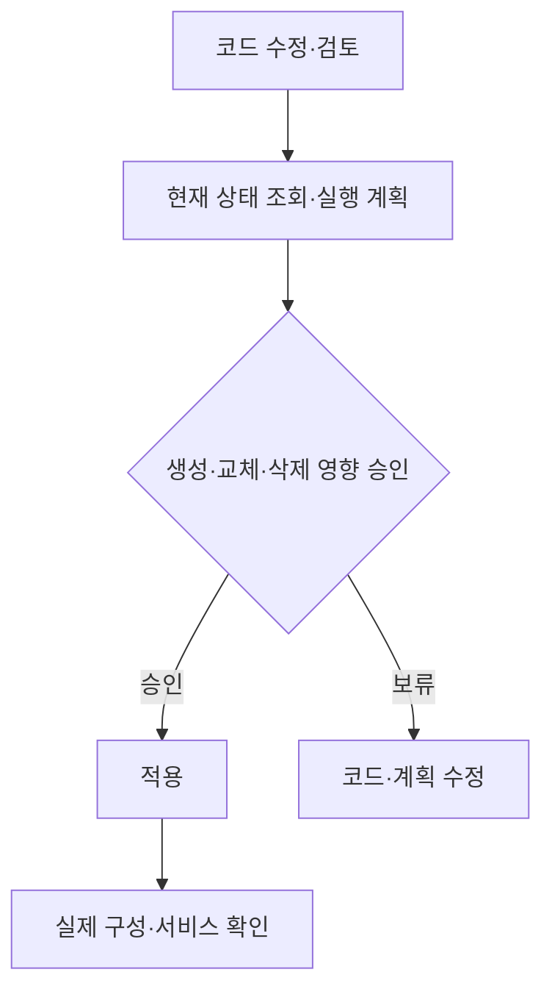

---
sidebar:
  order: 53
  label: "053. 코드형 인프라(IaC)"
  badge:
    text: "기초"
    variant: note
title: "코드형 인프라(IaC)"
author: "Codex"
date: "2026-09-24T00:00:00+09:00"
tags:
  - "notes-computer-system"
weight: 53
extra:
  model: "GPT-6"
  keyword_grade: "기초"
  question_no: "053"
---

## 지식 로드맵 내 현재 위치

지식 위치: 컴퓨터 시스템 → 클라우드 운영 → **인프라 구성 관리**

## 30초 인출

- 본질: **IaC** : 서버·네트워크·스토리지 등의 인프라 구성을 코드로 정의하고 변경 이력을 관리하는 방식
- 메커니즘: 코드의 목표 구성과 실제 구성을 비교해 실행 계획을 검토한 뒤 변경·검증

핵심 용어

- **IaC(Infrastructure as Code)** : 인프라 구성과 변경을 코드·형상관리·자동화 절차로 관리하는 방식
- **선언적 구성(Declarative Configuration)** : 원하는 최종 상태를 기술하는 방식
- **절차적 구성(Imperative Configuration)** : 상태에 도달하기 위한 명령 순서를 기술하는 방식
- **실행 계획(Plan)** : 코드 변경을 적용했을 때 생성·수정·삭제될 자원을 미리 보여주는 결과
- **상태 파일(State File)** : 일부 IaC 도구가 코드와 관리 자원의 대응 관계를 기록하는 파일
- **구성 표류(Drift)** : 코드의 기대 구성과 실제 운영 구성이 달라진 상태
- **멱등성(Idempotence)** : 같은 작업을 반복해도 목표 결과가 유지되는 성질

---

## 1교시 예상문제 (10점)

> 코드형 인프라(IaC)의 개념과 동작을 설명하시오. (예상·10점)

---

## 1교시 10점 답안

### Ⅰ. IaC의 개요

| 구분 | 핵심 |
|---|---|
| 정의 | **IaC** : 인프라의 구성·변경을 코드로 정의하고 형상관리·자동화하는 방식 |
| 목적 | 환경 재현성·변경 추적성·구성 일관성 확보 |

### Ⅱ. 적용 흐름

- 제언: 자동 적용 자체보다 삭제·교체 영향과 운영 환경의 구성 표류를 검토.

---

## 2~4교시 예상문제 (25점)

> IaC의 구성과 변경 절차를 설명하고, 운영 중 발생하는 구성 표류와 상태 관리의 한계·대응을 제시하시오. (예상·25점)

---

## 2~4교시 25점 답안

## Ⅰ. IaC의 개요

| 구분 | 핵심 |
|---|---|
| 정의 | **IaC** : 인프라의 구성·변경을 코드로 정의하고 형상관리·자동화하는 방식 |
| 목적 | 환경 재현성·변경 추적성·구성 일관성 확보 |

## Ⅱ. 구성 요소

상태 파일은 Terraform 같은 도구의 구성 요소이며 모든 IaC 도구에 필수인 것은 아님.

## Ⅲ. 변경 절차

인프라 코드만 검토해도 실제 운영 자원의 수동 변경을 놓칠 수 있으므로 적용 전·후 구성 비교가 중요.

## Ⅳ. 선언적·절차적 방식

| 구분 | 선언적 | 절차적 |
|---|---|---|
| 기술 대상 | 원하는 결과 상태 | 수행할 명령·순서 |
| 핵심 질문 | 무엇이 있어야 하는가 | 어떻게 바꿀 것인가 |
| 유의점 | 도구의 비교·조정 동작 확인 | 재실행·실패 중단 상태 관리 |

도구마다 두 방식을 섞어 사용할 수 있어 특정 제품을 한쪽으로 단정하지 않음.

## Ⅴ. 구성 표류와 상태 관리

| 한계 | 대응 |
|---|---|
| 콘솔에서 바꾼 운영 설정이 코드와 다름 | 표류 감지 후 수동 변경의 유지·되돌림 여부 결정 |
| 계획에 핵심 자원의 교체·삭제 포함 | 실행 계획 검토와 중요 자원 보호 정책 |
| 상태 파일에 민감 정보 포함 가능 | 접근 제한·암호화·안전한 저장·복구 |
| 동시 실행으로 상태 충돌 | 도구와 저장소가 지원하는 잠금·직렬화 적용 |

Terraform의 S3 백엔드는 잠금 파일을 지원하며, 이전의 DynamoDB 기반 잠금은 폐기 예정. 구체 구현은 사용하는 도구와 버전에 맞춰 확인.

## Ⅵ. 기술사적 제언

| 우선 제언 | 실행·확인 |
|---|---|
| 변경의 의도와 실제 영향을 함께 관리 | 코드 리뷰와 실행 계획의 생성·교체·삭제 목록 확인 |
| 코드·실제 구성·상태의 불일치 축소 | 정기 표류 점검, 상태 접근 통제, 적용 후 서비스 검증 |

---

## 검증 출처

- [HashiCorp: Create Infrastructure](https://developer.hashicorp.com/terraform/tutorials/aws-get-started/aws-create)
- [HashiCorp: Terraform S3 Backend](https://developer.hashicorp.com/terraform/language/backend/s3)
- [AWS CloudFormation: Drift-aware Change Sets](https://docs.aws.amazon.com/AWSCloudFormation/latest/UserGuide/drift-aware-change-sets.html)

## 연결 토픽

- 연관 토픽: [클라우드 네이티브 재해복구](./049_cloud_native_disaster_recovery.md), [클라우드 컴퓨팅](./013_cloud_computing.md)