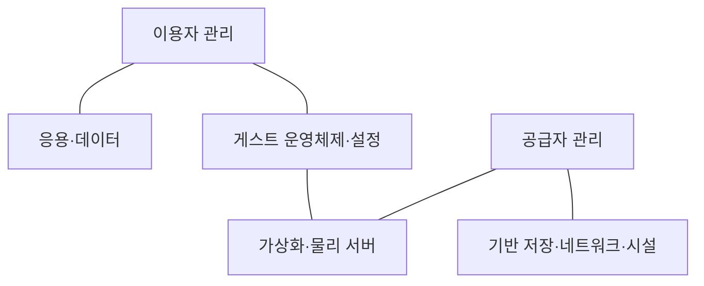
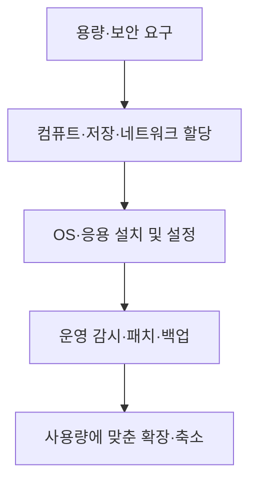

---
sidebar:
  order: 54
  label: "054. IaaS"
  badge:
    text: "기초"
    variant: note
title: "IaaS(Infrastructure as a Service)"
author: "Codex"
date: "2026-09-24T00:00:00+09:00"
tags:
  - "notes-computer-system"
weight: 54
extra:
  model: "GPT-6"
  keyword_grade: "기초"
  question_no: "054"
---

## 지식 로드맵 내 현재 위치

지식 위치: 컴퓨터 시스템 → 클라우드 컴퓨팅 → **서비스 모델**

## 30초 인출

- 본질: **IaaS** : 이용자가 처리·저장·네트워크 자원을 필요에 따라 제공받고 그 위에 운영체제와 응용을 설치·관리하는 서비스 모델
- 메커니즘: 공급자는 기반 인프라를 운영하고, 이용자는 할당 자원과 게스트 운영체제·응용·데이터를 구성

핵심 용어

- **IaaS(Infrastructure as a Service)** : 처리·저장·네트워크 등 기본 컴퓨팅 자원을 서비스로 제공하는 클라우드 모델
- **가상 머신(VM, Virtual Machine)** : 물리 자원 위에서 독립된 운영체제 환경을 제공하는 논리적 컴퓨터
- **게스트 운영체제(Guest OS)** : 가상 머신 내부에서 실행되는 운영체제
- **PaaS(Platform as a Service)** : 공급자가 제공하는 실행 플랫폼 위에 이용자가 응용을 배포하는 모델
- **SaaS(Software as a Service)** : 공급자가 운영하는 응용을 이용자가 사용하는 모델
- **공동 책임 모델(Shared Responsibility Model)** : 공급자와 이용자의 운영·보안 책임 경계를 서비스별로 나누는 체계

---

## 1교시 예상문제 (10점)

> IaaS의 개념과 이용자·공급자의 관리 범위를 설명하시오. (예상·10점)

---

## 1교시 10점 답안

### Ⅰ. IaaS의 개요

| 구분 | 핵심 |
|---|---|
| 정의 | **IaaS** : 처리·저장·네트워크 자원을 제공받아 이용자가 운영체제와 응용을 구성하는 클라우드 서비스 모델 |
| 목적 | 인프라를 직접 구축하지 않고 필요한 자원을 할당·확장 |

### Ⅱ. 관리 경계

| 공급자 | 이용자 |
|---|---|
| 물리 시설·하드웨어·기반 가상화 | 게스트 운영체제·응용·데이터·접근 설정 |

- 제언: 자원을 공급받아도 게스트 운영체제의 패치·계정·네트워크 설정 책임을 확인.

---

## 2~4교시 예상문제 (25점)

> IaaS의 구조와 관리 책임을 설명하고 PaaS·SaaS와 비교하여 적용 한계와 대응 방안을 제시하시오. (예상·25점)

---

## 2~4교시 25점 답안

## Ⅰ. IaaS의 개요

| 구분 | 핵심 |
|---|---|
| 정의 | **IaaS** : 처리·저장·네트워크 자원을 제공받아 이용자가 운영체제와 응용을 구성하는 클라우드 서비스 모델 |
| 목적 | 인프라를 직접 구축하지 않고 필요한 자원을 할당·확장 |

## Ⅱ. 제공 구조

IaaS 자원의 예로 가상 머신·블록 스토리지·가상 네트워크를 들 수 있음. 세부 책임은 선택한 상품·계약에 따라 달라짐.

## Ⅲ. 서비스 모델과 이용자 제어 범위

| 모델 | 공급받는 것 | 이용자의 주요 관리 |
|---|---|---|
| IaaS | 기본 컴퓨팅 자원 | 게스트 OS·응용·데이터 |
| PaaS | 응용 실행 플랫폼 | 응용·데이터·플랫폼 설정 |
| SaaS | 완성된 응용 | 이용자·데이터·서비스 설정 |

관리 범위가 줄어도 계정·데이터·접근 정책의 책임이 사라지지는 않음.

## Ⅳ. 자원 제공과 운영 절차

인프라 할당 속도와 실제 서비스의 안정성은 별개. 운영체제·응용·데이터의 관리 절차를 함께 설계해야 함.

## Ⅴ. 한계와 대응

| 한계 | 대응 |
|---|---|
| 게스트 OS의 패치·보안 설정 누락 | 이미지 기준·패치 주기·접근 통제 지정 |
| 과도한 자원 할당과 방치 | 이용률·비용 추적 후 용량 조정 |
| 가상 머신만 복제하고 데이터·업무 복구 누락 | 백업·복원·재해복구 시험 |
| 공급자 책임을 모든 영역으로 오해 | 서비스별 공동 책임 문서와 계약 확인 |

## Ⅵ. 기술사적 제언

| 우선 제언 | 실행·확인 |
|---|---|
| 자원 제어권과 운영 부담을 함께 판단 | OS 제어 필요성·패치 인력·비용을 PaaS 대안과 비교 |
| 공급자·이용자 책임을 업무에 연결 | 컴퓨트·네트워크·데이터·계정별 담당과 복구 절차 지정 |

---

## 검증 출처

- [NIST SP 800-145: The NIST Definition of Cloud Computing](https://csrc.nist.gov/pubs/sp/800/145/final)
- [AWS Shared Responsibility Model](https://aws.amazon.com/compliance/shared-responsibility-model/)

## 연결 토픽

- 연관 토픽: [PaaS](./055_paas.md), [SaaS](./036_saas.md)