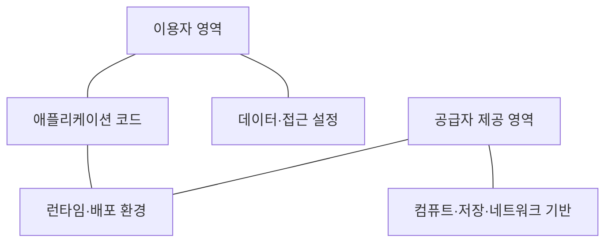
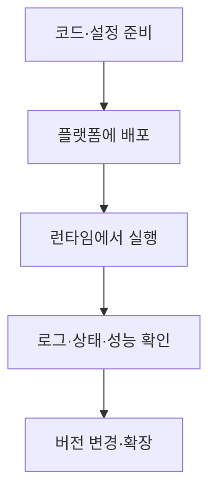

---
sidebar:
  order: 55
  label: "055. PaaS"
  badge:
    text: "기초"
    variant: note
title: "PaaS(Platform as a Service)"
author: "Codex"
date: "2026-09-24T00:00:00+09:00"
tags:
  - "notes-computer-system"
weight: 55
extra:
  model: "GPT-6"
  keyword_grade: "기초"
  question_no: "055"
---

## 지식 로드맵 내 현재 위치

지식 위치: 컴퓨터 시스템 → 클라우드 컴퓨팅 → **서비스 모델**

## 30초 인출

- 본질: **PaaS** : 공급자가 제공·관리하는 실행 플랫폼 위에 이용자가 애플리케이션을 배포하는 클라우드 서비스 모델
- 메커니즘: 이용자는 코드·데이터·설정을 관리하고, 공급자는 기반 인프라와 제공 범위의 런타임을 운영

핵심 용어

- **PaaS(Platform as a Service)** : 응용을 개발·배포·실행할 플랫폼을 서비스로 제공하는 모델
- **런타임(Runtime)** : 응용이 실행될 언어 실행 환경과 관련 구성
- **관리형 서비스(Managed Service)** : 공급자가 제공 범위의 설치·운영·유지 관리를 맡는 서비스
- **IaaS(Infrastructure as a Service)** : 처리·저장·네트워크 등의 기본 컴퓨팅 자원을 제공하는 모델
- **SaaS(Software as a Service)** : 공급자가 운영하는 완성된 응용을 이용하는 모델
- **플랫폼 종속(Platform Lock-in)** : 특정 플랫폼 API·데이터 모델 등에 의존해 이전이 어려워지는 상태

---

## 1교시 예상문제 (10점)

> PaaS의 개념과 IaaS와의 차이를 설명하시오. (예상·10점)

---

## 1교시 10점 답안

### Ⅰ. PaaS의 개요

| 구분 | 핵심 |
|---|---|
| 정의 | **PaaS** : 제공된 실행 플랫폼 위에 이용자가 애플리케이션을 개발·배포하는 서비스 모델 |
| 목적 | 기반 인프라 관리 부담을 줄이고 응용 개발·운영에 집중 |

### Ⅱ. 책임 경계

| 모델 | 이용자가 주로 관리 | 공급자가 제공 |
|---|---|---|
| IaaS | 게스트 OS·응용·데이터 | 기본 컴퓨팅 자원 |
| PaaS | 응용·데이터·플랫폼 설정 | 실행 플랫폼과 기반 인프라 |

- 제언: PaaS 도입 전 런타임·네트워크·데이터 서비스의 제어 범위를 확인.

---

## 2~4교시 예상문제 (25점)

> PaaS의 구성과 책임 경계를 설명하고 IaaS·SaaS와 비교하여 적용 한계와 대응 방안을 제시하시오. (예상·25점)

---

## 2~4교시 25점 답안

## Ⅰ. PaaS의 개요

| 구분 | 핵심 |
|---|---|
| 정의 | **PaaS** : 제공된 실행 플랫폼 위에 이용자가 애플리케이션을 개발·배포하는 서비스 모델 |
| 목적 | 기반 인프라 관리 부담을 줄이고 응용 개발·운영에 집중 |

## Ⅱ. 구성과 책임 경계

DB·메시지 큐·자동 확장·빌드팩은 플랫폼별 선택 기능. 모든 PaaS의 필수 구성으로 단정하지 않음.

## Ⅲ. 서비스 모델 비교

| 구분 | IaaS | PaaS | SaaS |
|---|---|---|---|
| 이용자가 받는 것 | 기본 자원 | 응용 실행 플랫폼 | 완성된 응용 |
| 이용자 제어 | OS·미들웨어까지 | 응용·플랫폼 설정 | 계정·데이터·서비스 설정 |
| 주된 활용 | OS 제어가 필요한 업무 | 응용 개발·배포 | 완성 서비스 이용 |

## Ⅳ. 응용 배포 흐름

빌드·배포·확장 자동화 정도는 서비스별로 다름. 플랫폼이 관리하는 범위와 이용자가 설정할 항목을 구별.

## Ⅴ. 한계와 대응

| 한계 | 대응 |
|---|---|
| 특수 OS·런타임 설정을 지원하지 않음 | 요구 기능과 지원 범위를 사전 적합성 시험 |
| 전용 API·데이터 서비스에 깊게 의존 | 종속 지점 목록화·이전 경로 시험 |
| 공급자 관리 범위를 과대평가 | 응용·데이터·계정의 책임 경계 확인 |
| 플랫폼 장애 시 복구 절차 불분명 | 백업·배포 재현·서비스 복구 시험 |

## Ⅵ. 기술사적 제언

| 우선 제언 | 실행·확인 |
|---|---|
| 개발 편의와 제어 요구를 함께 판단 | 런타임·네트워크·저장 요구를 IaaS 대안과 비교 |
| 플랫폼 종속의 비용을 가시화 | 전용 API·데이터 이동·복구 절차를 도입 전에 검증 |

---

## 검증 출처

- [NIST SP 800-145: The NIST Definition of Cloud Computing](https://csrc.nist.gov/pubs/sp/800/145/final)
- [NIST Glossary: Platform as a Service](https://csrc.nist.gov/glossary/term/platform_as_a_service)

## 연결 토픽

- 연관 토픽: [IaaS](./054_iaas.md), [SaaS](./036_saas.md)