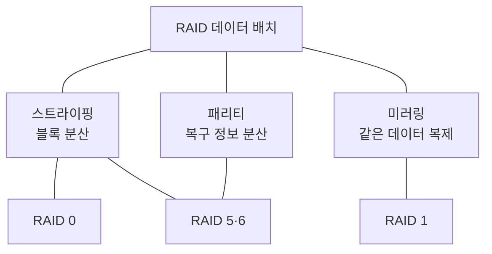
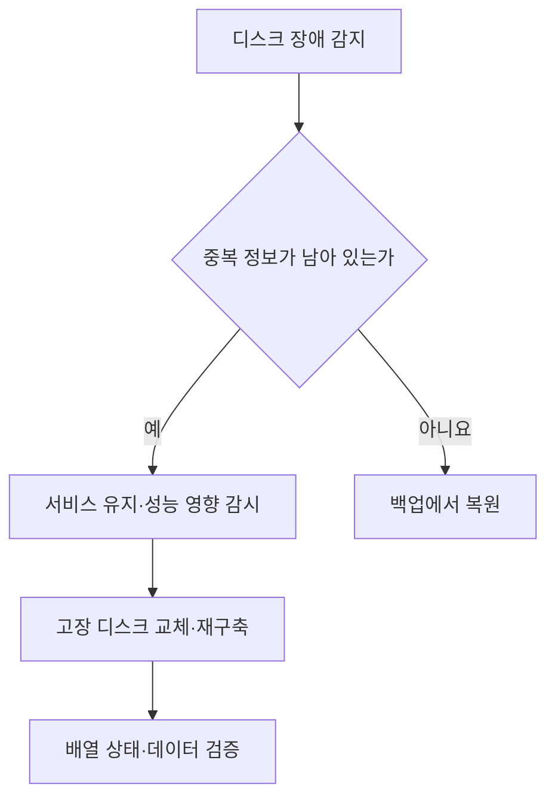

---
sidebar:
  order: 56
  label: "056. RAID"
  badge:
    text: "기초"
    variant: note
title: "RAID(Redundant Array of Independent Disks)"
author: "Codex"
date: "2026-09-24T00:00:00+09:00"
tags:
  - "notes-computer-system"
weight: 56
extra:
  model: "GPT-6"
  keyword_grade: "기초"
  question_no: "056"
---

## 지식 로드맵 내 현재 위치

지식 위치: 컴퓨터 시스템 → 저장장치 → **디스크 배열**

## 30초 인출

- 본질: **RAID** : 여러 저장장치를 하나의 논리적 배열로 묶어 데이터 배치·중복을 조합하는 기법
- 메커니즘: 스트라이핑은 데이터를 나눠 저장하고, 미러링·패리티는 일부 디스크 장애에 대비

핵심 용어

- **RAID(Redundant Array of Independent Disks)** : 여러 디스크의 데이터 배치와 중복 방식을 조합한 저장장치 배열
- **스트라이핑(Striping)** : 데이터를 블록 단위로 여러 디스크에 나누어 저장하는 방식
- **미러링(Mirroring)** : 같은 데이터를 둘 이상의 디스크에 복제하는 방식
- **패리티(Parity)** : 일부 디스크가 고장 나도 데이터를 재구성하도록 저장하는 중복 정보
- **재구축(Rebuild)** : 고장 디스크 교체 후 남은 데이터·중복 정보로 내용을 복원하는 작업
- **RAID 10** : 미러 쌍을 스트라이핑한 배열

---

## 1교시 예상문제 (10점)

> RAID 0·1·5·6의 구성과 장애 허용 범위를 설명하시오. (예상·10점)

---

## 1교시 10점 답안

### Ⅰ. RAID의 개요

| 구분 | 핵심 |
|---|---|
| 정의 | **RAID** : 여러 디스크를 논리적 배열로 묶어 데이터 분산·중복을 구성하는 기법 |
| 목적 | 요구에 따라 입출력 성능·디스크 장애 대응·사용 가능 용량을 조정 |

### Ⅱ. 주요 레벨

| 레벨 | 배치 원리 | 디스크 장애 대응 |
|---|---|---|
| RAID 0 | 스트라이핑 | 없음 |
| RAID 1 | 미러링 | 미러 사본으로 복구 |
| RAID 5 | 분산 단일 패리티 | 1개 장애 허용 |
| RAID 6 | 분산 이중 패리티 | 2개 장애 허용 |

- 제언: RAID의 중복성은 백업을 대신하지 않으므로 별도 복구본과 복원 시험 필요.

---

## 2~4교시 예상문제 (25점)

> RAID의 데이터 배치 방식과 레벨별 특성을 설명하고, 재구축 및 데이터 보호의 한계·대응을 제시하시오. (예상·25점)

---

## 2~4교시 25점 답안

## Ⅰ. RAID의 개요

| 구분 | 핵심 |
|---|---|
| 정의 | **RAID** : 여러 디스크를 논리적 배열로 묶어 데이터 분산·중복을 구성하는 기법 |
| 목적 | 요구에 따라 입출력 성능·디스크 장애 대응·사용 가능 용량을 조정 |

## Ⅱ. 데이터 배치 원리

RAID 5·6은 스트라이핑에 패리티를 결합. RAID 0에는 중복 정보가 없어 디스크 장애를 복구하지 못함.

## Ⅲ. 레벨별 비교

| 레벨 | 최소 구성 | 장애 허용 | 사용 가능 용량의 원리 | 쓰기 특성 |
|---|---|---|---|---|
| RAID 0 | 2개 이상 | 없음 | 중복 없이 전체 사용 | 분산 쓰기 |
| RAID 1 | 2개 이상 | 미러 사본 수에 따름 | 복제분만큼 사용 용량 감소 | 사본에 함께 쓰기 |
| RAID 5 | 3개 이상 | 1개 | 디스크 1개 상당을 패리티에 사용 | 패리티 갱신 필요 |
| RAID 6 | 4개 이상 | 2개 | 디스크 2개 상당을 패리티에 사용 | 두 종류 패리티 갱신 |
| RAID 10 | 미러 쌍 2개 이상 | 고장 위치에 따름 | 미러 복제분만큼 감소 | 미러 쌍에 쓰기 |

장애 허용은 동일 배열 내 디스크 고장 기준. RAID 10은 어떤 미러 쌍의 두 디스크가 모두 고장 나는지에 따라 결과가 달라짐.

## Ⅳ. 장애와 재구축 경로

재구축 시간과 성능 영향은 디스크 종류·용량·부하·구현 방식에 따라 달라짐.

## Ⅴ. 한계와 대응

| 한계 | 대응 |
|---|---|
| RAID 0의 디스크 장애 복구 불가 | 중요 데이터에 단독 보호 수단으로 사용하지 않음 |
| 재구축 중 추가 오류나 성능 저하 | 장애 감시·예비 용량·백업 복원 경로 준비 |
| 삭제·손상·랜섬웨어까지 배열에 반영 | 별도 백업·격리·복원 시험 |
| 레벨 이름만으로 성능·비용 단정 | 실제 읽기·쓰기 패턴과 디스크 구성으로 시험 |

## Ⅵ. 기술사적 제언

| 우선 제언 | 실행·확인 |
|---|---|
| 성능·용량·허용 장애의 균형 선택 | 워크로드와 재구축 시간에 맞춰 RAID 1·5·6·10 비교 |
| 배열 보호와 데이터 복구를 분리 | 재구축 절차와 별도 백업 복원 절차를 모두 검증 |

---

## 검증 출처

- [IBM Cloud Docs: About RAID](https://cloud.ibm.com/docs/bare-metal?topic=bare-metal-bm-raid-levels)
- [IBM: RAID level summary](https://www.ibm.com/docs/en/power6?topic=arrays-raid-level-summary)
- [SNIA: RAID Levels](https://www.snia.org/sites/default/files/SMI/VROC_webinar_SNIA_EMEA_v8.pdf)

## 연결 토픽

- 연관 토픽: [NAS](./080_nas.md), [SAN](./084_san.md)