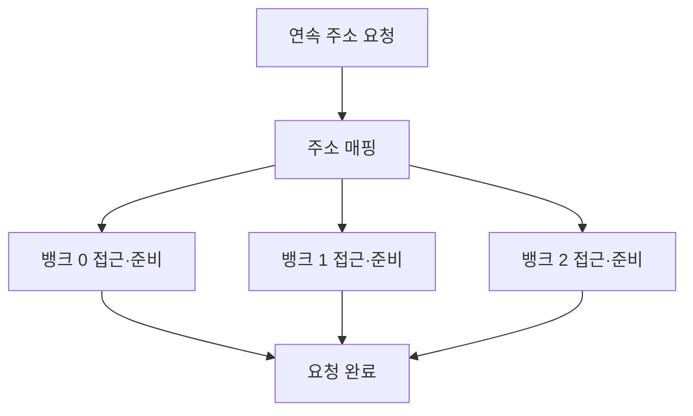

---
sidebar:
  order: 57
  label: "057. 메모리 인터리빙"
  badge:
    text: "기초"
    variant: note
title: "메모리 인터리빙(Memory Interleaving)"
author: "Codex"
date: "2026-09-24T00:00:00+09:00"
tags:
  - "notes-computer-system"
weight: 57
extra:
  model: "GPT-6"
  keyword_grade: "기초"
  question_no: "057"
---

## 지식 로드맵 내 현재 위치

지식 위치: 컴퓨터 시스템 → 주기억장치 → **메모리 접근 병렬화**

## 30초 인출

- 본질: **메모리 인터리빙** : 연속된 메모리 접근을 여러 뱅크·채널 등에 분산해 대기 시간을 겹치고 처리량을 높이는 방식
- 메커니즘: 주소를 분산 배치 → 한 뱅크가 접근 준비 중일 때 다른 뱅크에 요청 → 자원 사용 간격 축소

핵심 용어

- **메모리 인터리빙(Memory Interleaving)** : 주소를 복수의 메모리 자원에 분산해 접근을 겹치는 기법
- **메모리 뱅크(Memory Bank)** : DRAM 내부에서 독립적인 접근 상태를 관리하는 저장 단위
- **메모리 채널(Memory Channel)** : 메모리 컨트롤러와 모듈 사이의 데이터 전송 경로
- **뱅크 충돌(Bank Conflict)** : 동일 뱅크를 연속 사용하려 할 때 이전 동작 때문에 다음 요청이 기다리는 상황
- **하위 비트 인터리빙(Low-order Interleaving)** : 연속 주소를 다른 뱅크로 보내는 주소 배치 예
- **NUMA(Non-Uniform Memory Access)** : CPU와 메모리 위치에 따라 접근 비용이 달라지는 구조

---

## 1교시 예상문제 (10점)

> 메모리 인터리빙의 개념과 동작 원리를 설명하시오. (예상·10점)

---

## 1교시 10점 답안

### Ⅰ. 메모리 인터리빙의 개요

| 구분 | 핵심 |
|---|---|
| 정의 | **메모리 인터리빙** : 주소를 여러 메모리 자원에 분산해 접근을 겹치는 방식 |
| 목적 | 한 자원의 대기 시간 동안 다른 자원을 사용해 메모리 처리량 향상 |

### Ⅱ. 4개 뱅크의 개념적 배치

| 연속 블록 | 블록 0 | 블록 1 | 블록 2 | 블록 3 |
|---|---|---|---|---|
| 배치 뱅크 | 뱅크 0 | 뱅크 1 | 뱅크 2 | 뱅크 3 |

- 제언: 인터리빙 효과는 실제 주소 매핑과 접근 패턴에 좌우되므로 뱅크·채널 분산 여부 확인.

---

## 2~4교시 예상문제 (25점)

> 메모리 인터리빙의 주소 배치와 동작을 설명하고 뱅크·채널·NUMA 수준의 차이와 적용 한계·대응을 제시하시오. (예상·25점)

---

## 2~4교시 25점 답안

## Ⅰ. 메모리 인터리빙의 개요

| 구분 | 핵심 |
|---|---|
| 정의 | **메모리 인터리빙** : 주소를 여러 메모리 자원에 분산해 접근을 겹치는 방식 |
| 목적 | 한 자원의 대기 시간 동안 다른 자원을 사용해 메모리 처리량 향상 |

## Ⅱ. 뱅크 간 접근의 겹침

서로 다른 뱅크에 요청을 배치하면 한 뱅크의 준비 시간과 다른 뱅크의 접근을 겹칠 수 있음. 개별 뱅크의 지연 자체가 반드시 줄어드는 것은 아님.

## Ⅲ. 주소 배치 방식

| 방식 | 주소 예시 | 접근 특성 |
|---|---|---|
| 하위 비트 기반 | 연속 블록을 다른 뱅크에 순환 배치 | 연속 접근의 분산 가능 |
| 상위 비트 기반 | 주소 구간별로 뱅크 배치 | 같은 구간의 연속 접근은 한 뱅크에 집중 가능 |

실제 컨트롤러의 주소 매핑은 플랫폼에 따라 다르며 단순한 비트 분할만 사용한다고 단정할 수 없음.

## Ⅳ. 인터리빙 수준 구별

| 수준 | 분산 대상 | 유의점 |
|---|---|---|
| 뱅크 | DRAM 내부 뱅크 | 동일 뱅크 충돌·행 접근 패턴 |
| 채널 | 독립 데이터 전송 경로 | 장착 방식·채널별 자원 수 |
| NUMA 노드 | CPU에 연결된 메모리 노드 | 원격 접근 지연과 지역성 |

NUMA 노드 간 인터리빙은 용량·대역폭 분산에 쓸 수 있지만 원격 메모리 접근을 늘릴 수도 있음.

## Ⅴ. 성능 한계와 대응

| 한계 | 대응 |
|---|---|
| 접근이 한 뱅크에 집중 | 주소·스트라이드 패턴과 컨트롤러 매핑 점검 |
| 채널 구성이 비대칭 | 플랫폼의 메모리 장착 지침 확인 |
| NUMA 인터리빙으로 원격 접근 증가 | 스레드 배치·메모리 지역성과 실측 성능 비교 |
| 무조건적 대역폭 증가 기대 | 실제 부하의 대역폭·지연·뱅크 충돌 측정 |

## Ⅵ. 기술사적 제언

| 우선 제언 | 실행·확인 |
|---|---|
| 병렬화 대상 수준을 먼저 구별 | 뱅크·채널·NUMA 중 어느 자원이 병목인지 확인 |
| 접근 패턴과 장착 구성을 함께 최적화 | 순차·스트라이드 부하와 채널 배치를 변경하며 처리량 검증 |

---

## 검증 출처

- [Intel: Bank Interleaving](https://www.intel.com/content/www/us/en/docs/programmable/683216/22-3-2-6-1/bank-interleaving.html)
- [Linux Kernel: NUMA Memory Policy](https://docs.kernel.org/6.11/admin-guide/mm/numa_memory_policy.html)
- [IBM: Troubleshooting Memory Issues](https://www.ibm.com/support/pages/node/846800)

## 연결 토픽

- 연관 토픽: [캐시 메모리](./051_cache_memory.md), [메모리 계층과 인터리빙](./096_memory_hierarchy_interleaving.md)