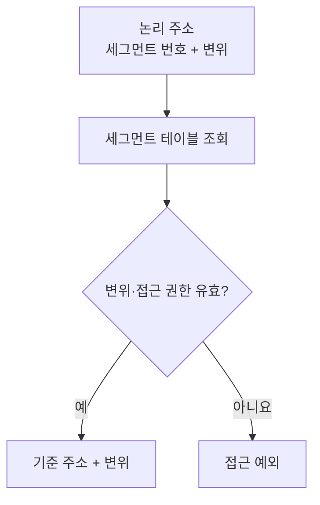
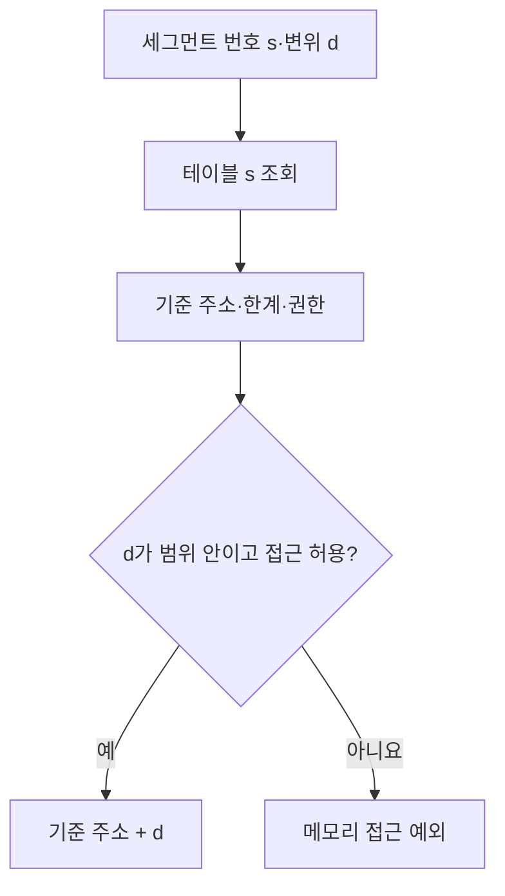

---
sidebar:
  order: 58
  label: "058. 세그먼테이션"
  badge:
    text: "기초"
    variant: note
title: "세그먼테이션(Segmentation)"
author: "Codex"
date: "2026-09-24T00:00:00+09:00"
tags:
  - "notes-computer-system"
weight: 58
extra:
  model: "GPT-6"
  keyword_grade: "기초"
  question_no: "058"
---

## 지식 로드맵 내 현재 위치

지식 위치: 컴퓨터 시스템 → 운영체제 → **메모리 주소 변환**

## 30초 인출

- 본질: **세그먼테이션** : 코드·데이터·스택처럼 의미가 다른 주소 공간을 가변 크기 세그먼트로 나누어 관리하는 메모리 기법
- 메커니즘: 논리 주소의 세그먼트 번호로 기준 주소·길이·권한을 찾고 변위를 검사한 뒤 주소 변환

핵심 용어

- **세그먼테이션(Segmentation)** : 프로그램의 논리 단위를 가변 크기 세그먼트로 분할·관리하는 기법
- **세그먼트(Segment)** : 별도의 기준 주소·크기·접근 권한을 가진 논리 영역
- **세그먼트 테이블(Segment Table)** : 세그먼트 번호에 대응하는 기준 주소·길이·권한을 기록하는 표
- **기준 주소(Base)** : 해당 세그먼트의 시작 주소
- **한계(Limit)** : 세그먼트 내에서 허용되는 주소 범위
- **변위(Offset)** : 세그먼트 시작점으로부터의 상대 위치
- **외부 단편화(External Fragmentation)** : 남은 공간이 여러 곳에 흩어져 큰 연속 공간을 확보하기 어려운 상태

---

## 1교시 예상문제 (10점)

> 세그먼테이션의 주소 변환 원리를 설명하시오. (예상·10점)

---

## 1교시 10점 답안

### Ⅰ. 세그먼테이션의 개요

| 구분 | 핵심 |
|---|---|
| 정의 | **세그먼테이션** : 논리적 의미에 따라 주소 공간을 가변 크기 세그먼트로 나누는 메모리 기법 |
| 목적 | 논리 단위별 주소 변환·접근 보호·공유 |

### Ⅱ. 주소 변환

- 제언: 세그먼테이션의 논리 단위 보호와 가변 크기에서 오는 외부 단편화를 함께 설명.

---

## 2~4교시 예상문제 (25점)

> 세그먼테이션의 주소 변환과 보호 원리를 설명하고 페이징과 비교하여 한계와 대응 방안을 제시하시오. (예상·25점)

---

## 2~4교시 25점 답안

## Ⅰ. 세그먼테이션의 개요

| 구분 | 핵심 |
|---|---|
| 정의 | **세그먼테이션** : 논리적 의미에 따라 주소 공간을 가변 크기 세그먼트로 나누는 메모리 기법 |
| 목적 | 논리 단위별 주소 변환·접근 보호·공유 |

## Ⅱ. 세그먼트 테이블과 주소 변환

세그먼트마다 다른 크기와 권한을 설정할 수 있음. 이 그림은 전통적인 세그먼트 기반 주소 변환의 개념도.

## Ⅲ. 논리 단위별 관리

| 영역 예 | 분리 이유 | 관리 대상 |
|---|---|---|
| 코드 | 실행 권한과 공유 | 읽기·실행 허용 범위 |
| 데이터 | 쓰기 가능한 상태 | 읽기·쓰기 범위 |
| 스택 | 호출별 작업 공간 | 접근 범위·확장 한계 |

세그먼트는 반드시 함수 하나씩 나뉘는 구조가 아니며 분할 단위는 구현에 따라 다름.

## Ⅳ. 페이징과 비교

| 관점 | 세그먼테이션 | 페이징 |
|---|---|---|
| 분할 단위 | 의미에 따른 가변 크기 | 고정 크기 페이지 |
| 주소 해석 | 세그먼트 번호·변위 | 페이지 번호·변위 |
| 보호 단위 | 세그먼트 | 페이지 |
| 주된 공간 한계 | 외부 단편화 | 마지막 페이지 등 내부 단편화 가능 |

두 기법의 구현·조합은 아키텍처와 운영체제에 따라 다름.

## Ⅴ. 현대 x86-64와 용어 주의

| 구분 | 핵심 |
|---|---|
| 전통적 세그먼테이션 | 세그먼트 기준 주소·한계로 주소 변환·검사 |
| x86-64 64비트 모드 | 일반 코드·데이터 세그먼트는 평면 주소 공간, FS·GS 기준 주소 기능은 유지 |
| Segmentation fault | 잘못된 메모리 접근의 예외·시그널 이름. 반드시 세그먼트 한계 초과만을 뜻하지 않음 |

## Ⅵ. 한계와 대응

| 한계 | 대응 |
|---|---|
| 가변 크기 할당·해제로 외부 단편화 | 페이징 등 고정 크기 관리와의 조합 검토 |
| 세그먼트별 보호·공유 관리 복잡 | 필요한 논리 경계와 권한만 분리 |
| 고전적 주소 변환을 현대 시스템에 그대로 대입 | 해당 CPU 모드와 운영체제의 실제 메모리 관리 방식 확인 |

## Ⅶ. 기술사적 제언

| 우선 제언 | 실행·확인 |
|---|---|
| 논리 보호와 공간 할당을 구별 | 세그먼트 경계·권한과 물리 메모리 할당의 역할 분리 |
| 비교 답안은 사용 환경까지 명시 | 고전적 세그먼테이션·페이징 원리와 현대 x86-64 구현의 차이 확인 |

---

## 검증 출처

- [Intel 64 and IA-32 Software Developer's Manual, System Programming Guide](https://www.intel.com/content/dam/www/public/us/en/documents/manuals/64-ia-32-architectures-software-developer-system-programming-manual-325384.pdf)
- [Linux Kernel: Using FS and GS Segments in User Space](https://docs.kernel.org/6.12/arch/x86/x86_64/fsgs.html)

## 연결 토픽

- 연관 토픽: [페이징](./060_paging.md), [프로세스 메모리 영역](./050_process_memory_layout.md)